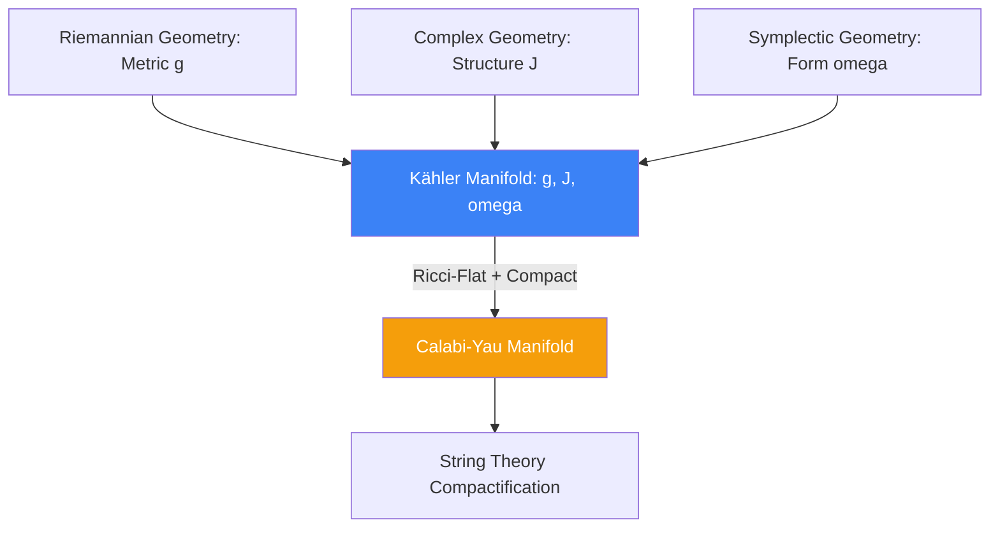

# Complex and Kähler Manifolds: The Geometry of String Theory

A **Complex Manifold** is a manifold that locally looks like $\mathbb{C}^n$ and has holomorphic transition functions between its coordinate patches. This restriction is extremely rigid, giving complex manifolds a deeply interwoven structure where geometry, topology, and algebra meet. They are the central stage for algebraic geometry and modern theoretical physics.

## 1. Almost Complex Structures

Before making a manifold truly complex, we define an **Almost Complex Structure** $J$.
- $J$ is a tensor field of type $(1,1)$ (a linear map $T_p M \to T_p M$) such that **$J^2 = -I$**.
- This $J$ acts as a geometric analog to the imaginary unit $i = \sqrt{-1}$, rotating tangent vectors by 90 degrees.

An almost complex manifold $(M, J)$ is a true **Complex Manifold** if and only if $J$ is **integrable**. By the **Newlander-Nirenberg Theorem**, this is true if the **Nijenhuis Tensor** vanishes: $N_J(X, Y) = 0$.

## 2. Hermitian Metrics

On a complex manifold, a Riemannian metric $g$ is called a **Hermitian Metric** if it respects the complex structure:
$$ g(JX, JY) = g(X, Y) $$
Given $g$ and $J$, we can define the **Fundamental 2-form** (or Kähler form) $\omega$:
$$ \omega(X, Y) = g(JX, Y) $$
By definition, $\omega$ is a non-degenerate, skew-symmetric form (a symplectic form).

## 3. Kähler Manifolds

A Hermitian manifold is a **Kähler Manifold** if its fundamental 2-form is closed:
$$ d\omega = 0 $$

A Kähler manifold is a mathematical miracle: it is simultaneously a **Riemannian manifold**, a **Complex manifold**, and a **Symplectic manifold**, and the three structures $(g, J, \omega)$ are mutually compatible.
- **Local Potential**: Locally, the Kähler metric can be derived from a single scalar function $K$ (the Kähler potential): $g_{i\bar{j}} = \partial_i \partial_{\bar{j}} K$.
- **Hodge Theory on Kähler Manifolds**: The Laplacian splits elegantly, and the cohomology groups exhibit the **Hodge Decomposition**, allowing deep connections between algebraic cycles and differential forms.

## 4. Calabi-Yau Manifolds

A **Calabi-Yau Manifold** is a compact, Kähler manifold that has a vanishing first Chern class (topologically, it can support a Ricci-flat metric where $R_{\mu\nu} = 0$).

### String Theory Connection
In Superstring Theory, spacetime is 10-dimensional. Since we only observe 4 dimensions (3 space + 1 time), the remaining 6 dimensions must be "compactified" or curled up so small they are invisible.
- To preserve supersymmetry (a requirement for string theory), these 6 hidden dimensions **must form a Calabi-Yau 3-fold** (3 complex dimensions = 6 real dimensions).
- The specific topology (the "holes") of the chosen Calabi-Yau manifold uniquely determines the physical properties of our universe (the masses of particles and the types of forces).

## 5. Mirror Symmetry

A profound discovery in string theory is **Mirror Symmetry**. It posits that Calabi-Yau manifolds come in pairs $(M, W)$. 
- The complex geometry of $M$ is perfectly equivalent to the symplectic geometry of $W$.
- This duality allowed mathematicians to solve century-old problems in enumerative geometry (counting the number of curves on a space) by converting difficult complex geometry calculations on $M$ into simpler symplectic calculations on its mirror $W$.

## Visualization: The Intersection of Geometries

## Related Topics

[[symplectic-geometry]] — the foundation of the Kähler form  
[[hodge-theory]] — behaves beautifully on Kähler manifolds  
[[tensor-calculus]] — required for the Nijenhuis tensor
---
