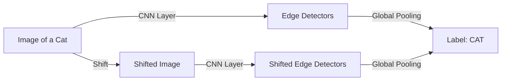

# Geometric Deep Learning: Symmetry and Invariance

Geometric Deep Learning (GDL) is an emerging framework that seeks to unify neural network architectures through the lens of **Symmetry** and **Invariance**. It recognizes that most successful AI models (like CNNs and GNNs) are effective because they exploit the geometric structure of the data domain (grids, graphs, or manifolds).

## 1. The "Erlangen Program" for AI

Just as Felix Klein unified geometry in the 19th century by studying groups of transformations, GDL (Bronstein et al., 2021) unifies deep learning by identifying the **Invariances** of the data:
- **Translation Invariance**: In images, a cat is a cat whether it is in the top-left or bottom-right corner. **CNNs** exploit this.
- **Permutation Invariance**: In a social network or molecule, the order of nodes doesn't matter. **GNNs** exploit this.
- **Rotation Invariance**: In 3D medical imaging or robotics, the orientation of an object shouldn't change its classification.

## 2. Key Mathematical Priors

The "Blueprint" of a geometric neural network consists of two main operations:

### A. Equivariant Layers
A layer is equivariant if transforming the input (e.g., rotating it) result in a transformed output. 
- *Formula*: $f(g \cdot x) = g \cdot f(x)$ for some group element $g$.
- Most layers in a CNN are translation-equivariant: if you shift the pixels, the feature maps shift by the same amount.

### B. Global Pooling (Invariance)
At the end of the network, we need a single label (e.g., "Cat" or "Dog") that is completely unchanged by transformations.
- *Formula*: $f(g \cdot x) = f(x)$.
- This is achieved by operations like Global Average Pooling.

## 3. The 5 Domains of GDL

GDL classifies all deep learning into five geometric categories:
1.  **Grids ($\mathbb{R}^d$)**: Classical CNNs. Domain is fixed and Euclidean.
2.  **Groups**: Equivariant networks for physics and rotation-heavy tasks.
3.  **Graphs**: [[graph-neural-networks|GNNs]]. The domain is a discrete set of nodes and edges.
4.  **Geodesics/Manifolds**: Learning on curved surfaces (e.g., the human body, the globe).
5.  **Sets**: Deep Sets. Handling collections of objects where order is irrelevant.

## 4. Why it Matters for Science (AI for Physics)

Geometric Deep Learning is the bridge that allows AI to obey the laws of physics. 
- **Equivariant NNs** are used to predict the energy of molecules. By ensuring the network is invariant to rotation and translation, we guarantee that the predicted energy doesn't change just because the molecule was rotated in the simulation.
- This dramatically reduces the amount of training data needed, as the model doesn't have to "learn" that rotations are the same thing—the geometry is built into the architecture.

## Visualization: Symmetry Breaking

*Equivariance (middle) preserves the transformation, while Invariance (end) discards it to reach a stable conclusion.*

## Related Topics

[[manifold]] — learning on curved data surfaces  
[[graph-neural-networks]] — the graph domain of GDL  
[[group-theory]] — the mathematical language of symmetry  
[[physics/classical/noether-theorem]] — the physical equivalent of symmetry and invariants
---