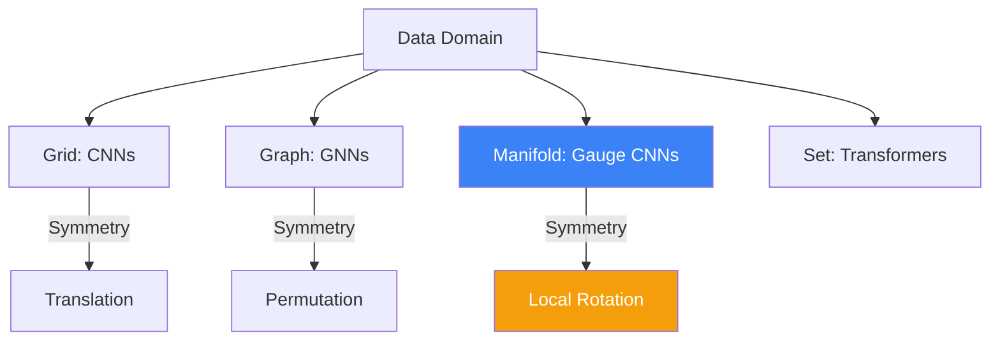

# Geometric Deep Learning: The Erlangen Program for ML

**Geometric Deep Learning (GDL)** is a framework that unifies diverse neural network architectures (CNNs, GNNs, Transformers) through the lens of **Symmetry** and **Invariance**. Inspired by Felix Klein's Erlangen Program in geometry, GDL posits that the structure of a model should be determined by the geometric symmetries of the data domain (e.g., grids, graphs, or manifolds).

## 1. The Core Principles: Invariance and Equivariance

Let $f$ be a neural network and $G$ be a group of transformations (e.g., rotations or translations).
- **Invariance**: The output remains the same under transformation: $f(g \cdot x) = f(x)$. Example: Classifying a cat image regardless of its position.
- **Equivariance**: The output transforms in the same way as the input: $f(g \cdot x) = g \cdot f(x)$. Example: Segmenting a tumor in a 3D medical scan; if the scan rotates, the segmentation mask must rotate identically.

## 2. The 5 Domains of GDL

GDL classifies data domains based on their symmetry groups:
1.  **Grids (Euclidean Space)**: Translation symmetry. Solved by **CNNs**.
2.  **Groups (Homogeneous Spaces)**: Rotational or global symmetries. Solved by **Group Equivariant CNNs**.
3.  **Graphs**: Permutation symmetry (the order of nodes doesn't matter). Solved by **GNNs** (Graph Neural Networks).
4.  **Manifolds**: Gauge symmetry (local coordinate changes). Solved by **Gauge Equivariant CNNs**.
5.  **Sets**: Global permutation symmetry. Solved by **Deep Sets** and **Transformers**.

## 3. Gauge Equivariant CNNs (Geodesic CNNs)

On a curved [[manifold-learning|manifold]] (like a sphere or a protein surface), there is no global coordinate system. To perform convolution, we must define it locally using the **Tangent Space**.
- **The Problem**: When you move a "filter" from point $p$ to $q$, the filter rotates depending on the path taken (due to [[connections-curvature|Holonomy]]).
- **The Solution**: Use **Gauge Equivariance**. The network is designed so that its output is independent of the local coordinate "gauge" chosen at each point. This requires weights to be constrained by representations of the [[lie-groups-algebras|Lie Group]] of the manifold.

## 4. Mathematical Implementation

A GDL layer typically consists of:
1.  **Linear Propagation**: Applying a learnable filter that commutes with the group action $G$.
2.  **Non-linear Activation**: Point-wise non-linearity (like ReLU) which preserves the symmetry.
3.  **Pooling / Coarsening**: Reducing the resolution of the domain while maintaining the geometric structure.

## 5. Applications at the PhD Level

- **Drug Discovery**: Modeling molecules as graphs (GNNs) or 3D point clouds (Equivariant Networks) to predict binding affinity.
- **Climate Science**: Using Spherical CNNs to process global weather data on the Earth's curved surface.
- **Robotics**: Planning paths in $SE(3)$ using Lie Group equivariant policies.

## Visualization: Symmetry Hierarchy

## Related Topics

[[lie-groups-algebras]] — the mathematical basis of symmetries  
[[connections-curvature]] — required for convolution on manifolds  
[[spectral-graph-theory]] — the "Fourier" view of GDL
---
