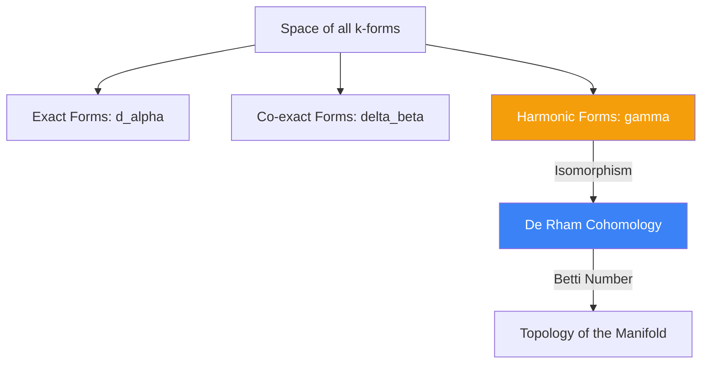

# Hodge Theory: Bridging Topology and Differential Equations

**Hodge Theory**, developed by W.V.D. Hodge in the 1930s, is a profound mathematical framework that connects the global topology of a manifold with the solutions to local partial differential equations (PDEs). It generalizes classical vector calculus (Gradient, Curl, Divergence) to higher dimensions and curved spaces using differential forms.

## 1. De Rham Cohomology

On a smooth manifold $M$, we study differential $k$-forms $\Omega^k(M)$.
The exterior derivative $d: \Omega^k \to \Omega^{k+1}$ satisfies the fundamental property $d^2 = 0$.
- A form $\omega$ is **closed** if $d\omega = 0$.
- A form $\omega$ is **exact** if $\omega = d\alpha$ for some $\alpha$.

Since every exact form is closed ($d(d\alpha) = 0$), we can define the **$k$-th De Rham Cohomology Group**:
$$ H^k_{dR}(M) = \frac{\ker(d)}{\text{im}(d)} = \frac{\text{Closed Forms}}{\text{Exact Forms}} $$
The dimension of $H^k_{dR}(M)$ is the $k$-th **Betti Number** ($b_k$), which counts the number of $k$-dimensional "holes" in the manifold.

## 2. The Hodge Star and Codifferential

To do geometry (measure lengths of forms), we need a metric $g_{\mu\nu}$. The metric gives rise to the **Hodge Star Operator** $\star: \Omega^k \to \Omega^{n-k}$, which acts as a dualizer (e.g., turning a 1-form into a 2-form in 3D).

Using $\star$, we define the **Codifferential** $\delta: \Omega^k \to \Omega^{k-1}$:
$$ \delta = (-1)^{nk + n + 1} \star d \star $$
While $d$ acts like the Curl or Gradient, $\delta$ acts like the **Divergence**. Note that $\delta^2 = 0$.

## 3. The Laplace-de Rham Operator

We can now define the **Laplacian** on differential forms:
$$ \Delta = d\delta + \delta d $$
A $k$-form $\omega$ is called **Harmonic** if $\Delta \omega = 0$. By definition, a harmonic form is both closed ($d\omega = 0$) and co-closed ($\delta\omega = 0$).

## 4. The Hodge Decomposition Theorem

The crown jewel of Hodge theory is the **Hodge Decomposition**. On a compact Riemannian manifold, any $k$-form $\omega$ can be uniquely decomposed into three mutually orthogonal parts:
$$ \omega = d\alpha + \delta\beta + \gamma $$
Where:
1.  $d\alpha$ is an **exact** form (pure gradient).
2.  $\delta\beta$ is a **co-exact** form (pure curl).
3.  $\gamma$ is a **Harmonic form** ($\Delta \gamma = 0$).

### The Isomorphism
Furthermore, Hodge proved that each cohomology class in $H^k_{dR}(M)$ contains exactly **one unique harmonic form**. Thus, the space of harmonic $k$-forms $\mathcal{H}^k$ is isomorphic to the cohomology group:
$$ \mathcal{H}^k \cong H^k_{dR}(M) $$
*Significance*: We can find the topological holes of a space by solving a differential equation ($\Delta \gamma = 0$).

## 5. Applications

### A. Electromagnetism
Maxwell's equations are beautifully simplified by Hodge theory. The electromagnetic tensor $F$ is a 2-form. The equations in a vacuum are simply:
$$ dF = 0 \quad \text{(No magnetic monopoles & Faraday's Law)} $$
$$ \delta F = J \quad \text{(Gauss's & Ampere's Laws)} $$

### B. Topological Data Analysis (TDA)
In modern ML, **Hodge Laplacians** on graphs and simplicial complexes are used to analyze the topology of data networks, helping to identify cycles and voids in highly complex, noisy datasets.

## Visualization: Hodge Decomposition

## Related Topics

[[tensor-calculus]] — required for computing the Hodge star  
[[connections-curvature]] — relationship between Laplacian and curvature (Bochner formula)
---
