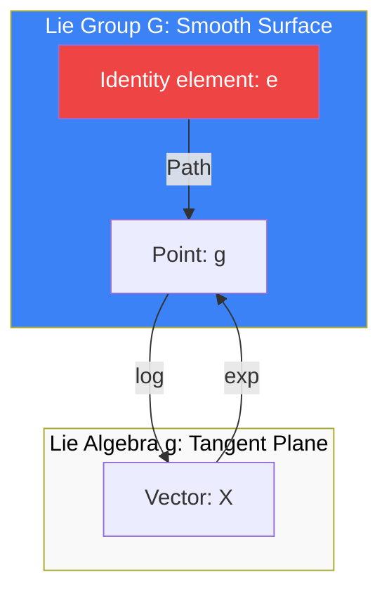

# Lie Groups and Lie Algebras: The Geometry of Symmetry

A **Lie Group** $G$ is a mathematical structure that is simultaneously a **Group** and a **Smooth [[manifold-learning|Manifold]]**, such that the group operations (multiplication and inversion) are smooth maps. They provide the fundamental framework for studying continuous symmetries in physics, robotics, and machine learning.

## 1. The Lie Algebra ($\mathfrak{g}$)

The **Lie Algebra** $\mathfrak{g}$ is the tangent space to the Lie group $G$ at the identity element $e$: $\mathfrak{g} = T_e G$. It captures the local structure of the group near the identity.
- **Lie Bracket**: The algebra is equipped with a non-associative multiplication called the Lie bracket $[X, Y]$, which satisfies:
  1.  **Antisymmetry**: $[X, Y] = -[Y, X]$
  2.  **Jacobi Identity**: $[X, [Y, Z]] + [Y, [Z, X]] + [Z, [X, Y]] = 0$

### Physical Intuition
If $G$ represents rotations, an element $X \in \mathfrak{g}$ represents an **infinitesimal rotation** (angular velocity). The Lie bracket $[X, Y]$ measures the non-commutativity of these infinitesimal moves.

## 2. The Exponential Map

The link between the algebra and the group is the **Exponential Map** $\exp: \mathfrak{g} \to G$:
$$ \exp(X) = \sum_{k=0}^{\infty} \frac{X^k}{k!} $$
For matrix Lie groups (like $SO(3)$ or $SU(n)$), this is the standard matrix exponential.
- **Baker-Campbell-Hausdorff (BCH) Formula**: Since Lie groups are non-abelian, $\exp(X)\exp(Y) \neq \exp(X+Y)$. The BCH formula expresses the product in terms of the Lie bracket:
  $$ \exp(X)\exp(Y) = \exp\left(X + Y + \frac{1}{2}[X, Y] + \frac{1}{12}([X, [X, Y]] - [Y, [Y, X]]) + \dots\right) $$

## 3. Important Lie Groups

1.  **$SO(n)$ (Special Orthogonal)**: Rotations in $n$-dimensional space. 
    - Algebra $\mathfrak{so}(n)$: Skew-symmetric matrices ($X^T = -X$).
2.  **$SU(n)$ (Special Unary)**: Symmetries of quantum states. 
    - $SU(3)$ is the gauge group of the **Strong Nuclear Force**.
3.  **$SE(3)$ (Special Euclidean)**: Rigid body motions (rotation + translation). 
    - Used in **Robotics** to describe the pose of a robot arm or a drone.

## 4. Adjoint Representation ($Ad$)

The Adjoint representation describes how the group $G$ acts on its own algebra $\mathfrak{g}$ by conjugation:
$$ Ad_g(X) = g X g^{-1} $$
This is essential for changing reference frames in physics and robotics. If $X$ is a velocity in the body frame, $Ad_g(X)$ is the same velocity viewed from the world frame.

## 5. Applications in Machine Learning

**Equivariant Neural Networks** use Lie group theory to ensure that the model's output changes predictably when the input is transformed.
- **CNNs**: Equivariant to the translation group $(\mathbb{R}^n, +)$.
- **Spherical CNNs**: Use $SO(3)$ to process data on a sphere (e.g., global climate data or omnidirectional images).

## Visualization: Group vs. Algebra

## Related Topics

[[tensor-calculus]] — tensors as representations of Lie groups  
[[gauge-theory-yang-mills|gauge theory]] — physics on Lie groups  
[[geometric-deep-learning]] — learning symmetries
---
