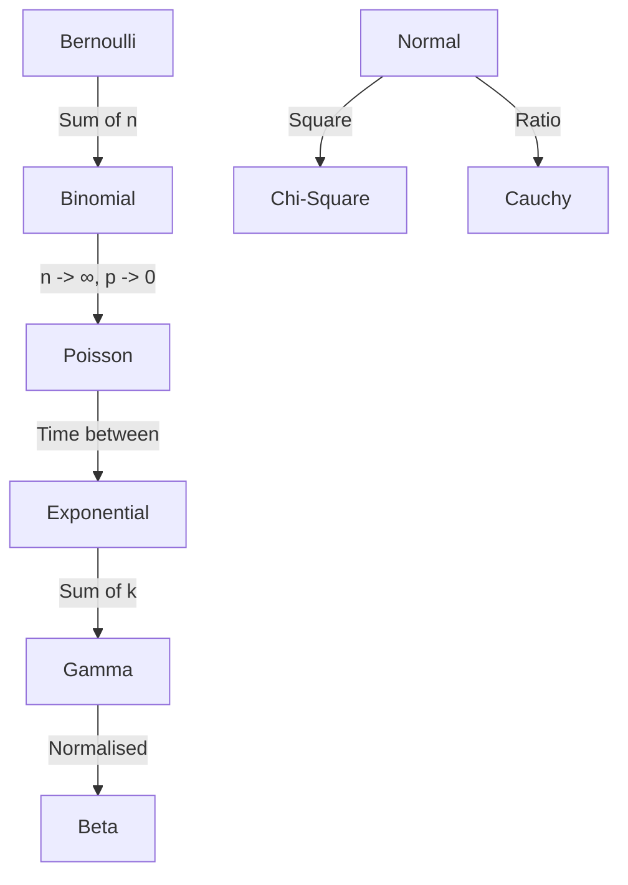

# Probability Distributions Zoo

A probability distribution describes how the values of a random variable are dispersed. In practice, a small set of "standard" distributions serves as the building blocks for almost all statistical models.

## Discrete Distributions

### 1. Bernoulli & Binomial
- **Bernoulli($p$)**: A single trial with two outcomes (Success/Failure). 
  - $P(X=1) = p$
- **Binomial($n, p$)**: The number of successes in $n$ independent Bernoulli trials.
  - $P(X=k) = \binom{n}{k} p^k (1-p)^{n-k}$

### 2. Poisson($\lambda$)
- Models the number of events occurring in a fixed interval of time/space.
- $P(X=k) = \frac{\lambda^k e^{-\lambda}}{k!}$
- Key property: $\mathbb{E}[X] = \text{Var}(X) = \lambda$.

## Continuous Distributions

### 1. Normal (Gaussian) $\mathcal{N}(\mu, \sigma^2)$
- The "King" of distributions due to the [[central-limit-theorem|CLT]].
- $f(x) = \frac{1}{\sigma \sqrt{2\pi}} e^{-\frac{1}{2}(\frac{x-\mu}{\sigma})^2}$

### 2. Exponential($\lambda$)
- Models the time between events in a Poisson process.
- $f(x) = \lambda e^{-\lambda x}$. It is **memoryless**.

### 3. Beta($\alpha, \beta$)
- Defined on the interval $[0, 1]$. Used as a conjugate prior for probabilities (Bernoulli/Binomial).
- Its shape is incredibly flexible, from U-shaped to bell-shaped.

### 4. Dirichlet($\alpha$)
- The multivariate generalization of the Beta distribution. A sample from a Dirichlet is itself a probability distribution.
- Used in **Topic Modeling** (LDA) and as a prior for Categorical distributions.

## Relationships Between Distributions



## Visualization: Common Shapes

```chart
{
  "type": "line",
  "xAxis": "x",
  "data": [
    {"x": -3, "gaussian": 0.004, "cauchy": 0.03},
    {"x": -2, "gaussian": 0.054, "cauchy": 0.06},
    {"x": -1, "gaussian": 0.242, "cauchy": 0.16},
    {"x": 0,  "gaussian": 0.399, "cauchy": 0.32},
    {"x": 1,  "gaussian": 0.242, "cauchy": 0.16},
    {"x": 2,  "gaussian": 0.054, "cauchy": 0.06},
    {"x": 3,  "gaussian": 0.004, "cauchy": 0.03}
  ],
  "lines": [
    {"dataKey": "gaussian", "stroke": "#3b82f6", "name": "Normal (Thin Tails)"},
    {"dataKey": "cauchy", "stroke": "#ef4444", "name": "Cauchy (Fat Tails)"}
  ]
}
```
*Distributions like Cauchy have much "fatter" tails than the Normal distribution, meaning extreme events are much more likely. This is a critical distinction in financial risk management.*

## Related Topics

[[exponential-families]] — the unifying framework  
[[central-limit-theorem]] — why the Normal is everywhere  
[[bayesian-inference]] — using Beta/Dirichlet as priors
---
