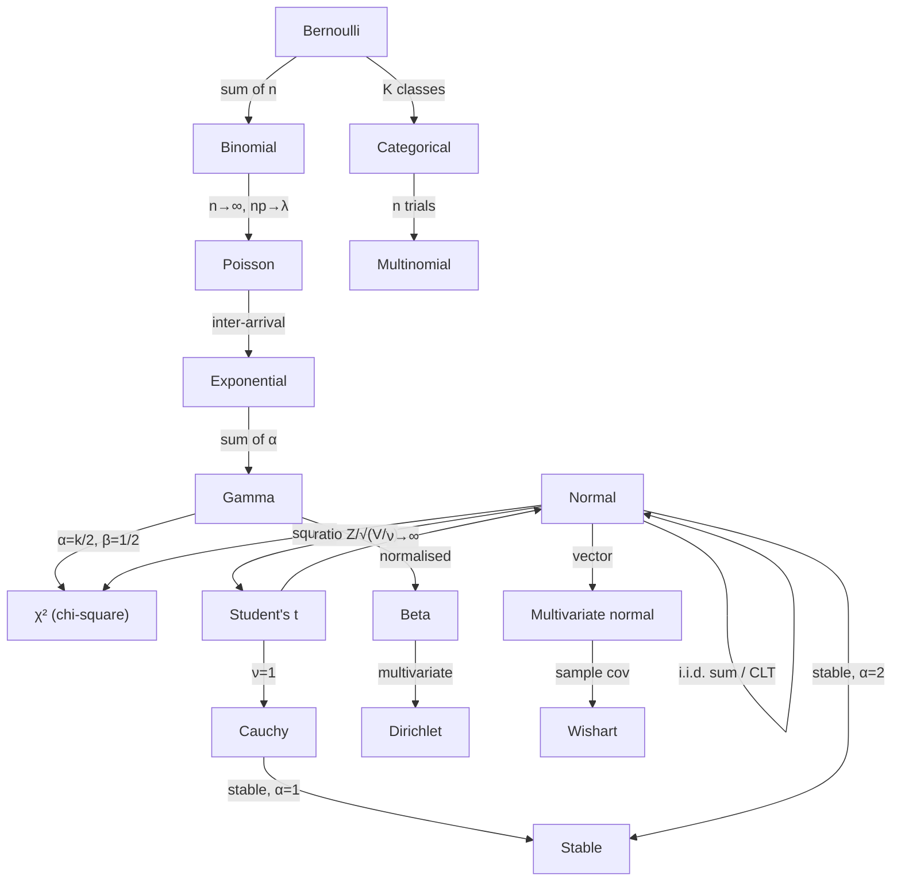

# Probability Distributions Zoo

A working statistician needs roughly a dozen distributions and a clear mental map of how they relate. Almost all of them are members of [[exponential-families|exponential families]], can be derived from [[maximum-entropy|maximum entropy]] under some constraint, and are connected to each other by limit theorems, conjugacy, or transformations.

This page is a reference card: definitions, moments, MGFs, MaxEnt characterisations, and the graph of relationships.

## 1. Discrete distributions

### Bernoulli($p$)

Single binary trial.

- **PMF.** $P(X=1) = p$, $P(X=0) = 1-p$.
- **Mean / variance.** $\mathbb{E}[X] = p$, $\operatorname{Var}(X) = p(1-p)$.
- **MGF.** $M(t) = (1-p) + pe^t$.
- **Exponential family.** $\eta = \log\frac{p}{1-p}$, $T(x) = x$, $A(\eta) = \log(1+e^\eta)$.
- **MaxEnt.** Maximum [[shannon-entropy|entropy]] on $\{0,1\}$ with fixed mean.

### Binomial($n, p$)

Sum of $n$ i.i.d. Bernoulli$(p)$.

- **PMF.** $\binom{n}{k} p^k (1-p)^{n-k}$.
- **Mean / variance.** $np$, $np(1-p)$.
- **MGF.** $((1-p) + pe^t)^n$.

### Poisson($\lambda$)

Number of events in a unit interval of a Poisson process.

- **PMF.** $\frac{\lambda^k e^{-\lambda}}{k!}$.
- **Mean / variance.** Both $\lambda$ — the **equi-dispersion** property.
- **MGF.** $\exp(\lambda(e^t - 1))$.
- **Exponential family.** $\eta = \log\lambda$, $T(x)=x$, $A(\eta)=e^\eta$, $h(x) = 1/x!$.
- **Limit.** Binomial$(n, \lambda/n)$ → Poisson$(\lambda)$ as $n \to \infty$ (rare-events law).
- **MaxEnt.** Max entropy on $\mathbb{N}$ with $\mathbb{E}[X]$ and base measure $1/x!$.

### Geometric / Negative Binomial

- **Geometric($p$).** Number of failures before the first success: $P(X=k) = (1-p)^k p$. Memoryless.
- **Negative binomial.** Number of failures before $r$ successes; sum of $r$ i.i.d. Geometric$(p)$.

### Multinomial / Categorical

Multivariate generalisation of Bernoulli/Binomial: $K$ categories with probabilities $\boldsymbol p$, $n$ trials. Used in language models, classification, GMMs.

## 2. Continuous distributions

### Normal $\mathcal{N}(\mu, \sigma^2)$

The "king" — the [[central-limit-theorem|CLT]] makes it the limit of every well-behaved sum.

- **PDF.** $\frac{1}{\sigma\sqrt{2\pi}}\exp\!\left(-\frac{(x-\mu)^2}{2\sigma^2}\right)$.
- **Mean / variance.** $\mu$, $\sigma^2$.
- **MGF.** $\exp(\mu t + \tfrac{1}{2}\sigma^2 t^2)$.
- **Exponential family.** $\eta = (\mu/\sigma^2,\, -1/(2\sigma^2))$, $T(x)=(x, x^2)$.
- **MaxEnt.** Max entropy on $\mathbb{R}$ given mean and variance.
- **Stable.** Sums of Gaussians are Gaussian; the $\alpha$-stable family with $\alpha=2$.

### Exponential($\lambda$)

Inter-arrival time of a Poisson process.

- **PDF.** $\lambda e^{-\lambda x}$ for $x \geq 0$.
- **Mean / variance.** $1/\lambda$, $1/\lambda^2$.
- **MGF.** $\lambda/(\lambda - t)$ for $t < \lambda$.
- **Memorylessness.** $P(X > s+t \mid X > s) = P(X > t)$ — the only continuous distribution with this property.
- **MaxEnt.** Max entropy on $[0,\infty)$ with fixed mean.

### Gamma($\alpha, \beta$)

Sum of $\alpha$ i.i.d. Exponential$(\beta)$ when $\alpha \in \mathbb{N}$.

- **PDF.** $\frac{\beta^\alpha}{\Gamma(\alpha)} x^{\alpha-1} e^{-\beta x}$ for $x \geq 0$.
- **Mean / variance.** $\alpha/\beta$, $\alpha/\beta^2$.
- **Special cases.** $\alpha=1$ → Exponential. $\alpha = k/2, \beta = 1/2$ → $\chi^2_k$.
- **MaxEnt.** Max entropy on $[0,\infty)$ with $\mathbb{E}[X]$ and $\mathbb{E}[\log X]$ fixed.

### Beta($\alpha, \beta$)

Distribution on $[0, 1]$. Conjugate prior to Bernoulli/Binomial.

- **PDF.** $\frac{x^{\alpha-1}(1-x)^{\beta-1}}{B(\alpha,\beta)}$.
- **Mean / variance.** $\alpha/(\alpha+\beta)$ and $\alpha\beta/((\alpha+\beta)^2(\alpha+\beta+1))$.
- **Shapes.** Bell-shaped, U-shaped, monotone, uniform — the most flexible 2-parameter density on $[0,1]$.

### Dirichlet($\boldsymbol\alpha$)

Multivariate Beta: distribution on the simplex $\Delta^{K-1}$. Conjugate prior to Multinomial/Categorical.

- **PDF.** $\frac{1}{B(\boldsymbol\alpha)}\prod_i x_i^{\alpha_i - 1}$ on the simplex.
- **Use.** LDA topic models, Bayesian neural-network priors, EBMs over discrete distributions.

### Chi-squared $\chi^2_k$

Sum of $k$ i.i.d. squared standard normals.

- **PDF.** $\frac{1}{2^{k/2}\Gamma(k/2)} x^{k/2 - 1} e^{-x/2}$ for $x \geq 0$.
- **Use.** Likelihood-ratio tests, confidence intervals for variance, goodness-of-fit.

### Student's $t_\nu$

Ratio $Z/\sqrt{V/\nu}$ with $Z \sim \mathcal{N}(0,1)$, $V \sim \chi^2_\nu$ independent.

- **Heavy tails:** $\sim |x|^{-(\nu+1)}$. Variance is finite only for $\nu > 2$.
- **Limit.** $t_\nu \to \mathcal{N}(0,1)$ as $\nu \to \infty$.
- **MaxEnt.** Tsallis-MaxEnt distribution under variance constraint.

### Cauchy

$t_1$, the canonical pathological case.

- **PDF.** $\frac{1}{\pi(1 + x^2)}$.
- **No mean, no variance.** The sample mean of Cauchy is again Cauchy — CLT *fails*.
- **Stable** with $\alpha = 1$.

### Stable distributions

A 4-parameter family $S(\alpha, \beta, \sigma, \mu)$ with $\alpha \in (0, 2]$. Characterised by closure under addition. The only attractors of normalised i.i.d. sums (generalised CLT). Used in finance for fat-tailed returns and in machine learning for heavy-tailed gradient noise.

### Multivariate normal $\mathcal{N}_d(\boldsymbol\mu, \Sigma)$

The vector-valued Gaussian — see [[multivariate-normal|Multivariate normal]] for the full theory (Mahalanobis ellipsoids, Schur-complement conditioning, Cramér–Wold CLT).

### Wishart and inverse Wishart

Distributions over positive-definite matrices. Wishart is the matrix analogue of $\chi^2$ (sample covariance of $\mathcal{N}_d$ data); inverse Wishart is its conjugate prior. Foundation of Gaussian-graphical-model Bayesian inference.

## 3. Heavy-tailed vs light-tailed

| Tail behaviour | Examples | Consequence |
|---|---|---|
| **Sub-Gaussian** $\Pr(|X| > t) \leq Ce^{-ct^2}$ | Bounded, Gaussian | Sharp concentration, finite MGF, Hoeffding-type bounds |
| **Sub-exponential** $\Pr(|X| > t) \leq Ce^{-ct}$ | Exponential, Gamma, sub-exp Lipschitz functions | Bernstein inequality |
| **Polynomial** $\Pr(|X| > t) \sim t^{-\alpha}$ | Pareto, Stable ($\alpha < 2$), Cauchy | CLT may fail; MGF doesn't exist |

This dichotomy controls when sample means concentrate (Bernstein), what kind of tail bounds you can hope for (sub-Gaussian: $e^{-t^2}$; polynomial: at best Markov), and which generalised CLT applies.

## 4. Relationship graph



## 5. Conjugate-prior pairs

| Likelihood | Conjugate prior | Updated posterior |
|---|---|---|
| Bernoulli, Binomial | Beta$(\alpha, \beta)$ | Beta$(\alpha + k, \beta + n - k)$ |
| Categorical, Multinomial | Dirichlet$(\boldsymbol\alpha)$ | Dirichlet$(\boldsymbol\alpha + \boldsymbol n)$ |
| Poisson | Gamma$(\alpha, \beta)$ | Gamma$(\alpha + \sum x_i, \beta + n)$ |
| Exponential | Gamma$(\alpha, \beta)$ | Gamma$(\alpha + n, \beta + \sum x_i)$ |
| $\mathcal{N}(\mu, \sigma^2)$ known $\sigma$ | $\mathcal{N}$ on $\mu$ | $\mathcal{N}$ with updated mean/variance |
| $\mathcal{N}(\mu, \sigma^2)$ known $\mu$ | Inverse Gamma on $\sigma^2$ | Inverse Gamma updated |
| Multivariate normal | Normal–inverse-Wishart | Normal–inverse-Wishart |

These pairings are no accident — they arise because each likelihood is in an [[exponential-families|exponential family]] and conjugate priors are themselves exponential.

## 6. Visualisation: tail contrast

```chart
{
  "type": "line",
  "xAxis": "x",
  "data": [
    {"x": -4, "gaussian": 0.0001, "cauchy": 0.0187},
    {"x": -3, "gaussian": 0.004,  "cauchy": 0.0318},
    {"x": -2, "gaussian": 0.054,  "cauchy": 0.0637},
    {"x": -1, "gaussian": 0.242,  "cauchy": 0.1592},
    {"x": 0,  "gaussian": 0.399,  "cauchy": 0.3183},
    {"x": 1,  "gaussian": 0.242,  "cauchy": 0.1592},
    {"x": 2,  "gaussian": 0.054,  "cauchy": 0.0637},
    {"x": 3,  "gaussian": 0.004,  "cauchy": 0.0318},
    {"x": 4,  "gaussian": 0.0001, "cauchy": 0.0187}
  ],
  "lines": [
    {"dataKey": "gaussian", "stroke": "#3b82f6", "name": "Gaussian (thin tails)"},
    {"dataKey": "cauchy",   "stroke": "#ef4444", "name": "Cauchy (fat tails)"}
  ]
}
```

*The Gaussian decays as $e^{-x^2/2}$; Cauchy decays only as $1/(1+x^2)$. The Cauchy assigns >100× more probability mass to "outliers" beyond ±3, which is exactly why financial returns and gradient noise are not Gaussian.*

## 7. Related topics

- [[exponential-families|Exponential families]] — the unifying algebraic form.
- [[maximum-entropy|Maximum entropy]] — derives each distribution from a constraint.
- [[central-limit-theorem|Central limit theorem]] — why the Normal dominates.
- [[multivariate-normal|Multivariate normal]] — vector Gaussian theory.
- [[bayesian-inference|Bayesian inference]] — uses the conjugate-prior table above.
- [[concentration-inequalities|Concentration inequalities]] — quantify tail behaviour.
- [[poisson-processes|Poisson processes]] — generators of the discrete and continuous arrival families.
