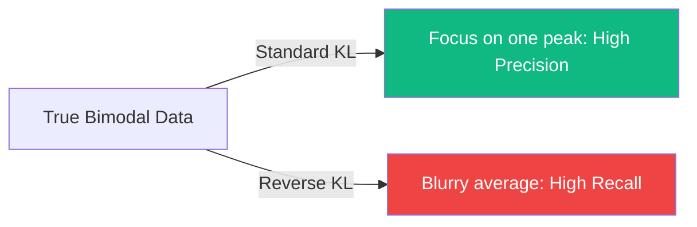

# f-Divergences: Measuring the Distance Between Distributions

In machine learning and information theory, we often need to measure how "different" two probability distributions $P$ and $Q$ are. While there are many ways to do this, **f-divergences** provide a unified mathematical framework that contains almost all common distance measures as special cases.

## 1. Definition

Given two distributions $P$ and $Q$ defined on a space $\Omega$, the f-divergence is defined as:
$$D_f(P \parallel Q) = \int_\Omega f\left( \frac{dP}{dQ} \right) dQ$$
Where **$f$ is a convex function** such that $f(1) = 0$. 

- **Intuition**: We are looking at the ratio of probabilities $P/Q$ at every point, applying a non-linear "cost" $f$ to the deviation from 1 (equality), and averaging it.
- **Positivity**: Due to [[jensens-inequality|Jensen's Inequality]], $D_f(P \parallel Q) \geq 0$ for any valid $f$.

## 2. Famous Special Cases

The choice of the function $f(t)$ determines the specific type of divergence:

| Divergence Name | Function $f(t)$ | Usage in AI |
| :--- | :--- | :--- |
| **KL Divergence** | $t \ln t$ | VAEs, [[llm]] Cross-[[shannon-entropy|Entropy]], [[rlhf]] |
| **Reverse KL** | $-\ln t$ | Variational Inference |
| **Total Variation** | $\frac{1}{2}|t - 1|$ | Theoretical bounds, Differential Privacy |
| **Pearson $\chi^2$** | $(t - 1)^2$ | Gaussian Mixture calibration |
| **Hellinger Distance**| $(\sqrt{t} - 1)^2$ | Robust statistics, signal processing |

## 3. Properties

1.  **Data Processing Inequality**: An f-divergence cannot increase under any local transformation (noise, filtering). This means that once information is lost, it stays lost.
2.  **Monotonicity**: $D_f$ is monotone with respect to the inclusion of $\sigma$-algebras.
3.  **Local Geometry**: For distributions that are very close, all f-divergences behave like the **Fisher Information Metric** (see [[information-geometry-finance]]).

## 4. Why Tier-1 ML Researchers care

- **Generative Adversarial Networks (GANs)**: The original GAN uses the Jensen-Shannon divergence. **f-GANs** showed that you can train a GAN using *any* f-divergence, allowing researchers to choose the one that results in the most stable training (e.g., the Hellinger GAN).
- **Variational Inference**: Choosing different f-divergences leads to different behaviors in the approximated distribution. KL-divergence tends to be "mode-seeking" (it covers only one peak), while Reverse-KL is "mass-covering" (it tries to cover the whole distribution).

## Visualization: Mode Seeking vs. Mass Covering

## Related Topics

[[shannon-entropy]] — the core of KL  
[[jensens-inequality]] — proving $D_f \geq 0$  
[[gan]] — application in generative models  
[[information-geometry-finance]] — the [[manifold-learning|manifold]] where $D_f$ is the distance
---