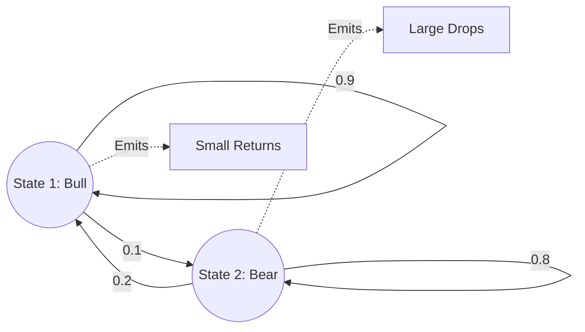

# Hidden Markov Models (HMM)

A **Hidden Markov Model (HMM)** is a statistical model in which the system is assumed to be a Markov process with unobserved (**hidden**) states. HMMs are the foundation of speech recognition, bioinformatics, and market regime detection.

## 1. The Model Structure

An HMM is defined by:
- **Hidden States ($Z_t$)**: A sequence of discrete states $1, \dots, K$ that follow a Markov chain.
- **Observations ($X_t$)**: What we actually see. The probability of an observation depends solely on the current hidden state: $P(X_t \mid Z_t)$.
- **Transition Matrix ($A$)**: $A_{ij} = P(Z_{t+1} = j \mid Z_t = i)$.
- **Emission Probabilities ($B$)**: $B_k(x) = P(X_t = x \mid Z_t = k)$.

## 2. The Three Fundamental Problems

To use an HMM, we must solve three mathematical challenges:

### A. The Evaluation Problem (Forward-Backward)
*Task*: Given the model and a sequence of observations, what is the probability $P(X)$?
*Solution*: The **Forward Algorithm**, which uses dynamic programming to sum over all possible hidden paths efficiently ($O(K^2 T)$).

### B. The Decoding Problem (Viterbi)
*Task*: Given the observations, what was the "most likely" sequence of hidden states?
*Solution*: The **Viterbi Algorithm**. It finds the single path through the hidden states that maximizes $P(Z \mid X)$.
- **In Finance**: Used to determine if the market was in a "Bull" or "Bear" regime during a specific historical period.

### C. The Learning Problem (Baum-Welch)
*Task*: Given only the observations, how do we find the parameters $A$ and $B$ that best fit the data?
*Solution*: The **Baum-Welch Algorithm**, which is a specific instance of the **Expectation-Maximization (EM)** algorithm. It iteratively improves the model by alternating between estimating the hidden states and updating the transition/emission probabilities.

## 3. Beyond Discrete States: Particle Filters

Standard HMMs assume a finite number of discrete states. If the hidden state is continuous (e.g., the true volatility of a stock), the evaluation becomes an integral that cannot be solved with Viterbi. In these cases, we use **[[hmm-particle-filters|Particle Filters]]** (Sequential Monte Carlo), which approximate the continuous hidden state using thousands of random samples.

## Visualization: HMM State Transition

## Related Topics

[[hmm-particle-filters]] — continuous state filtering  
markov-processes — the underlying state logic  
[[asymptotic-stats/mle]] — HMMs are trained via MLE (Baum-Welch)
---