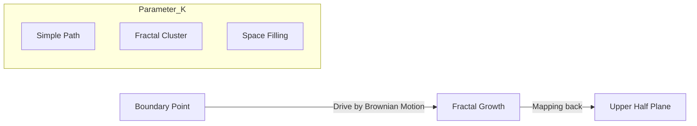

# Schramm-Loewner Evolution (SLE)

Schramm-Loewner Evolution (SLE) is a mathematical framework that describes the growth of random fractal curves in two dimensions. Introduced by **Oded Schramm** in 1999, it is the fundamental tool for understanding **Conformal Invariance** in statistical physics. It connects complex analysis, Brownian motion, and the geometry of phase transitions.

## 1. The Physical Motivation: Critical Interfaces

Imagine a 2D lattice (like a honeycomb) where each cell is colored either Black or White (a Percolation model). At the "critical point" (the phase transition), a giant path of black cells forms.
- This path is a jagged, random fractal curve.
- Physicists hypothesized that at large scales, these curves are **Conformally Invariant**: their statistics don't change if you stretch or warp the space (preserving angles).

SLE is the unique mathematical tool that describes these universal curves.

## 2. The Driving Equation

SLE works by "growing" a curve $\gamma(t)$ from the boundary of a complex domain (like the upper half-plane $\mathbb{H}$) into the interior.
The evolution is defined by the **Loewner Equation**:
$$\frac{\partial g_t(z)}{\partial t} = \frac{2}{g_t(z) - \xi_t}$$
Where:
- **$g_t(z)$**: A conformal map that "swallows" the curve and maps the remaining space back to the simple upper half-plane.
- **$\xi_t = \sqrt{\kappa} B_t$**: The **Driving Function**. It is a 1D Brownian motion scaled by a parameter $\kappa$.

## 3. The Kappa Parameter ($\kappa$) and Universality Classes

The entire geometry of the random curve is determined by a single number $\kappa$:
- **$\kappa \leq 4$**: The curve is simple (it never touches itself or the boundary).
- **$4 < \kappa < 8$**: The curve is "self-touching" (it forms loops) but does not fill the space.
- **$\kappa \geq 8$**: The curve is **Space-filling** (it visits every single point in the 2D plane).

### Famous Values:
- **$\kappa = 2$**: Loop-Erased Random Walk.
- **$\kappa = 3$**: Interface in the **Ising Model** (magnetism).
- **$\kappa = 6$**: Boundary of clusters in **Percolation**.
- **$\kappa = 8$**: The Peano curve / Uniform Spanning Tree.

## 4. Connection to 2D Quantum Gravity

SLE is the "boundary" description of random surfaces. There is a deep duality between SLE and the **[[gff|Gaussian Free Field (GFF)]]**:
- An SLE curve can be viewed as the "level line" of a random height map (GFF).
- This link is the basis for **Liouville Quantum Gravity**, which models how the geometry of the universe itself fluctuates at small scales.

## Visualization: The Growing Curve

## Related Topics

[[brownian-motion]] — the 1D engine of SLE  
[[gff]] — the 2D field version  
[[conformal-field-theory]] — the physical theory of these curves  
[[statistical-mechanics]] — where these phase transitions occur
---