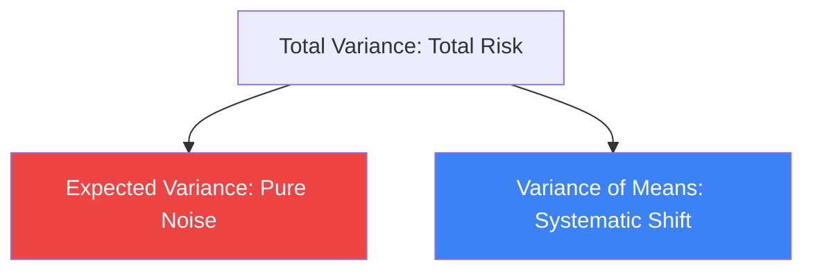

# Laws of Total Probability and Total Variance

These two "Laws of Total Everything" are the workhorses of conditional probability. They allow us to solve complex problems by breaking them down into simpler, conditional scenarios. They are the mathematical basis for **Stochastic Processes**, **Bayesian Hierarchical Models**, and **Variance Decomposition** in finance.

## 1. Law of Total Probability

The Law of Total Probability allows us to find the overall probability of an event by summing its conditional probabilities across all possible "worlds" (partitions of the sample space).

If $B_1, B_2, \dots$ is a partition of the space, then for any event $A$:
$$P(A) = \sum_i P(A \mid B_i) P(B_i)$$

- **In AI**: This is how **Generative Models** work. The total probability of an image $P(x)$ is the sum of probabilities of generating that image given every possible latent code $z$: $P(x) = \int P(x \mid z) P(z) dz$.

## 2. Law of Total Expectation (Adam's Law)

The expected value of $X$ is the "average of the averages":
$$\mathbb{E}[X] = \mathbb{E}[\mathbb{E}[X \mid Y]]$$

- **Intuition**: To find the average height of students in a university, you can first find the average height in each classroom, and then take the average of those results (weighted by class size).

## 3. Law of Total Variance (Eve's Law)

This is the most subtle and useful law for risk management. It decomposes the total variance of a variable into two distinct components:

$$\text{Var}(X) = \underbrace{\mathbb{E}[\text{Var}(X \mid Y)]}_{\text{Within-group variance}} + \underbrace{\text{Var}(\mathbb{E}[X \mid Y])}_{\text{Between-group variance}}$$

- **Component 1 (Expected Conditional Variance)**: The "unpredictable" noise that remains even if you know the category $Y$.
- **Component 2 (Variance of Conditional Expectation)**: The "predictable" part of the variance that is explained by $Y$.

### Example: Financial Alpha
Imagine $X$ is a stock return and $Y$ is the Market Regime (Bull or Bear).
- $\mathbb{E}[\text{Var}(X \mid Y)]$ is the volatility of the stock within a specific regime.
- $\text{Var}(\mathbb{E}[X \mid Y])$ is the risk caused by the fact that the market switches between regimes.

## 4. Application in Machine Learning

The Law of Total Variance is the foundation of the **Bias-Variance Decomposition**:
$$\text{Expected Error} = \text{Bias}^2 + \text{Variance} + \text{Irreducible Noise}$$
- **Bias** comes from the distance between our average prediction and the truth (related to $\mathbb{E}[X \mid Y]$).
- **Variance** comes from the "Between-group" part—how much our model's prediction changes if we change the training data $Y$.

## Visualization: Variance Decomposition

## Related Topics

[[probability-theory]] — the foundational axioms  
[[hmm-particle-filters]] — conditional scenarios in time  
[[bayesian-inference]] — where $Y$ is the parameter $\theta$
---