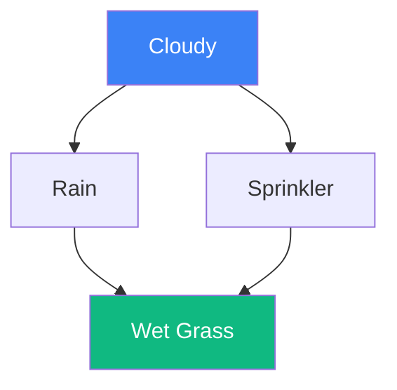

# Bayesian Networks

A Bayesian Network (also known as a belief network or causal network) is a probabilistic graphical model that represents a set of variables and their conditional dependencies via a **Directed Acyclic Graph (DAG)**. They provide a compact way to represent complex joint probability distributions.

## The DAG Structure

- **Nodes**: Represent random variables (discrete or continuous).
- **Edges**: Represent direct dependencies. If there is an edge from $A \to B$, we say $A$ is a parent of $B$.
- **Acyclicity**: There are no loops. You cannot start at a node and follow the arrows back to it.

## The Factorization Property

The power of Bayesian networks lies in the **Chain Rule for Bayesian Networks**. The joint probability distribution of all variables $X_1, \dots, X_n$ is the product of the conditional probabilities of each node given its parents:

$$P(X_1, \dots, X_n) = \prod_{i=1}^n P(X_i \mid \text{Parents}(X_i))$$

Without this structure, representing a joint distribution of 100 binary variables would require $2^{100}-1$ parameters. In a sparse Bayesian network, it might require only a few hundred.

## D-Separation (Conditional Independence)

D-separation is a criterion for deciding whether a set of variables $X$ is independent of $Y$ given $Z$ just by looking at the graph.
1.  **Chain**: $A \to B \to C$ ($A \perp C \mid B$)
2.  **Fork**: $A \leftarrow B \to C$ ($A \perp C \mid B$)
3.  **Collider (V-structure)**: $A \to B \leftarrow C$ ($A$ and $C$ are independent, but become **dependent** if $B$ is observed!)

## Inference and Learning

1.  **Inference**: Calculating $P(\text{Query} \mid \text{Evidence})$. This is NP-hard in general, but efficient algorithms like **Variable Elimination** or **Belief Propagation** work for specific graph structures (like trees).
2.  **Learning**:
    - **Parameter Learning**: Estimating the conditional probability tables (CPTs) when the graph structure is known (using MLE or EM).
    - **Structure Learning**: Finding the DAG that best fits the data (using scoring functions like BIC or constraint-based methods).

## Visualization: A Simple Network

*In this model, Rain and Sprinkler are dependent because they share a common cause (Cloudy). However, they also share a common effect (Wet Grass), which creates a "collider" structure.*

## Related Topics

[[bayes-theorem]] — the foundational logic  
[[hmm]] — HMMs are a special type of dynamic Bayesian network  
[[causal-inference]] — using Bayesian networks to represent causal structures
---
