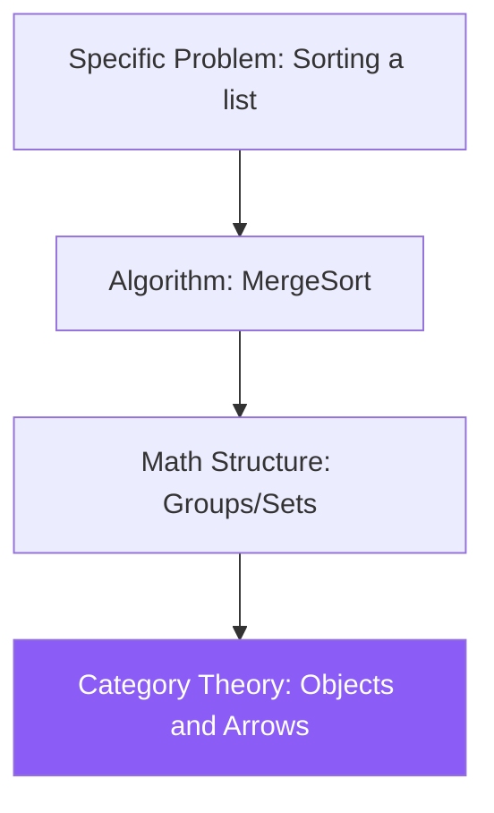

# Category Theory: The Mathematics of Mathematics

Category Theory is the ultimate level of mathematical abstraction. It studies not the internal structure of objects (like sets or groups), but the **Relationships (Morphisms)** between them. It provides a "unified language" for all of mathematics, physics, and computer science.

## 1. Objects and Morphisms

A **Category** consists of:
- **Objects**: Dots (e.g., all Sets, all Vector Spaces).
- **Morphisms (Arrows)**: Arrows between dots (e.g., Functions, Linear Maps).
- **Composition**: If there is an arrow $f: A \to B$ and $g: B \to C$, there must be an arrow $g \circ f: A \to C$.

## 2. Functors: Moving Between Worlds

A **Functor** is a mapping between categories. It maps objects to objects and arrows to arrows while preserving the structure of composition.
- *Example in AI*: A Word Embedding is a functor that maps the category of "Words/Meanings" to the category of "High-dimensional Vectors."

## 3. Natural Transformations

If Functors are maps between categories, **Natural Transformations** are maps between functors. They describe how one process can be transformed into another without losing its essential structure.

## 4. The Yoneda Lemma: Identity via Relationships

The most profound result in category theory. It states that **an object is completely determined by its relationships to all other objects.**
- You don't need to know what is "inside" an object. If you know every possible arrow pointing into it and out of it, you know the object perfectly.
- *Philosophical link*: This is identical to the idea of **Distributed Representations** in LLMs (Word2Vec/Embeddings). A word's "meaning" is defined solely by its context (the words it relates to).

## 5. Applications in AI and Physics

1.  **Functional Programming**: Category theory is the foundation of languages like **Haskell**. Concepts like **Monads** (used to handle side effects) are purely category-theoretic.
2.  **Topos Theory**: A category that behaves like the universe of sets but has its own internal logic (see [[topos-theory]]).
3.  **Quantum Physics**: **Categorical Quantum Mechanics** uses string diagrams (a visual category language) to describe entanglement and logic gates, bypassing complex matrix algebra.

## Visualization: The Hierarchy of Abstraction

## Related Topics

[[topos-theory]] — logic inside categories  
[[homological-algebra]] — using arrows to study topology  
[[type-theory]] — types as objects in a category
---
