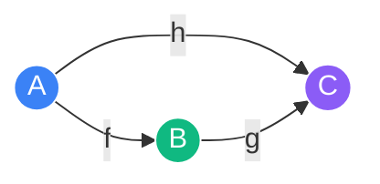

# Category Theory for AI

Category Theory is the "mathematics of mathematics" — a high-level framework that focuses on the **relationships** (morphisms) between objects rather than the internal structure of the objects themselves. In AI and Computer Science, it provides the formal foundation for functional programming, data schemas, and the study of neural architectures.

## Basic Definitions

### 1. Category ($\mathcal{C}$)
A category consists of:
- A collection of **objects** ($A, B, C, \dots$).
- A collection of **arrows** (morphisms) between objects ($f: A \to B$).
- A composition rule: for $f: A \to B$ and $g: B \to C$, there is $g \circ f: A \to C$.
- Identity morphisms and associativity.

### 2. Functor ($F$)
A functor is a mapping between categories that preserves the structure (objects and arrows).
$$F: \mathcal{C} \to \mathcal{D}$$
In programming, a Functor is often a type constructor (like `List` or `Option`) that maps values and functions.

## Deep Structures: Monads and Adjunctions

### 1. Monads
A Monad is a functor $M$ equipped with two natural transformations: $\eta: I \to M$ (unit) and $\mu: M^2 \to M$ (flatten). 
In AI, monads represent **computational effects** (like probability or state). A stochastic process can be viewed as a Kleisli category of the probability monad (Giry monad).

### 2. Adjunctions
Adjunctions are pairs of functors $F \dashv G$ that represent a form of "efficient equivalence." 
- **Backpropagation** can be formally described as an adjunction between the category of neural layers and the category of their gradients (Reverse-mode AD).

## Category Theory and Neural Architectures

Recent work in **Categorical Deep Learning** views neural networks as morphisms in a category of "learnable functions."
1.  **Compositionality**: A deep network is a composition of simpler functors.
2.  **Type Safety**: Ensuring that the dimensions and properties of layers match up during construction.
3.  **Invariance**: Describing symmetry groups as categorical actions on data.

## Visualization: The Commutative Diagram

*In Category Theory, if the path A -> B -> C is the same as A -> C, we say the diagram **commutes**. This is the formal way of saying that two different sequences of operations yield the same result.*

## Related Topics

[[homological-algebra]] — the algebraic application of categories  
[[automatic-differentiation]] — formalizing the chain rule  
[[geometric-deep-learning]] — categorical view of symmetries
---
