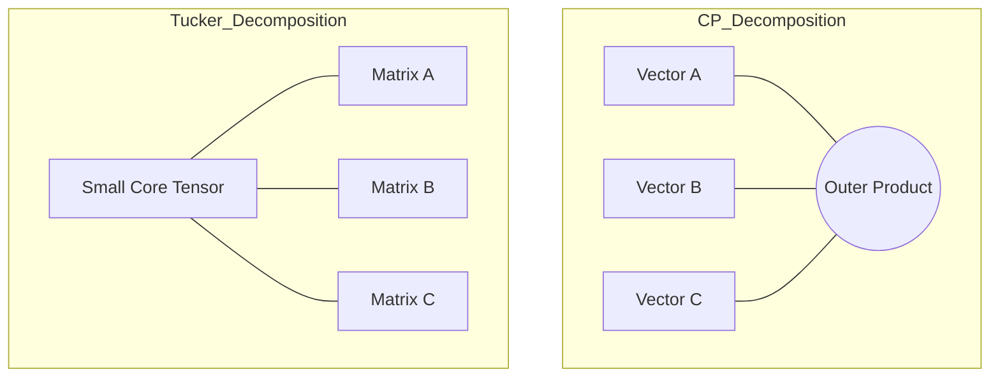

# Tensor Decompositions: Compressing Multi-dimensional Data

In linear algebra, we decompose matrices (2D tensors) using SVD or Eigen-decomposition. In modern AI, data and model weights are higher-dimensional **Tensors**. **Tensor Decompositions** provide the mathematical tools to find hidden low-rank structures in these giant multidimensional arrays, enabling extreme model compression.

## 1. The Core Problem: Rank of a Tensor

Unlike matrices, finding the rank of a tensor (3D or higher) is an **NP-hard** problem. There is no single "best" decomposition. Instead, we have several architectures depending on the goal.

## 2. CP Decomposition (CANDECOMP/PARAFAC)

CP decomposition expresses a tensor as a sum of a minimum number of **rank-1 tensors** (outer products of vectors).
$$\mathcal{X} \approx \sum_{r=1}^R \mathbf{a}_r \circ \mathbf{b}_r \circ \mathbf{c}_r$$
- **Use Case**: Identifying individual hidden factors in complex data (e.g., separating "Speaker," "Phoneme," and "Emotion" in a 3D audio tensor).
- **Limitation**: Finding the optimal $R$ is difficult and the optimization is often unstable.

## 3. Tucker Decomposition (Higher-Order SVD)

Tucker decomposition is like a multidimensional version of PCA. It decomposes a tensor into a small **Core Tensor** $\mathcal{G}$ multiplied by a matrix along each mode:
$$\mathcal{X} \approx \mathcal{G} \times_1 A \times_2 B \times_3 C$$
- **Interpretation**: The core tensor $\mathcal{G}$ captures the interactions between the factors represented by the matrices $A, B, C$.
- **Use Case**: Compressing convolutional layers in computer vision.

## 4. Tensor-Train (TT) Decomposition

This is the most important decomposition for **Large Language Models**. It is the mathematical bridge to [[many-body-tensor-networks|Matrix Product States (MPS)]] from physics.
Instead of a giant tensor, we store a chain of 3D tensors:
$$\mathcal{X}(i_1, \dots, i_d) = G_1(i_1) G_2(i_2) \dots G_d(i_d)$$
- **Compression Power**: TT can reduce the number of parameters from $O(N^d)$ to $O(d \cdot N \cdot \chi^2)$. 
- **Application**: A 100GB weight matrix can often be stored as a 1GB Tensor-Train without losing the model's ability to reason.

## 5. Why it Matters for AI Infrastructure

- **Reducing FLOPs**: Doing math on decomposed tensors is much faster. Instead of multiplying a million-by-million matrix, you multiply a series of small "TT-cores."
- **Communication**: In [[distributed-training]], sending decomposed gradients between GPUs requires 90% less bandwidth, solving the network bottleneck.

## Visualization: CP vs. Tucker

## Related Topics

[[pca]] — the 2D version  
[[many-body-tensor-networks]] — the physics application (MPS)  
[[llm-infra/training/modern-quantization]] — another way to compress models
---
