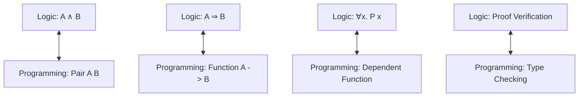

# Type Theory and Formal Logic

Type theory is a formal system that serves as an alternative to set theory for the foundations of mathematics. In type theory, every term has a **Type** (similar to programming), and mathematical proofs are treated as **Programs**. This is the basis for modern theorem provers like **Coq**, **Lean**, and **Agda**.

## The Curry-Howard Correspondence

The most profound insight in type theory is the **Curry-Howard isomorphism**:
- **Propositions are Types**: A mathematical statement $P$ is viewed as a type.
- **Proofs are Programs**: A proof of $P$ is an element (or a program) of type $P$.

If you can write a program that satisfies the requirements of a type, you have successfully proven the corresponding theorem. This "Proving by Programming" is what allows computers to verify human mathematics.

## Dependent Types

Standard types (like `Int` or `String`) are simple. **Dependent types** are types that depend on values.
- *Example*: A type `Vector(n)` which represents a list of exactly $n$ numbers.
This allows expressing complex mathematical properties in the type system itself, catching logical errors at "compile time."

## Homotopy Type Theory (HoTT)

A modern extension (Voevodsky et al., 2013) that interprets types as **spaces** and identities (equalities) as **paths** between points in those spaces. 
- **Univalence Axiom**: States that "equivalent types are identical." This solves many problems in how mathematicians treat isomorphic structures as "the same."

## Why It Matters for AI

1.  **AI for Math**: Models like OpenAI's `Lean-CLIP` or Meta's theorem provers use type theory to train AI to find formal proofs for IMO-level problems.
2.  **Software Safety**: Formal verification of neural network properties (e.g., ensuring a self-driving car never crosses a certain boundary) often relies on type-theoretic proofs.
3.  **Neuro-symbolic AI**: Combining the probabilistic nature of LLMs with the formal rigidity of type theory to prevent hallucinations in logical reasoning.

## Visualization: The Proof-Program Ladder

## Related Topics

[[category-theory]] — types can be viewed as objects in a category  
[[foundations]] — comparison with ZFC set theory  
[[reasoning-models]] — AI that operates within formal systems
---
