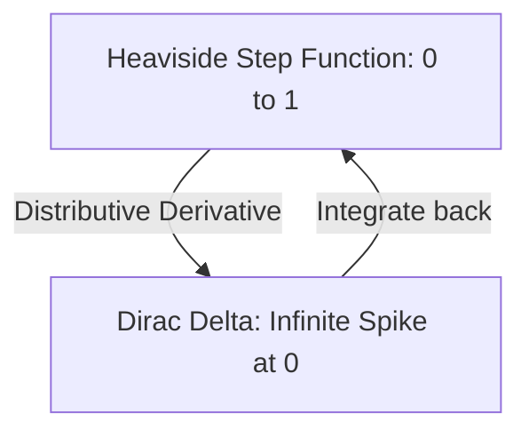

# Schwartz Distributions: Generalized Functions

In standard calculus, functions like the **Dirac Delta** ($\delta(x)$) are not really functions—their value at zero is "infinity" and zero elsewhere, yet their integral is 1. **Schwartz Distributions** (or Generalized Functions), introduced by Laurent Schwartz in the 1950s, provide the rigorous mathematical framework to handle such objects, enabling the modern theory of **Partial Differential Equations (PDEs)**.

## 1. The Core Idea: Functions as Linear Maps

Instead of defining a function by its values $f(x)$, we define a distribution $T$ by how it acts on "well-behaved" **Test Functions** $\phi(x)$. 
A distribution is a continuous linear functional on the space of smooth functions with compact support ($C_c^\infty$, also called the **Schwartz Space** $\mathcal{D}$).

The action is written as:
$$\langle T, \phi \rangle$$
For a normal function $f$, this is just the integral $\int f(x) \phi(x) dx$. For the Dirac Delta, it is $\langle \delta, \phi \rangle = \phi(0)$.

## 2. Weak Derivatives: Differentiating the Non-Differentiable

The greatest power of distributions is that **every distribution has a derivative** that is also a distribution.
We define the derivative $T'$ by "moving" the derivative onto the test function using integration by parts:
$$\langle T', \phi \rangle = -\langle T, \phi' \rangle$$

- *Example*: The Heaviside step function $H(x)$ is not differentiable in the classical sense. In the sense of distributions, its derivative is the **Dirac Delta**: $H' = \delta$.
- This allows us to find "weak solutions" to physical equations (like wave shocks or cracks in materials) where classical derivatives blow up.

## 3. The Fourier Transform of Distributions

Schwartz defined a special space of "Slowly Increasing" functions (the **Tempered Distributions** $\mathcal{S}'$). These are distributions that can be integrated against functions that decay faster than any polynomial.
- Tempered distributions have a well-defined **Fourier Transform**.
- This is why we can talk about the "spectrum" of a delta function (which is a constant 1) even though the delta function doesn't have a standard integral representation.

## 4. Fundamental Solutions (Green's Functions)

A distribution $G$ is a **Fundamental Solution** for a linear operator $L$ if:
$$LG = \delta$$
Once you find $G$, you can solve the equation $Lu = f$ for *any* source $f$ using **Convolution**: $u = G * f$. 
- In electrostatics, the fundamental solution of the Laplacian is the $1/r$ potential. 
- In [[deep-galerkin|DGM]] and PINNs, the neural network implicitly learns these fundamental solutions to represent physical fields.

## Visualization: Derivative of a Step

## Related Topics

[[laplacian]] — the operator whose fundamental solution is a distribution  
[[fourier-transform]] — the bridge for tempered distributions  
[[physics/classical/partial-differential-equations]] — solved via weak solutions
---
