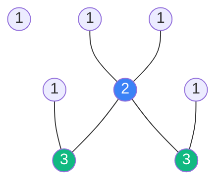

# Combinatorics and Induction: The Tools of Counting and Proving

**Combinatorics** is the branch of mathematics dealing with counting, arrangement, and combinations of elements in finite sets. **Mathematical Induction** is the primary technique for proving that a property holds for all natural numbers. Together, they are essential for analyzing algorithm complexity and discrete probabilities.

## 1. The Rules of Counting

- **Product Rule**: If task A can be done in $n$ ways and task B in $m$ ways, then doing both can be done in $n \times m$ ways.
- **Permutations ($P_n$)**: Ways to arrange $n$ distinct objects. 
  $$ P_n = n! = n \times (n-1) \times \dots \times 1 $$
- **Combinations ($C_n^k$)**: Ways to choose $k$ objects from $n$, where order does **not** matter.
  $$ \binom{n}{k} = \frac{n!}{k!(n-k)!} $$

## 2. Binomial Theorem

One of the most used formulas in statistics and algebra:
$$ (a + b)^n = \sum_{k=0}^{n} \binom{n}{k} a^{n-k} b^k $$
The coefficients $\binom{n}{k}$ form **Pascal's Triangle**. They represent the number of ways to get $k$ "successes" in $n$ trials, which is the heart of the **Binomial Distribution**.

## 3. Mathematical Induction

To prove that a statement $P(n)$ is true for all $n \geq 1$:
1.  **Base Case**: Show $P(1)$ is true.
2.  **Inductive Step**: Assume $P(k)$ is true (Inductive Hypothesis).
3.  **Conclusion**: Prove that $P(k+1)$ must also be true.

### Intuition: The Domino Effect
If the first domino falls (Base Case), and if any falling domino knocks over the next one (Inductive Step), then all dominoes will fall.

## 4. Why it Matters in CS and AI

1.  **Complexity Analysis**: We use induction to prove the time complexity ($O(n \log n)$) of recursive algorithms like MergeSort.
2.  **Probability in Deep Learning**: When calculating the number of possible paths in a neural network or the state space of a game (like Go or Chess), we use combinatorics.
3.  **Hardware Design**: Counting the number of possible states in a finite state machine.

## 5. Pigeonhole Principle

If you have $n$ pigeons and $m$ holes, and $n > m$, then at least one hole must contain more than one pigeon. 
*Significance*: This simple idea is used to prove lower bounds in computation and the existence of collisions in **Hash Functions** (critical for blockchain security).

## Visualization: Pascal's Triangle (Combinations)

## Related Topics

[[lln-clt]] — counting successes in large trials  
algorithms-complexity — using induction for Big-O notation  
[[stablecoin-mechanisms]] — combinatorial risks in large-scale protocols
---
