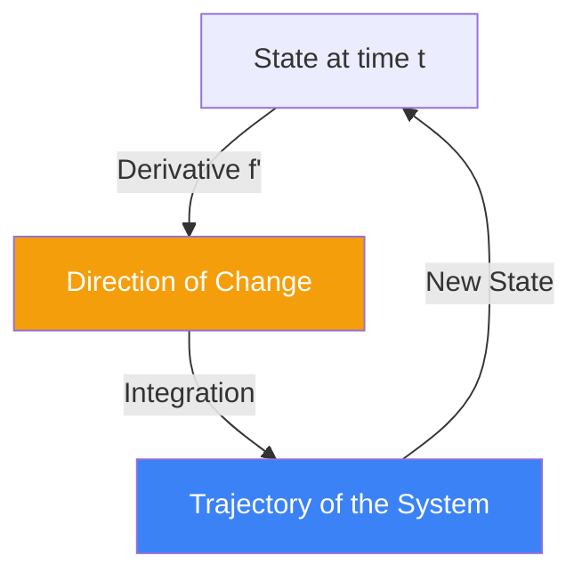

# Differential Equations: Modeling Dynamic Systems

**Differential Equations (DEs)** are mathematical equations that relate a function to its derivatives. In plain English, they describe how a system changes over time or space. Nearly every law of physics, from gravity to electromagnetism, is expressed as a differential equation.

## 1. Ordinary Differential Equations (ODEs)

An **ODE** involves functions of a single variable (usually time $t$).
- **First Order**: $y' = ky$. This describes **Exponential Growth** (population) or **Decay** (radioactivity).
- **Second Order**: $F = ma \implies m \frac{d^2x}{dt^2} = -kx$. This is the **Harmonic Oscillator** (springs, pendulums, AC circuits).

## 2. Partial Differential Equations (PDEs)

A **PDE** involves functions of multiple variables (e.g., space $x, y$ and time $t$). These describe fields and waves.
1.  **Heat Equation**: $\frac{\partial u}{\partial t} = \alpha \nabla^2 u$. Describes how heat spreads or how information diffuses in a network.
2.  **Wave Equation**: $\frac{\partial^2 u}{\partial t^2} = c^2 \nabla^2 u$. Describes sound, light, and water waves.
3.  **Black-Scholes PDE**: Used to price financial options by modeling the "diffusion" of risk.

## 3. Linearity and Superposition

The most important concept in DEs is **Linearity**. If an equation is linear:
- If $y_1$ and $y_2$ are solutions, then $y_1 + y_2$ is also a solution.
- This **Superposition Principle** allows us to build complex solutions from simple "building blocks" (like Sine and Cosine waves).

## 4. Analytical vs. Numerical Solutions

Most real-world DEs (like the Navier-Stokes equations for weather) cannot be solved with pen and paper.
- **Analytical**: Finding a formula for the solution (e.g., $y(t) = e^{kt}$).
- **Numerical**: Using a computer to step through time (e.g., **Runge-Kutta** or **Euler methods**). In AI, training a neural network is essentially solving a high-dimensional DE numerically.

## 5. Why it Matters in AI and Finance

### A. Neural ODEs
A modern AI architecture where the layers of a neural network are treated as a continuous flow, described by an ODE. This allows for models with variable depth and high efficiency.

### B. Stochastic Differential Equations (SDEs)
In finance and physics, we add "noise" to a DE.
$$ dS_t = \mu S_t dt + \sigma S_t dW_t $$
This is the **Geometric Brownian Motion**, the foundation of all quantitative trading.

## Visualization: The Vector Field

## Related Topics

[[geometric-brownian-motion]] — the primary SDE in finance  
[[ricci-flow]] — a PDE that evolves geometry itself  
backpropagation — viewed as a discrete-time ODE solver
---
