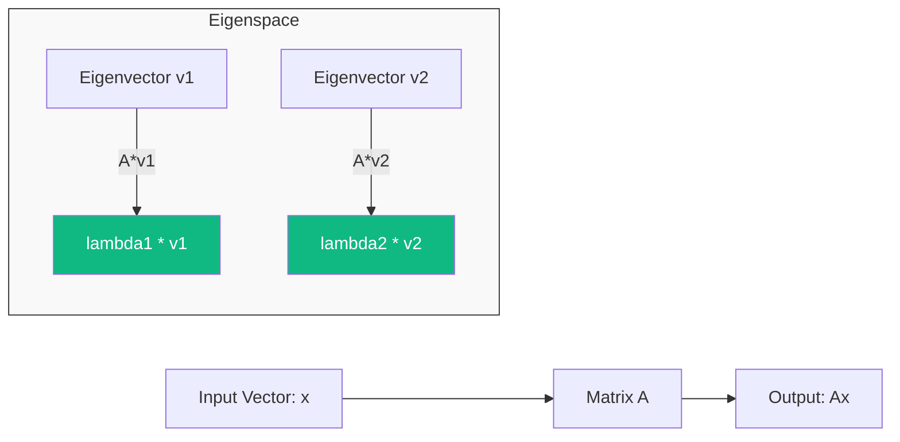

# [[spectral-theory-operators|Eigenvalues]], Eigenvectors, and Spectral Theory

In linear algebra, most vectors change their direction when multiplied by a matrix. However, some special vectors maintain their direction and are only scaled (stretched or shrunk). These are **Eigenvectors**, and the factor by which they are scaled is the **Eigenvalue**. This "Spectral Theory" is the engine behind stability analysis, vibration physics, and the **PageRank** algorithm.

## 1. The Characteristic Equation

For a square matrix $A$, a non-zero vector $v$ is an eigenvector if:
$$ Av = \lambda v $$
where $\lambda$ is a scalar (eigenvalue). To find $\lambda$, we solve the **Characteristic Equation**:
$$ \det(A - \lambda I) = 0 $$
This yields a polynomial of degree $n$, where the roots are the eigenvalues.

## 2. Eigendecomposition (Spectral Decomposition)

If a matrix $A$ has $n$ linearly independent eigenvectors, it can be decomposed into:
$$ A = V \Lambda V^{-1} $$
- $V$: A matrix where columns are the eigenvectors.
- $\Lambda$: A diagonal matrix of the eigenvalues.

### Physical Intuition
This decomposition "uncouples" the system. It shows that the complex transformation $A$ is actually just a simple scaling along the directions of the eigenvectors. In physics, these are the **Normal Modes** of a system (e.g., how a building vibrates during an earthquake).

## 3. Symmetric Matrices and Orthogonality

A critical result for ML and Physics is the **Spectral Theorem**: 
*If $A$ is a real symmetric matrix ($A = A^T$), its eigenvectors are orthogonal, and its eigenvalues are real.*
This allows for the decomposition:
$$ A = Q \Lambda Q^T $$
where $Q$ is an orthogonal matrix ($Q^T Q = I$). This is the foundation of **PCA (Principal Component Analysis)**.

## 4. Singular Value Decomposition (SVD)

What if the matrix is not square? **SVD** generalizes eigenvalues to any $m \times n$ matrix:
$$ A = U \Sigma V^T $$
- $U$: Left singular vectors (eigenvectors of $AA^T$).
- $V$: Right singular vectors (eigenvectors of $A^T A$).
- $\Sigma$: Singular values (square roots of eigenvalues of $A^T A$).
*SVD is used in image compression, recommendation systems (Netflix), and Latent Semantic Analysis in NLP.*

## 5. Applications in AI and Finance

1.  **Google PageRank**: The importance of a webpage is the dominant eigenvector of the web's link matrix.
2.  **Portfolio Risk**: The largest eigenvalue of a correlation matrix represents the **Market Factor** (systemic risk), while smaller ones represent sector-specific or idiosyncratic noise.
3.  **Neural Stability**: In Recurrent Neural Networks (RNNs), if the eigenvalues of the weight matrix are $> 1$, gradients explode; if $< 1$, they vanish.

## Visualization: Transformation and Eigendirs

## Related Topics

[[linear-spaces-basis]] — prerequisite definitions of vectors and spaces  
[[discrete-markov-chains|Markov chains]] — finding stationary distributions via eigenvalues  
[[pca-statarb]] — applying spectral theory to trading strategies
---
