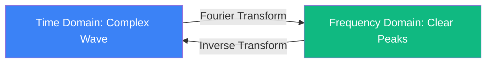

# Fourier Transform: The Language of Waves

Fourier Analysis is the study of how complex functions can be represented as sums of simple trigonometric waves. It is the mathematical foundation of signal processing, quantum mechanics, and modern AI.

## 1. Fourier Series (Periodic Signals)

Any periodic function $f(x)$ with period $2\pi$ can be written as an infinite sum of harmonics:
$$ f(x) = \frac{a_0}{2} + \sum_{n=1}^{\infty} [a_n \cos(nx) + b_n \sin(nx)] $$
**Intuition**: Any complex sound (like a violin note) is just a "recipe" of pure tones mixed in specific proportions.

## 2. The Fourier Transform (Continuous Case)

For signals that do not repeat, we move from a sum to an integral. The **Fourier Transform** $\mathcal{F}$ converts a signal from the **Time Domain** to the **Frequency Domain**:
$$ \hat{f}(\omega) = \int_{-\infty}^{\infty} f(t) e^{-i \omega t} \, dt $$

- **Inverse Transform**: Allows us to reconstruct the original signal from its frequency spectrum.
- **Duality**: A sharp spike in time "spreads out" across all frequencies, and vice versa.

## 3. Discrete and Fast Transform (FFT)

In computers, we use the **Discrete Fourier Transform (DFT)**. The **Fast Fourier Transform (FFT)** algorithm reduces the computational complexity from $O(N^2)$ to $O(N \log N)$. This efficiency is what makes digital audio (MP3), video streaming, 5G, and Wi-Fi possible.

## 4. Key Properties

- **Convolution Theorem**: $\mathcal{F}\{f \ast g\} = \hat f \cdot \hat g$. Convolution in time becomes simple multiplication in frequency—the basis for accelerating neural networks.
- **Uncertainty Principle**: A signal cannot be perfectly localized in both time and frequency. This is the mathematical root of Heisenberg's uncertainty principle in physics.
- **Parseval's Theorem**: The total energy of a signal is preserved during the transformation.

## 5. Why it Matters in AI and Science

- **Fourier Neural Operators (FNO)**: Architectures that learn in the spectral domain, solving PDEs (like Navier-Stokes) much faster than numerical solvers.
- **Geometric Deep Learning (GNNs)**: Convolutions on graphs are defined via the spectrum of the Graph Laplacian (the network equivalent of frequency analysis).
- **Positional Encodings**: Transformers and NeRFs use Fourier features (sinusoidal encodings) to represent high-frequency details and textures.
- **Quantitative Finance**: Spectral analysis helps identify cycles in time series and filter out market noise.

## Visualization: From Time to Frequency

## Related Topics

[[spectral-analysis|Spectral Analysis]] — studying the frequency composition of signals  
[[fno|Fourier Neural Operators]] — neural networks in the spectral domain  
[[spectral-graph-theory]] — Fourier analysis on networks and graphs  
[[quantum-computing|Quantum Fourier Transform]] — algorithmic speedup in quantum systems
