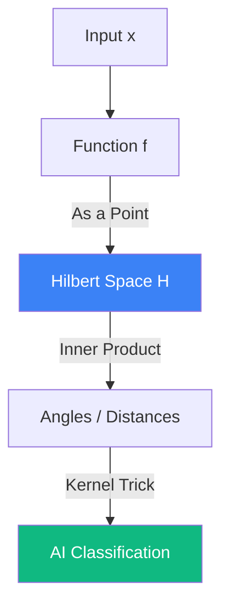

# Functional Analysis: The Calculus of Functions

**Functional Analysis** is a branch of mathematical analysis that studies vector spaces of functions. While linear algebra deals with finite-dimensional vectors (like in 3D space), Functional Analysis extends these concepts to **Infinite Dimensions**. It is the mathematical language of [[quantum-entanglement|Quantum Mechanics]] and the theoretical foundation of **Kernel Methods** in Machine Learning.

## 1. From Vectors to Functions

In functional analysis, we treat an entire function (e.g., $f(x) = \sin x$) as a single "point" or "vector" in a vast space. 
- **Normed Spaces**: A space where every "vector" (function) has a measurable length $\|f\|$.
- **Banach Space**: A complete normed space (no "gaps" in the space).

## 2. Hilbert Spaces ($\mathcal{H}$)

A **Hilbert Space** is a special kind of function space equipped with an **Inner Product** $\langle f, g \rangle$. This allows us to define:
1.  **Angle and Orthogonality**: Two functions are orthogonal if their inner product is zero.
2.  **Distance**: $d(f, g) = \|f - g\|$.
3.  **Projection**: Finding the "closest" simple function to a complex one.

*Example*: The space $L^2[a, b]$ of square-integrable functions is the most famous Hilbert space, used to represent quantum wave functions.

## 3. Operators and Eigenfunctions

A **Linear Operator** $A$ is a map that takes one function and transforms it into another (e.g., the Derivative operator $D f = f'$).
- **Eigenfunctions**: If $A f = \lambda f$, then $f$ is an eigenfunction and $\lambda$ is an eigenvalue.
- **Self-Adjoint Operators**: In quantum physics, physical observables (like Energy or Momentum) are represented by self-adjoint operators. Their [[spectral-theory-operators|eigenvalues]] are the only values we can actually measure in an experiment.

## 4. Why it Matters in AI: Kernels and RKHS

In Machine Learning, **Reproducing Kernel Hilbert Spaces (RKHS)** are used to solve non-linear problems.
- By "lifting" data from a low-dimensional space into an infinite-dimensional Hilbert space, complex boundaries become simple linear planes (the **Kernel Trick**).
- This is the math behind Support Vector Machines (SVMs) and Gaussian Processes.

## 5. Spectral Theorem (Infinite-dimensional)

The spectral theorem generalizes the [[eigenvalues-eigenvectors|eigendecomposition]] of matrices to infinite-dimensional operators. It proves that complex operators can be broken down into a "spectrum" of simpler pieces, which is essential for solving PDEs and understanding the stability of deep learning models.

## Visualization: Function as a Vector

## Related Topics

[[linear-spaces-basis]] — finite-dimensional precursor  
[[differential-equations]] — operators like the [[spectral-graph-theory|Laplacian]]  
[[gaussian-processes]] — practical application of RKHS
---
