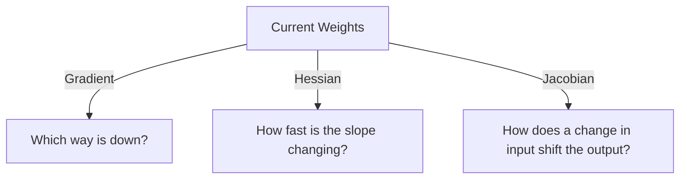

# Gradient, Hessian, and Jacobian: The Geometry of Derivatives

These three operators are the fundamental tools of vector calculus. They provide the 1st and 2nd order approximations of functions, forming the backbone of **Optimization** and **Deep Learning**.

## 1. The Gradient ($\nabla f$) - The Compass
The Gradient is a vector of all first-order partial derivatives of a scalar function $f: \mathbb{R}^n \to \mathbb{R}$.
$$\nabla f = \left[ \frac{\partial f}{\partial x_1}, \dots, \frac{\partial f}{\partial x_n} \right]^\top$$
- **Geometric Meaning**: It points in the direction of the steepest ascent on the function's landscape. Its magnitude tells you how steep the slope is.
- **In AI**: [[convex-optimization|Gradient Descent]] updates weights as $w \leftarrow w - \eta \nabla \mathcal{L}$. Without the gradient, the "blind" optimizer wouldn't know which way to go to reduce error.

## 2. The Jacobian ($J$) - The Linearizer
The Jacobian is a matrix of first-order partial derivatives of a **vector-valued** function $F: \mathbb{R}^n \to \mathbb{R}^m$.
$$J_{ij} = \frac{\partial F_i}{\partial x_j}$$
- **Linearization**: Near any point $x_0$, a complex non-linear transformation can be approximated as $F(x) \approx F(x_0) + J(x - x_0)$.
- **In AI**: The entire process of **[[automatic-differentiation|Backpropagation]]** is a sequence of **Jacobian-Vector Products (JVP)**. The chain rule of calculus is mathematically equivalent to multiplying these Jacobian matrices.

## 3. The Hessian ($H$) - The Curvature
The Hessian is a square matrix of second-order partial derivatives of a scalar function $f$.
$$H_{ij} = \frac{\partial^2 f}{\partial x_i \partial x_j}$$
- **Geometric Meaning**: It describes the local "bending" of the landscape.
- **[[spectral-theory-operators|Eigenvalues]] and Stability**:
    - If all eigenvalues $\lambda_i > 0$, the point is a **Local Minimum** (a bowl).
    - If all $\lambda_i < 0$, it is a **Local Maximum** (a peak).
    - If there is a mix of signs, it is a **Saddle Point** (a major obstacle for deep learning optimizers).

## 4. Advanced Optimization: Beyond SGD

Standard SGD only uses the Gradient (1st order). Advanced optimizers use the Hessian (2nd order):
- **Newton's Method**: $w \leftarrow w - H^{-1} \nabla f$. It reaches the minimum in a single step for quadratic functions, but calculating $H^{-1}$ for a billion parameters is impossible.
- **Hessian-Free & K-FAC**: Modern techniques that approximate the Hessian (or the Fisher Information Matrix) to speed up training of LLMs.

## Visualization: Landscape Analysis

## Related Topics

[[convex-optimization-trading]] — applying 2nd order methods  
[[automatic-differentiation]] — how these are computed in PyTorch/JAX  
[[laplacian]] — the trace of the Hessian
---
