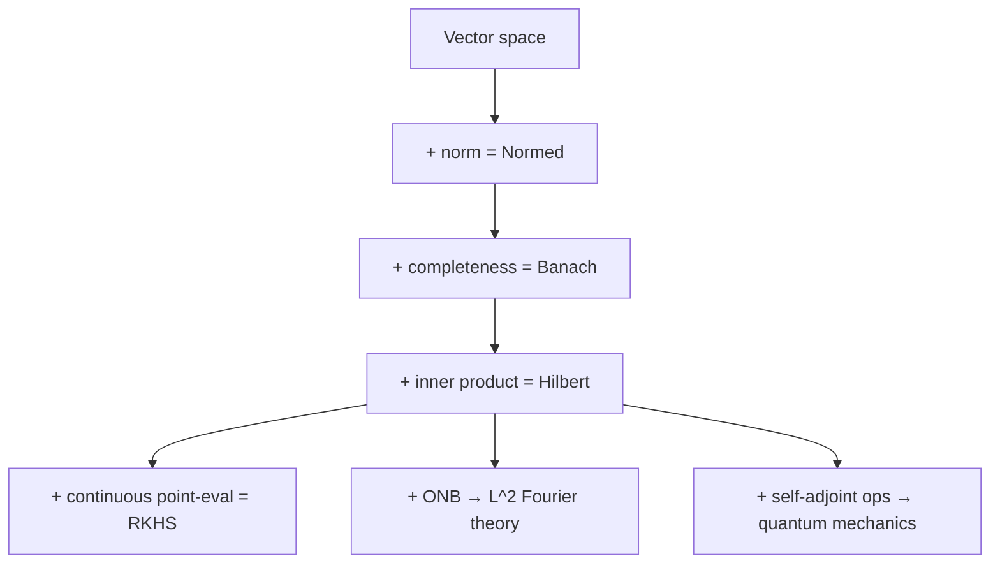

# Hilbert and Banach Spaces

Banach and Hilbert spaces are the infrastructure on top of which everything infinite-dimensional is built: functional analysis, quantum mechanics, Gaussian processes, spectral methods. They are the geometry where "distance" and "angle" still work when the dimension is infinite.

## 1. Normed space

**Definition.** A pair $(X, \|\cdot\|)$ where $X$ is a vector space over $\mathbb{R}$ or $\mathbb{C}$ and $\|\cdot\| : X \to [0, \infty)$ satisfies

1. $\|x\| = 0 \iff x = 0$;
2. $\|\alpha x\| = |\alpha|\, \|x\|$ for every scalar $\alpha$;
3. $\|x + y\| \leq \|x\| + \|y\|$ (triangle inequality).

The induced metric $d(x,y) = \|x-y\|$ makes $X$ a metric space.

## 2. Banach space

**Definition.** A normed space that is **complete** with respect to its norm: every Cauchy sequence has a limit inside $X$.

Completeness is essential — without it, the standard tools of analysis (limits, series, solutions of equations) can "leak out" of the space.

### Canonical examples

| Space | Elements | Norm |
|---|---|---|
| $\mathbb{R}^n$, $\mathbb{C}^n$ | finite vectors | $\|x\|_2, \|x\|_p, \|x\|_\infty$ |
| $\ell^p$, $1 \leq p < \infty$ | sequences | $\|a\|_p = (\sum |a_i|^p)^{1/p}$ |
| $\ell^\infty$ | bounded sequences | $\|a\|_\infty = \sup |a_i|$ |
| $C[a,b]$ | continuous functions | $\|f\|_\infty = \sup |f|$ |
| $L^p(\mu)$, $1\leq p<\infty$ | measurable functions | $\|f\|_p = (\int |f|^p d\mu)^{1/p}$ |

### The five pillars of Banach-space theory

Without these five results, functional analysis does not exist:

1. **Hahn-Banach theorem** — every bounded linear functional on a subspace extends to all of $X$ with the same norm.
2. **Open mapping theorem** — a surjective bounded operator is open.
3. **Closed graph theorem** — an operator with closed graph is automatically bounded.
4. **Uniform boundedness principle (Banach-Steinhaus)** — a pointwise-bounded family of operators is uniformly bounded.
5. **Banach fixed-point theorem** — a contraction has a unique fixed point.

## 3. Hilbert space

**Definition.** A Banach space $H$ whose norm is induced by an **inner product** $\langle \cdot, \cdot \rangle : H \times H \to \mathbb{C}$:

$$
\|x\|^2 = \langle x, x\rangle.
$$

The inner product is linear in the first argument, Hermitian $\langle x, y\rangle = \overline{\langle y, x\rangle}$, and positive-definite.

Hilbert $\iff$ Banach + parallelogram law:

$$
\|x+y\|^2 + \|x-y\|^2 = 2(\|x\|^2 + \|y\|^2).
$$

### Key Hilbert spaces

- $L^2(\mu)$ — square-integrable functions with $\langle f, g\rangle = \int \bar f g\, d\mu$.
- $\ell^2$ — square-summable sequences.
- **Sobolev spaces** $H^s = W^{s,2}$ — $L^2$-functions with derivatives in $L^2$; the natural language of PDEs.
- **RKHS** — function spaces where point evaluation is continuous.

## 4. Orthogonality and projection

Cauchy-Schwarz lets us define angles:

$$
\cos\theta = \frac{\langle x, y\rangle}{\|x\|\|y\|}.
$$

Orthogonal complement: $M^\perp = \{y \in H : \langle x,y\rangle = 0 \ \forall x \in M\}$.

**Direct-sum decomposition theorem.** For a closed subspace $M \subset H$,

$$
H = M \oplus M^\perp,\qquad x = P_M x + P_{M^\perp} x.
$$

The projection $P_M x$ is the **unique closest point** in $M$ to $x$. This is the foundation of least-squares, regression, and kernel projections.

## 5. Orthonormal bases

**Definition.** $\{e_i\}_{i \in I}$ is an orthonormal basis if $\langle e_i, e_j\rangle = \delta_{ij}$ and the closure of the linear span is $H$.

**Fourier expansion.** For any $x \in H$,

$$
x = \sum_{i \in I} \langle x, e_i\rangle\, e_i,\qquad \|x\|^2 = \sum_{i \in I} |\langle x, e_i\rangle|^2\ \text{(Parseval)}.
$$

This generalises Fourier series of $L^2[-\pi,\pi]$ functions to any Hilbert space.

**Corollary.** Every separable infinite-dimensional Hilbert space is isomorphic to $\ell^2$. There are no "different" separable Hilbert spaces.

## 6. Duality

**Riesz-Fréchet theorem.** The map $y \mapsto \langle \cdot, y\rangle$ is an isometric isomorphism $H \cong H^*$. Every bounded linear functional is "inner product with a unique vector".

For Banach spaces the dual $X^*$ is again Banach but not always isomorphic to $X$. For instance $(L^1)^* = L^\infty$, but $(L^\infty)^* \supsetneq L^1$.

**Reflexivity.** $X$ is **reflexive** if the canonical map $X \hookrightarrow X^{**}$ is an isomorphism. $L^p$ is reflexive for $1<p<\infty$; $L^1$ and $L^\infty$ are not.

## 7. Compactness and weak convergence

The closed unit ball of an infinite-dimensional Banach space is **never norm-compact**. But it is compact in the **weak topology** (Banach-Alaoglu) — the key technical idea behind variational calculus and PDE existence theorems.

$x_n \rightharpoonup x$ (weakly) means $\ell(x_n) \to \ell(x)$ for every $\ell \in X^*$. In a Hilbert space: $\langle x_n, y\rangle \to \langle x, y\rangle$ for every $y$.

## 8. Linear operators

$T : X \to Y$ is **bounded** if $\|T\| := \sup_{\|x\|\leq 1} \|Tx\| < \infty$. Bounded $\iff$ continuous.

### Operator classes in a Hilbert space

- **Self-adjoint:** $T^* = T$. Real spectrum.
- **Normal:** $T^*T = TT^*$. Spectral theorem.
- **Unitary:** $T^*T = I$. Isometry.
- **Compact:** maps bounded sets to relatively compact ones. Spectrum is a countable set with possible accumulation only at 0.

**Spectral theorem (compact self-adjoint).** $T = \sum \lambda_i \langle \cdot, e_i\rangle e_i$, with eigenvectors $\{e_i\}$ and $\lambda_i \to 0$. This is the infinite-dimensional diagonalisation of a matrix, and the backbone of PCA, spectral clustering, and Karhunen-Loève expansions.

## 9. RKHS and the kernel trick

**Definition.** A Hilbert space $\mathcal{H}$ of functions on $X$ is an **RKHS** if point evaluation $E_x : f \mapsto f(x)$ is continuous for every $x$. By Riesz there exists $K_x \in \mathcal{H}$ with $f(x) = \langle f, K_x\rangle$.

The function $k(x,y) = \langle K_x, K_y\rangle$ is the **reproducing kernel**.

**Moore-Aronszajn theorem.** A positive-definite function $k$ uniquely defines an RKHS.

**Use.** In SVMs and kernel ridge regression we never compute coordinates in the infinite-dimensional feature space; all computation goes through $k(x,y)$. That's the **kernel trick**.

## 10. Quantum mechanics

The state of a quantum system is a unit vector $|\psi\rangle$ in a complex Hilbert space. Observables are self-adjoint operators. Probabilities are $|\langle \phi | \psi\rangle|^2$.

All QM axioms become natural through Hilbert-space language: superposition is linear combination, interference is inner product, quantisation is spectral decomposition.

## 11. Visualisation

## 12. Related topics

- [[functional-analysis|Functional analysis]] — the general theory.
- [[lp-spaces|L^p spaces]] — canonical Banach examples.
- [[kernel-methods-rkhs|Kernel methods and RKHS]] — ML use of Hilbert spaces.
- [[spectral-theory-operators|Spectral theory]] — diagonalisation in infinite dimensions.
- [[sobolev-spaces|Sobolev spaces]] — natural function space for PDE.
- [[gaussian-processes|Gaussian processes]] — "distributions on an RKHS".
- [[quantum-math|Mathematics of quantum mechanics]] — the physical realisation of Hilbert geometry.
