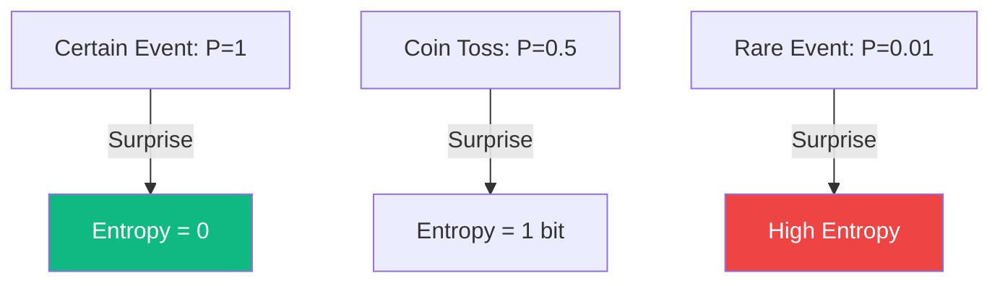

# Information Theory: The Physics of Data

**Information Theory**, founded by Claude Shannon in 1948, is the mathematical study of the quantification, storage, and communication of information. It answers fundamental questions: "How much can we compress data?" and "How much noise can a channel handle before communication fails?"

## 1. Shannon Entropy ($H$)

Entropy measures the amount of uncertainty or "surprise" in a random variable $X$. 
$$ H(X) = -\sum_{i=1}^n P(x_i) \log_2 P(x_i) $$
- **Intuition**: If an event is certain ($P=1$), its entropy is 0 (no information gained). If an event is highly unlikely, its occurrence provides a large amount of information.
- **Units**: Measured in **Bits** (if using $\log_2$) or **Nats** (if using $\ln$).

## 2. Kullback-Leibler (KL) Divergence

KL-divergence (Relative Entropy) measures how one probability distribution $Q$ differs from a reference distribution $P$.
$$ D_{KL}(P \| Q) = \sum P(x) \log \frac{P(x)}{Q(x)} $$
- **In AI**: This is the "distance" between what a model thinks ($Q$) and the true data distribution ($P$). 
- **Asymmetry**: $D_{KL}(P \| Q) \neq D_{KL}(Q \| P)$. It is not a true distance, but a measure of information loss.

## 3. Cross-Entropy Loss

The most important loss function in Deep Learning. It measures the performance of a classification model whose output is a probability between 0 and 1.
$$ \text{Loss} = -\sum y_{true} \log(y_{pred}) $$
Minimizing Cross-Entropy is mathematically equivalent to minimizing the KL-divergence between the true labels and the model's predictions.

## 4. Mutual Information ($I$)

Mutual Information measures how much knowing one variable reduces uncertainty about another.
$$ I(X; Y) = H(X) - H(X|Y) $$
- If $X$ and $Y$ are independent, $I(X; Y) = 0$.
- **In AI**: Used to find which features in a dataset are most important for predicting the target.

## 5. The Maximum Entropy Principle

A powerful philosophical and mathematical rule: *When making an inference based on incomplete information, the best distribution is the one with the maximum entropy subject to known constraints.*
- This principle explains why the **Gaussian (Normal) Distribution** is so common: it is the maximum entropy distribution for a fixed mean and variance.

## Visualization: Entropy and Surprise

## Related Topics

[[bayes-theorem]] — how information updates beliefs  
[[optimal-transport]] — alternative to KL-divergence for measuring distance  
[[information-geometry]] — the geometric structure of entropy
---
