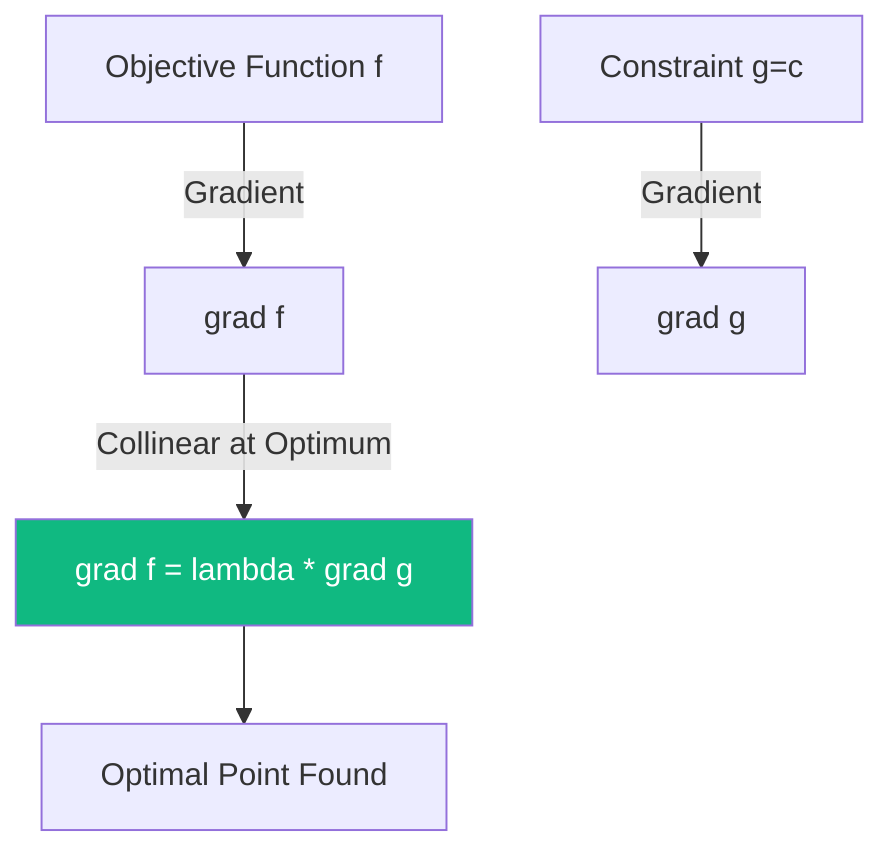

# Constrained Optimization: The Method of Lagrange Multipliers

In the real world, optimization is rarely "free." We want to maximize profit **subject to** a budget, or minimize energy **subject to** physical constraints. **Lagrange Multipliers** provide a powerful strategy for finding the local maxima and minima of a function subject to equality constraints.

## 1. The Core Problem

We want to find the extremum of a function $f(x, y)$ subject to a constraint $g(x, y) = c$. 
Standard [[convex-optimization|gradient descent]] won't work because it doesn't "know" about the constraint.

## 2. Geometric Intuition

At the optimal point $(x^*, y^*)$, the level curve of $f$ must be **tangent** to the constraint curve $g=c$. If they weren't tangent, we could move along the constraint to increase or decrease $f$.
Since they are tangent, their gradients must point in the same direction:
$$ \nabla f = \lambda \nabla g $$
where $\lambda$ is a scalar called the **Lagrange Multiplier**.

## 3. The Lagrangian Function ($\mathcal{L}$)

To solve the problem, we define a new function that combines $f$ and $g$:
$$ \mathcal{L}(x, y, \lambda) = f(x, y) - \lambda(g(x, y) - c) $$
By setting the partial derivatives of $\mathcal{L}$ to zero, we solve for all variables simultaneously:
1.  $\frac{\partial \mathcal{L}}{\partial x} = 0$
2.  $\frac{\partial \mathcal{L}}{\partial y} = 0$
3.  $\frac{\partial \mathcal{L}}{\partial \lambda} = 0$ (This recovers the original constraint $g(x, y) = c$)

## 4. Why it Matters in AI and Physics

### A. Support Vector Machines (SVMs)
SVMs find the "maximum margin" hyperplane between data classes. This is a constrained optimization problem. The points on the margin are essentially the "Lagrange multipliers" that define the boundary (hence the name **Support Vectors**).

### B. Classical Mechanics
The motion of a particle is found by minimizing the **Action** $\mathcal{S}$ subject to the constraints of the system (e.g., a bead on a wire). This leads to the **Euler-Lagrange equations**, the heart of physics.

### C. Advanced: KKT Conditions
For inequality constraints (e.g., $g(x, y) \leq c$), the method generalizes to the **Karush-Kuhn-Tucker (KKT)** conditions, which are the theoretical foundation for almost all modern optimization solvers in Deep Learning.

## Visualization: Tangent Gradients

## Related Topics

[[multivariable-calculus]] — prerequisite of gradients  
[[convex-optimization-trading]] — practical use in finance  
[[hamiltonian-nn]] — Lagrangian and Hamiltonian mechanics in AI
---
