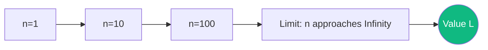

# Sequences, Limits, and Convergence: The Foundation of Continuity

Calculus is built on the concept of a **Limit**. Without limits, we couldn't define derivatives (instantaneous change) or integrals (infinite sums). At its core, limit theory answers the question: "What happens when we get infinitely close to a value without ever reaching it?"

## 1. Sequences ($a_n$)

A **Sequence** is an ordered list of numbers.
- **Convergence**: A sequence $a_n$ converges to a limit $L$ if, as $n$ goes to infinity, the distance $|a_n - L|$ becomes smaller than any possible number $\epsilon$.
- **Formal Definition ($\epsilon-N$)**: $\forall \epsilon > 0, \exists N$ such that $\forall n > N, |a_n - L| < \epsilon$.

## 2. Limits of Functions

For a function $f(x)$, we say $\lim_{x \to c} f(x) = L$ if we can make $f(x)$ as close to $L$ as we want by taking $x$ sufficiently close to $c$.
- **Continuity**: A function is continuous at point $c$ if the limit exists and equals the actual value of the function: $\lim_{x \to c} f(x) = f(c)$.

## 3. Important Rules and Special Limits

- **Squeeze Theorem**: If $g(x) \leq f(x) \leq h(x)$ and both $g$ and $h$ converge to $L$, then $f$ must also converge to $L$.
- **Euler's Number ($e$)**: Defined as a limit:
  $$ e = \lim_{n \to \infty} (1 + 1/n)^n \approx 2.71828 $$
- **L'Hôpital's Rule**: If a limit is in an "indeterminate form" (like $0/0$ or $\infty/\infty$), we can find it by taking the derivative of the top and bottom.

## 4. Cauchy Convergence

A sequence is a **Cauchy Sequence** if its terms get closer to *each other* as $n$ increases. 
- **Completeness**: In the real numbers ($\mathbb{R}$), every Cauchy sequence converges. This "completeness" is what allows us to fill the gaps between rational numbers and define the smooth line we use in calculus.

## 5. Why it Matters in AI and Optimization

### A. Gradient Descent Convergence
When training a model, we want the sequence of weights $\theta_t$ to converge to the minimum of the loss function. If the learning rate is too high, the sequence might **Diverge** (the error goes to infinity).

### B. Fixed-Point Iteration
Many algorithms (like PageRank or Reinforcement Learning's Bellman updates) work by repeatedly applying a function until the output stops changing. This is called a **Fixed Point**, and we use convergence theory to prove the algorithm will ever finish.

### C. Stability of Numerical Methods
When simulating physics, we break time into small steps $\Delta t$. We must prove that as $\Delta t \to 0$, the numerical simulation converges to the true physical solution.

## Visualization: The Limit Process

## Related Topics

[[taylor-series]] — convergence of power series  
[[differential-equations]] — limits in time-evolution  
[[backpropagation]] — limits in discrete optimization
---
