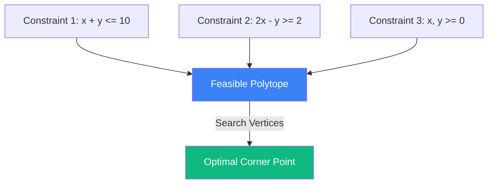

# Linear Programming: The Science of Resource Allocation

**Linear Programming (LP)** is a method to achieve the best outcome (such as maximum profit or lowest cost) in a mathematical model whose requirements are represented by linear relationships. It is the cornerstone of operations research, supply chain management, and algorithmic trading.

## 1. The Standard Form

An LP problem consists of a **Linear Objective Function** to be maximized (or minimized) subject to **Linear Equality and Inequality Constraints**:
$$ \max \mathbf{c}^T \mathbf{x} $$
Subject to:
$$ A \mathbf{x} \leq \mathbf{b} $$
$$ \mathbf{x} \geq 0 $$

## 2. The Simplex Method

Invented by George Dantzig, the **Simplex Algorithm** is the most famous way to solve LPs.
- **Intuition**: The set of constraints forms a **Convex Polytope** (a multidimensional diamond). The optimal solution is guaranteed to lie at one of the vertices (corners) of this polytope.
- **Algorithm**: Simplex starts at one vertex and moves along the edges to adjacent vertices that improve the objective function until no further improvement is possible.

## 3. Duality: The Hidden Logic

Every LP problem (the **Primal**) has a twin brother called the **Dual**.
- If the Primal is about maximizing profit from products, the Dual is about minimizing the cost of resources.
- **Strong Duality Theorem**: The maximum value of the Primal equals the minimum value of the Dual.
- **Shadow Prices**: The solution to the Dual variables $(\mathbf{y})$ tells you how much you should be willing to pay for one extra unit of a resource. This is critical for marginal cost analysis.

## 4. Why it Matters in AI and Finance

### A. Optimal Transport
The discrete version of the [[optimal-transport|Optimal Transport]] problem is a massive linear program. Solving it allows AI to compare image distributions or documents.

### B. Portfolio Optimization
While Markowitz is quadratic, many real-world constraints (like turnover limits or sector exposure) are linear. High-frequency market makers use LP to rebalance inventory under strict risk constraints.

### C. Large-Scale Logistics
The "Traveling Salesperson" and "Network Flow" problems are solved using LP and its integer-based variants (ILP), powering everything from Uber's routing to Amazon's warehouses.

## Visualization: The Feasible Region

## Related Topics

[[lagrange-multipliers]] — optimization with equality constraints  
[[convex-optimization-trading]] — generalizing LP to non-linear functions  
[[optimal-transport]] — a primary application of large-scale LP
---
