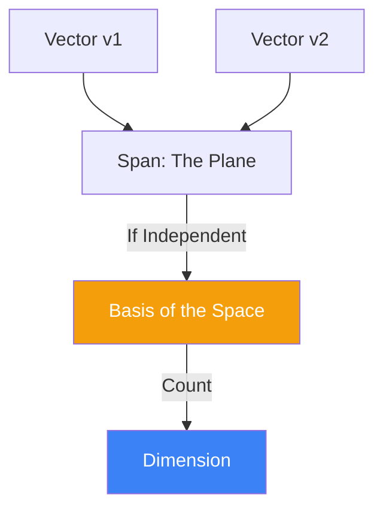

# Linear Spaces, Basis, and Dimension: The Scaffold of Algebra

A **Linear Space** (or Vector Space) is a collection of objects called vectors that can be added together and multiplied by numbers (scalars) without leaving the space. This simple definition forms the basis for everything from 3D computer graphics to the infinite-dimensional spaces used in [[quantum-entanglement|Quantum Mechanics]].

## 1. Defining a Linear Space ($V$)

A set $V$ is a vector space over a field $\mathbb{R}$ if it satisfies 8 axioms, including:
- **Commutativity**: $u + v = v + u$
- **Distributivity**: $a(u + v) = au + av$
- **Existence of Zero**: There is a vector $\mathbf{0}$ such that $v + \mathbf{0} = v$.

## 2. Linear Independence and Span

- **Linear Combination**: A sum of vectors scaled by constants: $v = c_1 v_1 + c_2 v_2 + \dots + c_n v_n$.
- **Span**: The set of all possible linear combinations of a group of vectors. If the span of $S$ is $V$, then $S$ "covers" the whole space.
- **Linear Independence**: A set of vectors is independent if none of them can be written as a linear combination of the others. Mathematically:
  $$ c_1 v_1 + c_2 v_2 + \dots + c_n v_n = 0 \implies c_1 = c_2 = \dots = c_n = 0 $$

## 3. Basis and Dimension

A **Basis** is a coordinate system for the space. It is a set of vectors that is **both** linearly independent and spans the entire space.
- **Uniqueness**: Every vector in the space can be written in exactly one way as a combination of basis vectors.
- **Dimension**: The number of vectors in a basis is called the **Dimension** of the space.
  - If a space has 3 basis vectors, it is 3D.
  - In Deep Learning, an embedding space might have a dimension of 1536 or 4096.

## 4. Change of Basis

The same space can have many different bases. Moving from one basis to another is a **Linear Transformation**, represented by a matrix $P$:
$$ [v]_{new} = P^{-1} [v]_{old} $$
This concept is the mathematical root of **Fourier Transforms** (changing to a frequency basis) and **PCA** (changing to a basis of maximum variance).

## 5. Subspaces and Rank

A **Subspace** is a smaller linear space contained within a larger one (e.g., a plane passing through the origin in 3D space).
- **Rank**: For a matrix, the rank is the dimension of the space spanned by its columns.
- **The Rank-Nullity Theorem**: For a matrix $A \in \mathbb{R}^{m \times n}$:
  $$ \text{Rank}(A) + \text{Nullity}(A) = n $$
  This theorem connects the number of "active" dimensions to the number of dimensions that are "collapsed" to zero by the transformation.

## Visualization: Basis and Span

## Related Topics

[[eigenvalues-eigenvectors]] — finding the "natural" basis of a matrix  
[[tensor-calculus]] — multi-linear algebra on manifolds  
[[quantum-information-entropy]] — working in complex Hilbert spaces
---
