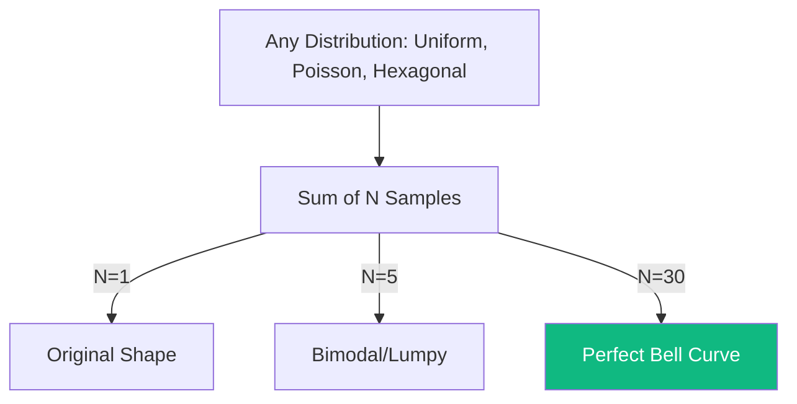

# LLN and CLT: Why Probability Works

The **Law of Large Numbers (LLN)** and the **Central Limit Theorem (CLT)** are the two most important theorems in probability theory. Together, they explain why we can trust statistics to represent reality and why the **Normal Distribution** (Bell Curve) is ubiquitous in nature, finance, and AI.

## 1. Law of Large Numbers (LLN)

The LLN states that as the number of independent trials increases, the average of the results gets closer to the expected value (the theoretical mean).
- **Weak LLN**: The sample average converges in probability to the mean.
- **Strong LLN**: The sample average converges almost surely to the mean.

### Intuition: The Casino's Edge
A casino might lose money to one player in one night (randomness). But because they play thousands of games, the LLN guarantees that their total profit will converge exactly to their theoretical house edge.

## 2. Central Limit Theorem (CLT)

The CLT is more profound. It states that for any independent, identically distributed (i.i.d.) random variables with a finite variance, the **sum** (or average) of these variables tends toward a **Normal Distribution** as the sample size $n$ grows, regardless of the original distribution's shape.
$$ Z = \frac{\bar{X} - \mu}{\sigma / \sqrt{n}} \xrightarrow{d} \mathcal{N}(0, 1) $$

- **$n \geq 30$**: A common rule of thumb is that for $n > 30$, the distribution of the mean is approximately normal.

## 3. Why the CLT is the "Magic" of the Universe

1.  **Error Modeling**: Measurement errors in physics are the sum of millions of tiny independent factors. The CLT explains why these errors always follow a Bell Curve.
2.  **Hypothesis Testing**: Z-tests and T-tests work because the CLT guarantees the normality of the sample mean.
3.  **Finance**: Stock returns are often modeled as a sum of many small random shocks. This leads to the **Lognormal** distribution of prices used in [[black-scholes|Black-Scholes]].

## 4. Limitations and "Fat Tails"

The CLT only works if the variables have **finite variance**. 
- In some systems (like crypto markets or extreme weather), variables follow **Power Laws** or Lévy flights with infinite variance. 
- In these cases, the CLT fails, and the distribution never becomes normal, remaining "Fat-Tailed." This is the realm of [[black-swan-scenarios|Black Swan]] events.

## Visualization: Convergence to Normal

## Related Topics

[[asymptotic-stats]] — rigorous proofs of convergence  
[[black-scholes]] — applications of normality in pricing  
[[monte-carlo-method]] — using LLN to solve integrals by sampling
---
