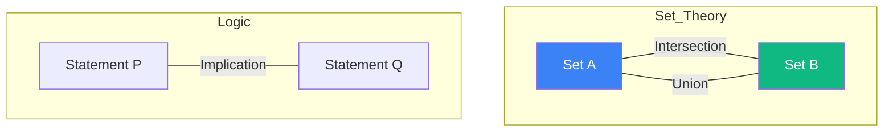

# Set Theory and Mathematical Logic: The Language of Truth

**Set Theory** and **Mathematical Logic** are the absolute foundations of mathematics. Everything from the definition of a number to the architecture of a computer database is built upon these principles.

## 1. Sets and Operations

A **Set** is a collection of distinct objects.
- **$\in, \notin$**: Membership (is or is not in the set).
- **$\cup$ (Union)**: Everything in $A$ OR $B$.
- **$\cap$ (Intersection)**: Everything in $A$ AND $B$.
- **$\setminus$ (Difference)**: Everything in $A$ but NOT in $B$.
- **$\mathcal{P}(A)$ (Power Set)**: The set of all possible subsets. Its size is $2^n$.

## 2. Mathematical Logic (Boolean Algebra)

Logic defines the rules of correct reasoning.
- **$\neg$ (NOT)**: Flips true to false.
- **$\wedge$ (AND)**: True only if both are true.
- **$\vee$ (OR)**: True if at least one is true.
- **$\implies$ (Implication)**: "If P, then Q." 
  *Note*: If P is false, the statement is always true (Vacuous truth).

### Quantifiers
- **$\forall$ (Universal)**: "For all..."
- **$\exists$ (Existential)**: "There exists at least one..."

## 3. Relations and Functions

- **Relation**: A set of ordered pairs $(x, y)$ showing how elements of sets interact.
- **Function**: A special relation where every input $x$ maps to **exactly one** output $y$.
  - **Injective**: No two inputs share an output.
  - **Surjective**: Every possible output is reached.
  - **Bijective**: Both injective and surjective (perfect 1-to-1 mapping).

## 4. Why it Matters in AI and CS

1.  **SQL and Databases**: Queries like `SELECT * FROM users WHERE age > 18 AND city = 'London'` are direct applications of set intersection and boolean logic.
2.  **Logic Gates**: Your CPU is a physical implementation of AND, OR, and NOT gates.
3.  **Knowledge Graphs**: Representing relationships between entities (like the [[knowledge-graph|graph in this Wiki]]) is fundamentally set-theoretic.

## 5. Russell's Paradox and Gödel

Can a set contain all sets that do not contain themselves? This question led to **Russell's Paradox**, forcing mathematicians to create more rigorous axioms. Later, **Kurt Gödel** proved that any sufficiently powerful logical system is either incomplete or inconsistent, a result that haunts the limits of AI reasoning today.

## Visualization: Venn Diagrams

## Related Topics

[[llm-alignment]] — using logic to constrain AI behavior  
[[measure-theory]] — generalizing set size to "volume"  
[[computational-complexity]] — set-theoretic limits of computation
---
