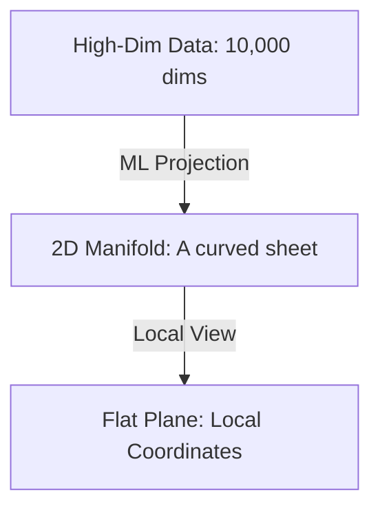

# Manifold

A manifold is a topological space that locally resembles Euclidean space near each point. It is the fundamental object of study in differential geometry and general relativity, and it is increasingly used in machine learning to understand the structure of high-dimensional data.

## The Intuition: Locally Flat

The classic example of a manifold is the **Earth**.
- From a global perspective, it is a curved sphere (non-Euclidean).
- From a local perspective (the view of a person standing on the ground), it looks perfectly flat (Euclidean plane $\mathbb{R}^2$).

A manifold "glues" these local flat patches (charts) together to form a complex, curved global shape.

## Why Manifolds Matter in AI

### 1. The Manifold Hypothesis
Modern machine learning is based on the idea that high-dimensional data (like 1024x1024 images) does not actually fill the entire space. Instead, it lies on a **low-dimensional manifold** embedded in that space.
- *Example*: A set of "Cat" images is a manifold. If you slightly rotate a cat, you are moving along the surface of that manifold.

### 2. Latent Spaces
Autoencoders and VAEs learn a mapping from the data manifold to a coordinate system in a lower-dimensional "Latent Space."

### 3. Riemannian Geometry in Optimization
Optimizing on a manifold (e.g., ensuring weights stay as orthogonal matrices) requires using **Riemannian Manifolds**, where we define distances and angles locally on the curved surface.

## Types of Manifolds

- **Differentiable Manifold**: A manifold smooth enough to do calculus (calculate gradients).
- **Riemannian Manifold**: A manifold equipped with a metric (to measure distances and areas).
- **Complex Manifold**: Locally looks like $\mathbb{C}^n$ (used in string theory).

## Visualization: Data on a Manifold

## Related Topics

[[differential-geometry]] — the math of manifolds  
[[complex-manifolds]] — the complex version  
[[topology]] — the broader family of spaces
---
