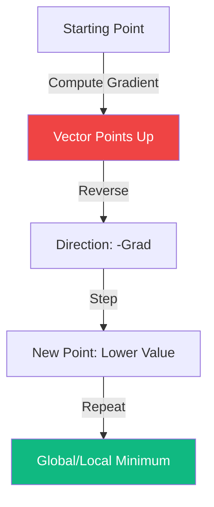

# Multivariable Calculus: The Language of Optimization

In a world where data has thousands of dimensions, single-variable calculus is not enough. **Multivariable Calculus** extends derivatives and integrals to functions of multiple variables. For Machine Learning and Quantitative Finance, the most important tools are the **Jacobian** (first derivative) and the **Hessian** (second derivative).

## 1. The Gradient ($\nabla f$)

For a scalar function $f(x_1, x_2, \dots, x_n)$, the gradient is a vector of its partial derivatives:
$$ \nabla f = \begin{bmatrix} \frac{\partial f}{\partial x_1} & \frac{\partial f}{\partial x_2} & \dots & \frac{\partial f}{\partial x_n} \end{bmatrix}^T $$
- **Geometry**: The gradient points in the direction of the **steepest ascent**.
- **Optimization**: To minimize a function (like a Loss function), we move in the opposite direction: $\theta_{new} = \theta_{old} - \eta \nabla f$. This is **Gradient Descent**.

## 2. The Jacobian Matrix ($\mathbf{J}$)

If we have a vector-valued function $\mathbf{F}: \mathbb{R}^n \to \mathbb{R}^m$, its first derivative is the **Jacobian Matrix**. It captures how every output component changes with respect to every input component.
$$ \mathbf{J}_{ij} = \frac{\partial F_i}{\partial x_j} $$
- **Linear Approximation**: Locally, any smooth transformation looks like a linear map: $\mathbf{F}(\mathbf{x}) \approx \mathbf{F}(\mathbf{a}) + \mathbf{J}(\mathbf{x} - \mathbf{a})$.
- **AI Application**: In **Backpropagation**, the Chain Rule is simply a sequence of Jacobian multiplications.

## 3. The Hessian Matrix ($\mathbf{H}$)

The Hessian is the matrix of second-order partial derivatives for a scalar function $f$:
$$ \mathbf{H}_{ij} = \frac{\partial^2 f}{\partial x_i \partial x_j} $$
- **Curvature**: The Hessian describes the "shape" of the local landscape.
- **Eigenvalues of H**:
  - If all eigenvalues are $> 0$: The point is a **Local Minimum** (valley).
  - If all eigenvalues are $< 0$: The point is a **Local Maximum** (peak).
  - If eigenvalues have mixed signs: The point is a **Saddle Point**.

## 4. Why it Matters for High-Finance

In option pricing ([[black-scholes|Black-Scholes]]), the "Greeks" are simply derivatives:
- **Delta** is a first derivative (part of the Jacobian).
- **Gamma** is a second derivative (part of the Hessian).
Managing a portfolio involves ensuring the "curvature" (Gamma) of your risk is controlled.

## 5. The Chain Rule in Higher Dimensions

The single most important formula for AI:
$$ \frac{\partial z}{\partial x} = \frac{\partial z}{\partial y} \cdot \frac{\partial y}{\partial x} $$
In multivariable calculus, this becomes a **Matrix Multiplication**:
$$ \mathbf{J}_{z(x)} = \mathbf{J}_{z(y)} \mathbf{J}_{y(x)} $$
This is how modern libraries like **PyTorch** and **TensorFlow** compute gradients automatically across millions of parameters.

## Visualization: Steepest Descent

## Related Topics

[[taylor-series]] — 2nd order Taylor expansion uses the Hessian  
backpropagation — implementing the multivariable chain rule  
[[information-geometry]] — the Fisher Information matrix as a specialized metric
---
