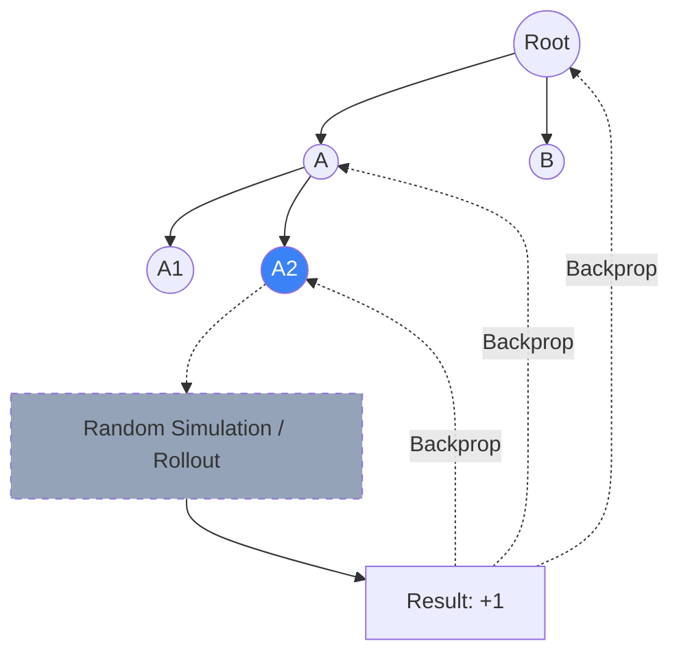

# Monte Carlo Tree Search (MCTS)

Monte Carlo Tree Search (MCTS) is a heuristic search algorithm for making optimal decisions in complex decision-making processes, most notably in games with huge state spaces (like Go or Chess). It combines the precision of **Tree Search** with the generality of **Monte Carlo simulations**.

## The Four Stages of MCTS

MCTS builds a search tree asynchronously through repeated iterations of four steps:

1.  **Selection**: Starting at the root, the algorithm traverses down the tree using a selection policy (typically **UCT** - Upper Confidence Bound for Trees) until it reaches a "leaf" node.
2.  **Expansion**: Unless the leaf node represents the end of the game, one or more child nodes are created to represent possible future moves.
3.  **Simulation (Rollout)**: From the new node, the algorithm performs a random simulation (playing against itself with random moves) until a terminal state is reached.
4.  **Backpropagation**: The result of the simulation (Win/Loss) is propagated back up the tree, updating the statistics (visit count and total reward) of all nodes along the path.

## The UCT Formula

To balance exploration and exploitation in the selection step, MCTS uses the **UCT** formula:

$$UCT(v) = \frac{Q(v)}{N(v)} + C \sqrt{\frac{\ln N(parent)}{N(v)}}$$

- **$Q(v)/N(v)$ (Exploitation)**: Average reward of the node.
- **$\sqrt{\dots}$ (Exploration)**: A term that increases for nodes that haven't been visited recently.

## Why MCTS is Revolutionary

Before MCTS, game AI relied on manually tuned **heuristic evaluation functions** (e.g., "having more pieces in chess is good"). 
MCTS requires **zero domain knowledge** besides the rules of the game. It "discovers" which states are good purely through random play and statistical aggregation. 

## AlphaGo and Neural MCTS

DeepMind's **AlphaGo** improved MCTS by replacing the random "Simulation" step with a **Value Network** (to predict the winner) and using a **Policy Network** to guide the "Selection" step. This hybrid approach allowed the search to focus only on the most promising human-like moves.

## Visualization: Tree Search vs. Rollout

## Related Topics

[[mdp]] — the formal model MCTS solves  
[[monte-carlo-integration]] — the statistical principle  
[[multi-armed-bandits]] — the source of the UCT formula
---
