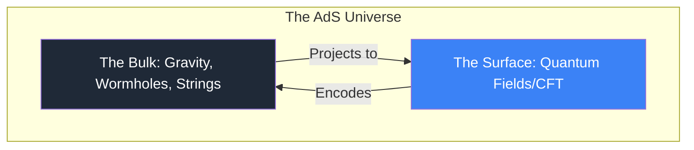

# AdS/CFT Correspondence: The Holographic Principle

The **AdS/CFT correspondence** (anti-de Sitter/conformal field theory), proposed by **Juan Maldacena** in 1997, is the most successful realization of the **Holographic Principle**. It is a mathematical "bridge" that allows us to solve intractable problems in quantum physics by translating them into simple problems in gravity, and vice versa.

## 1. The Two Sides of the Bridge

### Anti-de Sitter Space (AdS)
AdS is a universe with a **negative cosmological constant**. It is a space that is curved "inward," like a saddle. 
- *The Boundary*: Even though AdS is infinite in volume, a light ray can reach its "edge" in finite time. This edge is the **Boundary**, where the CFT lives.
- *The Bulk*: The interior of the space, where strings and black holes reside.

### Conformal Field Theory (CFT)
A CFT is a quantum theory that is **Symmetric under Scaling**. It has no mass scales (it looks the same whether you zoom in or out). These theories describe critical points of matter (like boiling water at high pressure).

## 2. The Ryu-Takayanagi Formula: Geometry is Information

The most stunning result of AdS/CFT is the link between **Spacetime and Entanglement**. 
Shinsei Ryu and Tadashi Takayanagi (2006) proved that the [[quantum-information-entropy|Entanglement Entropy]] ($S_A$) of a region on the boundary is exactly equal to the area of a minimal surface ($\gamma_A$) in the bulk:

$$S_A = \frac{\text{Area}(\gamma_A)}{4G_N}$$

This is the generalisation of the Bekenstein-Hawking formula for black holes. It suggests that **gravity is not a fundamental force**, but an "emergent" property created by the entanglement of quantum particles on the boundary.

## 3. ER = EPR: The Wormhole Paradox

Proposed by Susskind and Maldacena (2013), this conjecture states that:
- **EPR**: Two entangled particles (Einstein-Podolsky-Rosen pair).
- **ER**: A wormhole (Einstein-Rosen bridge) connecting two points in space.

AdS/CFT suggests that **ER = EPR**: whenever two particles are entangled, they are physically connected by a tiny, microscopic wormhole in a higher dimension. "Spooky action at a distance" is literally a bridge through the bulk.

## 4. Why Tier-1 Scientists Care

1.  **Strange Metals**: Traditional models of electrons fail to explain high-temperature superconductors. By using AdS/CFT, physicists model these materials as "black holes on a chip," obtaining answers that match experiments.
2.  **Quark-Gluon Plasma**: The "soup" created in the Large Hadron Collider is so thick that standard QCD equations fail. AdS/CFT allows us to calculate its viscosity (which is the lowest possible in the universe) using black hole dynamics.
3.  **Quantum Complexity**: The growth of the interior of a black hole is linked to the **Computational Complexity** of the boundary state, a new frontier linking computer science and gravity.

## Visualization: The AdS Tin Can

*Think of the universe as a tin can. The label on the can (CFT) contains all the instructions to generate the 3D contents inside (Gravity).*

## Related Topics

[[conformal-field-theory]] — the boundary physics  
[[black-hole-thermodynamics]] — the origins of the Area Law  
[[quantum-information-entropy]] — the "glue" of spacetime
---
