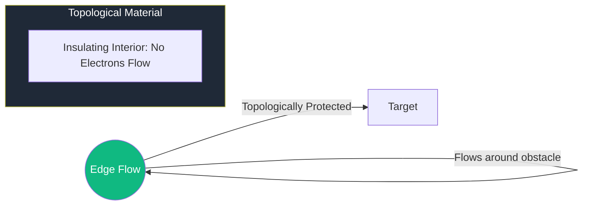

# Topological Phases of Matter

For almost a century, physicists classified matter by **Symmetry Breaking** (e.g., a magnet breaks rotational symmetry). The Nobel Prize-winning discovery of **Topological Phases** (Thouless, Haldane, Kosterlitz) proved that matter can have a deeper, "hidden" order that depends on the global topology of the electron's wave function.

## 1. What is Topological Order?

In topology, global properties are invariant under local changes.
- *The Berry Phase*: As an electron moves through a crystal, its wave function acquires a geometric phase called the **Berry Phase**. 
- If the total Berry phase over a closed loop is a non-zero integer, the material has a **Topological Invariant** (like a "knot" in the wave function). You cannot untie this knot without destroying the material's identity.

## 2. The TKNN Invariant and Chern Numbers

In the **Integer Quantum Hall Effect**, the conductance is quantized to levels of $n \cdot \frac{e^2}{h}$. 
The integer $n$ is the **Chern Number**.
- **Conductance as Topology**: Even if the material is dirty, cracked, or irregular, the conductance remains *exactly* $n$. This is because the conductance is a topological property of the entire electron band, much like the number of holes in a donut doesn't change if you dent it.

## 3. The Bulk-Boundary Correspondence

This is the most powerful theorem in the field:
- A material that has a topological "knot" in its interior (the **Bulk**) is mathematically forced to have **perfectly conducting states on its Edge**.
- **Protection**: These edge currents can only flow in one direction. They cannot be scattered backward because there is no state to scatter into. This means **Zero Resistance** even at high temperatures for certain modes.

## 4. Anyons and Non-Abelian Braiding

In 2D topological materials, we find "particles" called **Anyons**.
1.  **Abelian Anyons**: Swapping two particles changes the phase.
2.  **Non-Abelian Anyons**: Swapping two particles performs a **Matrix Rotation** on the ground state space.

By moving these particles around each other (**Braiding**), we perform quantum logic gates. Because the result only depends on the *topology* of the braid (which string went over which), the computation is **immune to local noise** (Decoherence). This is the dream of **Topological Quantum Computing**.

## 5. Topological AI and Robotics

- **Topological Photonic Crystals**: Using these ideas to build light-based circuits for AI that don't lose signal at corners.
- **Topological Data Analysis (TDA)**: Using the same math to find the "shape" of high-dimensional data in machine learning, identifying features that are robust to noise.

## Visualization: The One-Way Street

*Surface electrons are like cars on a one-way highway with no exits and no U-turns. They are forced to reach their destination regardless of the road conditions.*

## Related Topics

[[topology]] — the mathematical engine  
[[quantum-information-entropy]] — how anyons store information  
[[gauge-theory-yang-mills]] — the field theory of topological modes
---
