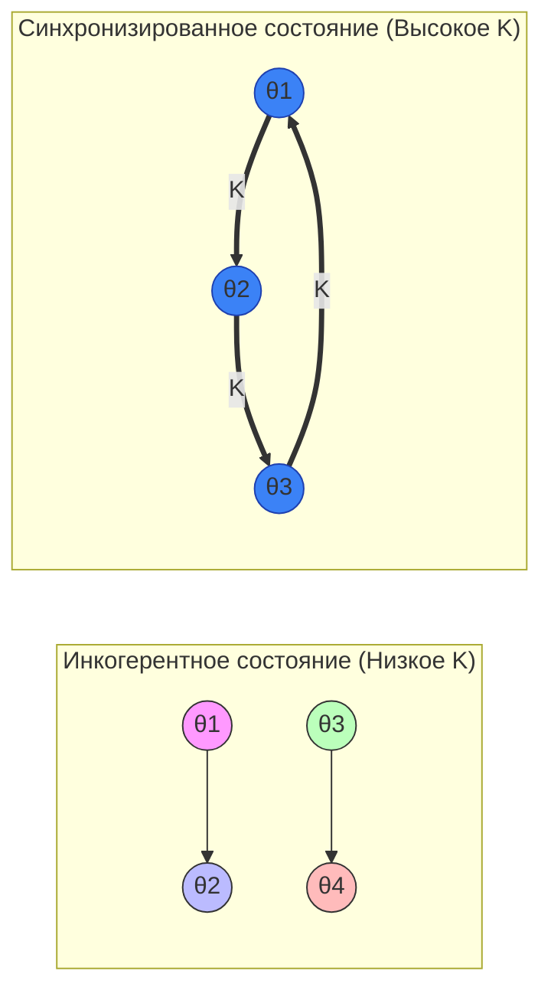

# Модель Курамото

## Обзор

Модель Курамото — это математическая база для описания коллективной синхронизации большой популяции связанных осцилляторов. Предложенная Ёсики Курамото в 1975 году, она стала «стандартной моделью» для понимания того, как простые индивидуальные агенты могут спонтанно согласовывать свое поведение, создавая глобальную когерентность.

Хотя изначально модель разрабатывалась для физических и биологических систем (например, синхронное мерцание светлячков или клетки-кардиостимуляторы в сердце), недавно она нашла глубокое применение в **искусственном интеллекте** (для связывания признаков и создания устойчивых нейронных сетей) и **финансах** (для моделирования рыночных крахов и системных рисков).

## Математическая база

Модель рассматривает $N$ осцилляторов, каждый из которых имеет свою фазу $\theta_i(t)$ и собственную частоту $\omega_i$. Частоты обычно выбираются из распределения $g(\omega)$ (часто нормального или распределения Коши).

Эволюция каждого осциллятора описывается уравнением:

$$\frac{d\theta_i}{dt} = \omega_i + \frac{K}{N} \sum_{j=1}^{N} \sin(\theta_j - \theta_i)$$

Где:
- $\theta_i$ — фаза $i$-го осциллятора.
- $\omega_i$ — его собственная частота.
- $K$ — **сила связи** (coupling strength).
- $N$ — общее количество осцилляторов.

Член $\sin(\theta_j - \theta_i)$ заставляет осцилляторы «подтягивать» друг друга к своим фазам.

## Фазовый переход и параметр порядка

Для измерения степени синхронизации Курамото ввел **комплексный параметр порядка** $r(t)e^{i\psi(t)}$:

$$re^{i\psi} = \frac{1}{N} \sum_{j=1}^N e^{i\theta_j}$$

- $r \approx 0$: **Инкогерентность**. Осцилляторы распределены по кругу случайным образом; их сигналы гасят друг друга.
- $r \approx 1$: **Глобальная синхрония**. Осцилляторы движутся как единый когерентный «рой».

По мере увеличения силы связи $K$ система претерпевает **фазовый переход** при критическом значении $K_c$. Ниже $K_c$ осцилляторы действуют независимо. Выше $K_c$ возникает «гигантская компонента» синхронизированных осцилляторов.

## Применение в AI

Современные исследования интегрируют динамику Курамото в архитектуры глубокого обучения для решения фундаментальных задач компьютерного зрения и логического вывода.

### 1. Искусственные осцилляторные нейроны Курамото (AKOrN)
Традиционные нейроны используют пороговые функции (например, ReLU). В отличие от них, осцилляторные нейроны представляют информацию через фазу.
- **Связывание признаков (Feature Binding):** Позволяя нейронам синхронизироваться, сеть может «связывать» различные признаки (например, контуры и цвет автомобиля) в единый объект без явной разметки.
- **Неконтролируемое обнаружение объектов:** Синхронизация служит естественным механизмом группировки, позволяя моделям сегментировать объекты на изображении, находя кластеры синхронизированной нейронной активности.

### 2. Состязательная устойчивость (Adversarial Robustness)
Сети на базе модели Курамото по своей природе более устойчивы к состязательным атакам. Поскольку результат зависит от коллективной стабильности множества связанных осцилляторов, небольшое возмущение (шум), добавленное к одному входу, «гасится» связями системы, не позволяя классификации легко измениться.

### 3. Решение комбинаторных задач
Сети осцилляторов Курамото могут «вычислять» решения NP-трудных задач (таких как Судоку или раскраска графов). Ограничения задачи отображаются на силы связи $K_{ij}$, а решение соответствует стабильному синхронизированному состоянию, к которому приходит система.

## Применение в финансах

В финансовой математике модель Курамото используется для изучения взаимосвязанности глобальных рынков.

### 1. Рыночная синхронизация и кризисы
Цены акций и индексы можно рассматривать как осцилляторы. В «нормальные» времена рынки демонстрируют здоровый уровень разнообразия (низкое $r$). Однако при приближении краха связь усиливается, и система движется к **экстремальной синхронизации** ($r \to 1$). Когда все участники начинают действовать в унисон, рынок теряет ликвидность и становится подвержен катастрофическому обвалу.

### 2. Системный риск
Моделируя банки или финансовые институты как осцилляторы, исследователи могут определить точку «критической связи», где сбой в одном узле синхронизирует сбои во всей сети, приводя к системному коллапсу.

## Визуализация синхронизации

Переход от хаоса к порядку при увеличении $K$:

## Связанные темы

- [[pinns]] — решение уравнения Курамото через нейронные сети
- [[hamiltonian-nn]] — законы сохранения в осцилляторных системах
- [[complex-networks]] — топология связей осцилляторов
- [[stochastic-processes]] — шум в модели Курамото
- [[graph-theory]] — структуры сетей для синхронизации
