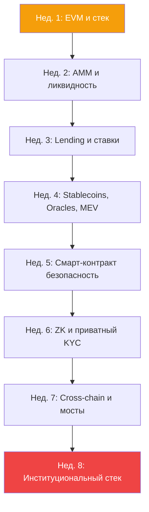

# CeDeFi Инженерия — институциональный Web3 за 8 недель

Курс для инженеров и квантов, которые строят гибридные системы уровня BlackRock / Fidelity Digital Assets: централизованная безопасность + децентрализованная ликвидность. 8 недель, 2 модуля в неделю, каждая неделя закрывается kata-проектом.

## Prerequisites

- Смарт-контракты: Solidity на уровне ERC-20/721, понимание газовой модели.
- Финансы: знание базовой деривативной экспозиции (спот, форвард, опцион).
- Девопс: Docker, базовый Linux, Git — уметь поднять локальный узел Hardhat / Anvil.

## Цели курса (Outcomes)

К концу 8 недель вы:

1. Спроектируете end-to-end поток «TradFi клиент → on-chain yield» с проходом всех комплаенс-гейтов.
2. Объясните, почему AMM-кривые CurveV2 и Uniswap v3 оптимизируют разные метрики и когда какая нужна.
3. Выведете ставку ликвидации для конкретного пула Aave / Compound с учётом LLTV и health factor.
4. Поднимете **полностью приватный** поток KYC-верификации через ZK-SNARK без утечки персональных данных.
5. Проаудитируете bridge-контракт по чеклисту OWASP + Rekt.news known-patterns.

## Карта курса

---

## Неделя 1 — EVM и архитектура стека

**Цель:** понимать стек от bytecode до frontend, отличать L1 / L2 / rollup по архитектуре.

- [[evm-internals|Внутренности EVM: стек, память, хранилище]]
- [[gas-and-opcodes|Газовая модель и опкоды]]
- [[rollups-l2|Rollups и L2 (Optimism, Arbitrum, zkSync)]]
- [[data-availability|Data availability слой (Celestia, EigenDA)]]

**Kata:** реализовать минимальный ERC-20 без OpenZeppelin, оптимизировать до < 30 KB bytecode, измерить газ трансфера vs. reference.

## Неделя 2 — AMM и микроструктура ликвидности

**Цель:** понимать, как работает on-chain price discovery и почему концентрированная ликвидность — это opt-in кредитное плечо для LP.

- [[amm-mechanics|Механика AMM: Uniswap v2/v3, Curve]]
- [[liquidity-providers|Провайдеры ликвидности: impermanent loss]]
- [[smart-order-routing|Smart Order Routing]]

**Kata:** получить котировку 5 000 USDC → ETH через Uniswap v3 TWAP quote и сравнить с на-цепи исполнением. Объяснить spread.

## Неделя 3 — Lending и риск

**Цель:** ставки, ликвидация, health factor; почему Aave выживает в кризис.

- [[lending-mechanics|Механика кредитных пулов]]
- [[onchain-credit|On-chain credit score]]
- [[liquid-staking|Liquid staking (Lido, EigenLayer)]]

**Kata:** написать симулятор Aave-пула: supply, borrow, price-шок → ликвидация. Проверить корректность расчёта health factor для position с 3 активами.

## Неделя 4 — Stablecoins, Oracles, MEV

**Цель:** три самых «ломающих» слоя DeFi-стека, через которые идут все серьёзные атаки.

- [[stablecoins|Stablecoins: USDT/USDC/DAI/crvUSD]]
- [[mev|MEV: sandwich, backrun, JIT liquidity]]
- [[oracle-design|Oracles: Chainlink, Pyth, API3]]

**Kata:** проэксплуатировать уязвимость TWAP-оракула на локальном форке (mainnet-fork + flash loan). Объяснить цену атаки в газе и slippage'е.

## Неделя 5 — Смарт-контракт безопасность

**Цель:** научиться читать контракт как аудитор, а не разработчик.

- [[contract-upgradeability|Upgradeability через прокси]]
- [[smart-contract-security|Типовые уязвимости и чеклисты]]
- [[formal-verification-smart|Формальная верификация смарт-контрактов]]

**Kata:** провести аудит учебного контракта Damn Vulnerable DeFi (уровень 4+), найти минимум 3 уязвимости, написать PoC-эксплойт.

## Неделя 6 — ZK и приватный KYC

**Цель:** главная инженерная revolution 2024-2026: proof-of-anything без утечки данных.

- [[zk-kyc|Приватный KYC через ZK-SNARK]]
- [[privacy-defi|Приватные пулы (Aztec, Railgun)]]
- [[account-abstraction|ERC-4337 Account Abstraction]]

**Kata:** реализовать ZK-circuit (Circom / Noir), который доказывает «мне > 18 и я не в санкц. списке» без раскрытия имени / даты. Деплой в testnet.

## Неделя 7 — Cross-chain и мосты

**Цель:** мосты — главный failure point DeFi. Научиться их строить безопасно и оценивать риски.

- [[bridge-mechanics|Mechanics of bridges]]
- [[cross-chain-interop|Cross-chain взаимодействие (CCIP, LayerZero)]]
- [[onchain-perps|Cross-chain perps и vAMM]]

**Kata:** использовать Chainlink CCIP для отправки USDC + message с Ethereum на Arbitrum, обработать reorg + rollback сценарий.

## Неделя 8 — Институциональный стек

**Цель:** собрать всё в production-setup, который подпишет aggregate-custodian.

- [[cedefi-gateway|Архитектура CeDeFi-шлюза]]
- [[cedefi|CeDeFi: обзор стека]]
- [[mpc-custody|MPC хранение и threshold signatures]]
- [[asset-tokenization|Токенизация RWA: недвижимость, облигации]]
- [[yield-aggregators|Yield-агрегаторы и авто-компаундинг]]

**Kata:** развернуть локальный MPC-кошелёк через `tss-lib` (3-of-5 threshold), подписать транзакцию multi-party, верифицировать on-chain.

---

## Финальный проект

**Комплаенс-доходный шлюз.**

Спроектируйте и разверните в тестнет систему, которая:

1. Принимает USDC от пользователя, прошедшего ZK-KYC (неделя 6).
2. Маршрутизирует в yield-хранилище через Chainlink CCIP (неделя 7).
3. Хранит операционные ключи под MPC-подписями (неделя 8).
4. Автоматически ликвидирует позицию, если onchain risk-score превысил лимит (неделя 3).
5. Защищён от JIT / sandwich через private mempool (неделя 4).

Бонус: добавьте модуль regulatory reporting — ежедневный on-chain proof-of-reserves.

## Рекомендуемая литература и источники

- Ethereum Yellow Paper — обязательно для модуля 1.
- *Mastering Ethereum* (A. Antonopoulos) — cover-to-cover.
- *Flash Boys 2.0* (Daian et al., 2019) — классика MEV.
- Rekt.news — читать все post-mortem'ы за 2022-2025.
- Solady / Solmate — референсные библиотеки, читать код.
- Paradigm Research — каноническая исследовательская платформа по AMM/MEV.
