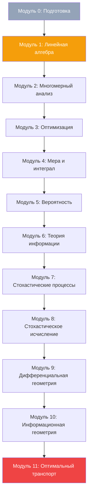

# Математика для Deep Learning — программа PhD-уровня

Курс на **12 недель**: от линала и многомерного анализа до информационной геометрии и оптимального транспорта. Каждый блок заканчивается практической задачей, которая используется в современных архитектурах (трансформеры, диффузия, нейроODE).

## Prerequisites

- Уверенный анализ функций одной переменной (производная, интеграл, ряды).
- Базовая линейная алгебра: операции с матрицами, определители, ранги.
- Знание Python + NumPy на уровне «могу самостоятельно реализовать линейную регрессию».

Если что-то из этого пробел — начните с Модуля 0 (см. ниже), он закроет дыры за 1 неделю.

## Цели курса (Outcomes)

К концу программы вы:

1. Свободно читаете статьи NeurIPS / ICML по теории глубокого обучения (PAC-Bayes, NTK, диффузия, OT).
2. Понимаете геометрию loss landscape и почему SGD сходится в плоские минимумы.
3. Можете вывести forward/backward уравнения диффузионной модели с нуля.
4. Объясняете, почему натуральный градиент инвариантен к репараметризации.
5. Можете численно решить задачу Wasserstein с энтропийной регуляризацией (Sinkhorn).

## Карта курса

---

## Модуль 0 (опциональный, 1 неделя): Подготовка

Закрытие пробелов перед основной программой. Пропускайте, если уверены.

- [[logic-sets|Теория множеств и логика]] — язык, на котором всё дальше говорит.
- [[limits-convergence|Пределы и сходимость]] — фундамент анализа.
- [[linear-spaces|Линейные пространства и базис]] — переход от «матриц» к «операторам».

**Чек-аут:** доказать, что объединение счётного семейства счётных множеств счётно.

---

## Неделя 1 — Линейная алгебра в operator-форме

**Цель:** перестать думать о матрицах как о «таблицах чисел» и начать видеть линейные операторы.

- [[linear-spaces|Линейные пространства, базис, размерность]]
- [[linear-systems|Системы линейных уравнений и метод Гаусса]]
- [[eigenvalues|Собственные значения и SVD]]

**Практика:** реализовать SVD низкого ранга вручную через power iteration и сравнить с `np.linalg.svd`.

## Неделя 2 — Спектр, SVD, тензорные разложения

**Цель:** SVD как универсальный анализ данных, тензоры как обобщение для сетей.

- [[hilbert-banach-spaces|Гильбертовы и банаховы пространства]]
- [[tensor-decompositions|Тензорные разложения: CP, Tucker]]
- [[manifold|Многообразие как локально евклидов объект]]

**Практика:** разложить веса предобученного слоя ResNet через truncated SVD, измерить деградацию accuracy.

## Неделя 3 — Многомерный анализ

**Цель:** понимать, что backprop — это chain rule на якобианах.

- [[multivariable-calculus|Многомерный анализ]]
- [[gradient-hessian-jacobian|Градиент, гессиан, якобиан]]
- [[taylor-series|Ряды Тейлора как локальная аппроксимация]]
- [[laplacian|Лапласиан и оператор Лапласа]]

**Практика:** вывести аналитический градиент softmax-cross-entropy и проверить численно через `torch.autograd.gradcheck`.

## Неделя 4 — Оптимизация и выпуклость

**Цель:** понимать, в чём «легко» (convex) и «трудно» (non-convex) современного обучения.

- [[convexity|Выпуклость]]
- [[convex-optimization|Выпуклая оптимизация]]
- [[lagrange-multipliers|Множители Лагранжа]]
- [[linear-programming|Линейное программирование и двойственность]]

**Практика:** вывести двойственную задачу для SVM с soft-margin, реализовать через `cvxpy` и сравнить с sklearn.

## Неделя 5 — Теория меры и интеграл Лебега

**Цель:** интеграл, который выживает в бесконечной размерности (DL живёт там).

- [[measure-theory|Основы теории меры]]
- [[lebesgue-integral|Интеграл Лебега]]
- [[sigma-algebra-measurability|σ-алгебры и измеримость]]
- [[lp-spaces|L^p-пространства]]

**Практика:** показать, что MSE-loss — это норма в L^2 пространстве на эмпирическом распределении.

## Неделя 6 — Теория вероятностей

**Цель:** вероятность как мера, ЦПТ как объяснение нормальности всего вокруг.

- [[kolmogorov-probability-axioms|Аксиоматика Колмогорова]]
- [[distributions-zoo|Справочник распределений]]
- [[lln-clt|ЗБЧ и ЦПТ]]
- [[multivariate-normal|Многомерное нормальное]]
- [[characteristic-functions|Характеристические функции]]

**Практика:** доказать ЦПТ для i.i.d. через характеристические функции (преобразование Фурье плотности).

## Неделя 7 — Теория информации

**Цель:** энтропия и KL как измерительная линейка для распределений и обучения.

- [[information-theory|Теория информации]]
- [[entropy-information|Энтропия и информационный выигрыш]]
- [[f-divergences|f-дивергенции (KL, χ², Hellinger)]]
- [[maximum-entropy|Принцип максимальной энтропии]]

**Практика:** вывести, что MLE = минимизация прямой KL между data distribution и параметризованной моделью.

## Неделя 8 — Стохастические процессы

**Цель:** язык времени и неопределённости, на котором описана диффузия и SDE-нейросети.

- [[discrete-markov-chains|Цепи Маркова]]
- [[poisson-process|Пуассоновский процесс]]
- [[brownian-bridge|Броуновское движение и мост]]
- [[ornstein-uhlenbeck|Процесс Орнштейна–Уленбека]]
- [[martingale|Мартингалы]]

**Практика:** симулировать траекторию OU-процесса методом Эйлера–Маруямы и измерить эмпирическое стационарное распределение.

## Неделя 9 — Стохастическое исчисление

**Цель:** Itô + Langevin = backbone современной диффузии и SGLD.

- [[stochastic-differential-equations|SDE и стохастический интеграл Itô]]
- [[feynman-kac|Формула Фейнмана-Каца]]
- [[malliavin-calculus|Исчисление Маллявэна]]
- [[sde-numerical-methods|Численные методы для SDE]]

**Практика:** реализовать score-matching loss и обучить score-network на 2D-Gaussian mixture.

## Неделя 10 — Дифференциальная геометрия

**Цель:** многообразия, метрики, кривизна — фундамент для информационной геометрии.

- [[differential-geometry|Дифференциальная геометрия]]
- [[connections-curvature|Связности и кривизна]]
- [[lie-groups|Группы Ли и их алгебры]]
- [[symplectic-geometry|Симплектическая геометрия]]
- [[hodge-theory|Теория Ходжа]]

**Практика:** вычислить тензор Риччи для 2-сферы и проверить, что он пропорционален метрике.

## Неделя 11 — Информационная геометрия

**Цель:** пространство распределений как риманово многообразие — натуральные градиенты, K-FAC, TRPO.

- [[fisher-information|Информация Фишера и FIM]]
- [[information-geometry|Информационная геометрия]]
- [[exponential-families|Экспоненциальные семейства]]
- [[geometric-deep-learning|Геометрическое глубокое обучение]]

**Практика:** реализовать натуральный градиентный спуск для логистической регрессии и сравнить с обычным SGD по числу итераций до сходимости.

## Неделя 12 — Оптимальный транспорт

**Цель:** Wasserstein-расстояние как геометрия между распределениями, движок Diffusion и Flow Matching.

- [[optimal-transport|Оптимальный транспорт]]
- [[manifold-learning|Manifold learning]]
- [[ricci-flow|Поток Риччи]]

**Практика:** реализовать алгоритм Sinkhorn для энтропийной регуляризации и применить к domain adaptation.

---

## Финальный проект

**Информационное узкое место в трансформере.**

Используя инструменты из недель 7 (теория информации) и 11 (инфогеометрия), измерьте mutual information между промежуточными активациями BERT-base и (a) входом, (b) выходным таргетом. Постройте кривую IB-plane для каждого слоя и найдите фазовый переход «memorisation → compression».

Опционально: повторите с дистиллированной моделью (DistilBERT) и сравните, насколько раньше происходит фазовый переход.

## Рекомендуемая литература

- Strang, G. — *Linear Algebra and Learning from Data* (для модулей 1-2).
- Boyd & Vandenberghe — *Convex Optimization* (модуль 3).
- Cover & Thomas — *Elements of Information Theory* (модуль 6).
- Øksendal — *Stochastic Differential Equations* (модули 7-8).
- Amari — *Information Geometry and Its Applications* (модуль 10).
- Peyré & Cuturi — *Computational Optimal Transport* (модуль 11).
