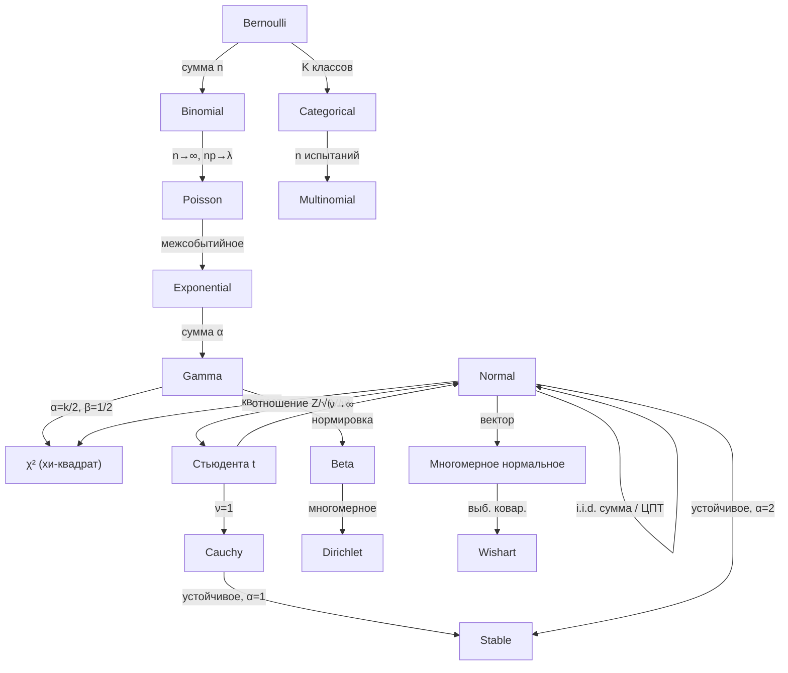

# Математика для Deep Learning — монография PhD-уровня

Настоящее руководство представляет собой цельный учебник и фундаментальную монографию по математическим основаниям глубокого обучения и искусственного интеллекта. Курс состоит из последовательных статей, объединенных в тематические разделы.

---

## Раздел 1. Линейные пространства и фундаментальные подпространства

### Линейные пространства, Базис и Размерность

**Линейное пространство** (или векторное пространство) — это множество объектов (векторов), которые можно складывать между собой и умножать на числа (скаляры), не выходя за пределы этого множества. Это простое определение лежит в основе всего: от 3D-графики в играх до бесконечномерных пространств в [[quantum-entanglement|Квантовой механике]].

### 1. Определение Линейного пространства ($V$)

Множество $V$ называется векторным пространством над полем $\mathbb{R}$, если для него выполняются 8 аксиом, включая:
- **Коммутативность**: $u + v = v + u$
- **Дистрибутивность**: $a(u + v) = au + av$
- **Наличие нуля**: Существует вектор $\mathbf{0}$, такой что $v + \mathbf{0} = v$.

### 2. Линейная независимость и Оболочка

- **Линейная комбинация**: Сумма векторов, умноженных на константы: $v = c_1 v_1 + c_2 v_2 + \dots + c_n v_n$.
- **Линейная оболочка (Span)**: Множество всех возможных линейных комбинаций данной группы векторов. Если оболочка векторов совпадает со всем пространством $V$, то эти векторы «порождают» это пространство.
- **Линейная независимость**: Векторы независимы, если ни один из них нельзя выразить через сумму остальных. Математически:
  $$ c_1 v_1 + c_2 v_2 + \dots + c_n v_n = 0 \implies c_1 = c_2 = \dots = c_n = 0 $$

### 3. Базис и Размерность

**Базис** — это «система координат» пространства. Это такой набор векторов, который **одновременно** линейно независим и порождает всё пространство.
- **Уникальность**: Любой вектор пространства можно представить через базис только **одним** способом.
- **Размерность (Dimension)**: Количество векторов в базисе называется размерностью пространства ($dim V$).
  - В 3D-пространстве размерность равна 3.
  - В глубоком обучении ([[llm|LLM]]) размерность пространства эмбеддингов может быть 1536 или 4096.

### 4. Смена базиса

Одно и то же пространство может иметь бесконечно много разных базисов. Переход от одного к другому описывается матрицей перехода $P$:
$$ [v]_{new} = P^{-1} [v]_{old} $$
Эта концепция — корень таких технологий, как **Преобразование Фурье** (переход в базис частот) и **Метод главных компонент (PCA)** (переход в базис максимальной дисперсии).

### 5. Подпространства и Ранг

**Подпространство** — это меньшее линейное пространство внутри большего (например, плоскость, проходящая через начало координат в 3D).
- **Ранг матрицы**: Размерность пространства, порожденного её столбцами.
- **Теорема о ранге и дефекте**: Для любой матрицы $A$ с $n$ столбцами:
  $$ \text{rank}(A) + \text{nullity}(A) = n $$
  Эта теорема связывает количество «полезных» измерений с количеством измерений, которые матрица «схлопывает» в ноль.

---

### Системы линейных уравнений и Метод Гаусса

Решение **Систем линейных уравнений (СЛАУ)** — самая частая вычислительная задача в науке. Будь то поиск химического равновесия, балансировка рынка или обучение нейросети, всё сводится к поиску набора неизвестных, которые удовлетворяют набору линейных ограничений.

### 1. Матричная запись

Система из $m$ уравнений с $n$ неизвестными записывается как:
$$ A \mathbf{x} = \mathbf{b} $$
Где $A$ — матрица коэффициентов, $\mathbf{x}$ — вектор неизвестных, $\mathbf{b}$ — вектор свободных членов.

### 2. Метод Гаусса

**Метод Гаусса** — это пошаговый алгоритм приведения любой матрицы к **ступенчатому виду** с помощью трех элементарных операций:
1.  **Перестановка** строк.
2.  **Умножение** строки на число (не равное нулю).
3.  **Прибавление** к одной строке другой строки, умноженной на число.

#### Этапы:
- **Прямой ход**: Обнуление элементов под главной диагональю для получения «треугольной» формы.
- **Обратный ход**: Решение уравнений начиная с самого последнего (где осталась одна переменная) и подстановка значений вверх.
- **Метод Гаусса-Жордана**: Доведение матрицы до вида, где на диагонали стоят единицы, а всё остальное — нули.

### 3. Когда есть решение?

Анализируя **Ранг** матрицы $A$ и расширенной матрицы $[A|b]$, можно понять тип решения:
1.  **Единственное решение**: Матрица $A$ обратима ($\det(A) \neq 0$), количество независимых уравнений равно количеству неизвестных.
2.  **Бесконечно много решений**: В системе есть **Свободные переменные**. Это типично для «недоопределенных» моделей ИИ.
3.  **Нет решений (Противоречие)**: Уравнения противоречат друг другу (например, получается строка $0 = 5$).

### 4. Почему это важно в цифровую эпоху

#### А. Компьютерная графика
Расчет того, как свет отражается от 3D-поверхности, требует решения систем уравнений для миллионов треугольников в реальном времени.

#### Б. Метод конечных элементов (МКЭ)
Инженеры моделируют нагрузку на мост или обтекаемость ракеты, разбивая объект на мелкие части и решая гигантскую систему уравнений ($A\mathbf{x}=\mathbf{b}$) с миллионами строк.

#### В. Обучение нейросетей
Хотя нейросети нелинейны, внутри каждого шага обучения происходит линеаризация, и видеокарты ([[inference-serving|GPU]]) оптимизированы именно под сверхбыстрое решение матричных задач, вытекающих из принципов Гаусса.

### 5. Вычислительная сложность

Метод Гаусса имеет сложность $O(n^3)$. Для систем с миллиардами переменных это слишком медленно. Современные суперкомпьютеры используют **итерационные методы** (например, метод сопряженных градиентов), чтобы приблизиться к решению, не выполняя полное исключение переменных.

---


*Статья None временно создается.*


---

## Раздел 2. Многомерный анализ и авто-дифференцирование

### Многомерный анализ: Якобианы и Гессианы

В мире, где данные имеют тысячи измерений, обычного анализа одной переменной недостаточно. **Многомерный анализ** расширяет понятия производных и интегралов на функции многих переменных. Для машинного обучения и количественных финансов самыми важными инструментами являются **Якобиан** (первая производная) и **Гессиан** (вторая производная).

### 1. Градиент ($\nabla f$)

Для скалярной функции $f(x_1, x_2, \dots, x_n)$ градиент — это вектор её частных производных:
$$ \nabla f = \begin{bmatrix} \frac{\partial f}{\partial x_1} & \frac{\partial f}{\partial x_2} & \dots & \frac{\partial f}{\partial x_n} \end{bmatrix}^T $$
- **Геометрия**: Градиент указывает направление **наискорейшего роста** функции.
- **Оптимизация**: Чтобы минимизировать функцию (например, ошибку нейросети), мы движемся в противоположном направлении: $\theta_{new} = \theta_{old} - \eta \nabla f$. Это и есть **[[convex-optimization|Градиентный спуск]]**.

### 2. Матрица Якоби (Якобиан, $\mathbf{J}$)

Если у нас есть векторная функция $\mathbf{F}: \mathbb{R}^n \to \mathbb{R}^m$, её первой производной является **Матрица Якоби**. Она показывает, как каждая компонента выхода меняется в зависимости от каждой компоненты входа.
$$ \mathbf{J}_{ij} = \frac{\partial F_i}{\partial x_j} $$
- **Линейная аппроксимация**: Локально любое гладкое преобразование выглядит как линейное: $\mathbf{F}(\mathbf{x}) \approx \mathbf{F}(\mathbf{a}) + \mathbf{J}(\mathbf{x} - \mathbf{a})$.
- **В ИИ**: В алгоритме **[[automatic-differentiation|Backpropagation]]** (обратное распространение ошибки) правило цепочки — это просто последовательное умножение матриц Якоби.

### 3. Матрица Гессе (Гессиан, $\mathbf{H}$)

Гессиан — это матрица вторых частных производных для скалярной функции $f$:
$$ \mathbf{H}_{ij} = \frac{\partial^2 f}{\partial x_i \partial x_j} $$
- **Кривизна**: Гессиан описывает «форму» локального ландшафта.
- **[[spectral-theory-operators|Собственные числа]] H**:
  - Все $> 0$: Точка является **Локальным минимумом** (впадина).
  - Все $< 0$: Точка является **Локальным максимумом** (пик).
  - Разные знаки: Точка является **Седловой точкой**.

### 4. Почему это важно для финансов

В оценке опционов ([[black-scholes|Блэк-Шоулз]]) «Греки» — это просто производные:
- **Дельта** — это первая производная (часть Якобиана).
- **Гамма** — это вторая производная (часть Гессиана).
Управление портфелем — это контроль «кривизны» (Гаммы) ваших рисков.

### 5. Правило цепочки в многомерном случае

Самая важная формула для ИИ:
$$ \frac{\partial z}{\partial x} = \frac{\partial z}{\partial y} \cdot \frac{\partial y}{\partial x} $$
В многомерном анализе это превращается в **Умножение матриц**:
$$ \mathbf{J}_{z(x)} = \mathbf{J}_{z(y)} \mathbf{J}_{y(x)} $$
Именно так библиотеки вроде **PyTorch** и **TensorFlow** автоматически вычисляют градиенты для миллионов параметров.

---

### Градиент, Гессиан и Якобиан

Эти три оператора — фундамент многомерного анализа и оптимизации. Они позволяют строить приближения функций 1-го и 2-го порядка, на которых держится всё **Машинное обучение**.

### 1. Градиент ($\nabla f$) — Компас
Градиент — это вектор всех первых частных производных **скалярной** функции $f$.
$$\nabla f = \left[ \frac{\partial f}{\partial x_1}, \dots, \frac{\partial f}{\partial x_n} \right]^\top$$
- **Геометрический смысл**: указывает направление самого быстрого подъема. Его длина — это крутизна склона.
- **В ИИ**: алгоритм Gradient Descent («[[convex-optimization|Градиентный спуск]]») использует $-\nabla f$, чтобы вести нейросеть к минимуму ошибки.

### 2. Якобиан ($J$) — Линеаризатор
Якобиан — это матрица первых производных **векторной** функции (когда на входе вектор и на выходе вектор).
$$J_{ij} = \frac{\partial F_i}{\partial x_j}$$
- **Смысл**: Якобиан — это «лучшая линейная замена» для сложного нелинейного преобразования в окрестности точки. Он показывает, как малый объем во входном пространстве растягивается и поворачивается в выходном.
- **В ИИ**: всё **[[automatic-differentiation|Обратное распространение ошибки]] ([[automatic-differentiation|Backpropagation]])** — это последовательное перемножение матриц Якоби (Jacobian-Vector Products).

### 3. Гессиан ($H$) — Кривизна
Гессиан — это квадратная матрица вторых производных скалярной функции.
$$H_{ij} = \frac{\partial^2 f}{\partial x_i \partial x_j}$$
- **Смысл**: описывает кривизну поверхности. Если градиент говорит нам «куда идти», то Гессиан говорит «как быстро меняется уклон».
- **Анализ стабильности**:
    - Все собственные числа $\lambda_i > 0$ — мы в «чаше» (минимум).
    - Есть и положительные, и отрицательные $\lambda_i$ — мы в **Седловой точке**. Глубокие нейросети полны седловых точек, где градиент равен нулю, но мы еще не в минимуме.

### 4. Оптимизация второго порядка

Обычный SGD (градиентный спуск) слеп к кривизне. Методы второго порядка используют Гессиан:
- **Метод Ньютона**: $w \leftarrow w - H^{-1} \nabla f$. Позволяет найти минимум за один шаг для простых функций. 
- **Проблема**: для модели с 175 млрд параметров (GPT-3) вычислить и обратить матрицу $H$ невозможно. Поэтому в ИИ используют приближения, такие как **K-FAC** или **L-BFGS**.

---

### Ряды Тейлора и Аппроксимация

**Ряд Тейлора** — это представление функции в виде бесконечной суммы слагаемых, вычисленных через значения её производных в одной точке. Это мощнейший инструмент численного анализа, позволяющий превращать сложные функции (такие как $\sin x$, $e^x$ или $\ln x$) в простые многочлены, которые легко вычислить на компьютере.

### 1. Формула Тейлора

Если функция $f(x)$ бесконечно дифференцируема в точке $a$, то её ряд Тейлора имеет вид:
$$ f(x) = f(a) + \frac{f'(a)}{1!}(x-a) + \frac{f''(a)}{2!}(x-a)^2 + \frac{f'''(a)}{3!}(x-a)^3 + \dots $$
В краткой записи:
$$ f(x) = \sum_{n=0}^{\infty} \frac{f^{(n)}(a)}{n!} (x-a)^n $$
Когда $a = 0$, ряд называется **Рядом Маклорена**.

### 2. Интуиция: Локальное упрощение

- **0-й порядок**: $f(x) \approx f(a)$. Самая грубая оценка (константа).
- **1-й порядок (линейный)**: $f(x) \approx f(a) + f'(a)(x-a)$. Это **Касательная прямая**. Она передает направление функции.
- **2-й порядок (квадратичный)**: Добавляет слагаемое с $f''(a)$. Оно передает **Кривизну** функции (её выпуклость или вогнутость).

### 3. Важные разложения, которые нужно знать

Вокруг точки $x=0$:
1.  **Экспонента**: $e^x = 1 + x + \frac{x^2}{2!} + \frac{x^3}{3!} + \dots$
2.  **Синус**: $\sin x = x - \frac{x^3}{3!} + \frac{x^5}{5!} - \dots$
3.  **Геометрическая прогрессия**: $\frac{1}{1-x} = 1 + x + x^2 + x^3 + \dots$ (только при $|x| < 1$).

### 4. Почему это важно для ИИ и Физики

#### А. Приближение малых углов
В физике часто используют $\sin \theta \approx \theta$. Это не магия, а просто отбрасывание всех членов ряда Тейлора выше 1-го порядка. Это позволяет аналитически решать уравнения маятника.

#### Б. Формула Эйлера
Если подставить $ix$ в ряд Тейлора для $e^x$ и сгруппировать вещественные и мнимые части, получится:
$$ e^{ix} = \cos x + i \sin x $$
Это мост между анализом и комплексными числами.

#### В. Оптимизация и ИИ
В машинном обучении мы часто используем **второе приближение Тейлора** для функции потерь (Loss function), чтобы понять её геометрию:
$$ L(\theta) \approx L(\theta_0) + \nabla L^T \Delta \theta + \frac{1}{2} \Delta \theta^T \mathbf{H} \Delta \theta $$
где $\mathbf{H}$ — это [[multivariable-calculus|Матрица Гессе (Гессиан)]].

### 5. Остаточный член

Ряд Тейлора полезен, только если он сходится. Ошибка (остаток) $R_n(x)$ показывает, насколько точен наш многочлен. Теорема Тейлора гарантирует, что чем ближе $x$ к $a$ и чем больше членов мы берем, тем меньше ошибка.

---

### Лапласиан (Оператор Лапласа)

Оператор Лапласа ([[spectral-graph-theory|Лапласиан]]) — это дифференциальный оператор второго порядка, который описывает «суммарную кривизну» функции или интенсивность процесса диффузии. Это фундаментальный язык, на котором «говорит» физика равновесия и современный генеративный ИИ.

### 1. Математическое определение

Для функции $f$ в $n$-мерном пространстве [[spectral-graph-theory|Лапласиан]] — это дивергенция градиента (сумма вторых производных):
$$\Delta f = \nabla \cdot \nabla f = \sum_{i=1}^n \frac{\partial^2 f}{\partial x_i^2}$$

#### Дискретный [[spectral-graph-theory|Лапласиан]] на графах
В [[graph-neural-networks|графовых нейросетях (GNN)]] Лапласиан определяется как $L = D - A$.
- Он показывает, насколько сигнал в узле графа отличается от сигналов в соседних узлах.
- **Спектр Лапласиана** графа позволяет сжимать данные и находить скрытые сообщества (кластеры) в социальных сетях или молекулах.

### 2. Физическая и Геометрическая интуиция

#### А. Смысл усреднения
Главное свойство Лапласиана — измерение отклонения от среднего.
- Если $\Delta f = 0$, значение функции в точке равно среднему значению в её окрестности. Такие функции называются **гармоническими**.
- Если $\Delta f < 0$, в этой точке наблюдается «пик» (значение выше среднего), и вещество будет оттуда растекаться.

#### Б. Энергия Дирихле
Лапласиан минимизирует «энергию натяжения» функции. Представьте резиновую мембрану, натянутую на каркас. Её форма будет удовлетворять уравнению Лапласа $\Delta f = 0$, так как природа стремится минимизировать изгибы.

### 3. Почему это важно для ИИ и Финансов

- **Диффузионные модели**: ИИ (Stable Diffusion) генерирует изображения, «разворачивая» процесс диффузии. Лапласиан здесь описывает, как шум «размывает» структуру картинки, а нейросеть учится этот процесс обращать.
- **Спектральное смещение (Spectral Bias)**: Доказано, что нейросети сначала выучивают «низкие частоты» (плавные формы, описываемые малыми собственными числами Лапласиана) и только потом переходят к мелким деталям.
- **Уравнение Блэка-Шоулза**: В финансах Лапласиан (в виде второй производной по цене $\frac{\partial^2 V}{\partial S^2}$ — Гаммы) описывает выпуклость опциона и скорость рассеивания вероятности цены.

### 4. Связь с Гессианом

Лапласиан — это **След (Trace)** матрицы [[gradient-hessian-jacobian|Гессиана]]:
$$\Delta f = \text{Tr}(H(f))$$
Он суммирует кривизну по всем осям, давая одно число, характеризующее общую «выпуклость» ландшафта в данной точке.

---

## Раздел 3. Выпуклая оптимизация и условия KKT

### Выпуклость (Convexity)

Выпуклость — это свойство, которое гарантирует, что задача оптимизации будет решена за разумное время. В машинном обучении и финансах почти каждый надежный алгоритм опирается на то, что математический ландшафт является выпуклым.

### 1. Математическая строгость

#### А. Выпуклые множества
Множество $C$ выпукло, если отрезок между любыми двумя его точками тоже лежит в $C$. Никаких «вмятин» и «пещер».

#### Б. Выпуклые функции
Функция выпукла, если область над её графиком является выпуклым множеством.
- **Тест Гессиана**: функция выпукла, если её [[gradient-hessian-jacobian|Гессиан]] $H$ является **положительно полуопределенным** ($H \succeq 0$) в каждой точке.
- **Сильная выпуклость**: если функция изгибается сильнее, чем парабола, она называется сильно выпуклой. Для таких функций градиентный спуск сходится **экспоненциально быстро**.

### 2. Почему это «Святой Грааль»

1.  **Глобальный минимум**: В выпуклой задаче любой **локальный минимум автоматически является глобальным**. Здесь нет «ловушек» или фальшивых ям.
2.  **Двойственность и условия ККТ**: Условия Каруша — Куна — Таккера дают четкие правила поиска идеального решения. Это позволяет решать «двойственную задачу», которая часто раскрывает скрытые смыслы (например, цену риска или ценность ресурса).

### 3. Применение

#### А. Метод опорных векторов (SVM)
Поиск «максимального зазора» между классами — это задача выпуклого квадратичного программирования. Именно поэтому SVM были доминирующим инструментом ИИ до эпохи нейросетей — они гарантированно находили лучшее решение.

#### Б. Оптимизация портфеля
Минимизация риска (дисперсии) при заданной доходности — это выпуклая задача. Однако добавление ограничений типа «купить не более 10 акций» делает задачу **невыпуклой** и экстремально сложной (NP-трудной).

#### В. Неравенство Йенсена
Фундаментальная теорема выпуклости:
$$f(\mathbb{E}[X]) \leq \mathbb{E}[f(X)]$$
- **В ИИ**: Это основа для обучения **VAE** (вариационных автокодировщиков) через максимизацию нижней границы вероятности (ELBO).
- **В Финансах**: Это объясняет, почему диверсифицированный портфель всегда лучше, чем простое среднее рисков его акций.

---

### Выпуклая оптимизация

Выпуклая оптимизация — раздел математики, занимающийся минимизацией выпуклых функций над выпуклыми множествами. Это исключительно благодатная область, где локальные минимумы совпадают с глобальными, что обеспечивает развитие эффективных алгоритмов с доказуемыми гарантиями сходимости. От машинного обучения до стохастического управления, выпуклая оптимизация пронизывает современное инженерное дело.

### Выпуклые множества и функции

Множество $C \subseteq \mathbb{R}^n$ выпукло, если для любых $x, y \in C$ и $\theta \in [0, 1]$ верно:
$$\theta x + (1-\theta) y \in C.$$

Иными словами, любой отрезок, соединяющий две точки множества, целиком лежит в этом множестве. Выпуклые множества наследуют благородные свойства: пересечение выпуклых множеств выпукло, как и выпуклая комбинация конечного числа точек.

Функция $f: \mathbb{R}^n \to \mathbb{R} \cup \{+\infty\}$ выпукла, если:
$$f(\theta x + (1-\theta)y) \leq \theta f(x) + (1-\theta)f(y)$$
для всех $x, y$ в её области определения и $\theta \in [0, 1]$. Это неравенство Йенсена геометрически утверждает, что график функции лежит выше любой касательной линии (надграфика).

**Надграфик** функции определяется как:
$$\mathrm{epi}(f) = \{(x, t) \in \mathbb{R}^n \times \mathbb{R} : f(x) \leq t\}.$$
Функция выпукла тогда и только тогда, когда её надграфик — выпуклое множество. Это ключевое наблюдение позволяет трансформировать функциональные вопросы в геометрические.

**Операции, сохраняющие выпуклость:**
- Неотрицательная взвешенная сумма выпуклых функций выпукла.
- Максимум семейства выпуклых функций выпукл: $f(x) = \sup_i f_i(x)$.
- Композиция: если $f$ выпукла и возрастающа по каждому аргументу, а $g_i$ выпукла, то $f(g_1(x), \ldots, g_m(x))$ выпукла.
- Преобразование перспективы: $(x, t) \mapsto tf(x/t)$ сохраняет выпуклость.

Эти замыкающие свойства позволяют синтезировать новые выпуклые функции из известных кирпичиков.

### Субдифференциал

Для гладких функций градиент $\nabla f(x)$ кодирует направление наискорейшего подъёма. Но выпуклые функции часто негладки (например, $|x|$ в нуле). Субдифференциал обобщает градиент на негладкий случай.

Вектор $g \in \mathbb{R}^n$ называется **субградиентом** функции $f$ в точке $x$ (обозначение $g \in \partial f(x)$), если:
$$f(y) \geq f(x) + \langle g, y - x \rangle$$
для всех $y \in \mathbb{R}^n$.

Геометрически субградиент определяет опорную гиперплоскость к надграфику в точке $(x, f(x))$. **Субдифференциал** $\partial f(x)$ — это множество всех субградиентов в точке $x$. Для выпуклой функции субдифференциал всегда непуст (в области определения) и выпуклый, замкнутый.

**Условие оптимальности первого порядка:** $x^*$ минимизирует $f$ тогда и только тогда, когда:
$$0 \in \partial f(x^*).$$

Это прямое обобщение условия $\nabla f(x^*) = 0$ для гладких функций. Для примера, $|x|$ имеет $\partial |x| = \{1\}$ при $x > 0$, $\partial |x| = \{-1\}$ при $x < 0$, и $\partial |0| = [-1, 1]$ — вся единичная масса в нуле.

### Двойственность и условия KKT

Рассмотрим стандартную задачу оптимизации:
$$\min_x f_0(x) \quad \text{s.t.} \quad f_i(x) \leq 0, \, i = 1, \ldots, m; \quad h_j(x) = 0, \, j = 1, \ldots, p,$$
где $f_0, f_i$ выпуклы, $h_j$ аффинны.

**Лагранжиан** задаёт:
$$L(x, \lambda, \nu) = f_0(x) + \sum_{i=1}^m \lambda_i f_i(x) + \sum_{j=1}^p \nu_j h_j(x),$$
где $\lambda_i, \nu_j$ — множители Лагранжа.

**Двойственная функция** определяется как:
$$g(\lambda, \nu) = \inf_x L(x, \lambda, \nu).$$

По построению, для любых допустимых $x$ и $\lambda \geq 0, \nu$ имеем $g(\lambda, \nu) \leq f_0(x^*)$. Это даёт нижнюю границу на оптимальное значение.

**Двойственная задача** максимизирует эту границу:
$$\max_{\lambda, \nu} g(\lambda, \nu) \quad \text{s.t.} \quad \lambda \geq 0.$$

**Слабая двойственность** гарантирует $g(\lambda^*, \nu^*) \leq f_0(x^*)$ для любых допустимых $x^*$.

**Сильная двойственность** утверждает равенство: $\max_{\lambda, \nu} g(\lambda, \nu) = f_0(x^*)$. Это верно, если исходная задача выпукла и **условие Слейтера** удовлетворено: существует точка $\tilde{x}$ такая, что $f_i(\tilde{x}) < 0$ для всех $i$ и $h_j(\tilde{x}) = 0$ для всех $j$ (условие квалификации ограничения).

**Условия KKT** (Каруш–Кун–Таккер) объединяют необходимые условия первого порядка для выпуклых задач:

1. **Стационарность:** $\nabla_x L(x^*, \lambda^*, \nu^*) = 0$ (или $0 \in \partial_x L$ для негладких $f_i$).
2. **Прямая допустимость:** $f_i(x^*) \leq 0$, $h_j(x^*) = 0$.
3. **Двойственная допустимость:** $\lambda^*_i \geq 0$.
4. **Дополняющая нежёсткость:** $\lambda^*_i f_i(x^*) = 0$ для всех $i$.

При выпуклости и сильной двойственности условия KKT необходимы и достаточны для оптимальности.

### Сопряжённая функция

**Сопряжённая функция** (или преобразование Лежандра–Фенхеля) задаёт двойственное описание функции:
$$f^*(y) = \sup_x \left(\langle y, x \rangle - f(x)\right).$$

Сопряжённая функция всегда выпукла, даже если исходная $f$ нет. Двойное сопряжение $f^{**}$ восстанавливает $f$, если $f$ выпукла и замкнута (собственная).

**Неравенство Фенхеля** связывает функцию и её сопряжённую:
$$\langle y, x \rangle \leq f(x) + f^*(y).$$

Это неравенство становится равенством при $y \in \partial f(x)$ (или эквивалентно $x \in \partial f^*(y)$).

Для примера, если $f(x) = \frac{1}{2}\|x\|^2$, то $f^*(y) = \frac{1}{2}\|y\|^2$ (самосопряжённость). Для нормы $f(x) = \|x\|$ сопряжённая $f^*(y) = 0$ при $\|y\|_* \leq 1$ и $+\infty$ иначе (индикатор двойственного шара).

### Проксимальный оператор

**Проксимальный оператор** функции $f$ в точке $v$ определяется как:
$$\mathrm{prox}_f(v) = \arg\min_x \left(f(x) + \frac{1}{2}\|x - v\|^2\right).$$

Это штрафованная минимизация, смещающая $v$ в сторону минимизирующей $f$ с квадратичной регуляризацией. При условии правильности $f$ оператор однозначен и липшицев.

**Примеры:**
- $\mathrm{prox}_{\lambda \|\cdot\|_1}(v)_i = \mathrm{sign}(v_i) \max(|v_i| - \lambda, 0)$ (мягкое пороговое сжатие).
- $\mathrm{prox}_{\lambda \|\cdot\|_2}(v) = \left(1 - \frac{\lambda}{\|v\|}\right)_+ v$ (масштабирование по норме).
- $\mathrm{prox}_{\iota_C}(v) = \arg\min_{x \in C} \|x - v\|^2$ (проекция на $C$).

Проксимальный оператор играет центральную роль в разработке алгоритмов для негладких задач.

### Алгоритмы

#### Градиентный спуск

Для гладкой выпуклой $f$ с $L$-липшицевым градиентом итерация:
$$x^{(k+1)} = x^{(k)} - \frac{1}{L} \nabla f(x^{(k)})$$
сходится со скоростью $O(1/k)$: $f(x^{(k)}) - f^* \leq O(1/k)$.

Если $f$ к тому же $\mu$-сильно выпукла (т.е. $f(x) \geq f(x^*) + \nabla f(x^*)(x - x^*) + \frac{\mu}{2}\|x - x^*\|^2$), сходимость линейна с показателем $\kappa = L/\mu$ (обусловленность): $\|x^{(k)} - x^*\|^2 \leq (1 - \mu/L)^k \|x^{(0)} - x^*\|^2$.

#### Проксимальный градиент (ISTA/FISTA)

Для задач вида $\min_x f(x) + g(x)$, где $f$ гладка, а $g$ негладка но проксимально разрешима:
$$x^{(k+1)} = \mathrm{prox}_{t g}(x^{(k)} - t \nabla f(x^{(k)})).$$

**FISTA** (ускоренный метод) добавляет инерцию (momentum):
$$y^{(k)} = x^{(k)} + \frac{t^{(k)} - 1}{t^{(k+1)}}(x^{(k)} - x^{(k-1)}), \quad x^{(k+1)} = \mathrm{prox}_{t g}(y^{(k)} - t \nabla f(y^{(k)})).$$
Это достигает $O(1/k^2)$ скорость сходимости.

#### ADMM

**Чередующийся метод множителей** (ADMM) решает задачи вида:
$$\min_{x, z} f(x) + g(z) \quad \text{s.t.} \quad Ax + Bz = c.$$

Итерации:
$$x^{(k+1)} = \arg\min_x \left(f(x) + \frac{\rho}{2}\|Ax + Bz^{(k)} - c + y^{(k)}/\rho\|^2\right),$$
$$z^{(k+1)} = \arg\min_z \left(g(z) + \frac{\rho}{2}\|Ax^{(k+1)} + Bz - c + y^{(k)}/\rho\|^2\right),$$
$$y^{(k+1)} = y^{(k)} + \rho(Ax^{(k+1)} + Bz^{(k+1)} - c).$$

ADMM декомпозирует задачу на подзадачи и отлично подходит для распределённых и крупномасштабных проблем.

### Скорости сходимости

Анализ сходимости оптимизационных методов часто выражается через число итераций, необходимое для достижения $\varepsilon$-оптимальности ($f(x^{(k)}) - f^* \leq \varepsilon$):

- **Градиентный спуск (выпуклая, гладкая):** $O(1/\varepsilon)$ итераций.
- **Ускоренный метод Нестерова:** $O(1/\sqrt{\varepsilon})$ итераций.
- **Сильно выпуклая гладкая:** линейная скорость $O(\log(1/\varepsilon))$.
- **Проксимальный метод:** $O(1/\varepsilon)$ без гладкости.

Эти скорости часто интерпретируются как нижние границы сложности для классов функций, подтверждающие оптимальность методов.

### Приложения

**LASSO** (Least Absolute Shrinkage and Selection Operator):
$$\min_\beta \|y - X\beta\|_2^2 + \lambda \|\beta\|_1.$$
Здесь $\|\cdot\|_1$ штраф добавляет разреженность. Решается проксимальным градиентом со мягким пороговым сжатием.

**SVM (машина опорных векторов):** двойственная формулировка выпуклой задачи квадратичного программирования позволяет использовать ядровый трюк для нелинейной классификации.

**Оптимизация портфеля:** Марковиц минимизирует риск (дисперсию) при заданном ожидаемом доходе — выпуклая задача (и сильно выпукла если матрица ковариации позитивно определена).

**Стохастическое управление:** уравнение Беллмана часто линеаризуется около точки линеаризации как выпуклая задача, позволяя находить приближённые решения уравнений HJB через выпуклую оптимизацию.

---

**Ключевые связи:** выпуклый-анализ, вариационное-исчисление, функциональный-анализ, [[m-оценки]], высокомерная-статистика, стохастическое-управление, теория-информации

---

### Оптимизация и Множители Лагранжа

В реальном мире оптимизация редко бывает «свободной». Мы хотим максимизировать прибыль **при условии** ограниченного бюджета или минимизировать расход топлива **при условии** соблюдения заданного маршрута. **Множители Лагранжа** — это мощный метод поиска локальных экстремумов функции при наличии ограничений типа равенства.

### 1. Суть задачи

Мы ищем экстремум функции $f(x, y)$ при условии, что переменные связаны уравнением $g(x, y) = c$. 
Обычный градиентный спуск здесь не сработает, так как он не «видит» ограничение и может увести нас в область, где условие $g=c$ нарушается.

### 2. Геометрическая интуиция

В точке оптимума $(x^*, y^*)$ линия уровня целевой функции $f$ должна быть **касательной** к кривой ограничения $g=c$. Если бы они пересекались под углом, мы могли бы сдвинуться вдоль ограничения и еще больше увеличить (или уменьшить) значение $f$.
Так как кривые касаются, их градиенты (векторы, перпендикулярные кривым) должны быть коллинеарны (параллельны):
$$ \nabla f = \lambda \nabla g $$
Число $\lambda$ называется **множителем Лагранжа**.

### 3. Функция Лагранжа ($\mathcal{L}$)

Для решения задачи мы создаем новую вспомогательную функцию:
$$ \mathcal{L}(x, y, \lambda) = f(x, y) - \lambda(g(x, y) - c) $$
Мы находим критические точки, приравнивая все частные производные к нулю:
1.  $\frac{\partial \mathcal{L}}{\partial x} = 0$
2.  $\frac{\partial \mathcal{L}}{\partial y} = 0$
3.  $\frac{\partial \mathcal{L}}{\partial \lambda} = 0$ (Это условие возвращает нас к исходному ограничению $g(x, y) = c$)

### 4. Почему это важно для ИИ и Физики

#### А. Машины опорных векторов (SVM)
Алгоритм SVM ищет разделяющую гиперплоскость с максимальным зазором. Это задача условной оптимизации. Точки, лежащие на границе зазора, — это и есть «поддержка», а их веса — множители Лагранжа (отсюда название **Опорные векторы**).

#### Б. Теоретическая механика
Движение любой системы в физике находится через минимизацию **Действия** при соблюдении связей. Это приводит к **уравнениям Эйлера-Лагранжа**, на которых строится вся современная физика.

#### В. Продвинутый уровень: Условия ККТ
Для ограничений-неравенств (например, «бюджет не более \$1000») метод обобщается в условия **Каруша-Куна-Таккера (KKT)**. Это теоретический фундамент почти всех оптимизаторов, используемых в Deep Learning.

---

### Линейное программирование и Двойственность

**Линейное программирование (ЛП)** — это метод поиска наилучшего результата (максимальной прибыли или минимальных затрат) в математической модели, где все требования выражены линейными зависимостями. Это фундамент исследования операций, логистики и алгоритмического трейдинга.

### 1. Стандартная форма

Задача ЛП состоит из **Линейной целевой функции**, которую нужно максимизировать (или минимизировать), и набора **Линейных ограничений** (равенств и неравенств):
$$ \max \mathbf{c}^T \mathbf{x} $$
При условии:
$$ A \mathbf{x} \leq \mathbf{b} $$
$$ \mathbf{x} \geq 0 $$

### 2. Симплекс-метод

Изобретенный Джорджем Данцигом, **Симплекс-метод** — самый известный способ решения задач ЛП.
- **Интуиция**: Множество ограничений образует **Выпуклый многогранник** в многомерном пространстве. Оптимальное решение всегда находится в одной из его вершин (углов).
- **Алгоритм**: Метод начинает с одной вершины и перемещается по ребрам к соседним вершинам, которые увеличивают значение целевой функции, пока не достигнет абсолютного максимума.

### 3. Двойственность: Скрытая логика

У каждой задачи ЛП (называемой **Прямой**) есть «брат-близнец» — **Двойственная задача**.
- Если Прямая задача ищет максимум прибыли от продажи товаров, то Двойственная ищет минимум стоимости ресурсов.
- **Теорема о сильной двойственности**: Максимум прямой задачи в точности равен минимуму двойственной.
- **Теневые цены (Shadow Prices)**: Решение двойственной задачи показывает, сколько вы готовы заплатить за единицу дополнительного ресурса. Это критично для анализа предельных издержек.

### 4. Применение в ИИ и Финансах

#### А. Оптимальный транспорт
Дискретная версия задачи [[optimal-transport|Оптимального транспорта]] — это гигантская задача линейного программирования. Её решение позволяет ИИ сравнивать распределения данных (например, стили разных художников).

#### Б. Оптимизация портфеля
Хотя модель Марковица является квадратичной, многие реальные ограничения (лимиты на оборот, запрет на короткие позиции) являются линейными. Маркет-мейкеры используют ЛП для мгновенной балансировки позиций.

#### В. Логистика и Сети
Задачи о «максимальном потоке» в сетях решаются методами ЛП, обеспечивая работу всего: от маршрутизации пакетов в интернете до доставки посылок Amazon.

---

## Раздел 4. Теория меры и интеграл Лебега

### Основы теории меры

Теория меры — это строгий математический аппарат, на котором держится современный анализ и теория вероятностей. Она обобщает понятия «длины», «площади» и «объема» на абстрактные множества, позволяя работать с бесконечностями и «плохими» функциями без ошибок.

### 1. Что такое мера ($\mu$)?

Мера — это функция, которая сопоставляет множеству число, отражающее его размер. 
Чтобы мера была корректной, она должна обладать **Счетной аддитивностью**: размер объединения непересекающихся кусков должен быть равен сумме их размеров.

### 2. Ключевые понятия

#### А. Сигма-алгебры ($\mathcal{F}$)
Мера определяется не для любого набора точек (чтобы избежать парадоксов типа Банаха-Тарского), а только для «измеримых» множеств, составляющих сигма-алгебру. Это структура, которая гарантирует, что мы можем безопасно пересекать и объединять множества.

#### Б. Интеграл Лебега
Школьный интеграл Римана (разрезание оси X) пасует перед сложными функциями. Интеграл Лебега (разрезание оси Y) гораздо мощнее: он суммирует значения функции, взвешенные по мере множеств, на которых эти значения принимаются.
Это делает интеграл устойчивым к «шуму» и позволяет интегрировать функции на фракталах или бесконечномерных пространствах.

### 3. Важнейшие теоремы для ИИ и Финансов

#### А. Теорема Радона-Никодима
Это сердце процесса **Смены меры**. Если одна мера «абсолютно непрерывна» относительно другой, существует функция $f$ (производная Радона-Никодима), такая что:
$$d\nu = f d\mu$$
- **В Финансах**: Эта функция $f$ — это **Плотность вероятности** или коэффициент перехода в «риск-нейтральный мир». Она позволяет оценивать опционы, меняя реальные вероятности на математически удобные.

#### Б. Сходимость
Теоремы о монотонной сходимости и лемма Фату позволяют менять местами предел и интеграл ($\lim \int = \int \lim$). Это критически важно для доказательства того, что алгоритм обучения нейросети действительно сойдется к правильному ответу при увеличении количества данных.

### 4. Зачем это нужно в Citadel и Tier-1 банках

- **Expected Shortfall**: Расчет рисков «в хвостах» распределения требует теории меры для корректного усреднения потерь там, где обычная гистограмма превращается в набор редких точек.
- **Стохастическое исчисление**: Без теории меры невозможно строго определить, что такое броуновское движение в непрерывном времени.

### Подробные разделы

Для глубокого изучения теории меры и её приложений в стохастике обратитесь к специальному разделу:
- [[sigma-algebra-measurability|σ-алгебры и измеримость]] — как определить «разрешенные» множества
- [[lebesgue-integral|Интеграл Лебега]] — современный подход к суммированию
- [[radon-nikodym|Теорема Радона-Никодима]] — основа смены меры
- [[lp-spaces|Пространства L^p]] — фундаментальные пространства функций
- [[kolmogorov-probability-axioms|Аксиоматика Колмогорова]] — как мера становится вероятностью

---

### Интеграл Лебега

**Интеграл Лебега** — это обобщение интеграла Римана, распространяющее понятие интегрирования на значительно более широкий класс функций и пространств с мерой. В отличие от подхода Римана, который разбивает область определения, метод Лебега разбивает область значений функции, что делает его более естественным для работы с пределами и интегралом по абстрактным пространствам с мерой.

### Простые функции и элементарное интегрирование

Конструкция начинается с **простых функций**. Измеримая функция $s : X \to [0, \infty)$ называется простой, если принимает лишь конечное число значений; запишем
$$s = \sum_{i=1}^n a_i \mathbb{1}_{E_i},$$
где $a_i \geq 0$ и $E_i$ — попарно дизъюнктные измеримые множества, объединение которых есть $X$.

Для простой функции $s$ и меры $\mu$ интеграл определяется естественным образом:
$$\int_X s \, d\mu = \sum_{i=1}^n a_i \mu(E_i),$$
с соглашением, что $0 \cdot \infty = 0$. Это определение не зависит от представления $s$.

### Интегрирование неотрицательных функций

Для неотрицательной измеримой функции $f : X \to [0, \infty]$ определяют
$$\int_X f \, d\mu = \sup \left\{ \int_X s \, d\mu : s \text{ проста и } s \leq f \right\}.$$

Этот супремум всегда хорошо определён (возможно, бесконечный). Сразу следуют ключевые свойства:
- **Монотонность**: если $f \leq g$, то $\int f \leq \int g$
- **Однородность**: $\int cf = c \int f$ для $c \geq 0$
- **Аддитивность**: $\int (f + g) = \int f + \int g$

### Расширение на знакопеременные и комплексные функции

Для знакопеременной или комплексной измеримой функции $f$ выполняют разложение $f = f^+ - f^-$, где
$$f^+ = \max(f, 0), \quad f^- = \max(-f, 0)$$
— обе неотрицательные измеримые функции. Функцию $f$ называют **интегрируемой** (или принадлежащей $L^1(\mu)$), если $\int f^+ d\mu < \infty$ и $\int f^- d\mu < \infty$. Затем полагают
$$\int_X f \, d\mu = \int_X f^+ \, d\mu - \int_X f^- \, d\mu.$$

Для комплексной функции $f = u + iv$ требуют, чтобы оба $u$ и $v$ принадлежали $L^1(\mu)$, и определяют $\int f = \int u + i \int v$.

### Теоремы о сходимости

Мощь интеграла Лебега проявляется в его способности работать с пределами. Наиболее важные результаты о сходимости:

#### Теорема о монотонной сходимости (MCT)
Если $(f_n)$ — возрастающая последовательность неотрицательных измеримых функций, то
$$\lim_{n \to \infty} \int f_n \, d\mu = \int \lim_{n \to \infty} f_n \, d\mu.$$
Никаких дополнительных предположений не требуется; теорема верна для почти везде сходящихся или поточечно сходящихся последовательностей.

#### Теорема о доминируемой сходимости (DCT)
Если $(f_n)$ — последовательность комплекснозначных измеримых функций, $f_n \to f$ почти везде, и существует интегрируемая функция $g \in L^1(\mu)$ такая, что $|f_n| \leq g$ почти везде для всех $n$, то
$$\lim_{n \to \infty} \int f_n \, d\mu = \int f \, d\mu.$$

*Набросок доказательства*: применяя теорему о доминируемой сходимости для неотрицательных функций к $|f_n - f|$ и замечая, что $|f_n - f| \leq 2g$ на множестве сходимости $f_n \to f$, теорема о монотонной сходимости (через лемму Фату) даёт $\int |f_n - f| \to 0$.

#### Лемма Фату
Для любой последовательности неотрицательных измеримых функций $(f_n)$ выполнено
$$\int \liminf_{n \to \infty} f_n \, d\mu \leq \liminf_{n \to \infty} \int f_n \, d\mu.$$
Это — самый слабый результат о сходимости и не требует никаких условий доминирования.

### Сравнение с интегралом Римана

Интеграл Римана, разбивающий область определения, требует равномерной сходимости функциональных последовательностей для того, чтобы интеграл мог быть переставлен с пределом. Интеграл Лебега, разбивая область значений, требует лишь поточечной почти везде сходимости и интегрируемого мажоранта (DCT). Это делает интегрирование по Лебегу несравнимо более гибким для приложений в анализе и теории вероятностей.

Более того, каждая функция, интегрируемая по Риману на $[a, b]$, интегрируема по Лебегу относительно меры Лебега, и интегралы совпадают.

### $L^1$ как банахово пространство

Пространство $L^1(\mu)$ всех интегрируемых функций (отождествлённых с точностью до равенства $\mu$-почти везде) является [[lp-spaces|банаховым пространством]] с нормой
$$\|f\|_{L^1} = \int_X |f| \, d\mu.$$

Полнота следует из теоремы о монотонной сходимости: если $(f_n)$ — последовательность Коши в $L^1$, то некоторая подпоследовательность сходится почти везде к некоторой функции $f \in L^1$, и вся последовательность сходится к $f$ в норме $L^1$.

### Результаты об аппроксимации

Каждую функцию $f \in L^1(\mu)$ можно аппроксимировать:
- Простыми функциями в норме $L^1$ (по определению интеграла)
- Непрерывными функциями с компактным носителем, если $\mu$ — регулярная борелева мера на локально компактном хаусдорфовом пространстве (теорема Люсина)

### Замена переменных

Пусть $\phi : X \to Y$ — измеримое отображение и $\nu = \mu \circ \phi^{-1}$ — прямой образ меры $\mu$ на $Y$. Для любой неотрицательной или интегрируемой функции $f : Y \to \mathbb{R}$ имеет место
$$\int_Y f \, d\nu = \int_X f \circ \phi \, d\mu.$$

Эта абстрактная формула обобщает классические формулы замены переменных и лежит в основе построения мер на фактор-пространствах.

### Произведение мер и теорема Фубини

Для [[product-measures-fubini|$\sigma$-конечных пространств с мерой]] $(X, \mathcal{F}, \mu)$ и $(Y, \mathcal{G}, \nu)$ произведение $\mu \times \nu$ на $X \times Y$ удовлетворяет **теореме Фубини**:
$$\int_{X \times Y} f \, d(\mu \times \nu) = \int_X \left( \int_Y f(x, y) \, d\nu(y) \right) d\mu(x) = \int_Y \left( \int_X f(x, y) \, d\mu(x) \right) d\nu(y),$$
при условии, что $f \in L^1(\mu \times \nu)$. Теорема Тонелли позволяет вычислять $\|f\|_{L^1}$ через повторное интегрирование для $f \geq 0$.

### Связанные понятия

Интеграл Лебега лежит в основе:
- [[sigma-algebra-measurability|Теории меры и $\sigma$-алгебр]], формализующих класс интегрируемых множеств
- [[radon-nikodym|Теоремы Радона–Никодима]], описывающей абсолютно непрерывные меры
- [[conditional-expectation-sigma|Условного математического ожидания]], определяемого как решение задачи минимизации в $L^2$ через интеграл Лебега
- [[borel-cantelli-zero-one|Лемм Бореля–Кантелли]], использующих лемму Фату для оценки хвостовых событий

---

**Литература**:
- Folland, G. B. *Real Analysis: Modern Techniques and Their Applications* (2nd ed.)
- Rudin, W. *Real and Complex Analysis* (3rd ed.)
- Halmos, P. R. *Measure Theory*
- Колмогоров, А. Н., Фомин, С. В. *Элементы теории функций и функционального анализа*

---

### σ-алгебры и измеримость

σ-алгебра — это формализация «информации»: какое подмножество элементарных исходов мы **способны различить** на текущем уровне знания. В [[kolmogorov-probability-axioms|колмогоровской аксиоматике]] вероятность определяется не на всех подмножествах $\Omega$, а только на элементах σ-алгебры $\mathcal{F}$. Это техническое ограничение оказывается на самом деле фундаментальным: σ-алгебра несёт смысл «что мы знаем», и эволюция σ-алгебр во времени — это то, что в финансовой математике называется **фильтрацией**.

Эта тема покрывается «Вероятности» Ширяева. Без понимания σ-алгебр невозможно корректное определение [[conditional-expectation-sigma|условного математического ожидания]], а без него — теории мартингалов, FTAP, стохастического исчисления.

### Определение

**Определение.** Семейство $\mathcal{F}$ подмножеств множества $\Omega$ называется **σ-алгеброй**, если:

1. $\Omega \in \mathcal{F}$.
2. **Замкнутость относительно дополнения**: $A \in \mathcal{F} \Rightarrow A^c \in \mathcal{F}$.
3. **Замкнутость относительно счётных объединений**: $A_1, A_2, \ldots \in \mathcal{F} \Rightarrow \bigcup_{i=1}^\infty A_i \in \mathcal{F}$.

Из этих свойств автоматически следует $\varnothing \in \mathcal{F}$ и замкнутость относительно счётных пересечений (по правилу де Моргана).

Слово «σ» (от немецкого *Summe* — сумма) подчёркивает счётную, а не только конечную, замкнутость. Если требовать только конечных объединений, получается **алгебра**, что значительно слабее.

### Простейшие примеры

- **Тривиальная σ-алгебра**: $\mathcal{F} = \{\varnothing, \Omega\}$. Минимальная возможная. Она знает только «всё или ничего». Любая случайная величина, измеримая относительно этой σ-алгебры, — константа.
- **Полная σ-алгебра**: $\mathcal{F} = 2^\Omega$. Знает всё — каждое подмножество. Подходит только для дискретных $\Omega$.
- **Борелевская σ-алгебра** $\mathcal{B}(\mathbb{R})$ — наименьшая σ-алгебра на $\mathbb{R}$, содержащая все открытые интервалы. Это **стандартный** выбор для непрерывных распределений.

### Порождённая σ-алгебра

**Определение.** Для произвольного семейства $\mathcal{C}$ подмножеств $\Omega$ существует **наименьшая** σ-алгебра, содержащая $\mathcal{C}$, обозначаемая $\sigma(\mathcal{C})$:

$$\sigma(\mathcal{C}) = \bigcap \big\{ \mathcal{F} : \mathcal{F} \text{ — σ-алгебра, } \mathcal{C} \subset \mathcal{F} \big\}.$$

Это пересечение всех σ-алгебр, содержащих $\mathcal{C}$ — само является σ-алгеброй (легко проверить из определения).

**Примеры.**
- $\sigma(\{(a, b) : a < b\}) = \mathcal{B}(\mathbb{R})$ — борелевская σ-алгебра порождена интервалами.
- Для случайной величины $X : \Omega \to \mathbb{R}$ **σ-алгебра, порождённая $X$**, есть $\sigma(X) = \{X^{-1}(B) : B \in \mathcal{B}(\mathbb{R})\}$. Это «вся информация, содержащаяся в значении $X$». Знание реализации $X$ позволяет отличать только те события, которые лежат в $\sigma(X)$.

### Измеримые функции

**Определение.** Функция $f : (\Omega_1, \mathcal{F}_1) \to (\Omega_2, \mathcal{F}_2)$ называется **измеримой**, если

$$f^{-1}(B) \in \mathcal{F}_1 \quad \forall B \in \mathcal{F}_2.$$

То есть прообраз каждого «измеримого» множества из второго пространства лежит в σ-алгебре первого.

**Случайная величина** — это в точности измеримая функция $X : (\Omega, \mathcal{F}) \to (\mathbb{R}, \mathcal{B}(\mathbb{R}))$. Условие измеримости гарантирует, что вопрос «$X \leq a$» имеет смысл — то есть множество $\{X \leq a\} = X^{-1}((-\infty, a])$ лежит в $\mathcal{F}$ и ему можно приписать вероятность.

### Адаптированность и фильтрация

**Фильтрация** — это возрастающее семейство σ-алгебр $\mathcal{F}_0 \subset \mathcal{F}_1 \subset \mathcal{F}_2 \subset \ldots$ Интуиция: $\mathcal{F}_t$ — это «вся информация, доступная к моменту времени $t$». С течением времени мы узнаём больше, и σ-алгебра растёт.

Случайный процесс $(X_t)_{t \geq 0}$ называется **адаптированным** к фильтрации $(\mathcal{F}_t)$, если $X_t$ измеримо относительно $\mathcal{F}_t$ для каждого $t$. То есть значение $X_t$ можно «прочитать» из информации, доступной к моменту $t$ — будущее не подсматриваем.

Этот концептуальный минимум — фундамент всего стохастического исчисления и финансовой математики:

- **Адаптированность** — нельзя торговать на основе будущего.
- **Предсказуемость** ($X_t$ измеримо относительно $\mathcal{F}_{t-1}$) — стратегия определяется по информации **строго до** текущего момента.
- **Стохастический интеграл** $\int H \, dM$ определён только для предсказуемого подынтегрального процесса $H$ против мартингала $M$ — иначе не было бы запрета «торговли на инсайде».

### Информационная интерпретация

Можно (и полезно) представлять σ-алгебру как **разбиение** $\Omega$ на классы неразличимости: два исхода $\omega_1, \omega_2$ «эквивалентны относительно $\mathcal{F}$», если для любого $A \in \mathcal{F}$ либо оба принадлежат $A$, либо оба нет. Чем меньше σ-алгебра, тем грубее разбиение, тем меньше различаешь.

Эта картинка делает понятным, почему σ-алгебры «растут» с временем (ты получаешь больше информации) и почему [[conditional-expectation-sigma|условное матожидание относительно σ-алгебры]] — это «лучшее предсказание $X$, использующее только информацию из $\mathcal{F}$».

### π-λ-системы и теорема Дынкина

Технический инструмент для работы с σ-алгебрами — **π-λ-системы** Дынкина. **π-система** — семейство, замкнутое относительно конечных пересечений. **λ-система** — семейство, замкнутое относительно дополнений и счётных объединений **непересекающихся** множеств.

**Теорема Дынкина (π-λ).** Если π-система $\mathcal{P}$ содержится в λ-системе $\mathcal{L}$, то $\sigma(\mathcal{P}) \subset \mathcal{L}$.

Это рабочая лошадка многих доказательств: если хочешь доказать, что **все** борелевские множества обладают некоторым свойством, достаточно показать, что:
(1) свойство выполнено на интервалах (π-системе),
(2) множество, на котором свойство выполнено, есть λ-система.

В Ширяеве этот метод используется на каждом шагу — для теорем единственности продолжения мер, доказательства независимости и т. д.

### Связь с теорией информации

В [[shannon-entropy|теории информации Шеннона]] σ-алгебра играет роль «множества вопросов, на которые мы можем получить ответ». [[shannon-entropy|Энтропия]] случайной величины относительно σ-алгебры — это **мера остаточной неопределённости** после получения этой информации.

В машинном обучении это переходит в концепцию **«представления»**: эмбеддинг входа $X$ — это σ-подалгебра, относительно которой мы строим предсказание. Чем «богаче» эмбеддинг (больше σ-алгебра), тем точнее можно предсказать — но и тем больше переобучение.

### Связанные статьи

- [[kolmogorov-probability-axioms]] — общая аксиоматика, в которой σ-алгебра — фундаментальный объект.
- [[conditional-expectation-sigma]] — главное использование σ-алгебр в теории вероятностей.
- [[brownian-motion]] — простейший случайный процесс с естественной фильтрацией.
- [[ftap-first-fundamental-theorem]] — финансовая теорема, формулируемая через эквивалентные меры на одной σ-алгебре.
- [[bs-market-self-financing]] — предсказуемость стратегий относительно фильтрации.
- [[shannon-entropy]] — информационная интерпретация σ-алгебр.
- [[discrete-martingales]] — теория мартингалов, опирающаяся на фильтрацию.

---

### Пространства L^p

### Определение и норма

Пусть $(X, \mathcal{F}, \mu)$ — пространство с мерой и $1 \leq p < \infty$. Пространство $L^p(\mu)$ состоит из всех измеримых функций $f : X \to \mathbb{R}$ (или $\mathbb{C}$), для которых интеграл $\int_X |f(x)|^p \, d\mu(x)$ конечен:

$$L^p(\mu) = \left\{ f : \int_X |f(x)|^p \, d\mu(x) < \infty \right\}$$

Две функции считаются эквивалентными, если они совпадают почти всюду относительно меры $\mu$. На самом деле, $L^p(\mu)$ — это пространство классов эквивалентности функций.

На элементах $L^p$ определена норма:

$$\|f\|_p = \left( \int_X |f(x)|^p \, d\mu(x) \right)^{1/p}$$

Эта норма обладает стандартными свойствами: позитивность, однородность и аддитивность (треугольное неравенство). Последнее свойство называется **неравенством Минковского**.

### Неравенство Гёльдера

Одно из фундаментальных неравенств анализа связывает функции из разных пространств $L^p$. Для сопряжённых показателей $p$ и $q$, удовлетворяющих соотношению:

$$\frac{1}{p} + \frac{1}{q} = 1, \quad 1 < p < \infty$$

**неравенство Гёльдера** утверждает:

$$\|fg\|_1 = \int_X |f(x)g(x)| \, d\mu(x) \leq \|f\|_p \cdot \|g\|_q$$

для всех $f \in L^p(\mu)$ и $g \in L^q(\mu)$.

Из неравенства Гёльдера непосредственно вытекает **неравенство Минковского**:

$$\|f + g\|_p \leq \|f\|_p + \|g\|_p$$

что доказывает, что $L^p$ с нормой $\|\cdot\|_p$ образует нормированное векторное пространство.

### Полнота и теорема Рисса–Фишера

Пространство $L^p(\mu)$ является **полным нормированным пространством**, то есть **банаховым пространством**. Это означает, что каждая фундаментальная последовательность в $L^p$ сходится к элементу из $L^p$.

**Теорема Рисса–Фишера**: Если $\{f_n\}$ — последовательность в $L^p$ такая, что $\sum_{n=1}^{\infty} \|f_n\|_p < \infty$, то существует функция $f \in L^p$ такая, что $\|f - \sum_{k=1}^n f_k\|_p \to 0$ при $n \to \infty$.

Этот результат гарантирует, что функции с интегрируемой степенью суммируются к интегрируемой функции.

### Гильбертова структура $L^2$

Пространство $L^2(\mu)$ обладает особой структурой. На нём определено **внутреннее произведение**:

$$\langle f, g \rangle = \int_X f(x) \overline{g(x)} \, d\mu(x)$$

которое порождает норму $\|f\|_2 = \sqrt{\langle f, f \rangle}$. Таким образом, $L^2(\mu)$ — это **гильбертово пространство**, обладающее всеми свойствами евклидова пространства в бесконечномерном контексте.

В гильбертовом пространстве выполнено **неравенство Коши–Шварца**:

$$|\langle f, g \rangle| \leq \|f\|_2 \cdot \|g\|_2$$

и верна **теорема о проекции**: каждый замкнутый выпуклый подмножество имеет единственный элемент наименьшей нормы.

### Двойственность: представление Рисса

Для каждого линейного непрерывного функционала $\phi$ на $L^p(\mu)$, где $1 \leq p < \infty$, существует единственный элемент $g \in L^q(\mu)$ (где $1/p + 1/q = 1$) такой, что:

$$\phi(f) = \int_X f(x) g(x) \, d\mu(x) \quad \text{для всех } f \in L^p$$

и $\|\phi\| = \|g\|_q$. Это **теорема Рисса об представлении**, устанавливающая изоморфизм:

$$(L^p)^* \cong L^q$$

Двойственное пространство $L^p$ совпадает с $L^q$ в смысле линейных функционалов.

### Вложения и конечная мера

На пространстве с конечной мерой $\mu(X) < \infty$ справедливо следующее отношение вложения: если $p \geq r$, то

$$L^p(\mu) \subseteq L^r(\mu)$$

с непрерывным вложением и оценкой:

$$\|f\|_r \leq \mu(X)^{1/r - 1/p} \cdot \|f\|_p$$

Это вытекает из неравенства Гёльдера. Обратное включение не верно для бесконечной меры.

### Пространство $L^\infty$ и существенный максимум

Пространство $L^\infty(\mu)$ определяется как множество всех измеримых функций, ограниченных почти всюду:

$$L^\infty(\mu) = \{ f : \exists C \geq 0, \, |f(x)| \leq C \text{ п.в.} \}$$

На нём вводится норма **существенного супремума**:

$$\|f\|_\infty = \inf \{ C \geq 0 : |f(x)| \leq C \text{ п.в.} \}$$

$L^\infty$ — банахово пространство, и двойственное к нему $(L^\infty)^*$ изоморфно пространству всех конечно-аддитивных мер, что значительно больше, чем $L^1$.

### Слабые пространства $L^p$ и интерполяция

**Слабое пространство** $L^{p,\infty}(\mu)$ (или Маркинкевич $L^p$) состоит из функций, для которых

$$\lambda^\alpha \mu(\{|f| > \lambda\})^{1/p} \leq C$$

для некоторой константы $C$ и всех $\lambda > 0$. Слабые $L^p$ содержат все $L^p$, но шире.

**Теорема интерполяции Маркинкевича** утверждает, что линейные операторы, действующие слабо с предписанной нормой на двух пространствах $L^{p_0}$ и $L^{p_1}$, действуют с контролируемой нормой на промежуточных пространствах $L^p$ при $p_0 < p < p_1$.

### Соболевские пространства и обобщения

Пространства $L^p$ являются основой для определения **пространств Соболева** $W^{k,p}$, состоящих из функций, чьи обобщённые производные до порядка $k$ принадлежат $L^p$. Это центральный инструмент в теории дифференциальных уравнений в частных производных.

Более того, $L^p$-теория распространяется на операторные пространства, скалярные и векторнозначные функции, и составляет фундамент современного функционального анализа и гармонического анализа.

### Связанные концепции

- [[lebesgue-integral]] — интеграл Лебега, на котором построены $L^p$
- [[sigma-algebra-measurability]] — теория меры и σ-алгебры
- [[sobolev-spaces]] — пространства Соболева $W^{k,p}$
- [[functional-analysis]] — банаховы и гильбертовы пространства
- [[radon-nikodym]] — теорема Радона–Никодима о представлении мер
- [[conditional-expectation-sigma]] — условные ожидания в $L^2$

---

## Раздел 5. Теория вероятностей и фундаментальные теоремы

### Аксиоматика вероятности Колмогорова

В 1933 году Андрей Николаевич Колмогоров опубликовал монографию «Grundbegriffe der Wahrscheinlichkeitsrechnung» (Основные понятия теории вероятностей), в которой впервые **строго** аксиоматизировал понятие вероятности через теорию меры. До этого теория вероятностей была собранием эвристических методов и парадоксов; после — стала разделом анализа, столь же строгим, как геометрия после Евклида или алгебра после Гильберта.

Этой аксиоматизации посвящены учебника «Вероятность» Ширяева, и она лежит в основе всего, что я уже написал про мартингалы, Гирсанова, FTAP и стохастическое исчисление. Без неё термины «событие», «вероятность», «случайная величина» были бы не определены строго.

### Базовая конструкция

**Вероятностное пространство** — это тройка $(\Omega, \mathcal{F}, \mathbb{P})$, где:

- $\Omega$ — **пространство элементарных исходов** (sample space). Множество всех «возможных результатов» эксперимента. Например, для подбрасывания монеты $\Omega = \{Г, Р\}$; для измерения времени до отказа лампы $\Omega = [0, \infty)$.
- $\mathcal{F}$ — **σ-алгебра событий**. Подмножество $2^\Omega$, замкнутое относительно счётных объединений и дополнений. Содержит «$\Omega$» и «$\varnothing$». Каждый элемент $A \in \mathcal{F}$ — это **событие**, которому можно приписать вероятность.
- $\mathbb{P}$ — **вероятностная мера**. Функция $\mathcal{F} \to [0, 1]$, удовлетворяющая трём аксиомам:

### Аксиомы

**Аксиома 1 (неотрицательность).** $\mathbb{P}(A) \geq 0$ для любого $A \in \mathcal{F}$.

**Аксиома 2 (нормировка).** $\mathbb{P}(\Omega) = 1$.

**Аксиома 3 (счётная аддитивность, σ-аддитивность).** Для любого счётного набора **попарно непересекающихся** событий $A_1, A_2, \ldots \in \mathcal{F}$:

$$\mathbb{P}\!\left(\bigcup_{i=1}^\infty A_i \right) = \sum_{i=1}^\infty \mathbb{P}(A_i).$$

Это всё. Из этих трёх аксиом выводится **вся** теория вероятностей.

### Что из них следует

Простейшие следствия:

- $\mathbb{P}(\varnothing) = 0$. Доказательство: $\Omega = \Omega \cup \varnothing \cup \varnothing \cup \ldots$, по аксиоме 3 сумма $\mathbb{P}(\Omega) + \mathbb{P}(\varnothing) + \ldots = 1$, значит все $\mathbb{P}(\varnothing) = 0$.
- $\mathbb{P}(A^c) = 1 - \mathbb{P}(A)$. Из $A \cup A^c = \Omega$ и аксиом 2-3.
- $A \subset B \Rightarrow \mathbb{P}(A) \leq \mathbb{P}(B)$. Монотонность.
- $\mathbb{P}(A \cup B) = \mathbb{P}(A) + \mathbb{P}(B) - \mathbb{P}(A \cap B)$. Принцип включения-исключения.
- **Непрерывность сверху и снизу:** для возрастающей последовательности $A_n \uparrow A$ имеем $\mathbb{P}(A_n) \to \mathbb{P}(A)$ (и аналогично для убывающей).

Непрерывность вероятностной меры — одно из самых полезных следствий аксиомы 3 и принципиально отличает счётную аддитивность от «просто конечной».

### Зачем нужна σ-алгебра

В **дискретном** случае ($\Omega$ конечно или счётно) σ-алгебру можно взять максимальной — $\mathcal{F} = 2^\Omega$. Никаких проблем: каждое подмножество — событие, у каждого есть вероятность.

В **непрерывном** случае это **невозможно**. Пример: на $\Omega = [0, 1]$ с равномерной «вероятностью длины интервала» нельзя приписать вероятность каждому подмножеству $[0,1]$ — существование «плохих» множеств гарантировано аксиомой выбора (множество Виталя). Поэтому $\mathcal{F}$ выбирается **меньше** чем $2^\Omega$, обычно как **борелевская σ-алгебра** $\mathcal{B}([0,1])$ — наименьшая σ-алгебра, содержащая все интервалы.

Это технический, но **критически важный** момент: σ-алгебра — не просто формальность, а нетривиальный объект, без которого корректное определение «равномерного распределения на отрезке» невозможно.

См. отдельную статью [[sigma-algebra-measurability]] для деталей.

### Случайная величина

Случайная величина — это **измеримое отображение**

$$X : (\Omega, \mathcal{F}) \to (\mathbb{R}, \mathcal{B}(\mathbb{R})),$$

то есть функция, прообраз каждого борелевского множества под которой принадлежит $\mathcal{F}$. «Измеримость» здесь обеспечивает, что выражения вида $\mathbb{P}(X \leq a) = \mathbb{P}(\{ \omega : X(\omega) \leq a \})$ имеют смысл — потому что $\{X \leq a\} \in \mathcal{F}$.

**Распределение случайной величины:** мера $\mu_X$ на $(\mathbb{R}, \mathcal{B}(\mathbb{R}))$, заданная как $\mu_X(B) = \mathbb{P}(X \in B)$. Это и есть «функция распределения» $F_X(a) = \mathbb{P}(X \leq a)$ в её строгой формулировке.

### Математическое ожидание

Определяется как **интеграл Лебега** случайной величины по мере $\mathbb{P}$:

$$\mathbb{E}[X] = \int_\Omega X(\omega) \, d\mathbb{P}(\omega).$$

Это обобщает риманов интеграл: для дискретной случайной величины $\mathbb{E}[X] = \sum_i x_i \mathbb{P}(X = x_i)$, для непрерывной с плотностью $f$ — $\mathbb{E}[X] = \int x f(x) \, dx$. Лебеговская конструкция объединяет оба случая в один и распространяется на произвольные измеримые функции.

### Историческое значение

До Колмогорова теория вероятностей была наполовину математикой, наполовину философией: что такое «случайность», что значит «вероятность 1/2», как обосновать частотное определение. Колмогоров **отделил** математическую часть: вероятностное пространство — это абстрактный объект, для которого «частота», «частотный предел», «независимость» — это **выводимые** свойства, а не определения.

Это та же роль, что аксиоматика Гильберта сыграла для геометрии: вместо «прямой как наглядного объекта» — «прямая как один из объектов, удовлетворяющих аксиомам». Аксиоматика делает теорию **инвариантной к интерпретации**: одна и та же математика применима к подбрасыванию монеты, броуновскому движению цены акции, шуму в радиоприёмнике и квантово-механическому измерению.

### Связь с модернизмом в математике

Колмогоровская аксиоматика — часть общего модернистского движения в математике 1920-30-х: формализм Гильберта, аксиоматическая теория множеств Цермело-Френкеля, спектральная теория фон Неймана, дифференциальная геометрия Картана. Все они объединены идеей **отделения формальной структуры от интерпретации**.

В этом смысле теория Колмогорова — финальный шаг в превращении вероятности из «рассуждения о случае» в раздел чистой математики.

### Связанные статьи

- [[sigma-algebra-measurability]] — формальный аппарат событий и измеримости.
- [[conditional-expectation-sigma]] — обобщение математического ожидания через σ-алгебры.
- [[characteristic-functions]] — преобразование Фурье вероятностной меры.
- [[law-of-large-numbers]] — теорема, для которой колмогоровская аксиоматика была разработана.
- [[central-limit-theorem]] — фундаментальная теорема, формулируемая в этих терминах.
- [[brownian-motion]] — простейший непрерывный случайный процесс на колмогоровском пространстве.
- [[ftap-first-fundamental-theorem]] — финансовая теорема, формулируемая на $(\Omega, \mathcal{F}, \mathbb{P})$.
- [[godel-incompleteness]] — параллельный пример формальной аксиоматизации (теории чисел).

---

### Справочник распределений

Работающему статистику нужно примерно дюжина распределений и ясная ментальная карта их связей. Почти все они — члены [[exponential-families|экспоненциальных семейств]], могут быть выведены из [[maximum-entropy|принципа максимальной энтропии]] при том или ином ограничении и связаны друг с другом предельными теоремами, сопряжённостью или преобразованиями.

Эта страница — справочная карточка: определения, моменты, MGF, MaxEnt-характеризации и граф связей.

### 1. Дискретные распределения

#### Бернулли($p$)

Один бинарный эксперимент.

- **PMF.** $P(X=1) = p$, $P(X=0) = 1-p$.
- **Среднее / дисперсия.** $\mathbb{E}[X] = p$, $\operatorname{Var}(X) = p(1-p)$.
- **MGF.** $M(t) = (1-p) + pe^t$.
- **Экспоненциальное семейство.** $\eta = \log\frac{p}{1-p}$, $T(x) = x$, $A(\eta) = \log(1+e^\eta)$.
- **MaxEnt.** Максимум энтропии на $\{0,1\}$ при фиксированном среднем.

#### Биномиальное($n, p$)

Сумма $n$ i.i.d. величин Бернулли$(p)$.

- **PMF.** $\binom{n}{k} p^k (1-p)^{n-k}$.
- **Среднее / дисперсия.** $np$, $np(1-p)$.
- **MGF.** $((1-p) + pe^t)^n$.

#### Пуассон($\lambda$)

Число событий в единичном интервале пуассоновского процесса.

- **PMF.** $\frac{\lambda^k e^{-\lambda}}{k!}$.
- **Среднее / дисперсия.** Оба равны $\lambda$ — свойство **равной дисперсии**.
- **MGF.** $\exp(\lambda(e^t - 1))$.
- **Экспоненциальное семейство.** $\eta = \log\lambda$, $T(x)=x$, $A(\eta)=e^\eta$, $h(x) = 1/x!$.
- **Предел.** Биномиальное$(n, \lambda/n)$ → Пуассон$(\lambda)$ при $n \to \infty$ (закон редких событий).
- **MaxEnt.** Максимум энтропии на $\mathbb{N}$ при $\mathbb{E}[X]$ и базовой мере $1/x!$.

#### Геометрическое / Отрицательное биномиальное

- **Геометрическое($p$).** Число неудач до первого успеха: $P(X=k) = (1-p)^k p$. Без памяти.
- **Отрицательное биномиальное.** Число неудач до $r$ успехов; сумма $r$ i.i.d. геометрических$(p)$.

#### Многочленное / Категориальное

Многомерное обобщение Бернулли/биномиального: $K$ категорий с вероятностями $\boldsymbol p$, $n$ испытаний. Используется в языковых моделях, классификации, GMM.

### 2. Непрерывные распределения

#### Нормальное $\mathcal{N}(\mu, \sigma^2)$

«Король» — [[central-limit-theorem|ЦПТ]] делает его пределом любой хорошо ведущей себя суммы.

- **PDF.** $\frac{1}{\sigma\sqrt{2\pi}}\exp\!\left(-\frac{(x-\mu)^2}{2\sigma^2}\right)$.
- **Среднее / дисперсия.** $\mu$, $\sigma^2$.
- **MGF.** $\exp(\mu t + \tfrac{1}{2}\sigma^2 t^2)$.
- **Экспоненциальное семейство.** $\eta = (\mu/\sigma^2,\, -1/(2\sigma^2))$, $T(x)=(x, x^2)$.
- **MaxEnt.** Максимум энтропии на $\mathbb{R}$ при заданных среднем и дисперсии.
- **Устойчивое.** Суммы гауссиан — гауссианы; $\alpha$-устойчивое семейство при $\alpha=2$.

#### Экспоненциальное($\lambda$)

Время между событиями пуассоновского процесса.

- **PDF.** $\lambda e^{-\lambda x}$ при $x \geq 0$.
- **Среднее / дисперсия.** $1/\lambda$, $1/\lambda^2$.
- **MGF.** $\lambda/(\lambda - t)$ при $t < \lambda$.
- **Отсутствие памяти.** $P(X > s+t \mid X > s) = P(X > t)$ — единственное непрерывное распределение с этим свойством.
- **MaxEnt.** Максимум энтропии на $[0,\infty)$ при фиксированном среднем.

#### Гамма($\alpha, \beta$)

Сумма $\alpha$ i.i.d. Экспоненциальных$(\beta)$ при $\alpha \in \mathbb{N}$.

- **PDF.** $\frac{\beta^\alpha}{\Gamma(\alpha)} x^{\alpha-1} e^{-\beta x}$ при $x \geq 0$.
- **Среднее / дисперсия.** $\alpha/\beta$, $\alpha/\beta^2$.
- **Частные случаи.** $\alpha=1$ → Экспоненциальное. $\alpha = k/2, \beta = 1/2$ → $\chi^2_k$.
- **MaxEnt.** Максимум энтропии на $[0,\infty)$ при фиксированных $\mathbb{E}[X]$ и $\mathbb{E}[\log X]$.

#### Бета($\alpha, \beta$)

Распределение на $[0, 1]$. Сопряжённый приор для Бернулли/биномиального.

- **PDF.** $\frac{x^{\alpha-1}(1-x)^{\beta-1}}{B(\alpha,\beta)}$.
- **Среднее / дисперсия.** $\alpha/(\alpha+\beta)$ и $\alpha\beta/((\alpha+\beta)^2(\alpha+\beta+1))$.
- **Формы.** Колоколообразная, U-образная, монотонная, равномерная — самая гибкая 2-параметрическая плотность на $[0,1]$.

#### Дирихле($\boldsymbol\alpha$)

Многомерное обобщение Беты: распределение на симплексе $\Delta^{K-1}$. Сопряжённый приор для многочленного/категориального.

- **PDF.** $\frac{1}{B(\boldsymbol\alpha)}\prod_i x_i^{\alpha_i - 1}$ на симплексе.
- **Применение.** Тематические модели LDA, байесовские приоры в нейросетях, EBM над дискретными распределениями.

#### Хи-квадрат $\chi^2_k$

Сумма $k$ i.i.d. квадратов стандартных нормальных.

- **PDF.** $\frac{1}{2^{k/2}\Gamma(k/2)} x^{k/2 - 1} e^{-x/2}$ при $x \geq 0$.
- **Применение.** Тесты отношения правдоподобия, доверительные интервалы для дисперсии, тесты согласия.

#### Стьюдента $t_\nu$

Отношение $Z/\sqrt{V/\nu}$, где $Z \sim \mathcal{N}(0,1)$, $V \sim \chi^2_\nu$ независимы.

- **Тяжёлые хвосты:** $\sim |x|^{-(\nu+1)}$. Дисперсия конечна только при $\nu > 2$.
- **Предел.** $t_\nu \to \mathcal{N}(0,1)$ при $\nu \to \infty$.
- **MaxEnt.** Цаллис-MaxEnt-распределение при ограничении на дисперсию.

#### Коши

$t_1$, канонический патологический случай.

- **PDF.** $\frac{1}{\pi(1 + x^2)}$.
- **Нет среднего, нет дисперсии.** Выборочное среднее Коши снова Коши — ЦПТ *не работает*.
- **Устойчивое** при $\alpha = 1$.

#### Устойчивые распределения

4-параметрическое семейство $S(\alpha, \beta, \sigma, \mu)$ с $\alpha \in (0, 2]$. Характеризуется замкнутостью относительно сложения. Единственные аттракторы нормированных i.i.d. сумм (обобщённая ЦПТ). Используется в финансах для тяжёлых хвостов доходностей и в ML для тяжёлохвостого градиентного шума.

#### Многомерное нормальное $\mathcal{N}_d(\boldsymbol\mu, \Sigma)$

Векторное гауссовское распределение — см. [[multivariate-normal|Многомерное нормальное]] для полной теории (эллипсоиды Махаланобиса, условие через дополнение Шура, ЦПТ Крамера–Уолда).

#### Уишарт и обратный Уишарт

Распределения на положительно определённых матрицах. Уишарт — матричный аналог $\chi^2$ (выборочная ковариация $\mathcal{N}_d$-данных); обратный Уишарт — его сопряжённый приор. Фундамент байесовского вывода в гауссовских графовых моделях.

### 3. Тяжёлые vs лёгкие хвосты

| Поведение хвоста | Примеры | Следствие |
|---|---|---|
| **Суб-гауссовское** $\Pr(|X| > t) \leq Ce^{-ct^2}$ | Ограниченные, гауссовские | Резкая концентрация, конечная MGF, оценки Хёфдинга |
| **Суб-экспоненциальное** $\Pr(|X| > t) \leq Ce^{-ct}$ | Экспоненциальное, гамма, суб-эксп. липшицевы | Неравенство Бернштейна |
| **Полиномиальное** $\Pr(|X| > t) \sim t^{-\alpha}$ | Парето, устойчивые ($\alpha < 2$), Коши | ЦПТ может не работать; MGF не существует |

Эта дихотомия определяет, когда выборочные средние концентрируются (Бернштейн), какие хвостовые оценки достижимы (суб-гауссовские: $e^{-t^2}$; полиномиальные: в лучшем случае Марков), и какая обобщённая ЦПТ применима.

### 4. Граф связей


```mermaid
graph TD
    Bernoulli --"сумма n"--> Binomial
    Binomial --"n→∞, np→λ"--> Poisson
    Poisson --"межсобытийное"--> Exponential
    Exponential --"сумма α"--> Gamma
    Gamma --"α=k/2, β=1/2"--> ChiSquared["χ² (хи-квадрат)"]
    Normal --"квадрат"--> ChiSquared
    Normal --"отношение Z/√(V/ν)"--> Student["Стьюдента t"]
    Student --"ν=1"--> Cauchy
    Student --"ν→∞"--> Normal
    Gamma --"нормировка"--> Beta
    Beta --"многомерное"--> Dirichlet
    Bernoulli --"K классов"--> Categorical
    Categorical --"n испытаний"--> Multinomial
    Normal --"вектор"--> MVN["Многомерное нормальное"]
    MVN --"выб. ковар."--> Wishart
    Normal --"i.i.d. сумма / ЦПТ"--> Normal
    Cauchy --"устойчивое, α=1"--> Stable
    Normal --"устойчивое, α=2"--> Stable
```

### 5. Сопряжённые пары приоров

| Правдоподобие | Сопряжённый приор | Обновлённый постериор |
|---|---|---|
| Бернулли, биномиальное | Бета$(\alpha, \beta)$ | Бета$(\alpha + k, \beta + n - k)$ |
| Категориальное, многочленное | Дирихле$(\boldsymbol\alpha)$ | Дирихле$(\boldsymbol\alpha + \boldsymbol n)$ |
| Пуассон | Гамма$(\alpha, \beta)$ | Гамма$(\alpha + \sum x_i, \beta + n)$ |
| Экспоненциальное | Гамма$(\alpha, \beta)$ | Гамма$(\alpha + n, \beta + \sum x_i)$ |
| $\mathcal{N}(\mu, \sigma^2)$ известное $\sigma$ | $\mathcal{N}$ на $\mu$ | $\mathcal{N}$ с обновлёнными средним/дисперсией |
| $\mathcal{N}(\mu, \sigma^2)$ известное $\mu$ | Inverse Gamma на $\sigma^2$ | Inverse Gamma обновлённое |
| Многомерное нормальное | Normal–Inverse-Wishart | Normal–Inverse-Wishart |

Эти пары не случайны — они возникают из того, что каждое правдоподобие лежит в [[exponential-families|экспоненциальном семействе]], а сопряжённые приоры сами экспоненциальны.

### 6. Визуализация: контраст хвостов

```chart
{
  "type": "line",
  "xAxis": "x",
  "data": [
    {"x": -4, "gaussian": 0.0001, "cauchy": 0.0187},
    {"x": -3, "gaussian": 0.004,  "cauchy": 0.0318},
    {"x": -2, "gaussian": 0.054,  "cauchy": 0.0637},
    {"x": -1, "gaussian": 0.242,  "cauchy": 0.1592},
    {"x": 0,  "gaussian": 0.399,  "cauchy": 0.3183},
    {"x": 1,  "gaussian": 0.242,  "cauchy": 0.1592},
    {"x": 2,  "gaussian": 0.054,  "cauchy": 0.0637},
    {"x": 3,  "gaussian": 0.004,  "cauchy": 0.0318},
    {"x": 4,  "gaussian": 0.0001, "cauchy": 0.0187}
  ],
  "lines": [
    {"dataKey": "gaussian", "stroke": "#3b82f6", "name": "Гауссовское (тонкие хвосты)"},
    {"dataKey": "cauchy",   "stroke": "#ef4444", "name": "Коши (тяжёлые хвосты)"}
  ]
}
```

*Гауссиана убывает как $e^{-x^2/2}$; Коши — лишь как $1/(1+x^2)$. Коши даёт >100× больше вероятностной массы «выбросам» за пределами ±3, и именно поэтому финансовые доходности и градиентный шум — не гауссовские.*

### 7. Связи

- [[exponential-families|Экспоненциальные семейства]] — объединяющая алгебраическая форма.
- [[maximum-entropy|Максимум энтропии]] — выводит каждое распределение из ограничения.
- [[central-limit-theorem|Центральная предельная теорема]] — почему нормальное доминирует.
- [[multivariate-normal|Многомерное нормальное]] — векторная гауссовская теория.
- [[bayesian-inference|Байесовский вывод]] — использует таблицу сопряжённых приоров выше.
- [[concentration-inequalities|Концентрационные неравенства]] — количественная оценка хвостов.
- [[poisson-processes|Пуассоновские процессы]] — генераторы дискретных и непрерывных «приходных» семейств.

---

### ЗБЧ и ЦПТ: Столпы статистики

**Закон больших чисел (ЗБЧ)** и **Центральная предельная теорема (ЦПТ)** — это две важнейшие теоремы теории вероятностей. Вместе они объясняют, почему мы можем доверять статистике и почему **Нормальное распределение** (колоколообразная кривая) встречается повсюду: от физики до ИИ.

### 1. Закон больших чисел (ЗБЧ)

ЗБЧ утверждает, что при увеличении количества независимых испытаний среднее арифметическое результатов стремится к математическому ожиданию (теоретическому среднему).
- **Слабый ЗБЧ**: Среднее значение сходится к истинному по вероятности.
- **Сильный ЗБЧ**: Среднее значение сходится к истинному «почти наверняка».

#### Интуиция: Доход казино
Казино может проиграть одному игроку в одну конкретную ночь (случайность). Но так как игр проводятся тысячи, ЗБЧ гарантирует, что общая прибыль казино в конце года в точности совпадет с заложенным математическим преимуществом.

### 2. Центральная предельная теорема (ЦПТ)

ЦПТ еще более удивительна. Она утверждает: если вы возьмете сумму (или среднее) большого количества независимых случайных величин, то их распределение будет стремиться к **Нормальному**, какой бы формы ни было исходное распределение.
$$ Z = \frac{\bar{X} - \mu}{\sigma / \sqrt{n}} \xrightarrow{d} \mathcal{N}(0, 1) $$

- **Правило $n \geq 30$**: Считается, что если выборка больше 30 элементов, распределение среднего уже достаточно похоже на «колокол».

### 3. Почему ЦПТ — это «Магия» Вселенной

1.  **Моделирование ошибок**: Ошибки измерений в физике — это сумма миллионов мелких независимых факторов. ЦПТ объясняет, почему эти ошибки всегда ложатся в «колокол».
2.  **Проверка гипотез**: Z-тесты и T-тесты в науке работают только потому, что ЦПТ гарантирует нормальность среднего значения выборки.
3.  **Финансы**: Доходность акций часто моделируется как сумма множества мелких случайных шоков. Это ведет к **Логнормальному** распределению цен, которое используется в [[black-scholes|модели Блэка-Шоулза]].

### 4. Ограничения и «Толстые хвосты»

ЦПТ работает только тогда, когда у величин есть **конечная дисперсия**. 
- В некоторых системах (например, крипторынки или экстремальная погода) величины подчиняются степенным законам с бесконечной дисперсией. 
- В таких случаях ЦПТ «ломается», и распределение никогда не становится нормальным, сохраняя **Толстые хвосты**. Это мир «Черных лебедей» ([[black-swan-scenarios|Black Swan]]).

---

### Многомерное нормальное распределение

Многомерное нормальное (MVN) — единственное распределение, которое **замкнуто относительно аффинных преобразований, условных распределений и произведений по независимым компонентам** одновременно. Эта тройная замкнутость делает его backbone'ом гауссовских процессов, фильтра Калмана, PCA, факторного анализа, LDA, вариационного вывода и диффузионных моделей.

### 1. Определение

Случайный вектор $\mathbf{X} \in \mathbb{R}^k$ называется **нормальным**, если для любого $\mathbf{a} \in \mathbb{R}^k$ линейная комбинация $\mathbf{a}^\top \mathbf{X}$ одномерно нормальна. При невырожденной ковариации имеет плотность:

$$
f(\mathbf{x}) = \frac{1}{\sqrt{(2\pi)^k |\boldsymbol{\Sigma}|}}\, \exp\!\left(-\tfrac{1}{2}(\mathbf{x}-\boldsymbol{\mu})^\top \boldsymbol{\Sigma}^{-1}(\mathbf{x}-\boldsymbol{\mu})\right),
$$

где $\boldsymbol{\mu} = \mathbb{E}[\mathbf{X}]$, $\boldsymbol{\Sigma} = \operatorname{Cov}(\mathbf{X}) \succ 0$.

В вырожденном случае (когда $\boldsymbol{\Sigma}$ неполного ранга) плотности относительно $\lambda$-меры не существует; используют плотность относительно меры Лебега на аффинном подпространстве или характеристическую функцию:

$$
\varphi_{\mathbf{X}}(\mathbf{t}) = \mathbb{E}[e^{i\mathbf{t}^\top \mathbf{X}}] = \exp\!\left(i\mathbf{t}^\top \boldsymbol{\mu} - \tfrac{1}{2} \mathbf{t}^\top \boldsymbol{\Sigma}\,\mathbf{t}\right).
$$

Определение через характеристическую функцию универсально и распространяется на вырожденный случай.

### 2. Геометрия: эллипсоиды Махаланобиса

**Квадратичная форма** в экспоненте:

$$
d_M^2(\mathbf{x}) = (\mathbf{x}-\boldsymbol{\mu})^\top \boldsymbol{\Sigma}^{-1}(\mathbf{x}-\boldsymbol{\mu})
$$

называется **квадратом расстояния Махаланобиса**. Уровни $d_M^2 = c$ — эллипсоиды с центром в $\boldsymbol{\mu}$, главные оси — собственные векторы $\boldsymbol{\Sigma}$, длины полуосей — $\sqrt{c \lambda_i}$, где $\lambda_i$ — собственные числа.

**Факт.** $d_M^2(\mathbf{X}) \sim \chi^2_k$. Следствие: $\Pr(d_M^2 \leq c_\alpha) = \alpha$, где $c_\alpha$ — $\alpha$-квантиль $\chi^2_k$. Это даёт **точные доверительные эллипсоиды** для $\boldsymbol{\mu}$.

### 3. Аффинная замкнутость

**Теорема.** Если $\mathbf{X} \sim \mathcal{N}(\boldsymbol{\mu},\boldsymbol{\Sigma})$ и $\mathbf{Y} = A\mathbf{X} + \mathbf{b}$, то

$$
\mathbf{Y} \sim \mathcal{N}(A\boldsymbol{\mu} + \mathbf{b},\; A\boldsymbol{\Sigma} A^\top).
$$

*Доказательство:* через характеристическую функцию.

$$
\varphi_{\mathbf{Y}}(\mathbf{t}) = e^{i\mathbf{t}^\top \mathbf{b}}\, \varphi_{\mathbf{X}}(A^\top \mathbf{t}) = \exp\!\left(i\mathbf{t}^\top(A\boldsymbol{\mu}+\mathbf{b}) - \tfrac{1}{2}\mathbf{t}^\top A\boldsymbol{\Sigma} A^\top \mathbf{t}\right).
$$

#### Следствия

- **Стандартизация.** Если $\boldsymbol{\Sigma} = LL^\top$ (Cholesky), то $L^{-1}(\mathbf{X}-\boldsymbol{\mu}) \sim \mathcal{N}(0, I_k)$.
- **Сэмплинг.** $\mathbf{X} = \boldsymbol{\mu} + L\mathbf{Z}$, $\mathbf{Z} \sim \mathcal{N}(0, I_k)$.
- **Маргиналы.** Любой подвектор $\mathbf{X}$ снова нормален.

### 4. Условное распределение

Разобьём $\mathbf{X} = (\mathbf{X}_1, \mathbf{X}_2)$ с блочной структурой:

$$
\boldsymbol{\mu} = \begin{pmatrix}\boldsymbol{\mu}_1\\\boldsymbol{\mu}_2\end{pmatrix},\qquad \boldsymbol{\Sigma} = \begin{pmatrix}\boldsymbol{\Sigma}_{11}&\boldsymbol{\Sigma}_{12}\\\boldsymbol{\Sigma}_{21}&\boldsymbol{\Sigma}_{22}\end{pmatrix}.
$$

**Теорема.** $\mathbf{X}_1 \mid \mathbf{X}_2 = \mathbf{x}_2 \sim \mathcal{N}(\boldsymbol{\mu}_{1|2}, \boldsymbol{\Sigma}_{1|2})$, где

$$
\boldsymbol{\mu}_{1|2} = \boldsymbol{\mu}_1 + \boldsymbol{\Sigma}_{12}\boldsymbol{\Sigma}_{22}^{-1}(\mathbf{x}_2 - \boldsymbol{\mu}_2),\qquad
\boldsymbol{\Sigma}_{1|2} = \boldsymbol{\Sigma}_{11} - \boldsymbol{\Sigma}_{12}\boldsymbol{\Sigma}_{22}^{-1}\boldsymbol{\Sigma}_{21}.
$$

Ключевые наблюдения:

1. **Условное среднее — линейная функция** наблюдаемых. Это фундамент **байесовской линейной регрессии** и **гауссовских процессов**.
2. **Условная ковариация не зависит от $\mathbf{x}_2$.** Это уникальное свойство нормального.
3. $\boldsymbol{\Sigma}_{1|2}$ — **дополнение Шура** $\boldsymbol{\Sigma}_{22}$ в $\boldsymbol{\Sigma}$.

Это тот же формализм, что и в **фильтре Калмана**: prediction step $\to$ $\boldsymbol{\Sigma}_{1|2}$.

### 5. Прецизионная матрица и условная независимость

Обозначим $\boldsymbol{\Omega} = \boldsymbol{\Sigma}^{-1}$ — **прецизионная матрица**. 

**Теорема (Lauritzen).** В MVN $X_i \perp X_j \mid X_{V\setminus\{i,j\}}$ тогда и только тогда, когда $\boldsymbol{\Omega}_{ij} = 0$.

Следовательно, структура нулей в $\boldsymbol{\Omega}$ задаёт **гауссовский графический модель** — направление исследования, давшее graphical LASSO и современные Bayesian networks.

### 6. [[shannon-entropy|Энтропия]] и дифференциальная энтропия

$$
H(\mathbf{X}) = -\int f(\mathbf{x})\log f(\mathbf{x})\, d\mathbf{x} = \tfrac{1}{2}\log\bigl((2\pi e)^k |\boldsymbol{\Sigma}|\bigr).
$$

**Принцип максимальной энтропии:** среди всех распределений на $\mathbb{R}^k$ с фиксированными $\boldsymbol{\mu},\boldsymbol{\Sigma}$, максимум энтропии достигается на нормальном. Это обоснование, почему MaxEnt дает гауссиану, когда ограничения — первые два момента.

### 7. KL-дивергенция между нормальными

Для $p = \mathcal{N}(\boldsymbol{\mu}_1,\boldsymbol{\Sigma}_1)$ и $q = \mathcal{N}(\boldsymbol{\mu}_2,\boldsymbol{\Sigma}_2)$:

$$
D_{\mathrm{KL}}(p\,\|\,q) = \tfrac{1}{2}\!\left[\operatorname{tr}(\boldsymbol{\Sigma}_2^{-1}\boldsymbol{\Sigma}_1) + (\boldsymbol{\mu}_2-\boldsymbol{\mu}_1)^\top\boldsymbol{\Sigma}_2^{-1}(\boldsymbol{\mu}_2-\boldsymbol{\mu}_1) - k + \log\frac{|\boldsymbol{\Sigma}_2|}{|\boldsymbol{\Sigma}_1|}\right].
$$

Эта формула — ключевой компонент **ELBO** в вариационных авто-энкодерах.

### 8. Многомерная ЦПТ

**Теорема (Крамер-Волд).** Пусть $\mathbf{X}_1,\dots,\mathbf{X}_n$ i.i.d. в $\mathbb{R}^k$, $\mathbb{E}[\mathbf{X}_1] = \boldsymbol{\mu}$, $\operatorname{Cov}(\mathbf{X}_1) = \boldsymbol{\Sigma}$. Тогда

$$
\sqrt{n}(\bar{\mathbf{X}}_n - \boldsymbol{\mu}) \xrightarrow{d} \mathcal{N}(0, \boldsymbol{\Sigma}).
$$

Метод доказательства: свести к одномерной ЦПТ, применив её к любой линейной комбинации $\mathbf{a}^\top(\bar{\mathbf{X}}_n - \boldsymbol{\mu})$.

### 9. Вывод плотности из характеристической функции

Рассмотрим стандартный $\mathbf{Z} \sim \mathcal{N}(0, I_k)$. Его компоненты независимы, плотность — произведение одномерных:

$$
f_{\mathbf{Z}}(\mathbf{z}) = \prod_{i=1}^k (2\pi)^{-1/2} e^{-z_i^2/2} = (2\pi)^{-k/2} e^{-\|\mathbf{z}\|^2/2}.
$$

Для $\mathbf{X} = \boldsymbol{\mu} + L\mathbf{Z}$ с $LL^\top = \boldsymbol{\Sigma}$ по формуле замены переменных (якобиан $|L| = |\boldsymbol{\Sigma}|^{1/2}$):

$$
f_{\mathbf{X}}(\mathbf{x}) = |\boldsymbol{\Sigma}|^{-1/2}\, f_{\mathbf{Z}}\bigl(L^{-1}(\mathbf{x}-\boldsymbol{\mu})\bigr) = (2\pi)^{-k/2} |\boldsymbol{\Sigma}|^{-1/2} \exp\!\bigl(-\tfrac{1}{2}(\mathbf{x}-\boldsymbol{\mu})^\top \boldsymbol{\Sigma}^{-1}(\mathbf{x}-\boldsymbol{\mu})\bigr).
$$

### 10. Приложения

- **Гауссовские процессы.** Условное распределение конечного поднабора точек — это та же формула, что в разделе 4. GP predictive mean / variance — это $\boldsymbol{\mu}_{1|2}$ / $\boldsymbol{\Sigma}_{1|2}$.
- **Фильтр Калмана.** State-space модель с линейной динамикой и гауссовским шумом → all posterior'ы нормальны. Prediction и update steps используют тождества раздела 4.
- **VAE / диффузионные модели.** Reparametrization trick: $\mathbf{X} = \boldsymbol{\mu}(\theta) + \operatorname{diag}(\boldsymbol{\sigma}(\theta))\odot\mathbf{Z}$, $\mathbf{Z} \sim \mathcal{N}(0,I)$.
- **PCA.** Собственные векторы $\boldsymbol{\Sigma}$ — главные оси эллипсоида плотности. PCA эквивалентна нахождению MLE для низкоранговой модели вида $\mathbf{X} = W\mathbf{Z} + \boldsymbol{\epsilon}$.
- **LDA.** Фишеровская линейная дискриминация предполагает MVN с общей $\boldsymbol{\Sigma}$ для всех классов.

### 11. Визуализация корреляции

```chart
{
  "type": "line",
  "xAxis": "t",
  "data": [
    {"t": 0, "rho_0": 0, "rho_0_5": 0, "rho_0_9": 0},
    {"t": 1, "rho_0": 0.8, "rho_0_5": 0.6, "rho_0_9": 0.4},
    {"t": 2, "rho_0": 1.0, "rho_0_5": 1.0, "rho_0_9": 1.0},
    {"t": 3, "rho_0": 0.8, "rho_0_5": 0.6, "rho_0_9": 0.4},
    {"t": 4, "rho_0": 0, "rho_0_5": 0, "rho_0_9": 0}
  ],
  "lines": [
    {"dataKey": "rho_0", "stroke": "#94a3b8", "name": "ρ = 0 (круговая плотность)"},
    {"dataKey": "rho_0_5", "stroke": "#3b82f6", "name": "ρ = 0.5"},
    {"dataKey": "rho_0_9", "stroke": "#ef4444", "name": "ρ = 0.9 (узкий эллипс)"}
  ]
}
```

### 12. Связи

- [[multivariate-clt|Многомерная ЦПТ]] — почему MVN всюду.
- [[gaussian-processes|Гауссовские процессы]] — бесконечномерный MVN.
- [[pca|PCA]] — диагонализация $\boldsymbol{\Sigma}$.
- [[fisher-information|Информация Фишера]] — для MVN FIM имеет блочную форму.
- [[hmm|Скрытые марковские модели]] — линейно-гауссовские частные случаи → фильтр Калмана.
- [[f-divergences|f-дивергенции]] — все они закрытой формы для пары MVN.

---

### Характеристические функции

### Обзор
Характеристическая функция однозначно определяет распределение вероятностей и представляет собой математическое ожидание $e^{itX}$.

### Определение
Для случайной величины $X$:
$$ \varphi_X(t) = \mathbb{E}[e^{itX}] = \int_{-\infty}^{\infty} e^{itx} f_X(x) \, dx $$
Она тесно связана с преобразованием Фурье плотности вероятности. В отличие от производящей функции моментов, она всегда существует и упрощает анализ сумм независимых величин:
$$ \varphi_{X+Y}(t) = \varphi_X(t) \varphi_Y(t) $$

---

## Раздел 6. Теория информации и дивергенции

### Теория информации

Теория информации, основанная Клодом Шенноном в 1948 году, формализует понятие информации как количественную меру неопределённости. Она устанавливает фундаментальные пределы сжатия данных и скорости их передачи по шумным каналам.

### Основные концепции

#### 1. [[shannon-entropy|Энтропия]] Шеннона $H(X)$
Мера неопределённости случайной величины $X$:
$$H(X) = -\sum_{x \in \mathcal{X}} p(x) \log p(x)$$
- Максимальна на равномерном распределении.
- Измеряет минимальное среднее количество битов для кодирования исходов.

#### 2. Взаимная информация $I(X;Y)$
Количество информации, которое $Y$ содержит о $X$:
$$I(X;Y) = H(X) - H(X|Y) = D_{\text{KL}}(P_{X,Y} \| P_X \otimes P_Y)$$

#### 3. Дивергенция Кульбака-Лейблера (KL)
Мера «расстояния» (несходства) между распределениями $P$ и $Q$:
$$D_{\text{KL}}(P \| Q) = \sum_x p(x) \log \frac{p(x)}{q(x)}$$
- Всегда $D_{\text{KL}} \ge 0$.
- База для функции потерь в Cross-Entropy и Variational Inference.

### Фундаментальные теоремы

1. **Теорема о кодировании источника:** [[shannon-entropy|Энтропия]] $H(X)$ является неулучшаемым пределом сжатия данных без потерь.
2. **Теорема о пропускной способности канала:** Для любой скорости передачи $R < C$ (где $C = \max I(X;Y)$) существует код с вероятностью ошибки, стремящейся к нулю.
3. **Неравенство обработки данных:** $I(X;Z) \leq I(X;Y)$ для цепи Маркова $X \to Y \to Z$. Информация только теряется при обработке.

### Связь с другими областями

- **Физика:** [[shannon-entropy|Энтропия]] Шеннона эквивалентна термодинамической энтропии Больцмана ($S = k \ln W$).
- **Машинное обучение:** Обучение модели как минимизация KL-дивергенции между распределением данных и предсказаниями модели.
- **Статистика:** Информация Фишера определяет кривизну логарифмического правдоподобия и связана с дифференциальной энтропией.

---

### Энтропия и Информационный выигрыш

Теория информации дает математический способ измерить «неопределенность», «неожиданность» и «объем информации». Эти понятия лежат в основе сжатия данных, обучения решающих деревьев и нейросетей.

### 1. [[shannon-entropy|Энтропия]] Шеннона ($H$)

[[shannon-entropy|Энтропия]] — это мера хаоса или неопределенности. Чем более непредсказуема случайная величина, тем выше её энтропия.
$$H(X) = -\sum p_i \log p_i$$
- Если исход известен заранее (вероятность 1) — энтропия равна 0.
- Если все исходы равновероятны — энтропия максимальна.

### 2. Взаимная информация (Mutual Information)

Измеряет, сколько информации одна переменная содержит о другой. Это количество «неопределенности», которое исчезает в переменной $Y$, если мы узнали значение $X$. В отличие от корреляции, этот показатель видит **любые** зависимости, а не только прямые линии.

### 3. Информационный выигрыш (Information Gain)

Это ключевая метрика для построения **деревьев решений** (Random Forest, XGBoost). 
Алгоритм перебирает все возможные признаки (возраст, пол, доход) и выбирает тот, разделение по которому максимально уменьшает энтропию (вносит максимум ясности) в целевую переменную.

### Почему это важно для ИИ

- **Кросс-энтропия**: стандартная функция потерь для классификации. Мы минимизируем разницу между энтропией реальных меток и энтропией предсказаний модели.
- **Сжатие**: энтропия задает теоретический предел того, насколько сильно можно сжать файл без потери данных.

---

### f-Дивергенции

В машинном обучении и теории информации нам постоянно нужно измерять, насколько «далеки» друг от друга два распределения вероятностей $P$ и $Q$. **f-дивергенции** — это единый математический аппарат, который объединяет почти все известные меры расстояния (от KL до Хеллингера) в одну формулу.

### 1. Определение

Для двух распределений $P$ и $Q$ f-дивергенция задается как:
$$D_f(P \parallel Q) = \int f\left( \frac{dP}{dQ} \right) dQ$$
Где **$f$ — любая выпуклая функция**, такая что $f(1) = 0$.

- **Интуиция**: Мы смотрим на отношение вероятностей $P/Q$ в каждой точке. Если $P=Q$, отношение равно 1 и «штраф» $f(1)=0$. Если они разные, выпуклая функция $f$ начисляет штраф.
- **Неотрицательность**: Благодаря [[jensens-inequality|неравенству Йенсена]], любая f-дивергенция всегда $\geq 0$.

### 2. Знаменитые частные случаи

Выбор функции $f(t)$ определяет тип расстояния:

- **Дивергенция Кульбака-Лейблера (KL)**: $f(t) = t \ln t$. Используется везде: от обучения GPT до [[rlhf|RLHF]].
- **Расстояние Хеллингера**: $f(t) = (\sqrt{t}-1)^2$. Очень устойчиво к выбросам, используется в робастной статистике.
- **Хи-квадрат Пирсона**: $f(t) = (t-1)^2$. База классических статистических тестов.
- **Total Variation (TV)**: $f(t) = \frac{1}{2}|t-1|$. Описывает максимальную разницу в вероятностях событий.

### 3. Почему это важно для ИИ (f-GAN)

В 2016 году было доказано, что нейросети **GAN** можно обучать, используя *любую* f-дивергенцию. 
- Оригинальный GAN минимизировал расстояние Йенсена-Шеннона.
- **f-GAN** позволяют выбирать дистанцию под задачу. Например, если вы хотите, чтобы модель генерировала только очень четкие (но однообразные) картинки, вы выбираете одну функцию $f$. Если нужно разнообразие (но с риском брака) — другую.

### 4. Свойства

- **Инвариантность**: f-дивергенция не меняется при обратимых преобразованиях данных.
- **Локальность**: Если распределения очень близки, любая f-дивергенция превращается в **Информационную метрику Фишера** (база [[information-geometry-finance|Информационной геометрии]]).

---

### Принцип максимальной энтропии

Принцип максимальной энтропии (MaxEnt), сформулированный **Эдвином Джейнсом** в 1957 году, — это конструктивный ответ на вопрос: *имея частичную информацию о случайной величине, какое распределение выбрать?* Ответ Джейнса: то, что **максимально неопределённо** при заданных ограничениях. Любой другой выбор тайно вводит предположения, которых у вас нет.

Этот один принцип порождает почти все стандартные распределения статистики, оправдывает распределение Больцмана в физике, строит мост между экспоненциальными семействами и теорией информации, и даёт неконвенциональный рецепт построения байесовских приоров.

### 1. Формальная постановка

Пусть $(\mathcal{X}, \mathcal{F}, \mu)$ — измеримое пространство, $f_1,\dots,f_d : \mathcal{X} \to \mathbb{R}$ — конечный набор тестовых функций с заданными ожиданиями $\mu_1,\dots,\mu_d$. MaxEnt-распределение решает:

$$
\max_{p \in \mathcal{P}} \quad H(p) = -\int p(x)\log p(x)\, d\mu(x)
$$

при ограничениях

$$
\int p(x)\, d\mu = 1, \qquad \int f_j(x)\, p(x)\, d\mu = \mu_j,\ j=1,\dots,d.
$$

Если заменить $\mu$ на эталонную меру $q$, то максимизируется $-\mathrm{KL}(p\|q)$ — то есть $p$ выбирается **максимально близко к приору** $q$ при выполнении ограничений (это **принцип минимума дискриминационной информации Кульбака**).

### 2. Решение методом множителей Лагранжа

Лагранжиан:

$$
\mathcal{L}(p, \lambda_0, \boldsymbol\lambda) = -\int p\log p\, d\mu - \lambda_0\!\left(\int p\, d\mu - 1\right) - \sum_{j=1}^d \lambda_j\!\left(\int f_j p\, d\mu - \mu_j\right).
$$

Вариационная производная по $p$:

$$
\frac{\delta \mathcal{L}}{\delta p}(x) = -\log p(x) - 1 - \lambda_0 - \sum_j \lambda_j f_j(x) = 0.
$$

Отсюда:

$$
\boxed{p^*(x) = \frac{1}{Z(\boldsymbol\lambda)}\exp\!\left(\sum_{j=1}^d \lambda_j f_j(x)\right)}, \qquad Z(\boldsymbol\lambda) = \int e^{\sum_j \lambda_j f_j(x)}\, d\mu(x).
$$

Это **в точности каноническая форма [[exponential-families|экспоненциального семейства]]** с достаточной статистикой $T = (f_1,\dots,f_d)$ и натуральным параметром $\eta = (\lambda_1,\dots,\lambda_d)$. Логарифм нормализатора $A(\boldsymbol\lambda) = \log Z(\boldsymbol\lambda)$.

### 3. Двойственность с максимальным правдоподобием

MaxEnt-задача — **выпуклый дуал** MLE для экспоненциального семейства. Множители Лагранжа $\boldsymbol\lambda$ — это в точности натуральные параметры $\eta$, а ограничения $\mu_j = \mathbb{E}[f_j]$ — это моментные условия $\nabla A(\eta) = \bar T_n$, которым удовлетворяет MLE. Формально:

$$
\max_p H(p) \text{ при фикс. моментах} \quad \equiv \quad \max_\eta \ell(\eta) \text{ по экспоненциальному семейству}.
$$

Это **эквивалентность MaxEnt ↔ MLE**: «самое честное» распределение, согласующееся с данными, и «самая правдоподобная» модель — это один и тот же объект.

### 4. Зоопарк MaxEnt

Разные выборы $(\mathcal{X}, \mu, T)$ порождают стандартные распределения:

| Пространство | Ограничения | MaxEnt-распределение |
|---|---|---|
| $\{x_1,\dots,x_n\}$ (счётная мера) | только нормировка | Равномерное |
| $[a, b]$ (Лебег) | только нормировка | Равномерное на $[a,b]$ |
| $\mathbb{R}$ | $\mathbb{E}[X], \operatorname{Var}(X)$ | $\mathcal{N}(\mu, \sigma^2)$ |
| $\mathbb{R}_+$ | $\mathbb{E}[X]$ | Экспоненциальное$(\lambda)$ |
| $\mathbb{R}_+$ | $\mathbb{E}[X], \mathbb{E}[\log X]$ | Гамма$(\alpha, \beta)$ |
| $\{0,1\}$ | $\mathbb{E}[X]$ | Бернулли$(p)$ |
| $\mathbb{N}$ | $\mathbb{E}[X]$ | Геометрическое / Пуассон (от выбора $\mu$) |
| Симплекс $\Delta^{K-1}$ | $\mathbb{E}[\log X_i]$ | Дирихле$(\alpha)$ |
| $\mathbb{R}^d$ | $\mathbb{E}[X], \operatorname{Cov}(X)$ | $\mathcal{N}_d(\boldsymbol\mu, \Sigma)$ |

**Главный вывод.** «Дефолтное» распределение для каждого пространства *вынуждено* MaxEnt-принципом, как только выбраны интересующие моменты. В гауссовости при фиксированных среднем и дисперсии нет ничего произвольного.

### 5. Пример: вывод гауссовского распределения

На $\mathcal{X} = \mathbb{R}$ при ограничениях $\mathbb{E}[X] = \mu$, $\mathbb{E}[X^2] = \mu^2 + \sigma^2$ MaxEnt-плотность имеет форму

$$
p(x) = \frac{1}{Z}\exp(\lambda_1 x + \lambda_2 x^2).
$$

Выделение полного квадрата в показателе даёт квадратичную форму $-\frac{(x-\mu)^2}{2\sigma^2}$ (с $\lambda_2 < 0$ для сходимости интеграла), нормализатор $Z = \sigma\sqrt{2\pi}$. Результат:

$$
p(x) = \frac{1}{\sigma\sqrt{2\pi}} \exp\!\left(-\frac{(x-\mu)^2}{2\sigma^2}\right).
$$

Гауссовское распределение **не постулат** — это уникальное распределение максимальной неопределённости на $\mathbb{R}$ с заданными средним и дисперсией.

### 6. Статфизика: распределение Больцмана из MaxEnt

В термодинамике ограничение — фиксированная энергия $\mathbb{E}[E] = \langle E \rangle$. MaxEnt по микросостояниям даёт

$$
p(\text{состояние } i) = \frac{1}{Z(\beta)} e^{-\beta E_i},
$$

где $\beta$ отождествляется с **обратной температурой** $1/(k_B T)$. Логарифм статсуммы $\log Z(\beta)$ становится отрицательной свободной энергией Гельмгольца. Весь аппарат статфизики — распределение Больцмана, статсуммы, свободная энергия — это одно применение MaxEnt с энергией как ограничением.

В этом — самый глубокий смысл, в котором **энтропия — объединяющее понятие**: тот же вариационный принцип управляет теорией информации, статистическим выводом и термодинамикой.

### 7. Байесовские приоры через MaxEnt

Когда нужен приор, но есть лишь слабая структурная информация, MaxEnt даёт принципиальное построение:

- Никакой информации → равномерный приор.
- Известно среднее положительной величины → экспоненциальный приор.
- Известно среднее и дисперсия на $\mathbb{R}$ → гауссовский приор.

Это ответ Джейнса на проблему **неинформативного приора**, мучившую раннюю байесовскую статистику: вместо произвольных «приоров Джеффриса» выбирайте приор с максимальной энтропией при структурных ограничениях, в которые вы реально верите.

### 8. Обобщения: Цаллис и Реньи

Замена энтропии Шеннона на $q$-деформированные энтропии порождает целые семейства распределений:

- **[[shannon-entropy|Энтропия]] Реньи** $H_\alpha(p) = \frac{1}{1-\alpha}\log\int p^\alpha$. MaxEnt по Реньи даёт **растянутые экспоненты** и **степенные законы**.
- **[[shannon-entropy|Энтропия]] Цаллиса** $S_q(p) = \frac{1-\int p^q}{q-1}$. MaxEnt по Цаллису с ограничением на дисперсию даёт **распределение Стьюдента** ($q$-гауссиана), объясняя появление тяжёлых хвостов в неэкстенсивных системах.

Эти обобщения объясняют, почему **тяжёлохвостые распределения** естественны — они MaxEnt при другой мере неопределённости.

### 9. Информационно-геометрический взгляд

Пространство распределений на $\mathcal{X}$ — риманово многообразие с метрикой Фишера. MaxEnt при линейных ограничениях ортогонально (в **m-плоском** смысле) проецирует на аффинное подпространство, а MLE — ортогонально (в **e-плоском** смысле). Теорема Пифагора информационной геометрии даёт двойственности из §3 чистый геометрический смысл.

### 10. Применения в современном ML

- **Логистическая регрессия** — MaxEnt-классификатор при ограничениях согласования ожиданий признаков. Именно поэтому она так хорошо обобщает: это самая некатегоричная модель, согласованная с тренировочными моментами.
- **MaxEnt RL** (Soft Actor-Critic, Soft Q-Learning) добавляет к награде энтропийный бонус, смещая политику к решениям максимальной неопределённости и резко улучшая исследование.
- **Energy-based модели** (машины Больцмана, современные EBM) параметризуют $p(x) \propto e^{-E_\theta(x)}$ — в точности MaxEnt-форма с обучаемой энергией.
- **Вариационные автоэнкодеры** включают энтропийный член в ELBO, прямо предотвращая коллапс постериора.

### 11. Визуализация: энтропия убывает с ограничениями

```chart
{
  "type": "line",
  "xAxis": "constraint_strictness",
  "data": [
    {"constraint_strictness": 0,  "entropy": 10.0},
    {"constraint_strictness": 1,  "entropy": 9.2},
    {"constraint_strictness": 2,  "entropy": 8.0},
    {"constraint_strictness": 3,  "entropy": 6.5},
    {"constraint_strictness": 5,  "entropy": 4.2},
    {"constraint_strictness": 8,  "entropy": 1.5},
    {"constraint_strictness": 10, "entropy": 0.1}
  ],
  "lines": [
    {"dataKey": "entropy", "stroke": "#ef4444", "name": "max H(p) при k ограничениях"}
  ]
}
```

*Каждое дополнительное моментное ограничение понижает максимально возможную энтропию — модель становится более определённой. С нулём ограничений — равномерное распределение, с бесконечным числом — точечная масса.*

### 12. Связи

- [[information-theory|Теория информации]] — энтропия Шеннона, которую мы максимизируем.
- [[exponential-families|Экспоненциальные семейства]] — универсальная форма MaxEnt-решений.
- [[fisher-information|Информация Фишера]] — кривизна многообразия, на котором живёт MaxEnt.
- [[bayesian-inference|Байесовский вывод]] — неинформативные приоры через MaxEnt.
- [[information-geometry|Информационная геометрия]] — пифагорова двойственность MaxEnt и MLE.
- [[mle|Метод максимального правдоподобия]] — выпуклый дуал MaxEnt-задачи.
- [[statistical-mechanics|Статистическая механика]] — распределение Больцмана как MaxEnt с ограничением на энергию.

---

## Раздел 7. Стохастические процессы

### Дискретные марковские цепи

Марковская цепь — это случайный процесс, у которого **будущее зависит только от настоящего**, а не от полной истории. Это самая старая (А. А. Марков, 1906) и самая широко используемая модель «случайного процесса с памятью один шаг». Её достаточно, чтобы покрыть широкий класс реальных систем — от случайного блуждания до Google PageRank, от Метрополиса-Гастингса до моделей физических систем в равновесии.
«Вероятности» Ширяева — самое полное введение в дискретные марковские цепи на русском.

### Определение

**Марковское свойство.** Случайная последовательность $(X_n)_{n \geq 0}$ называется **марковской цепью** со значениями в конечном или счётном пространстве состояний $S$, если для каждого $n$ и каждой последовательности $i_0, i_1, \ldots, i_{n+1} \in S$:

$$\mathbb{P}(X_{n+1} = i_{n+1} \mid X_0 = i_0, \ldots, X_n = i_n) = \mathbb{P}(X_{n+1} = i_{n+1} \mid X_n = i_n).$$

То есть «информация о прошлом не добавляет ничего к текущему состоянию» при предсказании следующего шага.

**Однородность по времени.** Если переходные вероятности $\mathbb{P}(X_{n+1} = j \mid X_n = i) = p_{ij}$ не зависят от $n$, цепь называется **однородной**. Все классические результаты — для однородных цепей.

**Матрица переходов.** Совокупность $P = (p_{ij})_{i,j \in S}$ — это **стохастическая матрица**: $p_{ij} \geq 0$ и $\sum_j p_{ij} = 1$ для каждого $i$. Каждая строка — распределение вероятностей следующего шага.

### Основные операции

**Распределение через $n$ шагов.** Если в момент 0 распределение состояний задано вектором $\mu_0$, то через $n$ шагов:

$$\mu_n = \mu_0 \cdot P^n.$$

То есть итерация цепи — это умножение распределения на $n$-ю степень матрицы переходов.

**Уравнения Чепмена-Колмогорова.** Для $n \leq m$:

$$p_{ij}^{(m)} = \sum_{k \in S} p_{ik}^{(n)} \cdot p_{kj}^{(m-n)},$$

где $p_{ij}^{(n)} = (P^n)_{ij}$. Это переписанное умножение матриц на языке вероятностей: чтобы попасть из $i$ в $j$ за $m$ шагов, нужно за $n$ шагов попасть в какое-то промежуточное $k$, а потом за $m-n$ шагов из $k$ в $j$.

### Классификация состояний

Состояния цепи делятся на классы по динамическому поведению.

**Сообщающиеся состояния.** $i$ и $j$ **сообщаются**, если из $i$ можно попасть в $j$ за конечное число шагов и обратно. Это отношение эквивалентности; цепь делится на **классы сообщения**.

**Возвратные / невозвратные.** Состояние $i$ называется **возвратным** (recurrent), если $\mathbb{P}(\text{вернуться в } i \text{ хотя бы один раз} \mid X_0 = i) = 1$. Иначе — **невозвратное** (transient).

- Для возвратного состояния число возвращений = $\infty$ почти наверное.
- Для невозвратного — конечно почти наверное.

**Положительно/нулево возвратные.** Возвратное состояние называется **положительно возвратным**, если ожидаемое время возврата $\mathbb{E}[\text{время возврата} \mid X_0 = i] < \infty$. Иначе — **нулево возвратным**.

Только положительно возвратные цепи имеют (нетривиальное) **стационарное распределение**.

### Стационарное распределение

**Определение.** Распределение $\pi$ на $S$ называется **стационарным** (или **инвариантным**), если

$$\pi \cdot P = \pi,$$

то есть $\pi$ — левый собственный вектор $P$ с собственным значением 1. В компонентах: $\pi_j = \sum_i \pi_i p_{ij}$.

Интерпретация: если в момент 0 распределение состояний цепи равно $\pi$, то и в каждый следующий момент оно равно $\pi$. Цепь «находится в равновесии».

**Существование и единственность.** Для конечной неразложимой (irreducible) цепи стационарное распределение существует и единственно. Для счётной — существует тогда и только тогда, когда цепь положительно возвратная.

### Эргодическая теорема для цепей

**Теорема.** Пусть $(X_n)$ — конечная неразложимая апериодическая марковская цепь с матрицей переходов $P$ и стационарным распределением $\pi$. Тогда:

1. **Сходимость к стационарному**: $p_{ij}^{(n)} \to \pi_j$ при $n \to \infty$ для всех $i, j$.
2. **Сходимость средних**: $\frac{1}{n} \sum_{k=1}^n f(X_k) \to \sum_j \pi_j f(j)$ почти наверное для любой функции $f$.

Это — частный случай [[ergodic-theorems-birkhoff|эргодической теоремы Биркгофа-Хинчина]] для конкретного случая марковского процесса.

**Скорость сходимости** определяется **спектральным зазором** $1 - |\lambda_2(P)|$, где $\lambda_2$ — второй по модулю собственный спектр $P$. Чем больше зазор, тем быстрее «забывается» начальное распределение.

### Апериодичность

Состояние $i$ называется **периодическим с периодом $d$**, если $\gcd\{n : p_{ii}^{(n)} > 0\} = d$. Цепь **апериодична**, если $d = 1$ для всех состояний.

Без апериодичности сходимость к стационарному распределению может нарушаться в чисто детерминистическом смысле: например, цепь, чередующая два состояния («туда-сюда»), не сходится к равновесию, хотя имеет стационарное распределение.

### Применения

**1. PageRank.** Алгоритм Google для ранжирования веб-страниц — это вычисление стационарного распределения марковской цепи на графе ссылок. Стационарное распределение — это «вес» каждой страницы в равновесии случайного блуждания по ссылкам.

**2. MCMC (Markov Chain Monte Carlo).** Алгоритмы Метрополиса-Гастингса, Гиббса, HMC — это построение марковской цепи с **заранее заданным** стационарным распределением и использование её для сэмплирования из этого распределения. Главный инструмент байесовской статистики.

**3. Скрытые марковские модели (HMM).** Модель сигнала, где наблюдаемая последовательность — это «шумная» функция от скрытой марковской цепи. Применения: распознавание речи, биоинформатика, NLP, технический анализ финансовых временных рядов. См. [[hidden-markov-models]].

**4. Финансовые модели режимов.** «Регимные» модели волатильности (например, Гамильтон 1989) предполагают, что рынок переключается между несколькими «режимами» (бычий, медвежий, кризис) по марковской цепи.

**5. Классическая физика и химия.** Модели реакций, диффузии, броуновского движения в дискретном времени — все это марковские цепи на конечных или счётных пространствах состояний.

**6. Reinforcement Learning.** Среда в RL обычно моделируется как марковский процесс принятия решений (MDP) — обобщение марковской цепи с действиями агента и наградами. Все классические алгоритмы (Q-learning, value iteration) работают именно с этой структурой.

### Цепи с непрерывным временем

Цепи с непрерывным временем — обобщение, в котором переходы происходят в моменты пуассоновского процесса с интенсивностями $q_{ij}$. Они описываются **уравнениями Колмогорова** для матрицы переходных вероятностей $P(t)$:

$$\frac{d}{dt} P(t) = Q \cdot P(t), \quad P(0) = I,$$

где $Q$ — генератор (матрица интенсивностей). Решение: $P(t) = e^{tQ}$.

Это раздел теории, который Ширяев в основной книге не покрывает (есть отдельная литература), но он непрерывный аналог дискретной теории.

### Связь с мартингалами

Многие функционалы марковской цепи являются **мартингалами**. Например, для функции $f$, удовлетворяющей $\sum_j p_{ij} f(j) = f(i)$ (так называемая **гармоническая** функция для $P$):

$$M_n = f(X_n) - n \cdot 0 = f(X_n)$$

— мартингал. Эти связи позволяют применять [[discrete-martingales|мартингальные методы]] к марковским задачам — теоремы остановки, неравенства Доба и т. д.

### Связанные статьи

- [[discrete-martingales]] — родственная теория, мартингалы и марковские цепи часто пересекаются.
- [[ergodic-theorems-birkhoff]] — частным случаем для марковских цепей является эргодическая теорема.
- [[hidden-markov-models]] — расширение для частично наблюдаемых цепей.
- [[law-of-large-numbers]] — обобщение на марковские цепи через эргодическую теорему.
- [[kolmogorov-probability-axioms]] — фундамент.
- [[brownian-motion]] — непрерывный аналог простейшей марковской цепи.
- [[hidden-markov-models]] — практическое применение в эконометрике и NLP.
- [[reinforcement-learning]] — RL-среда как марковский MDP.
- [[crr-model]] — финансовая модель как марковская цепь на двух состояниях.
- [[kolmogorov-equations-ctmc]] — уравнения Колмогорова для цепей с непрерывным временем.

---

### Пуассоновский процесс

### Обзор
Пуассоновский процесс — это случайный процесс, моделирующий последовательность событий, происходящих случайно во времени или пространстве.

### Свойства
Количество событий $N(t)$ в интервале $[0, t]$ имеет распределение Пуассона с параметром $\lambda t$:
$$ P(N(t) = k) = \frac{(\lambda t)^k e^{-\lambda t}}{k!} $$
Интервалы времени между событиями независимы и имеют экспоненциальное распределение с параметром (интенсивностью) $\lambda$.

---

### Броуновский мост

### Определение

Броуновский мост $B_t^{\text{br}}$ на отрезке $[0, T]$ — это гауссов процесс, полученный кондиционированием стандартного броуновского движения $W_t$ на условие $W_T = 0$. Формально, это броуновское движение, закреплённое в концах: $B_0^{\text{br}} = 0$ и $B_T^{\text{br}} = 0$.

Явная конструкция выражается через броуновское движение:

$$B_t^{\text{br}} = W_t - \frac{t}{T} W_T$$

Это представление показывает, что мост получается из $W_t$ вычитанием линейной интерполяции конечного значения. Процесс гауссов с математическим ожиданием $\mathbb{E}[B_t^{\text{br}}] = 0$ и ковариацией:

$$\text{Cov}(B_s^{\text{br}}, B_t^{\text{br}}) = \min(s, t) - \frac{st}{T} = s\left(1 - \frac{t}{T}\right), \quad s \leq t$$

Дисперсия достигает максимума в точке $t = T/2$: $\text{Var}(B_{T/2}^{\text{br}}) = T/4$.

### Мост между произвольными точками

Обобщённый мост, соединяющий точки $a$ и $b$ на интервале $[0, T]$, определяется как:

$$X_t = a + (b - a)\frac{t}{T} + B_t^{\text{br}}$$

Здесь линейный тренд $a + (b - a)t/T$ обеспечивает граничные условия $X_0 = a$ и $X_T = b$, а броуновский мост добавляет случайную компоненту с закреплёнными концами.

### СДУ представление и численная сложность

Броуновский мост удовлетворяет стохастическому дифференциальному уравнению:

$$dB_t^{\text{br}} = -\frac{B_t^{\text{br}}}{T - t} dt + dW_t$$

Здесь проявляется решающая техническая особенность: коэффициент при сносе имеет сингулярность вида $1/(T-t)$ при $t \to T$. Коэффициент диффузии остаётся регулярным, но тренд расходится. Это означает, что при $t$ близких к $T$ мост развивает сильный дрейф, тянущий процесс к нулю.

При численной интеграции этого СДУ необходимо использовать адаптивные или неравномерные временные сетки для стабилизации вычислений вблизи конца интервала. Явные схемы Эйлера становятся неустойчивыми; предпочтительны неявные методы или специальные квадратурные формулы.

### Разложение Кархунена—Лоэва

Мост допускает ортогональное разложение через собственные функции ядра ковариации:

$$B_t^{\text{br}} = \sqrt{2} \sum_{n=1}^{\infty} Z_n \frac{\sin(n\pi t/T)}{n\pi}$$

где $Z_n \sim \mathcal{N}(0, 1)$ — независимые стандартные гауссовы величины, а собственные значения:

$$\lambda_n = \frac{1}{(n\pi)^2}$$

Это разложение связывает геометрию процесса с гармоническим анализом. Ряд сходится в норме $L^2([0, T])$, и для практических целей (в том числе в Монте-Карло) достаточно взять первые несколько членов — энергия сосредоточена в низкочастотных компонентах.

### Статистика Колмогорова—Смирнова

Эмпирическая функция распределения $F_n$ выборки объёма $n$ из распределения $F$ связана с броуновским мостом следующей асимптотикой. Нормализованное отклонение:

$$\sqrt{n}(F_n(x) - F(x)) \xrightarrow{d} B_x^{\text{br}}$$

в смысле слабой сходимости в пространстве Скорохода $D[0, 1]$ (при любом фиксированном $x$). Статистика Колмогорова—Смирнова определяется как:

$$D_n = \sup_{x} |F_n(x) - F(x)|$$

и в пределе распределение $\sqrt{n} D_n$ совпадает с распределением $\sup_{t \in [0, 1]} |B_t^{\text{br}}|$. Критическое значение уровня значимости $\alpha$ таблицируется через распределение Колмогорова, которое задаётся:

$$P\left(\sup_{0 \leq t \leq 1} |B_t^{\text{br}}| > x\right) = 2 \sum_{k=1}^{\infty} (-1)^{k-1} e^{-2k^2x^2}$$

Эта формула позволяет строить непараметрические критерии согласия, которые широко применяются в математической статистике.

### Броуновское движение и экскурсии

Броуновское движение, кондиционированное на положительность на интервале $[0, T]$, называется броуновским меандром. С ним тесно связано понятие экскурсии — пути броуновского движения, выходящего из нуля и возвращающегося в ноль, при условии неотрицательности в промежутке. Экскурсия формально — это мост процесса $|W_t|$. Такие конструкции возникают в комбинаторике, теории случайных деревьев и парковочных функциях.

### Приложения в финансах и численных методах

**Симуляция барьерных опционов:** при оценке производных с барьерными условиями (например, [[barrier-asian-options|барьерные опционы]]) между дискретными моментами времени $t_i$ и $t_{i+1}$ траектория броуновского моста используется для точной проверки пересечения барьера. Это снижает погрешность [[monte-carlo-method|Монте-Карло]] симуляции.

**Мостовая выборка:** в [[monte-carlo-method|методе Монте-Карло]] построение случайных путей через промежуточные точки с помощью мостов уменьшает дисперсию эстиматора, так как фиксирует конечные значения и генерирует промежуточные слои более эффективно.

**Последовательное тестирование:** в адаптивных торговых стратегиях и последовательных статистических тестах кумулятивные суммы прибыльности кондиционируются на предварительно установленных конечных порогах, что приводит к броуновским мостам.

### Связанные конструкции

[[ornstein-uhlenbeck-process|Мост Орнштейна—Уленбека]] — это процесс Орнштейна—Уленбека, кондиционированный на значение конечной точки. Он появляется в интегральных представлениях квантовой механики и калибровочных теориях.

---

### Процесс Орнштейна-Уленбека

Процесс Орнштейна-Уленбека (ОУ) — это стационарный гауссовский марковский процесс, который описывает движение частицы с учетом трения. В финансах и ИИ это основная модель для описания **возврата к среднему (mean-reversion)**.

### Уравнение процесса

Процесс $X_t$ задается следующим стохастическим дифференциальным уравнением:
$$dX_t = \theta (\mu - X_t) dt + \sigma dW_t$$

- **$\theta$ (скорость возврата)**: как быстро процесс стремится обратно к среднему.
- **$\mu$ (равновесное значение)**: долгосрочное среднее, вокруг которого колеблется процесс.
- **$\sigma$ (волатильность)**: интенсивность случайных толчков.

### Основные свойства

1.  **Возврат к среднему**: в отличие от обычного броуновского движения, которое может уйти бесконечно далеко, процесс ОУ всегда «притягивается» к значению $\mu$.
2.  **Стационарность**: со временем распределение процесса перестает зависеть от начальной точки и становится стабильным нормальным распределением $\mathcal{N}(\mu, \sigma^2/2\theta)$.
3.  **Экспоненциальное забывание**: корреляция между прошлым и будущим затухает по экспоненте $e^{-\theta \Delta t}$.

### Применение

- **Финансы (модель Васичека)**: моделирование процентных ставок, которые не могут расти бесконечно и стремятся к некоторому экономически обоснованному уровню.
- **Физика**: описание скоростей частиц в термодинамическом равновесии.
- **Генеративные модели**: многие диффузионные алгоритмы используют вариации процесса ОУ для превращения данных в шум с ограниченной дисперсией.

---

### Мартингал

**Мартингал** — это случайный процесс, который математически формализует понятие «честной игры». Это один из самых мощных инструментов в теории вероятностей и современных финансах. На понятии мартингала строятся **Гипотеза эффективного рынка** и вся **Математика опционов**.

### 1. Определение

Случайный процесс $M_t$ называется мартингалом относительно потока информации (фильтрации) $\mathcal{F}_t$, если:
1.  **Интегрируемость**: Матожидание процесса конечно.
2.  **Адаптированность**: Значение $M_t$ известно в момент времени $t$.
3.  **Свойство честности**: 
    $$\mathbb{E}[M_{t+s} \mid \mathcal{F}_t] = M_t \quad \text{для всех } s > 0$$

Простыми словами: «Ваш лучший прогноз на будущее, основанный на всём, что вы знаете сегодня — это сегодняшнее значение». У мартингала нет предсказуемого тренда, циклов или закономерностей, которые можно было бы использовать для гарантированного выигрыша.

### 2. Виды мартингалов

- **Субмартингал**: $\mathbb{E}[M_{t+s} \mid \mathcal{F}_t] \geq M_t$. Игра, в которой капитал в среднем растет (например, акция с положительной доходностью).
- **Супермартингал**: $\mathbb{E}[M_{t+s} \mid \mathcal{F}_t] \leq M_t$. Невыгодная игра, в которой капитал в среднем тает (например, ставки в казино из-за комиссии заведения).

### 3. Ключевые теоремы

#### А. Теорема об остановке (Optional Stopping Theorem)
Эта теорема гласит, что вы не можете получить преимущество в честной игре (мартингале), просто выбирая «удачный момент» для выхода, основываясь на прошлом. 
- *Следствие*: Популярная в народе стратегия «Мартингейл» (удвоение ставки после каждого проигрыша) не меняет ваше математическое ожидание. Она лишь меняет распределение: вы с большой вероятностью выиграете копейку, но с крошечной вероятностью потеряете всё состояние и квартиру. В среднем вы останетесь при своих.

#### Б. Разложение Дуба-Мейера
Любой «хороший» случайный процесс (субмартингал) можно единственным образом разложить на две части:
$$X_t = M_t + A_t$$
Где $M_t$ — это чистый шум (мартингал), а $A_t$ — предсказуемый растущий тренд.
- **В Финансах**: Это математическая база для отделения «Альфы» (вашего умения находить тренд $A_t$) от «Бета-шума» рынка ($M_t$).

### 4. Почему это важно для Citadel и ИИ

1.  **Безмодельный прайсинг**: Фундаментальная теорема оценки активов гласит: рынок безарбитражен тогда и только тогда, когда существует мера, при которой цены активов являются мартингалами. Все формулы оценки деривативов на триллионы долларов — это поиск таких мер.
2.  **Сходимость алгоритмов**: В машинном обучении мартингалы используются для доказательства того, что градиентный спуск (SGD) или алгоритмы обучения с подкреплением со временем стабилизируются и найдут минимум.
3.  **Детекция аномалий**: Если процесс, который должен быть мартингалом (например, спред между двумя акциями), внезапно приобретает тренд — это сигнал для входа в сделку.

---

## Раздел 8. Стохастическое исчисление и СДУ

### Стохастические дифференциальные уравнения

Стохастические дифференциальные уравнения (СДУ) описывают динамику систем, подверженных случайным воздействиям (шуму). В отличие от обычных дифференциальных уравнений (ODE), траектории СДУ не являются гладкими. Это фундаментальный язык для **математических финансов** (модель Блэка-Шоулза), **физики** и современного **генеративного AI** (диффузионные модели).

### 1. Основы: Броуновское движение

Центральным элементом СДУ является **Винеровский процесс** (Броуновское движение) $W_t$. Его свойства:
1. $W_0 = 0$.
2. Приращения $W_{t+s} - W_t$ независимы и распределены нормально $\mathcal{N}(0, s)$.
3. Траектории непрерывны, но **нигде не дифференцируемы** и имеют неограниченную вариацию.

### 2. Общий вид СДУ

Типичное уравнение Ито записывается в дифференциальной форме:
$$ dX_t = b(t, X_t) dt + \sigma(t, X_t) dW_t $$
Где:
- $b(t, X_t)$ — **коэффициент дрейфа (drift)**, детерминированная часть.
- $\sigma(t, X_t)$ — **коэффициент диффузии (diffusion)**, амплитуда случайного шума.

Интегральная форма:
$$ X_t = X_0 + \int_0^t b(s, X_s) ds + \int_0^t \sigma(s, X_s) dW_s $$
Второй интеграл — это **интеграл Ито**, который нельзя вычислить как обычный интеграл Римана из-за бесконечной вариации $W_t$.

### 3. Лемма Ито (Itô's Lemma)

Главный инструмент СДУ — аналог правила цепочки (производной сложной функции). Если $X_t$ удовлетворяет СДУ, а $f(x, t)$ — дважды дифференцируемая функция, то дифференциал $df$ равен:
$$ df(X_t, t) = \left( \frac{\partial f}{\partial t} + b \frac{\partial f}{\partial x} + \frac{1}{2} \sigma^2 \frac{\partial^2 f}{\partial x^2} \right) dt + \sigma \frac{\partial f}{\partial x} dW_t $$
Член со второй производной $\frac{1}{2}\sigma^2 \frac{\partial^2 f}{\partial x^2}$ возникает из-за того, что $(dW_t)^2 \approx dt$. Это фундаментальное отличие стохастического исчисления от классического.

### 4. Теория решений

Различают два типа решений СДУ: **сильные** и **слабые**.

#### Сильные решения
Это процесс $X$, который строится по **заданному** броуновскому движению $W$. Решение $X$ должно быть согласовано с фильтрацией $\mathcal{F}_t^W$. Если коэффициенты $b$ и $\sigma$ липшицевы по $x$, то сильное решение существует и единственно.

#### Слабые решения
В этом случае вероятностное пространство и броуновское движение $W$ **являются частью решения**. Мы ищем процесс, распределение которого удовлетворяет СДУ. Слабые решения часто используются там, где коэффициенты не удовлетворяют условию Липшица (например, $\sigma(x) = \sqrt{x}$).

**Теорема Ямады-Ватанабэ**: 
$$\text{Слабое существование} + \text{Потраекторная единственность} \implies \text{Сильное существование}.$$

### 5. Мартингальная задача (Строк-Вараден)

Альтернативный подход к определению слабых решений. Задача состоит в поиске меры $P$, такой что для каждой гладкой функции $f$:
$$ f(X_t) - f(X_0) - \int_0^t \mathcal{L}f(X_s) ds $$
является мартингалом, где $\mathcal{L}$ — инфинитезимальный оператор СДУ.

### 6. Приложения

#### Финансы
[[geometric-brownian-motion|Геометрическое броуновское движение]] $dS_t = \mu S_t dt + \sigma S_t dW_t$ — основа модели Блэка-Шоулза. СДУ типа CIR используется для моделирования процентных ставок и волатильности ([[heston-model|модель Хестона]]).

#### Генеративный AI (Диффузионные модели)
Современные модели (Stable Diffusion) используют СДУ для генерации данных:
1. **Прямое СДУ**: Добавление шума к данным до состояния хаоса.
2. **Обратное СДУ**: Нейросеть учится обращать этот процесс, используя **Score-функцию** $\nabla_x \ln p(x, t)$. Это позволяет буквально «вычерпывать» структуру из белого шума.

#### Физика и фильтрация
Эволюция плотности вероятности системы описывается детерминированным **уравнением Фоккера-Планка** (Колмогорова), которое является макро-описанием траекторий СДУ.

---

### Формула Фейнмана-Каца

Формула Фейнмана-Каца устанавливает фундаментальную двойственность между параболическими [[partial-differential-equations|дифференциальными уравнениями в частных производных]] (с подходящими краевыми условиями) и [[stochastic-differential-equations|стохастическими дифференциальными уравнениями]]. Она выражает решение задачи Коши для параболического PDE как условное математическое ожидание функционала, зависящего от случайной траектории, управляемой генератором PDE. Формула является краеугольным камнем численного решения PDE методом Монте-Карло (вместо конечных разностей), фундаментальным связующим звеном между [[black-scholes|моделью Блэка-Шоулса]] и уравнением риск-нейтральной оценки, и основой всей теории американских опционов через [[optimal-stopping-american|теорию оптимальной остановки]].

### Формулировка: основной результат

Рассмотрим параболическое PDE в области $[0, T) \times \mathbb{R}^d$:

$$\frac{\partial u}{\partial t}(t, x) + \mathcal{L}u(t, x) + V(t, x) u(t, x) = 0$$

с терминальным (краевым) условием

$$u(T, x) = g(x),$$

где $g: \mathbb{R}^d \to \mathbb{R}$ — ограниченная измеримая функция.

Здесь $\mathcal{L}$ — **генератор диффузии**, определённый как

$$\mathcal{L}u = b(t, x) \cdot \nabla u + \frac{1}{2}\text{Tr}(\sigma\sigma^\top \nabla^2 u),$$

где $b: [0,T] \times \mathbb{R}^d \to \mathbb{R}^d$ — вектор сноса, $\sigma: [0,T] \times \mathbb{R}^d \to \mathbb{R}^{d \times m}$ — матрица волатильности, и $V: [0,T] \times \mathbb{R}^d \to \mathbb{R}$ — потенциал (обычно предполагается неположительным).

**Теорема (Фейнман-Кац).** Пусть $b$, $\sigma$, $V$, $g$ удовлетворяют условиям роста и гладкости такого, что решение PDE существует и уникально. Тогда

$$u(t, x) = \mathbb{E}\!\left[\exp\!\left(\int_t^T V(s, X_s)\,ds\right) \cdot g(X_T) \,\bigg|\, X_t = x\right],$$

где $(X_s)_{s \geq t}$ — решение [[stochastic-differential-equations|СДУ]]

$$dX_s = b(s, X_s)\,ds + \sigma(s, X_s)\,dW_s, \quad X_t = x,$$

с $W$ — стандартным $m$-мерным винеровским процессом.

Экспоненциальный множитель $\exp(\int_t^T V(s, X_s)\,ds)$ интерпретируется как **стохастический дисконтный фактор** вдоль траектории.

### Эскиз доказательства: мартингальный подход

Определим вспомогательный процесс

$$M_s := \exp\!\left(\int_t^s V(u, X_u)\,du\right) \cdot u(s, X_s), \quad s \in [t, T].$$

**Ключевой шаг:** покажем, что $M_s$ — мартингал относительно естественной фильтрации $(X_s)$.

Применим лемму Ито к произведению $e^{\int_t^s V} \cdot u(s, X_s)$. Пусть $Y_s = \int_t^s V(u, X_u)\,du$. Тогда $dY_s = V(s, X_s)\,ds$. По правилу произведения для Ито:

$$d\left(e^{Y_s} u(s, X_s)\right) = e^{Y_s}\,du(s, X_s) + u(s, X_s)\,d(e^{Y_s}) + d\langle e^Y, u \rangle_s.$$

Вычислим каждый член:

1. $d(e^{Y_s}) = e^{Y_s} V(s, X_s)\,ds$ (по сцепной правилу, поскольку $Y$ имеет конечную вариацию).
2. $du(s, X_s) = \left[\frac{\partial u}{\partial s} + \mathcal{L}u + \frac{1}{2}\text{Tr}(\sigma\sigma^\top \nabla^2 u)\right]ds + \nabla u \cdot \sigma\,dW_s$ (по лемме Ито для $u$).
3. Ковариация между членом конечной вариации и мартингальным членом даёт $d\langle e^Y, u \rangle_s = 0$.

Собирая коэффициенты:

$$dM_s = e^{Y_s} \left[\frac{\partial u}{\partial s} + \mathcal{L}u + V \cdot u\right]ds + e^{Y_s} \nabla u \cdot \sigma\,dW_s.$$

По условию PDE, коэффициент при $ds$ обнуляется: $\frac{\partial u}{\partial s} + \mathcal{L}u + V \cdot u = 0$. Поэтому

$$dM_s = e^{Y_s} \nabla u \cdot \sigma\,dW_s,$$

т.е. $M_s$ — мартингал (при подходящих интегрируемостях на градиент $\nabla u$).

**Применение остановки.** По мартингальному свойству и терминальному условию $u(T, x) = g(x)$:

$$M_t = \mathbb{E}[M_T \mid \mathcal{F}_t] = \mathbb{E}\!\left[\exp\!\left(\int_t^T V(u, X_u)\,du\right) \cdot g(X_T) \,\bigg|\, X_t = x\right].$$

Так как $M_t = \exp(0) \cdot u(t, x) = u(t, x)$, получаем требуемую формулу.

### Пример I: Уравнение Блэка-Шоулса

Классическое PDE Блэка-Шоулса для цены европейского колл-опциона:

$$\frac{\partial C}{\partial t} + \frac{\sigma^2 S^2}{2} \frac{\partial^2 C}{\partial S^2} + r S \frac{\partial C}{\partial S} - r C = 0,$$

с условием $C(T, S) = (S - K)^+$.

В форме Фейнмана-Каца: $b = rS$, $\sigma = \sigma S$, $V = -r$, генератор порождает риск-нейтральный процесс $dS = rS\,dt + \sigma S\,dW^\mathbb{Q}$.

Формула даёт:

$$C(t, S) = \mathbb{E}^\mathbb{Q}\!\left[e^{-r(T-t)}(S_T - K)^+ \,\bigg|\, S_t = S\right],$$

что в точности совпадает с [[risk-neutral-valuation|риск-нейтральной оценкой]] в [[black-scholes|модели Блэка-Шоулса]].

### Пример II: Уравнение теплопроводности (V=0)

Классический случай: параболическое уравнение

$$\frac{\partial u}{\partial t} = \frac{1}{2}\frac{\partial^2 u}{\partial x^2}$$

с начальным условием $u(0, x) = g(x)$.

Генератор отвечает броуновскому движению: $dX = dW$. Формула Фейнмана-Каца (с $V=0$) даёт:

$$u(t, x) = \mathbb{E}[g(x + W_t) \mid W_0 = 0] = \int_{-\infty}^{\infty} g(x + y) \cdot \frac{1}{\sqrt{2\pi t}} e^{-y^2/(2t)}\,dy,$$

это в точности формула Гаусса для решения уравнения теплопроводности.

### Связь с обратным уравнением Колмогорова

[[fokker-planck-equation|Уравнение Фоккера-Планка]] описывает эволюцию плотности переходной вероятности вперёд во времени. **Обратное уравнение Колмогорова**, напротив, описывает, как решение $u(t, x) = \mathbb{E}_x[f(X_T)]$ эволюционирует при изменении стартовой точки $x$ и текущего времени $t$:

$$\frac{\partial u}{\partial t} + \mathcal{L}u = 0,$$

это частный случай Фейнмана-Каца с $V \equiv 0$.

Обобщение на $V \neq 0$ позволяет включить убывание вероятности из-за поглощения или взвешивания: величина $\exp(\int V)$ в формуле Фейнмана-Каца часто интерпретируется как **вероятность выживания** вдоль траектории при наличии поглощающей границы с коэффициентом интенсивности $-V$.

### Дисконтирование и стохастический дисконтный фактор

В финансовых приложениях потенциал $V(t, x) = -r(t, x)$ часто представляет мгновенную процентную ставку. Тогда

$$\exp\!\left(\int_t^T V(s, X_s)\,ds\right) = \exp\!\left(-\int_t^T r(s, X_s)\,ds\right)$$

— это **стохастический дисконтный фактор** (случайный дисконт, зависящий от пути). Формула становится:

$$u(t, x) = \mathbb{E}_x\!\left[e^{-\int_t^T r(s, X_s)\,ds} \cdot g(X_T)\right],$$

выражая цену производной как дисконтированное условное ожидание выплаты — это связующее звено между локальной точностью PDE и глобальной финансовой интерпретацией через [[martingale-representation|представление мартингалов]].

### Численное решение: Монте-Карло вместо конечных разностей

Традиционный способ решения параболического PDE — дискретизация по пространству и времени (метод конечных разностей, конечных элементов). Формула Фейнмана-Каца предлагает **альтернативу**: численно оценить условное математическое ожидание методом Монте-Карло:

1. Симулировать $N$ независимых траекторий $(X_s^{(i)})_{s \in [t, T]}$ из СДУ, стартуя из $X_t = x$.
2. Для каждой траектории вычислить взвешенный финальный платёж: $e^{\int_t^T V(s, X_s^{(i)})\,ds} \cdot g(X_T^{(i)})$.
3. Усреднить: $u(t, x) \approx \frac{1}{N}\sum_{i=1}^N e^{\int_t^T V(s, X_s^{(i)})\,ds} \cdot g(X_T^{(i)})$.

Сходимость со скоростью $O(N^{-1/2})$ не зависит от размерности $d$, в отличие от конечных разностей, которые страдают от **проклятия размерности**. Этот подход критичен для моделирования в высоких размерностях, как в многомерных моделях волатильности и сложных структурах портфелей.

### Связь со стохастическим интегралом представления

[[martingale-representation|Теорема о представлении мартингалов]] (Итан-Вентцель, Дэвис) утверждает, что под достаточно регулярными условиями любой квадратично интегрируемый функционал траектории $F(X)$ можно выразить как:

$$F(X) = \mathbb{E}[F(X)] + \int_0^T \xi_s\,dW_s$$

для некоторого адаптированного процесса $\xi$. Формула Фейнмана-Каца неявно кодирует этот процесс $\xi$ через градиент $\nabla u$ в диффузионном коэффициенте: в эскизе доказательства мартингальный член $d\langle M \rangle_s$ пропорционален $\nabla u \cdot \sigma$, что и определяет хеджирующую позицию для репликации производной в непрерывном времени.

### Приложения

**Теория американских опционов.** Цена американского опциона удовлетворяет системе [[optimal-stopping-american|неравенства вариационного типа]]: в точках продолжения выполнена PDE Блэка-Шоулса, в точках упражнения достигнута граница. Формула Фейнмана-Каца связывает локальную PDE с глобальной задачей оптимальной остановки, предоставляя основу для численных схем итерации на регионах.

**Модели структурного кредитного риска.** Вероятность дефолта фирмы моделируется через уравнение теплопроводности с поглощением на границе (стоимость активов падает ниже порога долга). Формула Фейнмана-Каца даёт распределение времени достижения границы, именно то, что требуется для расчёта спреда кредитного дефолта.

**Физика и уравнение Шрёдингера.** Формула Фейнмана-Каца имеет квантово-механическую интерпретацию: волновая функция в уравнении Шрёдингера $i\hbar\frac{\partial \psi}{\partial t} = -\frac{\hbar^2}{2m}\nabla^2\psi + V\psi$ восстанавливается из интеграла по траекториям, что является **интегральной формулировкой квантовой механики**. Потенциал $V$ становится фазовым множителем $e^{iS/\hbar}$ в фейнмановском пути интеграла.

**Задачи преграждение в турбулентности.** В вычислительной гидродинамике и теории турбулентности формула используется для численного расчёта средних функционалов от поля скорости через отслеживание лагранжевых частиц.

### Связанные статьи

- [[stochastic-differential-equations|Стохастические дифференциальные уравнения]] — фундамент для понимания СДУ генератора.
- Лемма Ито — ключевой инструмент доказательства.
- [[black-scholes|Модель Блэка-Шоулса]] — классическое применение.
- [[risk-neutral-valuation|Риск-нейтральная оценка]] — финансовая интерпретация.
- [[optimal-stopping-american|Оптимальная остановка и американские опционы]] — расширение на вариационные неравенства.
- [[fokker-planck-equation|Уравнение Фоккера-Планка]] — прямое эволюционное уравнение.
- [[martingale-representation|Представление мартингалов]] — связь с хеджированием и полнотой рынка.
- [[girsanov-semimartingales|Теорема Гирсанова]] — смена меры в формуле (при переходе к риск-нейтральной мере).
- [[numerical-pde-finance|Численное решение PDE в финансах]] — практические алгоритмы.
- [[path-integral|Интеграл по траекториям]] — квантово-механическая интерпретация.

---

### Исчисление Маллявэна

### Введение
Исчисление Маллявэна расширяет вариационное исчисление на стохастические процессы, вводя понятие производной для случайных величин на пространстве Винера.

### Производная Маллявэна
Для гладкой цилиндрической случайной величины $F = f(W(t_1), \dots, W(t_n))$ производная Маллявэна $D_t F$ определяется как:
$$ D_t F = \sum_{i=1}^n \frac{\partial f}{\partial x_i}(W(t_1), \dots, W(t_n)) \mathbf{1}_{[0, t_i]}(t) $$
Пространство $\mathbb{D}^{1,2}$ является замыканием по норме $\|F\|_{1,2}^2 = \mathbb{E}[F^2] + \mathbb{E}[\int_0^T (D_t F)^2 dt]$.

### Формула Кларка-Окона
Для $F \in \mathbb{D}^{1,2}$ формула Кларка-Окона дает явное представление в теореме об интегральном представлении Ито:
$$ F = \mathbb{E}[F] + \int_0^T \mathbb{E}[D_t F \mid \mathcal{F}_t] dW(t) $$
Это фундаментально для нахождения хеджирующих портфелей.

### Греки в финансах
Интегрирование по частям в исчислении Маллявэна позволяет вычислять греки опционов с негладкими функциями выплат:
$$ \mathbb{E}[D F \cdot G] = \mathbb{E}[F \delta(G)] $$
где $\delta$ - интеграл Скорохода. Это переносит дифференцирование с функции выплаты на плотность распределения.

---

### Численные методы для СДУ

Стохастические дифференциальные уравнения ([[stochastic-differential-equations]]) редко имеют замкнутые решения; численная аппроксимация является фундаментальным инструментом в приложениях от физики и финансов до generative modeling. В этой статье рассматриваются основные схемы дискретизации СДУ и меры сходимости.

### Стандартное СДУ

Рассмотрим СДУ Итô:
$$dX_t = \mu(X_t, t)\,dt + \sigma(X_t, t)\,dW_t,$$
с начальным условием $X_0 = x_0$. Дрейф $\mu$ и диффузия $\sigma$ предполагаются достаточно гладкими. Цель — вычислить значения $X_{t_0}, X_{t_1}, \ldots, X_{t_N}$ на временной сетке $0 = t_0 < t_1 < \cdots < t_N = T$ с равномерным шагом $h = T/N$.

### Схема Эйлера–Маруямы

Простейшая и наиболее распространённая дискретизация — это **схема Эйлера–Маруямы**:
$$X_{n+1} = X_n + \mu(X_n)\,h + \sigma(X_n)\,\Delta W_n,$$
где $\Delta W_n = W_{t_{n+1}} - W_{t_n} \sim N(0, h)$ — независимые приращения броуновского движения. Это естественное обобщение метода Эйлера на стохастический случай.

**Сильный порядок сходимости**: $1/2$. Ожидаемая ошибка $\mathbb{E}[\max_{0 \le n \le N} |X_{t_n} - X_n|]$ убывает как $O(h^{1/2})$.

**Слабый порядок сходимости**: $1$. Функциональная ошибка $|\mathbb{E}[f(X_T)] - \mathbb{E}[f(X_N)]|$ убывает как $O(h)$ для гладких тестовых функций $f$.

Эйлер–Марауама обладает достаточной слабой сходимостью для оценки математических ожиданий методом [[monte-carlo-method|Монте-Карло]], но недостаточна для path-dependent оценок. Её простота реализации и низкая вычислительная стоимость делают эту схему de facto стандартом на практике.

### Схема Милштейна

Более высокая сильная сходимость требует знания производных высшего порядка. **Схема Милштейна** включает correction term первого порядка по Итô:
$$X_{n+1} = X_n + \mu(X_n)\,h + \sigma(X_n)\,\Delta W_n + \frac{1}{2}\sigma'(X_n)\sigma(X_n)\,[(\Delta W_n)^2 - h].$$

Здесь $\sigma'$ — производная $\sigma$ по $X$. Дополнительный член $\frac{1}{2}\sigma\sigma'[(\Delta W)^2 - h]$ возникает из квадратичной вариации $d\langle W \rangle_t = dt$ и правила произведения в исчислении Итô.

**Сильный порядок сходимости**: $1$. Ожидаемая ошибка снижается до $O(h)$ — существенное улучшение по сравнению с Эйлером–Маруямой.

**Вычислительная стоимость**: одна дополнительная оценка производной на шаг. В умеренных размерностях эта накладная расходы приемлемы.

Схема Милштейна естественно обобщается на многомерные системы: для многомерного $X_t \in \mathbb{R}^d$ correction term принимает вид
$$\frac{1}{2}\sum_{i,j} \frac{\partial\sigma_i}{\partial x_j}\sigma_j\,[(\Delta W_i\Delta W_j) - \mathbb{1}_{i=j}h],$$
который может стать дорогостоящим в высоких размерностях без осторожной реализации без явного построения матриц.

### Методы Рунге–Кутты для СДУ

Детерминированные методы Рунге–Кутты обобщаются на СДУ с осторожным учётом нескольких винеровских приращений. Второго порядка сильная схема типа Рунге–Кутты выглядит как:
$$X_{n+1} = X_n + \mu(X_n)\,h + \sigma(X_n)\,\Delta W_n + O(h^{3/2}).$$

Схемы более высокого порядка обычно требуют моделирования приращений высшего порядка Леви (например, $\int_{t_n}^{t_{n+1}} W_s\,ds$), что увеличивает как сложность, так и размерность. **Wagner–Platen expansion** (обсуждается ниже) предоставляет систематический фреймворк для вывода этих схем.

### Сильная и слабая сходимость

**Сильная сходимость** измеряет ошибку вдоль траекторий:
$$e_n^{\text{strong}} = \mathbb{E}[|X_{t_n} - X_n|].$$
Требуется, когда важны индивидуальные траектории: path-dependent payoffs, stopping times, оценки экстремумов.

**Слабая сходимость** измеряет ошибку в математических ожиданиях:
$$e_N^{\text{weak}} = |\mathbb{E}[f(X_T)] - \mathbb{E}[f(X_N)]|.$$
Достаточна для расчета цен, моментов и плотностей. Слабые схемы могут быть дешевле: более крупные сетки, меньше шагов, более простые приращения.

**Многоуровневый Монте-Карло** (Giles) эксплуатирует это: используйте приближения на грубой сетке для снижения дисперсии, затем вычислите fine-grid corrections на доле путей. С $L$ уровнями, где уровень $l$ использует $N_l = 2^l$ шагов, стоимость составляет $O(\varepsilon^{-2})$ против $O(\varepsilon^{-2}\log^2\varepsilon^{-1})$ для naive Monte Carlo — экономия фактора $\log^2 N$.

### Wagner–Platen Expansion

Для СДУ аналогом разложения Тейлора является **Wagner–Platen (стохастическое тейлоровское) разложение**:
$$dX_t = \left[ L^{(0)}X_t\,dt + L^{(1)}X_t\,dW_t \right] + \text{члены высшего порядка},$$
где $L^{(0)} = \mu\frac{\partial}{\partial x} + \frac{1}{2}\sigma^2\frac{\partial^2}{\partial x^2}$ ([[feynman-kac|инфинитезимальный оператор]]) и $L^{(1)} = \sigma\frac{\partial}{\partial x}$.

Усечение этого разложения на разных уровнях даёт схемы различной точности. Например, сохранение членов до $L^{(1)}L^{(1)}$ приводит к схеме Милштейна. Полные разложения до порядка $3/2$ или $2$ производят схемы высшего порядка, но требуют многих оценок производных — редко оправдано, если не гарантирована гладкость и размерность низка.

### Неявные методы для жёстких СДУ

Когда дрейф или диффузия имеют большие константы Липшица или широкие спектральные зазоры (жёсткие системы), явные методы требуют запретительно малых шагов. **Неявный Эйлер** естественно обобщается:
$$X_{n+1} = X_n + \mu(X_{n+1})\,h + \sigma(X_n)\,\Delta W_n.$$

Неявные схемы являются $A$-стабильными (в смысле детерминированной теории) и допускают большие шаги, хотя требуют решения нелинейной системы на каждом шаге. **Semi-implicit** варианты (неявные в дрейфе, явные в диффузии) уравновешивают стабильность и стоимость.

Анализ устойчивости неявных СДУ тонок: стандартные концепции линейной устойчивости должны быть адаптированы для учёта шума, обычно через notions mean-square или асимптотической стабильности.

### Split-Step методы

Для систем со специальной структурой — separable дрейф и диффузия, или additive noise — **split-step** (или **Lie–Trotter**) схемы привлекательны:
$$X^{(1)}_{n+1} = X_n + \sigma(X_n)\,\Delta W_n,$$
$$X_{n+1} = X^{(1)}_{n+1} + \mu(X_{n+1})\,h.$$

Порядок может быть улучшен чередованием splits в чередующихся шагах (**Strang splitting**). Эти методы снижают вычислительную стоимость, когда $\sigma$ дешевле обращать или имеет специальную форму (например, диагональную в [[diffusion-models]]).

### Приложения

**Generative Modeling**: Diffusion-based модели генерируют изображения через СДУ вида $dX_t = f(X_t, t)\,dt + g(t)\,dW_t$. Score-matching учит дрейф, и моделирование (via Euler–Maruyama или higher-order схемы) обращает шум. Слабая сходимость достаточна; выбор схемы балансирует скорость vs. качество образцов.

**Физические симуляции**: Langevin dynamics для молекулярной динамики требуют стабильных, обратимых интеграторов. Используются leapfrog и аналогичные symplectic схемы; необходимо балансировать верность continuous-time СДУ с законами сохранения.

**Математические финансы**: Оценка производных под стохастической волатильностью или jump-моделями (Heston, jump-diffusion) опирается на Monte Carlo с Euler–Maruyama. Слабая сходимость $O(h)$ — стандарт; multilevel схемы снижают дисперсию для nested expectations (американские опционы, CVA).

**Стохастическая фильтрация**: Kalman и particle фильтры дискретизируют СДУ для state-space inference. Точное моделирование (Gillespie для jump processes) или high-order схемы обеспечивают согласованность фильтра.

### Практические соображения

1. **Доступность производных**: Milstein и higher schemes требуют $\nabla\sigma$ и $\nabla\mu$. Automatic differentiation облегчает боль, но стоимость масштабируется с размерностью.
2. **Размерность**: При $d \gg 100$ Euler–Maruyama доминирует; накладная стоимость high-order схем перевешивает gain в точности.
3. **Tuning шага**: Адаптивный выбор размера шага (monitoring local error) помогает, особенно вблизи discontinuities или low-diffusion режимов.
4. **Проверка**: Сравнение с exact solutions (geometric Brownian motion, Ornstein–Uhlenbeck) или benchmark problems валидирует реализацию.

### Связанные концепции

[[stochastic-differential-equations]] · [[feynman-kac]] · [[brownian-bridge]] · [[levy-ito-decomposition]] · [[monte-carlo-method]] · [[diffusion-models]] · [[cameron-martin-formula]]

---

## Раздел 9. Дифференциальная геометрия

### Дифференциальная геометрия

Дифференциальная геометрия изучает гладкие многообразия, снабженные геометрическими структурами, прежде всего римановыми метриками, и инструменты, которые измеряют кривизну, параллельный перенос и геодезический поток. Она объединяет анализ, топологию и алгебру, предоставляя математическую основу для теории относительности Эйнштейна, теории информации и современного машинного обучения.

### Гладкие многообразия и карты

**Гладкое многообразие** $M$ размерности $n$ — это топологическое пространство, локально диффеоморфное $\mathbb{R}^n$. Это формализуется через **атлас**: набор **карт** $\{(U_\alpha, \phi_\alpha)\}$, где $U_\alpha \subseteq M$ — открытое множество, а $\phi_\alpha: U_\alpha \to \mathbb{R}^n$ — гомеоморфизм. На пересечениях $U_\alpha \cap U_\beta$ отображения переходов $\phi_\beta \circ \phi_\alpha^{-1}$ должны быть гладкими (бесконечно дифференцируемыми).

**Локальные координаты** $(x^1, \ldots, x^n)$ на карте $U$ позволяют выражать функции, векторные поля и дифференциальные формы. Гладкое отображение $f: M \to N$ между многообразиями имеет дифференциал: **дифференциал** или **якобиан** $df_p: T_p M \to T_{f(p)} N$.

### Касательные и кокасательные пространства

В каждой точке $p \in M$ **касательное пространство** $T_p M$ — это $n$-мерное вещественное векторное пространство классов эквивалентности кривых через $p$. В локальных координатах $(x^i)$ оно имеет базис $\{\partial_1|_p, \ldots, \partial_n|_p\}$, где $\partial_i|_p$ представляет направленную производную вдоль $i$-й оси координат.

**Кокасательное пространство** $T_p^* M$ — это двойственное пространство; его элементы — линейные функционалы на $T_p M$, называемые **ковекторами** или **1-формами**. Оно имеет естественный базис $\{dx^1|_p, \ldots, dx^n|_p\}$, двойственный координатному базису: $dx^i(\partial_j) = \delta^i_j$.

**Касательное расслоение** — это $TM = \bigsqcup_{p \in M} T_p M$, и аналогично для **кокасательного расслоения** $T^*M$. **Векторное поле** $X$ на $M$ приписывает каждой $p$ касательный вектор $X_p \in T_p M$ гладким образом; в координатах $X = X^i(x) \partial_i$.

### Римановы метрики

**Риманова метрика** на $M$ — это гладкое, симметричное, положительно определенное тензорное поле $g$, которое в каждой точке $p \in M$ определяет внутреннее произведение $g_p: T_p M \times T_p M \to \mathbb{R}$.

В локальных координатах метрика выражается как:

$$g = g_{ij}(x) \, dx^i \otimes dx^j$$

где **компоненты метрики** $g_{ij}(x)$ удовлетворяют $g_{ij} = g_{ji}$ и матрица $(g_{ij})$ положительно определена.

Для касательных векторов $X = X^i \partial_i$ и $Y = Y^j \partial_j$ внутреннее произведение:

$$\langle X, Y \rangle = g_{ij} X^i Y^j$$

**Длина** касательного вектора: $\|X\| = \sqrt{g_{ij} X^i X^j}$.

**Длина дуги** кривой $\gamma: [a,b] \to M$:

$$\text{Length}(\gamma) = \int_a^b \sqrt{g_{ij}(\gamma(t)) \dot{\gamma}^i(t) \dot{\gamma}^j(t)} \, dt$$

**Форма объема** на римановом многообразии: $dV = \sqrt{\det(g_{ij})} \, dx^1 \wedge \cdots \wedge dx^n$, позволяющая интегрировать:

$$\int_M f \, dV$$

### Связности и ковариантная производная

**Связность** $\nabla$ на касательном расслоении — это правило дифференцирования векторных полей. Для векторных полей $X, Y$ на $M$ **ковариантная производная** $\nabla_X Y$ — это векторное поле, удовлетворяющее линейности и правилу Лейбница:

$$\nabla_X (fY) = (Xf) Y + f \nabla_X Y$$

В локальных координатах связность кодируется **символами Кристоффеля** $\Gamma^k_{ij}$:

$$\nabla_{\partial_i} \partial_j = \Gamma^k_{ij} \partial_k$$

Для риманова многообразия единственная метрически согласованная, без кручения связность — это **связность Леви-Чивиты**, чьи символы Кристоффеля:

$$\Gamma^k_{ij} = \frac{1}{2} g^{kl} \left( \frac{\partial g_{lj}}{\partial x^i} + \frac{\partial g_{il}}{\partial x^j} - \frac{\partial g_{ij}}{\partial x^l} \right)$$

где $g^{kl}$ — компоненты обратного тензора метрики.

Для кривой $\gamma(t)$ со скоростью $\dot{\gamma}(t)$ **ускорение**:

$$\nabla_{\dot{\gamma}} \dot{\gamma} = \ddot{\gamma}^k + \Gamma^k_{ij} \dot{\gamma}^i \dot{\gamma}^j \, \partial_k$$

### Геодезические и экспоненциальное отображение

**Геодезическая** $\gamma$ — это кривая, удовлетворяющая уравнению геодезической:

$$\nabla_{\dot{\gamma}} \dot{\gamma} = 0$$

Эквивалентно, в координатах:

$$\ddot{\gamma}^k(t) + \Gamma^k_{ij}(\gamma(t)) \dot{\gamma}^i(t) \dot{\gamma}^j(t) = 0$$

Это ОДУ второго порядка; существование и единственность следуют из теоремы Пикара–Лиделёфа.

**Экспоненциальное отображение** в точке $p \in M$:

$$\exp_p: T_p M \to M, \quad \exp_p(v) = \gamma_v(1)$$

где $\gamma_v$ — единственная геодезическая, начинающаяся в $p$ с начальной скоростью $v$. Для достаточно малого $v$ $\exp_p$ — диффеоморфизм на окрестность $p$, называемую **нормальной окрестностью**.

[[manifold-learning|Многообразие]] **геодезически полно**, если каждая геодезическая продолжается неограниченно: $\exp_p$ определена на всем $T_p M$ для всех $p$. **Теорема Хопфа–Ринова** утверждает, что для риманова многообразия геодезическая полнота эквивалентна метрической полноте, и компактность влечет полноту.

### Кривизна и тензор Римана

**Тензор кривизны Римана** измеряет отказ ковариантных производных коммутировать. Для векторных полей $X, Y, Z$:

$$R(X, Y) Z = \nabla_X \nabla_Y Z - \nabla_Y \nabla_X Z - \nabla_{[X,Y]} Z$$

В локальных координатах:

$$R^l_{kij} = \frac{\partial \Gamma^l_{kj}}{\partial x^i} - \frac{\partial \Gamma^l_{ki}}{\partial x^j} + \Gamma^l_{im} \Gamma^m_{kj} - \Gamma^l_{jm} \Gamma^m_{ki}$$

**Тензор Риччи** — это свертка:

$$\text{Ric}_{ij} = R^k_{ikj} = \frac{\partial \Gamma^k_{ik}}{\partial x^j} - \frac{\partial \Gamma^k_{ij}}{\partial x^k} + \Gamma^k_{im} \Gamma^m_{kj} - \Gamma^k_{jm} \Gamma^m_{ki}$$

**Скалярная кривизна**:

$$R = g^{ij} \text{Ric}_{ij}$$

Для двумерной поверхности скалярная кривизна связана с **гауссовой кривизной** $K$ через $R = 2K$.

### Секционная кривизна и пространства форм

**Секционная кривизна** 2-плоскости $\sigma \subset T_p M$, натянутой на ортонормированные векторы $X, Y$:

$$K(X, Y) = \langle R(X, Y) Y, X \rangle$$

Это ключевой инвариант. Пространство с **постоянной секционной кривизной** $K$ называется **пространством формы**.

- **Плоские пространства** ($K = 0$): $\mathbb{R}^n$ с евклидовой метрикой
- **Сферические пространства** ($K = 1$): Единичная сфера $S^n = \{x \in \mathbb{R}^{n+1} : \|x\| = 1\}$ с индуцированной метрикой
- **Гиперболические пространства** ($K = -1$): $\mathbb{H}^n$, например модель верхней полуплоскости $\{(x^1, \ldots, x^n) \in \mathbb{R}^n : x^n > 0\}$ с метрикой $g_{ij} = \delta_{ij} / (x^n)^2$

Эти три обеспечивают локальную геометрию всех пространств постоянной кривизны.

### Параллельный перенос и голономия

**Параллельный перенос** вдоль кривой $\gamma$ решает уравнение ковариантной производной:

$$\nabla_{\dot{\gamma}} V = 0$$

Для начального касательного вектора $V_0 \in T_{\gamma(0)} M$ это ОДУ дает единственное векторное поле $V(t)$ вдоль $\gamma$ с $V(0) = V_0$.

**Группа голономии** $\text{Hol}_p$ — это множество линейных отображений $T_p M \to T_p M$, полученных параллельным переносом вдоль всех замкнутых кривых через $p$. Это подгруппа Ли в $O(T_p M) \cong O(n)$ и кодирует глобальные геометрические ограничения. На односвязном пространстве форм группа голономии — это либо $O(n)$, $SO(n)$, либо подгруппа одной из них.

### Теорема Гаусса-Бонне

**Теорема Гаусса-Бонне** — классический результат, связывающий локальную кривизну с глобальной топологией для поверхностей:

$$\int_M K \, dA = 2\pi \chi(M)$$

где $K$ — гауссова кривизна, $dA$ — элемент площади, а $\chi(M)$ — эйлерова характеристика.

Для компактной ориентируемой поверхности $M$ рода $g$ имеем $\chi(M) = 2 - 2g$. Теорема подразумевает, что интеграл кривизны — топологический инвариант, независящий от конкретной метрики.

Многомерные обобщения (например, Черна-Гаусса-Бонне) связывают форму высшей степени кривизны с числом Эйлера.

### Приложения и расширения

**Информационная геометрия**: [[information-geometry|В теории информации]] распределения вероятностей образуют многообразия с естественными метриками. **Метрика Фишера**:

$$g_{ij} = \mathbb{E}_{p(x|\theta)} \left[ \frac{\partial \log p(x|\theta)}{\partial \theta^i} \frac{\partial \log p(x|\theta)}{\partial \theta^j} \right]$$

Это делает пространство распределений риманово многообразием, позволяя использовать естественный градиентный спуск и меры дивергенции.

**Стохастическая дифференциальная геометрия**: Стохастические дифференциальные уравнения на многообразиях требуют осторожной обработки ковариантных производных; [[variational-calculus|вариационные методы]] применяемые к случайным кривым дают понимание броуновского движения на искривленных пространствах.

**Общая относительность**: [[non-euclidean-geometry|Геометрия пространства-времени]] — это псевдориманово многообразие с сигнатурой метрики $(-,+,+,+)$. Тензор Риччи кодирует материю и энергию через уравнения поля Эйнштейна $\text{Ric}_{ij} - \frac{1}{2}R g_{ij} = 8\pi G T_{ij}$.

**Топологические приложения**: [[algebraic-topology|Алгебраическая топология]] использует [[complex-analysis|комплексные структуры]] и [[functional-analysis|функциональный анализ]] для изучения многообразий. Когомология де Рама, теория Ходжа и характеристические классы естественно возникают из дифференциальной геометрии.

**Машинное обучение**: Современное глубокое обучение всё чаще использует параметры, принимающие значения в многообразиях, и оптимизацию, чувствительную к геодезическим, на матричных группах Ли, грассманианах и симметрических пространствах.

### Литература и дальнейшее изучение

Классические тексты как *Semi-Riemannian Geometry* О'Нила и *Differential Geometry of Curves and Surfaces* до Кармо предоставляют фундаментальный материал. Продвинутые трактаты включают всеобъемлющую серию *Differential Geometry* Спивака и *Riemannian Geometry and Geometric Analysis* Йоста. Для [[complex-analysis|комплексной геометрии]], [[topology-basics|топологии]] и приложений к физике см. *Lectures on Differential Geometry* Черна и *General Relativity* Уолда.

---

### Связности, ковариантные производные и кривизна

Дифференциальная геометрия на искривленном многообразии $M$ требует метода для переноса геометрических данных между различными касательными пространствами $T_p M$ и $T_q M$. **Аффинная связность** $\nabla$ задает эту структуру, определяя «прямизну» путей и степень «скрученности» ткани многообразия.

### 1. Ковариантная производная и символы Кристоффеля

Обычная частная производная векторного поля $\partial_\mu v^\nu$ зависит от выбора координат. На искривленном пространстве мы используем **Ковариантную производную**:
$$ \nabla_\mu v^\nu = \partial_\mu v^\nu + \Gamma^\nu_{\mu\lambda} v^\lambda $$
**Символы Кристоффеля** $\Gamma^\nu_{\mu\lambda}$ являются коэффициентами связности. В римановой геометрии используется **Связность Леви-Чивиты**, которая является единственной связностью, обладающей свойствами:
1.  **Согласованность с метрикой**: $\nabla g = 0$ (длины векторов сохраняются при переносе).
2.  **Отсутствие кручения**: $\Gamma^\lambda_{\mu\nu} = \Gamma^\lambda_{\nu\mu}$.

### 2. Голономия: Геометрическая подпись кривизны

Если параллельно перенести вектор $v$ вдоль замкнутой петли $\gamma$ на искривленном многообразии, результирующий вектор $v'$ в общем случае будет отличаться от исходного.
- Линейное преобразование $v \to v'$ называется **Голономией**. Множество таких преобразований для всех петель образует **Группу голономии** $Hol(\nabla)$.
- Для плоского пространства голономия тривиальна.
- Для сферы $S^2$ группа голономии — это группа вращений $SO(2)$.
**Теорема Амброза-Зингера** строго связывает голономию с кривизной: группа голономии порождается тензором кривизны $R$, проинтегрированным по поверхности, ограниченной петлей.

### 3. Тензор кривизны Римана ($R^\rho_{\sigma\mu\nu}$)

Кривизна — это мера некоммутативности ковариантных производных:
$$ [\nabla_\mu, \nabla_\nu] v^\rho = R^\rho_{\sigma\mu\nu} v^\sigma $$
Этот тензор 4-го ранга имеет 20 независимых компонент в 4D и удовлетворяет важным тождествам:
- **Алгебраическое тождество Бианки**: $R^\rho_{[\sigma\mu\nu]} = 0$.
- **Дифференциальное (Второе) тождество Бианки**: $\nabla_{[\lambda} R^\rho_{\sigma|\mu\nu]} = 0$.

#### Физический смысл: Сохранение энергии
Свернутое Второе тождество Бианки приводит к $\nabla_\mu G^{\mu\nu} = 0$, где $G^{\mu\nu}$ — **Тензор Эйнштейна**. Эта математическая необходимость заставляет тензор энергии-импульса $T^{\mu\nu}$ подчиняться закону сохранения ($\nabla_\mu T^{\mu\nu} = 0$), что является фундаментом Общей теории относительности.

### 4. Разложение кривизны: Риччи vs Вейль

Полную кривизну можно разделить на две части:
1.  **Кривизна Риччи ($R_{\mu\nu}$)**: Описывает изменение объемов. Она напрямую связана с материей через уравнения Эйнштейна.
2.  **Тензор Вейля ($C_{\rho\sigma\mu\nu}$)**: Описывает «искажение формы» (приливные силы). В вакууме ($T_{\mu\nu}=0$) кривизна Риччи равна нулю, но тензор Вейля может быть отличен от нуля, что делает возможным существование **Гравитационных волн**.

### 5. Геометрические потоки: Поток Риччи

Уравнение **Потока Риччи**, $\frac{\partial g_{\mu\nu}}{\partial t} = -2 R_{\mu\nu}$, описывает, как метрика эволюционирует, чтобы «сгладить» свою кривизну. Этот процесс стал ключевым инструментом Григория Перельмана при доказательстве **гипотезы Пуанкаре**: многообразие рассматривается как теплопроводящее тело, где кривизна играет роль «температуры».

---

### Группы и алгебры Ли

Группы Ли — это математический язык **непрерывных симметрий**. Это объекты, которые одновременно являются гладкими многообразиями и группами. Это означает, что в них можно как плавно перемещаться, так и комбинировать элементы (умножать их). Группы Ли лежат в основе физики элементарных частиц (Стандартная модель), робототехники и современного эквивариантного ИИ.

### Основные определения

#### 1. Группа Ли ($G$)
Группа Ли — это дифференцируемое многообразие $G$, на котором задана структура группы, такая что операции умножения $(g, h) \mapsto gh$ и взятия обратного $g \mapsto g^{-1}$ являются гладкими отображениями.

**Примеры:**
- $GL(n, \mathbb{R})$: полная линейная группа (обратимые матрицы).
- $SO(3)$: группа вращений 3D пространства.
- $SU(n)$: специальная унитарная группа (фундамент квантовой механики).

#### 2. Алгебра Ли ($\mathfrak{g}$)
Алгебра Ли — это **касательное пространство в единице** группы Ли. Она описывает локальную структуру группы вблизи «начала координат». 
Это векторное пространство с операцией **скобки Ли** (коммутатора) $[\cdot, \cdot]: \mathfrak{g} \times \mathfrak{g} \to \mathfrak{g}$, обладающей свойствами:
- Билинейность.
- Антисимметричность: $[X, Y] = -[Y, X]$.
- Тождество Якоби.

Для матричных групп скобка Ли — это просто $XY - YX$.

### Экспоненциальное отображение

Связь между «плоской» алгеброй Ли и «искривленной» группой Ли осуществляется через **экспоненциальное отображение**:
$$\exp: \mathfrak{g} \to G$$
Для матриц это обычная матричная экспонента: $\exp(X) = \sum \frac{X^k}{k!}$. Она превращает вектор скорости (из алгебры) в поворот или сдвиг (в группе).

### Применение в ИИ и Физике

1.  **Эквивариантные нейросети**: создание архитектур, которые автоматически учитывают симметрии (например, распознают объект независимо от его поворота в 3D).
2.  **Робототехника**: описание ориентации робота в пространстве через алгебру $\mathfrak{so}(3)$ позволяет избежать проблем с углами Эйлера (gimbal lock).
3.  **Квантовая физика**: классификация элементарных частиц основана на представлениях групп $SU(2)$ и $SU(3)$.

---

### Симплектическая геометрия

**Симплектическая геометрия** — это раздел дифференциальной геометрии, изучающий **Симплектические многообразия**. Она возникла как математический язык **Гамильтоновой механики**, где состояние системы описывается координатами $q$ и импульсами $p$. В отличие от римановой геометрии, которая измеряет длины и углы, симплектическая геометрия измеряет **Площадь** и сохраняет объем фазового пространства.

### 1. Симплектическая форма ($\omega$)

Симплектическое многообразие $(M, \omega)$ — это гладкое многообразие $M$, оснащенное замкнутой невырожденной дифференциальной 2-формой $\omega$, называемой **Симплектической формой**.
- **Замкнутость**: $d\omega = 0$.
- **Невырожденность**: Для любого ненулевого вектора $v$ найдется вектор $u$, такой что $\omega(v, u) \neq 0$. Это влечет за собой **четномерность** многообразия ($dim = 2n$).

#### Теорема Дарбу
Фундаментальный результат симплектической геометрии гласит, что все симплектические многообразия одной размерности **локально неразличимы**. Всегда существуют локальные координаты $(q_1, \dots, q_n, p_1, \dots, p_n)$, в которых:
$$ \omega = \sum_{i=1}^n dq_i \wedge dp_i $$

### 2. Гамильтоновы векторные поля

Симплектическая геометрия позволяет естественным образом превратить скалярную функцию $H$ (Гамильтониан или Энергию) в векторное поле $X_H$, описывающее эволюцию системы во времени.
Векторное поле $X_H$ определяется соотношением:
$$ \iota_{X_H} \omega = dH $$
В координатах Дарбу это в точности дает **Уравнения Гамильтона**:
$$ \dot{q}_i = \frac{\partial H}{\partial p_i}, \quad \dot{p}_i = -\frac{\partial H}{\partial q_i} $$

### 3. Скобки Пуассона

Симплектическая форма задает бинарную операцию на функциях, называемую **Скобкой Пуассона**:
$$ \{f, g\} = \omega(X_f, X_g) $$
- Эта скобка превращает пространство гладких функций в алгебру Ли.
- **Законы сохранения**: Величина $f$ сохраняется вдоль траектории $H$, если $\{f, H\} = 0$. Это геометрическая версия **теоремы Нётер**.

### 4. Ключевые свойства

#### А. Симплектоморфизмы
Преобразование $\phi: M \to M$, сохраняющее симплектическую форму ($\phi^* \omega = \omega$), называется **симплектоморфизмом**. В физике это **канонические преобразования**.

#### Б. Теорема Лиувилля
Поток, порожденный Гамильтонианом, сохраняет симплектический элемент объема $\Omega = \frac{1}{n!} \omega^n$. Это означает, что в статистической системе плотность состояний в фазовом пространстве остается постоянной со временем.

### 5. Продвинутый рубеж: Симплектические интеграторы

В **вычислительной физике** и **машинном обучении** (например, Hamiltonian Monte Carlo) используются **Симплектические интеграторы**. В отличие от обычных методов Эйлера или Рунге-Кутты, они сохраняют симплектическую структуру уравнений.
- **Преимущество**: Отсутствие дрейфа энергии. В долгосрочных симуляциях (орбиты планет или обучение глубоких [[stochastic-differential-equations|SDE]]) энергия остается стабильной бесконечно долго, тогда как обычные методы приводят к спиральному коллапсу или взрыву системы.

---

### Теория Ходжа и гармонические формы

**Теория Ходжа**, разработанная У.В.Д. Ходжем в 1930-х годах, — это глубокий математический аппарат, который связывает глобальную топологию многообразия с решениями локальных дифференциальных уравнений в частных производных (УрЧП). Она обобщает классический векторный анализ (Градиент, Ротор, Дивергенция) на многомерные и искривленные пространства с помощью дифференциальных форм.

### 1. Когомологии Де Рама

На гладком многообразии $M$ мы изучаем дифференциальные $k$-формы $\Omega^k(M)$.
Внешний дифференциал $d: \Omega^k \to \Omega^{k+1}$ удовлетворяет фундаментальному свойству $d^2 = 0$.
- Форма $\omega$ называется **замкнутой**, если $d\omega = 0$.
- Форма $\omega$ называется **точной**, если $\omega = d\alpha$ для некоторой $\alpha$.

Поскольку любая точная форма замкнута ($d(d\alpha) = 0$), мы можем определить **$k$-ю группу когомологий Де Рама**:
$$ H^k_{dR}(M) = \frac{\ker(d)}{\text{im}(d)} = \frac{\text{Замкнутые формы}}{\text{Точные формы}} $$
Размерность $H^k_{dR}(M)$ — это $k$-е **Число Бетти** ($b_k$), которое подсчитывает количество $k$-мерных «дыр» в многообразии.

### 2. Звезда Ходжа и Кодифференциал

Чтобы измерять «длину» форм, нам нужна метрика $g_{\mu\nu}$. Метрика порождает оператор **Звезда Ходжа** $\star: \Omega^k \to \Omega^{n-k}$, который действует как оператор двойственности (например, превращая 1-форму в 2-форму в 3D).

С помощью $\star$ определяется **Кодифференциал** $\delta: \Omega^k \to \Omega^{k-1}$:
$$ \delta = (-1)^{nk + n + 1} \star d \star $$
Если $d$ работает как Ротор или Градиент, то $\delta$ работает как **Дивергенция**. Важно отметить, что $\delta^2 = 0$.

### 3. Оператор Лапласа-Де Рама

Теперь мы можем определить **[[spectral-graph-theory|Лапласиан]]** для дифференциальных форм:
$$ \Delta = d\delta + \delta d $$
$k$-форма $\omega$ называется **Гармонической**, если $\Delta \omega = 0$. По определению, гармоническая форма одновременно замкнута ($d\omega = 0$) и ко-замкнута ($\delta\omega = 0$).

### 4. Теорема о разложении Ходжа

Жемчужина теории — **Разложение Ходжа**. На компактном римановом многообразии любую $k$-форму $\omega$ можно однозначно разложить на три взаимно ортогональные части:
$$ \omega = d\alpha + \delta\beta + \gamma $$
Где:
1.  $d\alpha$ — **точная** форма (чистый градиент).
2.  $\delta\beta$ — **ко-точная** форма (чистый вихрь/ротор).
3.  $\gamma$ — **Гармоническая форма** ($\Delta \gamma = 0$).

#### Изоморфизм Ходжа
Более того, Ходж доказал, что в каждом классе когомологий из $H^k_{dR}(M)$ содержится ровно **одна уникальная гармоническая форма**. Таким образом, пространство гармонических $k$-форм $\mathcal{H}^k$ изоморфно группе когомологий:
$$ \mathcal{H}^k \cong H^k_{dR}(M) $$
*Смысл*: Мы можем найти топологические «дыры» пространства, решая дифференциальное уравнение ($\Delta \gamma = 0$).

### 5. Применение

#### А. Электромагнетизм
Уравнения Максвелла приобретают потрясающую простоту в языке Ходжа. Электромагнитный тензор $F$ — это 2-форма. Уравнения в вакууме записываются так:
$$ dF = 0 \quad \text{(Отсутствие монополей и закон Фарадея)} $$
$$ \delta F = J \quad \text{(Законы Гаусса и Ампера)} $$

#### Б. Топологический анализ данных (TDA)
В современном ML **Лапласианы Ходжа** на графах и симплициальных комплексах используются для анализа топологии сетей данных, помогая выявлять циклы, пустоты и вихревые потоки в сложных графовых датасетах.

---

## Раздел 10. Информационная геометрия

### Информация Фишера и граница Крамера-Рао

Информация Фишера — центральный инвариант параметрической статистики. Она задаёт **риманову метрику** на пространстве распределений, **ставит жёсткий предел** точности любой несмещённой оценки (неравенство Крамера-Рао), определяет **асимптотическую эффективность** MLE и лежит в основе **натурального градиента** в глубоком обучении.

### 1. Определение

Пусть дано регулярное параметрическое семейство плотностей $\{p(x; \theta) : \theta \in \Theta \subseteq \mathbb{R}^k\}$ относительно σ-конечной доминирующей меры $\mu$. Функцию **score** определяют как градиент логарифма правдоподобия по параметру:

$$
s(x; \theta) := \nabla_\theta \log p(x; \theta) = \frac{\nabla_\theta p(x; \theta)}{p(x; \theta)}.
$$

**Матрица информации Фишера (FIM)** — это ковариация score:

$$
I(\theta) := \mathbb{E}_\theta\bigl[s(x;\theta)\, s(x;\theta)^\top\bigr] = \operatorname{Var}_\theta\bigl(s(x;\theta)\bigr),
$$

где равенство с вариацией справедливо при условии $\mathbb{E}_\theta[s(x;\theta)] = 0$, которое мы докажем ниже.

#### Регулярность

Семейство называется **регулярным**, если:

1. носитель $\{x : p(x;\theta)>0\}$ не зависит от $\theta$;
2. $p(x;\theta)$ трижды непрерывно дифференцируема по $\theta$;
3. операции дифференцирования по $\theta$ и интегрирования по $x$ можно менять местами (доминируемая сходимость выполнена).

### 2. Тождество нулевого среднего score

**Утверждение.** В регулярной модели $\mathbb{E}_\theta[s(x;\theta)] = 0$.

*Доказательство.*
$$
\mathbb{E}_\theta[s(x;\theta)] = \int \frac{\nabla_\theta p(x;\theta)}{p(x;\theta)}\, p(x;\theta)\, d\mu(x) = \int \nabla_\theta p(x;\theta)\, d\mu(x) = \nabla_\theta \int p(x;\theta)\, d\mu(x) = \nabla_\theta 1 = 0. \ \square
$$

Отсюда FIM можно записать двумя эквивалентными формами:

$$
I(\theta) = \mathbb{E}_\theta[s s^\top] = -\mathbb{E}_\theta[\nabla^2_\theta \log p(x;\theta)].
$$

Вторая форма — **отрицательный ожидаемый гессиан** логарифмического правдоподобия — удобнее для численного вычисления.

### 3. Информация Фишера как риманова метрика

На статистическом многообразии $\mathcal{M} = \{p_\theta\}$ матрица $I(\theta)$ задаёт риманову метрику:

$$
\langle u, v\rangle_\theta := u^\top I(\theta)\, v, \qquad u,v \in T_\theta \mathcal{M}.
$$

Эта метрика **инвариантна относительно репараметризации**: если $\eta = \phi(\theta)$ — биекция, то

$$
\tilde I(\eta) = J_\phi^{-\top}\, I(\theta)\, J_\phi^{-1},
$$

где $J_\phi$ — якобиан $\phi$. Это ровно закон преобразования метрического тензора $g_{ij}$ на многообразии.

**Следствие.** Расстояние Куллбака-Лейблера аппроксимируется FIM:

$$
D_{\mathrm{KL}}\bigl(p_\theta \,\|\, p_{\theta+d\theta}\bigr) = \tfrac{1}{2}\, d\theta^\top I(\theta)\, d\theta + o(\|d\theta\|^2).
$$

*Вывод:* разложим $\log p(x;\theta+d\theta)$ в ряд Тейлора, возьмём матожидание, учтём нулевое среднее score.

### 4. Неравенство Крамера-Рао

**Теорема (Крамера-Рао, скалярный случай).** Пусть $\hat\theta(X)$ — несмещённая оценка скалярного параметра $\theta$ в регулярной модели. Тогда

$$
\operatorname{Var}_\theta(\hat\theta) \geq \frac{1}{I(\theta)}.
$$

*Доказательство.* По условию несмещённости $\mathbb{E}_\theta[\hat\theta - \theta] = 0$. Дифференцируем по $\theta$:

$$
0 = \frac{d}{d\theta} \int (\hat\theta - \theta)\, p_\theta\, d\mu = \int \hat\theta\, s\, p_\theta\, d\mu - 1 = \mathbb{E}_\theta[\hat\theta\, s] - 1.
$$

Значит $\operatorname{Cov}_\theta(\hat\theta, s) = \mathbb{E}_\theta[\hat\theta\, s] - \mathbb{E}_\theta[\hat\theta]\mathbb{E}_\theta[s] = 1$. По Коши-Буняковскому:

$$
1 = \operatorname{Cov}(\hat\theta, s)^2 \leq \operatorname{Var}(\hat\theta)\,\operatorname{Var}(s) = \operatorname{Var}(\hat\theta)\, I(\theta).\ \square
$$

**Многомерный случай.** Для несмещённой оценки $\hat\theta(X) \in \mathbb{R}^k$

$$
\operatorname{Cov}_\theta(\hat\theta) \succeq I(\theta)^{-1},
$$

в смысле положительной полуопределённости: $\operatorname{Cov}(\hat\theta) - I(\theta)^{-1} \succeq 0$.

#### Эффективные оценки

Оценка называется **эффективной**, если достигает границы Крамера-Рао. Например, выборочное среднее для $X_i \sim \mathcal{N}(\mu, \sigma^2)$ с известным $\sigma^2$ — эффективная оценка $\mu$: $\operatorname{Var}(\bar X) = \sigma^2/n = 1/I(\mu)$.

### 5. Информация в i.i.d.-выборке

Для $X_1,\dots,X_n$ i.i.d. из $p_\theta$ FIM **аддитивна**:

$$
I_n(\theta) = n\, I(\theta).
$$

*Доказательство.* Логарифм правдоподобия суммы $\ell_n(\theta) = \sum_{i=1}^n \log p(X_i;\theta)$ имеет score $s_n = \sum_i s(X_i;\theta)$. По независимости $\operatorname{Var}(s_n) = \sum_i \operatorname{Var}(s(X_i;\theta)) = n I(\theta)$.

Следовательно граница Крамера-Рао даёт скорость $1/n$: несмещённая оценка не может сходиться быстрее параметрической.

### 6. Асимптотическая эффективность MLE

**Теорема (асимптотика MLE).** В регулярной модели MLE $\hat\theta_n$ удовлетворяет

$$
\sqrt{n}\,(\hat\theta_n - \theta_0) \xrightarrow{d} \mathcal{N}\bigl(0,\, I(\theta_0)^{-1}\bigr).
$$

То есть MLE **асимптотически эффективна**: её асимптотическая дисперсия совпадает с нижней границей.

Эскиз доказательства: из $\nabla \ell_n(\hat\theta_n) = 0$ и разложения Тейлора вокруг $\theta_0$ получаем

$$
\sqrt{n}(\hat\theta_n - \theta_0) \approx \Bigl(-\tfrac{1}{n}\nabla^2 \ell_n(\theta_0)\Bigr)^{-1} \tfrac{1}{\sqrt n}\nabla\ell_n(\theta_0).
$$

Первый множитель по ЗБЧ сходится к $I(\theta_0)^{-1}$; второй по ЦПТ — к $\mathcal{N}(0, I(\theta_0))$.

### 7. Информация Фишера как натуральный градиент

В стохастической оптимизации градиентный спуск по параметру $\theta$ в евклидовой метрике:

$$
\theta_{t+1} = \theta_t - \eta\, \nabla_\theta \mathcal{L}(\theta_t).
$$

Это направление **зависит от параметризации**. Натуральный градиентный спуск (Amari, 1998) идёт в направлении наискорейшего убывания **на статистическом многообразии**:

$$
\theta_{t+1} = \theta_t - \eta\, I(\theta_t)^{-1}\nabla_\theta \mathcal{L}(\theta_t).
$$

В этой форме шаг обновления инвариантен к репараметризации. Именно из этой идеи выросли алгоритмы **K-FAC** (Martens & Grosse, 2015) и **TRPO** (Schulman et al., 2015), использующие приближения $I(\theta)$ блочно-диагональной структурой.

### 8. Примеры

#### 8.1. Нормальное распределение $\mathcal{N}(\mu, \sigma^2)$

Для фиксированного $\sigma^2$:

$$
s(x;\mu) = \frac{x-\mu}{\sigma^2}, \qquad I(\mu) = \frac{1}{\sigma^2}.
$$

Граница Крамера-Рао: $\operatorname{Var}(\hat\mu) \geq \sigma^2/n$. Достигается $\bar X$.

Для совместной оценки $(\mu,\sigma^2)$:

$$
I(\mu,\sigma^2) = \begin{pmatrix} 1/\sigma^2 & 0 \\ 0 & 1/(2\sigma^4) \end{pmatrix}.
$$

Нулевые off-diagonal элементы означают **ортогональную параметризацию**: оценки $\hat\mu$ и $\hat\sigma^2$ асимптотически независимы.

#### 8.2. Бернулли $\text{Bern}(p)$

$$
s(x;p) = \frac{x-p}{p(1-p)}, \qquad I(p) = \frac{1}{p(1-p)}.
$$

FIM растёт у краёв интервала (информация «концентрируется» там, где $p$ близко к 0 или 1).

#### 8.3. Показательное $\text{Exp}(\lambda)$

$$
I(\lambda) = \frac{1}{\lambda^2}.
$$

### 9. Информация Фишера и тест хи-квадрат

Статистика отношения правдоподобия $\Lambda_n = -2\log \mathcal{L}(\theta_0)/\mathcal{L}(\hat\theta_n)$ асимптотически:

$$
\Lambda_n \xrightarrow{d} \chi^2_k \quad \text{при } H_0: \theta=\theta_0.
$$

Скорость сходимости и мощность теста определяются через FIM: **нецентральный параметр** в альтернативном распределении — это квадрат расстояния по метрике Фишера.

### 10. Наблюдаемая vs. ожидаемая информация

В практике часто используется **наблюдаемая информация Фишера**:

$$
\hat I_n(\theta) = -\nabla^2_\theta \ell_n(\theta) \Big|_{\theta=\hat\theta_n}.
$$

По ЗБЧ $\hat I_n(\hat\theta_n)/n \xrightarrow{\text{п.н.}} I(\theta_0)$. Статистические пакеты (statsmodels, R's `glm`) возвращают именно наблюдаемую FIM, потому что её не нужно интегрировать аналитически.

**Важно:** по теореме Эфрона-Хинкли в гауссовских моделях наблюдаемая FIM даёт **более точные** доверительные интервалы на конечных выборках, чем ожидаемая.

### 11. Связи с другими разделами

- [[cramer-rao-bound|Граница Крамера-Рао]] — следствие FIM.
- [[mle|Метод максимального правдоподобия]] — асимптотически достигает $1/I(\theta)$.
- [[information-geometry|Информационная геометрия]] — FIM как риманова метрика на $\mathcal{M}$.
- [[exponential-families|Экспоненциальные семейства]] — FIM совпадает с гессианом log-partition function.
- [[f-divergences|f-дивергенции]] — все они локально квадратичны по FIM.
- [[local-asymptotic-normality|LAN]] — LeCam's framework обобщает теорему об асимптотике MLE.
- [[sufficient-statistics|Достаточные статистики]] — сохраняют всю FIM (теорема факторизации Фишера-Неймана).

---

### Информационная геометрия (Information Geometry)

Информационная геометрия — это раздел математики, применяющий методы **дифференциальной геометрии** к теории вероятностей и статистике. Она рассматривает параметризованные семейства распределений как **Римановы многообразия**.

### Статистическое многообразие и метрика Фишера

Пусть $S = \{ p(x | \theta) : \theta \in \Theta \}$ — семейство распределений. Параметры $\theta$ — это координаты на многообразии. Единственной инвариантной метрикой здесь является **информационная матрица Фишера** $F(\theta)$:

$$
F_{ij}(\theta) = \mathbb{E}_{x \sim p(x|\theta)} \left[ \frac{\partial \ln p(x|\theta)}{\partial \theta^i} \frac{\partial \ln p(x|\theta)}{\partial \theta^j} \right]
$$

Она определяет локальное расстояние (метрику Фишера-Рао) и описывает кривизну пространства распределений.

### Дуальные связности и $\alpha$-геометрия

В отличие от обычной геометрии, здесь изучаются пары **дуальных связностей** $(\nabla, \nabla^*)$. Понятие **Тензора Амари-Ченцова** позволяет определить семейство $\alpha$-связностей:
- **$\alpha=1$ (e-связность):** Плоская для экспоненциальных семейств.
- **$\alpha=-1$ (m-связность):** Плоская для пространств параметров ожидания (смесей).

Это позволяет использовать **Обобщенную теорему Пифагора** для дивергенций: если путь между распределениями ортогонален в смысле дуальных связностей, то дивергенции суммируются как квадраты катетов.

### Натуральный градиент (Natural Gradient)

Обычный градиентный спуск не учитывает геометрию. **Натуральный градиент** корректирует направление спуска с помощью обратной матрицы Фишера:

$$
\tilde{\nabla} \mathcal{L}(\theta) = F^{-1}(\theta) \nabla_\theta \mathcal{L}(\theta)
$$

Это делает обучение инвариантным к способу параметризации модели. Практические реализации: **K-FAC** (для оптимизации весов) и **TRPO/PPO** (в Reinforcement Learning).

### Применение в Deep Learning

1. **Информационное узкое место (Information Bottleneck):** Формализация задачи сжатия представлений $\min I(X; \hat{X}) - \beta I(Y; \hat{X})$ как проекции на статистическом многообразии.
2. **Геометрия латентных пространств [[llm|LLM]]:** Анализ кривизны пространства активаций трансформеров для понимания семантических границ.
3. **Асимптотическая статистика:** Определение границ точности оценок (граница Крамера-Рао).

---

### Экспоненциальные семейства

Экспоненциальные семейства — фундаментальный класс распределений, выделенный одной алгебраической формой. В этом классе: Гаусс, Бернулли, Пуассон, Гамма, Бета, Дирихле, многочлен, Вишарт. Для них **MLE выпуклая**, **достаточные статистики конечномерны**, **моменты — производные log-partition**, а **сопряжённые приоры существуют всегда**. Информационная геометрия называет их **e-плоскими многообразиями** — геодезические в параметре $\eta$ прямые.

### 1. Каноническая форма

Семейство $\{p(x\mid \eta) : \eta \in \Xi\}$ — **экспоненциальное**, если плотность (относительно доминирующей меры $\mu$) имеет вид:

$$
p(x\mid \eta) = h(x)\, \exp\!\left(\eta^\top T(x) - A(\eta)\right).
$$

Компоненты:

- $T(x) \in \mathbb{R}^d$ — **достаточная статистика** (вся информация о параметре умещается в $T$).
- $\eta \in \Xi \subseteq \mathbb{R}^d$ — **натуральный параметр**.
- $h(x) \geq 0$ — **базовая мера**.
- $A(\eta) = \log\!\int h(x) e^{\eta^\top T(x)}\, d\mu(x)$ — **log-partition function** (обеспечивает нормировку).

**Естественное параметрическое пространство:**

$$
\Xi = \{\eta : \int h(x) e^{\eta^\top T(x)}\, d\mu(x) < \infty\}
$$

открыто и выпукло (доказательство через неравенство Гёльдера).

### 2. Log-partition function = кумулянт

**Теорема.** $A(\eta)$ — это логарифм производящей функции моментов $T(X)$ относительно меры $h\, d\mu$. Отсюда:

$$
\nabla A(\eta) = \mathbb{E}_\eta[T(X)] =: \mu(\eta), \qquad \nabla^2 A(\eta) = \operatorname{Cov}_\eta(T(X)).
$$

Вторая формула означает, что **$A(\eta)$ выпукла** (гессиан — ковариационная матрица, положительно полуопределена). Это immediate structural результат.

**Следствие (взаимно-однозначность).** Если $T$ минимальная (нет линейной зависимости между компонентами почти всюду), то $\mu(\eta) = \nabla A(\eta)$ — биекция между натуральным $\eta$ и **средним параметром** $\mu$. Экспоненциальное семейство имеет две канонические параметризации.

### 3. Связь параметров натуральных и средних

Лежандрово преобразование $A$:

$$
A^*(\mu) = \sup_\eta (\eta^\top \mu - A(\eta)).
$$

Два параметра связаны через Лежандр-двойственность: $\eta = \nabla A^*(\mu)$, $\mu = \nabla A(\eta)$. На языке информационной геометрии это **двойная аффинная структура Амари** (e- и m-плоскости).

### 4. MLE и выпуклость

**Задача.** $n$ i.i.d. наблюдений $x_1,\dots,x_n$. Лог-правдоподобие:

$$
\ell_n(\eta) = \eta^\top \sum_i T(x_i) - n A(\eta) + \sum_i \log h(x_i).
$$

Градиент $\nabla \ell_n = \sum_i T(x_i) - n\nabla A(\eta) = 0 \Longrightarrow \boxed{\nabla A(\hat\eta) = \bar T_n}$.

Иначе говоря, MLE делает **теоретическое среднее $T$ равным эмпирическому**. Это задача **выпуклой оптимизации** (так как $A$ выпукла), имеет единственное решение при минимальности $T$.

### 5. Информация Фишера и log-partition

**Теорема.** Для экспоненциального семейства:

$$
I(\eta) = \nabla^2 A(\eta) = \operatorname{Cov}_\eta(T(X)).
$$

То есть **FIM совпадает с гессианом log-partition function**. Это один из самых элегантных фактов параметрической статистики. Отсюда:

- $A(\eta)$ задаёт риманову метрику Фишера на многообразии $\mathcal{M}$.
- MLE асимптотически эффективна: $\sqrt n (\hat\eta_n - \eta_0) \xrightarrow{d} \mathcal{N}(0, I(\eta_0)^{-1})$.

### 6. Сопряжённые приоры

**Теорема.** Для каждого экспоненциального семейства существует **сопряжённое семейство приорных распределений** на $\eta$:

$$
p(\eta \mid \nu, \tau) \propto \exp\!\left(\tau^\top \eta - \nu A(\eta)\right),
$$

параметризованное «эффективным sample size» $\nu > 0$ и «эффективной суммой достаточных статистик» $\tau$. Байесовское обновление элементарно:

$$
(\nu, \tau) \;\xrightarrow{x_{1:n}}\; \left(\nu + n,\; \tau + \sum_i T(x_i)\right).
$$

Это то, что делает EM и вариационный вывод алгебраически замкнутыми для GMM, LDA, Бернулли-Бета, Пуассон-Гамма и т. д.

### 7. Теорема Питмана-Купмана-Дармуа

**Теорема.** Параметрическое семейство с носителем, не зависящим от параметра, допускает **нетривиальную достаточную статистику фиксированной размерности** тогда и только тогда, когда оно экспоненциальное.

Это объясняет, почему экспоненциальные семейства — универсальный объект: только в них информация о параметре сжимается до конечного числа чисел, сколько бы данных вы ни взяли.

### 8. Максимум энтропии

**Теорема.** Среди всех распределений на $\mathcal{X}$ с фиксированными ожиданиями $\mathbb{E}[T_j(X)] = \mu_j$ для $j=1,\dots,d$, максимум дифференциальной энтропии достигается на **экспоненциальном семействе** с статистикой $T = (T_1,\dots,T_d)$.

Примеры:

- $\mathcal{X} = \mathbb{R}$, $\mathbb{E}[X], \mathbb{E}[X^2]$ заданы → Гаусс.
- $\mathcal{X} = \mathbb{R}_+$, $\mathbb{E}[X]$ задано → Экспоненциальное.
- $\mathcal{X} = \{0,1\}$, $\mathbb{E}[X]$ задано → Бернулли.
- $\mathcal{X} = \mathbb{R}_+$, $\mathbb{E}[\log X], \mathbb{E}[X]$ заданы → Гамма.

MaxEnt даёт принципиальное обоснование, почему именно эти распределения — «дефолтные выборы»: они минимизируют структурное предположение при заданных ограничениях.

### 9. Таблица примеров

| Семейство | $\eta$ | $T(x)$ | $A(\eta)$ | $h(x)$ |
|---|---|---|---|---|
| Bernoulli $(p)$ | $\log\!\tfrac{p}{1-p}$ | $x$ | $\log(1+e^\eta)$ | 1 |
| Poisson $(\lambda)$ | $\log \lambda$ | $x$ | $e^\eta$ | $1/x!$ |
| $\mathcal{N}(\mu,\sigma^2)$ | $(\mu/\sigma^2,\, -1/(2\sigma^2))$ | $(x, x^2)$ | $-\eta_1^2/(4\eta_2) - \tfrac{1}{2}\log(-2\eta_2)$ | $1/\sqrt{2\pi}$ |
| Gamma $(\alpha,\beta)$ | $(\alpha-1,\, -\beta)$ | $(\log x, x)$ | $\log\Gamma(\eta_1+1) - (\eta_1+1)\log(-\eta_2)$ | 1 |
| Beta $(\alpha,\beta)$ | $(\alpha-1, \beta-1)$ | $(\log x, \log(1-x))$ | $\log B(\eta_1+1,\eta_2+1)$ | 1 |
| Dirichlet $(\alpha)$ | $\alpha - \mathbf{1}$ | $(\log x_1,\dots,\log x_K)$ | $\sum \log\Gamma(\eta_i+1) - \log\Gamma(\sum \eta_i + K)$ | 1 |

### 10. Обобщённые линейные модели (GLM)

**Модель GLM.** Наблюдения $y_i$ принадлежат экспоненциальному семейству с параметром $\eta_i = \mathbf{x}_i^\top \boldsymbol{\beta}$. Функция связи — $g(\mu_i) = \eta_i$, где $g$ — canonical link (естественная параметризация).

**Примеры:**

- **Логистическая регрессия:** $y_i \in \{0,1\}$, Bernoulli, $g(\mu) = \log\tfrac{\mu}{1-\mu}$.
- **Poisson-регрессия:** $y_i \in \mathbb{N}$, $g(\mu) = \log \mu$.
- **Линейная регрессия:** $y_i \in \mathbb{R}$, Gauss, $g(\mu) = \mu$.

Все эти модели являются выпуклыми задачами MLE; IRLS (iteratively reweighted least squares) — стандартный алгоритм.

### 11. Вариационный вывод

В современном ML экспоненциальные семейства дают **mean-field VI**: приближённое постериорное распределение параметризуется натуральным $\eta$, оптимизация ELBO превращается в координатное обновление по $\eta$-компонентам (CAVI). Блэя и соавторы (2017) показали: если выбрать вариационное семейство экспоненциальным и провести обновления по средним параметрам, CAVI — это естественный градиентный спуск в статистической геометрии.

### 12. Визуализация: нормальное → натуральное

```chart
{
  "type": "line",
  "xAxis": "eta",
  "data": [
    {"eta": -3, "mean": 0.05},
    {"eta": -2, "mean": 0.12},
    {"eta": -1, "mean": 0.27},
    {"eta": 0,  "mean": 0.50},
    {"eta": 1,  "mean": 0.73},
    {"eta": 2,  "mean": 0.88},
    {"eta": 3,  "mean": 0.95}
  ],
  "lines": [
    {"dataKey": "mean", "stroke": "#8b5cf6", "name": "μ(η) = ∇A(η) для Bernoulli"}
  ]
}
```

*График $\mu = \sigma(\eta)$ для Bernoulli показывает Лежандрову двойственность: гладкая биекция между натуральным и средним параметром.*

### 13. Связи

- [[sufficient-statistics|Достаточные статистики]] — $T(x)$ несёт всю информацию.
- [[fisher-information|Информация Фишера]] — $I(\eta) = \nabla^2 A(\eta)$.
- [[information-geometry|Информационная геометрия]] — e-плоские многообразия.
- [[maximum-entropy|Максимум энтропии]] — обоснование выбора семейства.
- [[mle|Метод максимального правдоподобия]] — всегда выпуклая задача.
- [[bayesian-inference|Байесовский вывод]] — сопряжённые приоры в замкнутой форме.
- [[variational-inference|Вариационный вывод]] — mean-field обновления.

---

### Геометрическое глубокое обучение

**Геометрическое глубокое обучение (Geometric Deep Learning, GDL)** — это теоретический фундамент, который объединяет различные архитектуры нейросетей (CNN, GNN, [[transformer-architecture|Трансформеры]]) через призму **Симметрии** и **Инвариантности**. Вдохновленный «Эрлангенской программой» Феликса Клейна, подход GDL утверждает, что структура модели должна определяться геометрическими симметриями домена данных (сетки, графы или многообразия).

### 1. Основные принципы: Инвариантность и Эквивариантность

Пусть $f$ — нейросеть, а $G$ — группа преобразований (например, вращения или сдвиги).
- **Инвариантность**: Выход модели не меняется при трансформации входа: $f(g \cdot x) = f(x)$. Пример: Классификация кота на фото не зависит от его положения в кадре.
- **Эквивариантность**: Выход модели трансформируется так же, как и вход: $f(g \cdot x) = g \cdot f(x)$. Пример: Если мы сегментируем опухоль на 3D-снимке МРТ, то при повороте снимка маска сегментации должна повернуться точно так же.

### 2. Пять доменов GDL

GDL классифицирует данные на основе их групп симметрий:
1.  **Сетки (Евклидовы пространства)**: Симметрия переноса. Решается через **CNN**.
2.  **Группы (Однородные пространства)**: Глобальные вращения. Решается через **Group Equivariant CNNs**.
3.  **Графы**: Перестановочная симметрия (порядок узлов не важен). Решается через **GNN** (Graph Neural Networks).
4.  **Многообразия**: Калибровочная симметрия (локальные изменения координат). Решается через **Gauge Equivariant CNNs**.
5.  **Множества**: Полная перестановочная симметрия. Решается через **Transformers** и **Deep Sets**.

### 3. Калибровочно-эквивариантные сети (Gauge CNNs)

На искривленном многообразии (например, поверхность белка или сфера) нет глобальной системы координат. Чтобы сделать свертку, мы должны определить её локально в **Касательном пространстве**.
- **Проблема**: При перемещении «фильтра» из точки $p$ в $q$ он поворачивается в зависимости от пути (из-за [[connections-curvature|Голономии]]).
- **Решение**: Использование **Калибровочной эквивариантности**. Модель строится так, что её результат не зависит от того, как мы выбрали локальные оси координат в каждой точке. Веса сети ограничиваются представлениями [[lie-groups-algebras|Групп Ли]].

### 4. Математическая реализация

Слой GDL обычно состоит из:
1.  **Линейного распространения**: Применение обучаемого фильтра, который коммутирует с действием группы $G$.
2.  **Нелинейной активации**: Поточечная функция (например, ReLU), сохраняющая симметрию.
3.  **Пулинга / Огрубления**: Снижение разрешения домена с сохранением его геометрической структуры.

### 5. Применение на PhD-уровне

- **Разработка лекарств**: Моделирование молекул как графов или 3D-облаков точек для предсказания энергии связывания белков.
- **Наука о климате**: Использование сферических CNN для обработки данных о погоде на криволинейной поверхности Земли.
- **Робототехника**: Планирование траекторий в пространстве $SE(3)$ с использованием политик, эквивариантных к группам Ли.

---

## Раздел 11. Оптимальный транспорт и геометрическое глубокое обучение

### Оптимальный транспорт и метрики Вассерштейна

### Введение
Задача Монжа-Канторовича ищет наиболее эффективный способ перемещения массы из одного распределения в другое. Для мер $\mu \in \mathcal{P}(X)$ и $\nu \in \mathcal{P}(Y)$, формулировка Монжа:
$$ \inf_{T_\# \mu = \nu} \int_X c(x, T(x)) \,d\mu(x) $$

### Релаксация Канторовича
Формулировка Канторовича использует совместное распределение $\pi \in \Pi(\mu, \nu)$:
$$ W_p(\mu, \nu) = \left( \inf_{\pi \in \Pi(\mu, \nu)} \int_{X \times Y} d(x,y)^p \,d\pi(x,y) \right)^{1/p} $$

### Энтропийная регуляризация и дивергенция Синхорна
Для снижения вычислительной сложности вводится энтропийная регуляризация:
$$ W_{c,\epsilon}(\mu, \nu) = \inf_{\pi \in \Pi(\mu, \nu)} \int c(x,y) d\pi(x,y) + \epsilon \text{KL}(\pi \| \mu \otimes \nu) $$
Решение имеет вид $\pi = \text{diag}(u) K \text{diag}(v)$, где $K_{i,j} = \exp(-c(x_i, y_j)/\epsilon)$, и находится алгоритмом Синхорна-Кноппа.

Дивергенция Синхорна:
$$ S_\epsilon(\mu, \nu) = W_{c,\epsilon}(\mu, \nu) - \frac{1}{2} W_{c,\epsilon}(\mu, \mu) - \frac{1}{2} W_{c,\epsilon}(\nu, \nu) $$

### Приложения в WGAN
Для генеративно-состязательных сетей (WGAN) используется расстояние Вассерштейна-1:
$$ W_1(\mu, \nu) = \sup_{\|f\|_L \le 1} \mathbb{E}_{x \sim \mu}[f(x)] - \mathbb{E}_{y \sim \nu}[f(y)] $$
Основано на двойственности Канторовича-Рубинштейна.

---

### Обучение на многообразиях

[[Обучение на многообразиях]] извлекает нелинейную низкоразмерную структуру. Isomap использует геодезические расстояния, а LLE сохраняет локальные линейные окрестности.

---

### Потоки Риччи и геометрическая эволюция

**Потоки Риччи**, введенные Ричардом Гамильтоном в 1982 году, представляют собой уравнение геометрической эволюции, которое деформирует риманову метрику $g$ на многообразии $M$. Этот процесс аналогичен уравнению теплопроводности: геометрия стремится «остыть» и стать более однородной. Это главный инструмент, с помощью которого Григорий Перельман доказал **гипотезу Пуанкаре**.

### 1. Уравнение эволюции

Поток Риччи задается нелинейным уравнением в частных производных (УрЧП) для метрического тензора $g_{ij}(t)$:
$$ \frac{\partial g_{ij}}{\partial t} = -2 R_{ij} $$
где $R_{ij}$ — **тензор кривизны Риччи**.
- **Интуиция**: Поток сжимает области с положительной кривизной (например, выпуклости) и расширяет области с отрицательной кривизной. Со временем это «разглаживает» неровности многообразия.
- **Существование**: Для любого гладкого многообразия решение гарантированно существует на малом интервале времени.

### 2. Сингулярности и Хирургия

Главная проблема потоков Риччи — появление **сингулярностей**, когда в определенных точках кривизна становится бесконечной за конечное время.
- **Neck-pinch (Перетяжка)**: Часть многообразия, похожая на цилиндр, схлопывается в точку.
- **Прорыв Перельмана**: Он разработал метод **потока Риччи с хирургией**. Когда поток приближается к сингулярности, многообразие «разрезается» в местах критической кривизны, сингулярные части отбрасываются, а края «заклеиваются» сферическими колпачками. После этого поток запускается заново.

### 3. Функционал энтропии Перельмана

Чтобы строго контролировать поведение потока, Перельман ввел **$\mathcal{W}$-функционал энтропии**, который монотонно возрастает вдоль потока:
$$ \mathcal{W}(g, f, \tau) = \int_M \left[ \tau (|\nabla f|^2 + R) + f - n \right] (4\pi \tau)^{-n/2} e^{-f} dV $$
Этот «энергетический» подход позволил доказать, что поток Риччи не может совершать бесконечные осцилляции и что сингулярности имеют управляемую структуру.

### 4. Доказательство гипотезы Пуанкаре

Гипотеза Пуанкаре утверждает, что любое односвязное компактное 3-мерное многообразие без края гомеоморфно 3-мерной сфере $S^3$.
- **Стратегия доказательства**: 
  1. Берем произвольную метрику на 3-многообразии.
  2. Запускаем поток Риччи с хирургией.
  3. Перельман показал, что в долгосрочной перспективе многообразие распадается на части, которые можно классифицировать. 
  4. Для односвязного случая все части превращаются в сферы или исчезают, что подтверждает топологическую эквивалентность сфере.

### 5. Применение в ИИ и компьютерном зрении

- **Параметризация сеток**: Разглаживание 3D-сканов (например, лиц или органов в медицине) для упрощения обработки.
- **Кривизна графов**: Использование «Дискретных потоков Риччи» (кривизна Оливье-Риччи) для анализа устойчивости нейросетей и поиска сообществ в сложных сетях.
- **Обучение на многообразиях**: «Разглаживание» облака данных для улучшения работы алгоритмов снижения размерности.

---

