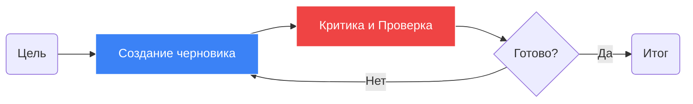

# Агентные паттерны проектирования

## Что это такое

Агентные паттерны (Agentic Design Patterns) — это архитектурные «чертежи» для создания надежных автономных систем на базе [[llm|LLM]]. Эндрю Ын (Andrew Ng) популяризировал идею о том, что **агентные ворклоу (Agentic Workflows)** — итеративные циклы, где модель может исправлять сама себя — позволяют меньшим моделям превосходить гигантов, работающих в один проход.

Вместо одного промпта мы строим систему, которая умеет планировать, рефлексировать и сотрудничать.

## Основные паттерны

### 1. Reflection (Рефлексия / Самокоррекция)



Модель генерирует ответ, затем второй промпт (или другая модель) критикует этот ответ и предлагает улучшения.
- **Процесс**: `Черновик` $\to$ `Критика` $\to$ `Исправленный вариант`.
- **Зачем**: Радикально снижает количество галлюцинаций и ошибок форматирования.

### 2. Planning (Планирование)
Модель разбивает сложную цель на последовательность подзадач перед их выполнением.
- **Процесс**: `Цель` $\to$ `План` $\to$ `Шаг 1` $\to$ `Шаг 2` $\dots$ $\to$ `Итог`.
- **Фреймворки**: BabyAGI, AutoGPT.

### 3. Tool Use (Рассуждение + Действие)
Модель наблюдает за окружением, рассуждает о том, что нужно сделать, и совершает действие (вызов API).
- **Фреймворки**: **ReAct** (Reason + Act).
- **Новый стандарт**: [[mcp|Model Context Protocol (MCP)]] для стандартизированного доступа к инструментам.

### 4. Multi-Agent Collaboration (Многоагентное сотрудничество)
Назначение разных ролей разным экземплярам [[llm|LLM]] (например, «Программист», «Ревьюер», «Менеджер») и организация их диалога.
- **Зачем**: Специализация повышает качество. Агент-ревьюер лучше находит баги, чем сам программист проверяет свой же код.

## Визуализация: Один проход vs Агентный цикл

```chart
{
  "type": "line",
  "xAxis": "iterations",
  "data": [
    {"iterations": 0, "gpt4_zero_shot": 67, "gpt35_agentic": 42},
    {"iterations": 1, "gpt4_zero_shot": 67, "gpt35_agentic": 65},
    {"iterations": 2, "gpt4_zero_shot": 67, "gpt35_agentic": 74},
    {"iterations": 3, "gpt4_zero_shot": 67, "gpt35_agentic": 81}
  ],
  "lines": [
    {"dataKey": "gpt4_zero_shot", "stroke": "#ef4444", "name": "GPT-4 (Один проход)"},
    {"dataKey": "gpt35_agentic", "stroke": "#3b82f6", "name": "GPT-3.5 (Агентный цикл)"}
  ]
}
```

## Математический взгляд: Итеративное уточнение

Агентные ворклоу можно рассматривать как цепь Маркова, где состояние $s_{t+1}$ генерируется моделью на основе предыдущих попыток и обратной связи:

$$P(y \mid x) \approx \int P(y \mid x, z_{refine}) P(z_{refine} \mid x, y_{initial}) dy_{initial}$$

Через сэмплирование и уточнение мы приближаемся к глобальному оптимуму задачи гораздо точнее, чем при жадном декодировании в один проход.

## Пример реализации: Паттерн Рефлексии

```python
def generate_with_reflection(prompt):
    # Шаг 1: Начальная генерация
    draft = llm.generate(f"Реши задачу: {prompt}")
    
    # Шаг 2: Критика
    critique = llm.generate(f"Найди ошибки в этом решении: {draft}")
    
    # Шаг 3: Исправление
    final = llm.generate(f"Исправь решение на основе критики: {critique}")
    
    return final
```

## Родственные темы

[[agents|Агенты]] — общая концепция  
[[tool-use|Использование инструментов]] — как агенты взаимодействуют с миром  
[[mcp|MCP]] — протокол для взаимодействия агентов
