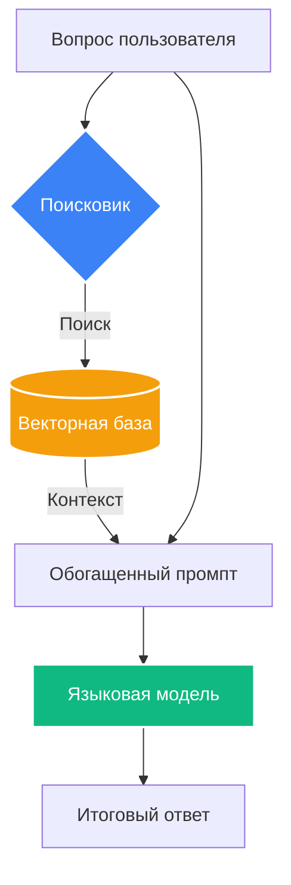

# RAG (Retrieval-Augmented Generation)

## Обзор

Retrieval-Augmented Generation (RAG) — это архитектурный паттерн, который расширяет возможности [[llm|LLM]], предоставляя ей актуальные внешние данные в момент генерации. Вместо того чтобы полагаться только на знания, полученные при обучении, RAG-система сначала ищет релевантные куски текста в базе данных, а затем передает их модели вместе с вопросом пользователя.

## Архитектурная схема



## Продвинутый пайплайн

Современные системы (Advanced RAG) используют многостадийный процесс:

1.  **Pre-Retrieval (Трансформация запроса)**:
    - **HyDE**: Генерация гипотетического ответа для улучшения поиска.
    - **Multi-Query**: Поиск по нескольким вариациям одного вопроса.
2.  **Retrieval (Гибридный поиск)**:
    - Сочетание **Векторного поиска** (по смыслу) и **Ключевого поиска** (BM25) для точного совпадения терминов.
3.  **Post-Retrieval (Реранжирование)**:
    - Использование **Cross-Encoder** моделей для переоценки топ-результатов.
4.  **Сжатие контекста**:
    - Удаление «шума» из найденных фрагментов для экономии токенов.

## Математический аппарат: RRF

Для объединения результатов разных типов поиска используется **Reciprocal Rank Fusion (RRF)**:

$$RRFscore(d) = \sum_{k \in \mathcal{K}} \frac{1}{k + rank(d, k)}$$

## Визуализация: Точность поиска

```chart
{
  "type": "bar",
  "xAxis": "method",
  "data": [
    {"method": "Naive Vector", "hit_rate": 62},
    {"method": "Hybrid (V+BM25)", "hit_rate": 78},
    {"method": "Hybrid + Rerank", "hit_rate": 89},
    {"method": "GraphRAG", "hit_rate": 94}
  ],
  "lines": [
    {"dataKey": "hit_rate", "stroke": "#3b82f6", "name": "Hit Rate @ 10 (%)"}
  ]
}
```

## GraphRAG и Эвалюация

- **GraphRAG**: Использование графов знаний для ответов на глобальные вопросы по всему датасету.
- **RAGAS**: Фреймворк для оценки качества: верность контексту (Faithfulness), релевантность ответа и точность поиска.

## Родственные темы

[[vector-databases|Векторные базы]] — где лежат данные  
[[embedding-models|Эмбеддинги]] — движок поиска  
[[tool-use|Использование инструментов]] — RAG как инструмент агента
---
