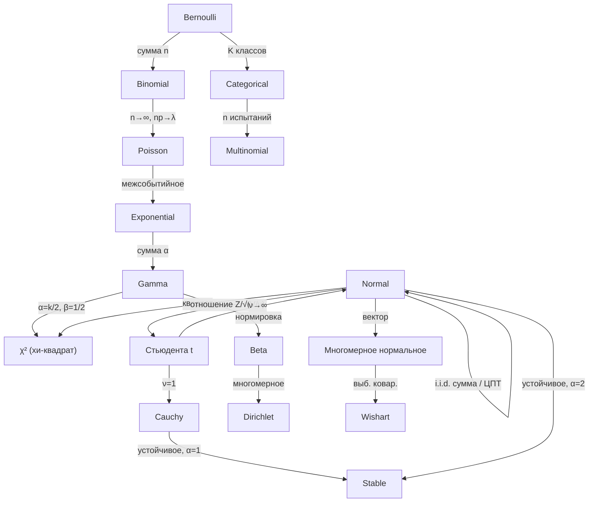

# Справочник распределений

Работающему статистику нужно примерно дюжина распределений и ясная ментальная карта их связей. Почти все они — члены [[exponential-families|экспоненциальных семейств]], могут быть выведены из [[maximum-entropy|принципа максимальной энтропии]] при том или ином ограничении и связаны друг с другом предельными теоремами, сопряжённостью или преобразованиями.

Эта страница — справочная карточка: определения, моменты, MGF, MaxEnt-характеризации и граф связей.

## 1. Дискретные распределения

### Бернулли($p$)

Один бинарный эксперимент.

- **PMF.** $P(X=1) = p$, $P(X=0) = 1-p$.
- **Среднее / дисперсия.** $\mathbb{E}[X] = p$, $\operatorname{Var}(X) = p(1-p)$.
- **MGF.** $M(t) = (1-p) + pe^t$.
- **Экспоненциальное семейство.** $\eta = \log\frac{p}{1-p}$, $T(x) = x$, $A(\eta) = \log(1+e^\eta)$.
- **MaxEnt.** Максимум энтропии на $\{0,1\}$ при фиксированном среднем.

### Биномиальное($n, p$)

Сумма $n$ i.i.d. величин Бернулли$(p)$.

- **PMF.** $\binom{n}{k} p^k (1-p)^{n-k}$.
- **Среднее / дисперсия.** $np$, $np(1-p)$.
- **MGF.** $((1-p) + pe^t)^n$.

### Пуассон($\lambda$)

Число событий в единичном интервале пуассоновского процесса.

- **PMF.** $\frac{\lambda^k e^{-\lambda}}{k!}$.
- **Среднее / дисперсия.** Оба равны $\lambda$ — свойство **равной дисперсии**.
- **MGF.** $\exp(\lambda(e^t - 1))$.
- **Экспоненциальное семейство.** $\eta = \log\lambda$, $T(x)=x$, $A(\eta)=e^\eta$, $h(x) = 1/x!$.
- **Предел.** Биномиальное$(n, \lambda/n)$ → Пуассон$(\lambda)$ при $n \to \infty$ (закон редких событий).
- **MaxEnt.** Максимум энтропии на $\mathbb{N}$ при $\mathbb{E}[X]$ и базовой мере $1/x!$.

### Геометрическое / Отрицательное биномиальное

- **Геометрическое($p$).** Число неудач до первого успеха: $P(X=k) = (1-p)^k p$. Без памяти.
- **Отрицательное биномиальное.** Число неудач до $r$ успехов; сумма $r$ i.i.d. геометрических$(p)$.

### Многочленное / Категориальное

Многомерное обобщение Бернулли/биномиального: $K$ категорий с вероятностями $\boldsymbol p$, $n$ испытаний. Используется в языковых моделях, классификации, GMM.

## 2. Непрерывные распределения

### Нормальное $\mathcal{N}(\mu, \sigma^2)$

«Король» — [[central-limit-theorem|ЦПТ]] делает его пределом любой хорошо ведущей себя суммы.

- **PDF.** $\frac{1}{\sigma\sqrt{2\pi}}\exp\!\left(-\frac{(x-\mu)^2}{2\sigma^2}\right)$.
- **Среднее / дисперсия.** $\mu$, $\sigma^2$.
- **MGF.** $\exp(\mu t + \tfrac{1}{2}\sigma^2 t^2)$.
- **Экспоненциальное семейство.** $\eta = (\mu/\sigma^2,\, -1/(2\sigma^2))$, $T(x)=(x, x^2)$.
- **MaxEnt.** Максимум энтропии на $\mathbb{R}$ при заданных среднем и дисперсии.
- **Устойчивое.** Суммы гауссиан — гауссианы; $\alpha$-устойчивое семейство при $\alpha=2$.

### Экспоненциальное($\lambda$)

Время между событиями пуассоновского процесса.

- **PDF.** $\lambda e^{-\lambda x}$ при $x \geq 0$.
- **Среднее / дисперсия.** $1/\lambda$, $1/\lambda^2$.
- **MGF.** $\lambda/(\lambda - t)$ при $t < \lambda$.
- **Отсутствие памяти.** $P(X > s+t \mid X > s) = P(X > t)$ — единственное непрерывное распределение с этим свойством.
- **MaxEnt.** Максимум энтропии на $[0,\infty)$ при фиксированном среднем.

### Гамма($\alpha, \beta$)

Сумма $\alpha$ i.i.d. Экспоненциальных$(\beta)$ при $\alpha \in \mathbb{N}$.

- **PDF.** $\frac{\beta^\alpha}{\Gamma(\alpha)} x^{\alpha-1} e^{-\beta x}$ при $x \geq 0$.
- **Среднее / дисперсия.** $\alpha/\beta$, $\alpha/\beta^2$.
- **Частные случаи.** $\alpha=1$ → Экспоненциальное. $\alpha = k/2, \beta = 1/2$ → $\chi^2_k$.
- **MaxEnt.** Максимум энтропии на $[0,\infty)$ при фиксированных $\mathbb{E}[X]$ и $\mathbb{E}[\log X]$.

### Бета($\alpha, \beta$)

Распределение на $[0, 1]$. Сопряжённый приор для Бернулли/биномиального.

- **PDF.** $\frac{x^{\alpha-1}(1-x)^{\beta-1}}{B(\alpha,\beta)}$.
- **Среднее / дисперсия.** $\alpha/(\alpha+\beta)$ и $\alpha\beta/((\alpha+\beta)^2(\alpha+\beta+1))$.
- **Формы.** Колоколообразная, U-образная, монотонная, равномерная — самая гибкая 2-параметрическая плотность на $[0,1]$.

### Дирихле($\boldsymbol\alpha$)

Многомерное обобщение Беты: распределение на симплексе $\Delta^{K-1}$. Сопряжённый приор для многочленного/категориального.

- **PDF.** $\frac{1}{B(\boldsymbol\alpha)}\prod_i x_i^{\alpha_i - 1}$ на симплексе.
- **Применение.** Тематические модели LDA, байесовские приоры в нейросетях, EBM над дискретными распределениями.

### Хи-квадрат $\chi^2_k$

Сумма $k$ i.i.d. квадратов стандартных нормальных.

- **PDF.** $\frac{1}{2^{k/2}\Gamma(k/2)} x^{k/2 - 1} e^{-x/2}$ при $x \geq 0$.
- **Применение.** Тесты отношения правдоподобия, доверительные интервалы для дисперсии, тесты согласия.

### Стьюдента $t_\nu$

Отношение $Z/\sqrt{V/\nu}$, где $Z \sim \mathcal{N}(0,1)$, $V \sim \chi^2_\nu$ независимы.

- **Тяжёлые хвосты:** $\sim |x|^{-(\nu+1)}$. Дисперсия конечна только при $\nu > 2$.
- **Предел.** $t_\nu \to \mathcal{N}(0,1)$ при $\nu \to \infty$.
- **MaxEnt.** Цаллис-MaxEnt-распределение при ограничении на дисперсию.

### Коши

$t_1$, канонический патологический случай.

- **PDF.** $\frac{1}{\pi(1 + x^2)}$.
- **Нет среднего, нет дисперсии.** Выборочное среднее Коши снова Коши — ЦПТ *не работает*.
- **Устойчивое** при $\alpha = 1$.

### Устойчивые распределения

4-параметрическое семейство $S(\alpha, \beta, \sigma, \mu)$ с $\alpha \in (0, 2]$. Характеризуется замкнутостью относительно сложения. Единственные аттракторы нормированных i.i.d. сумм (обобщённая ЦПТ). Используется в финансах для тяжёлых хвостов доходностей и в ML для тяжёлохвостого градиентного шума.

### Многомерное нормальное $\mathcal{N}_d(\boldsymbol\mu, \Sigma)$

Векторное гауссовское распределение — см. [[multivariate-normal|Многомерное нормальное]] для полной теории (эллипсоиды Махаланобиса, условие через дополнение Шура, ЦПТ Крамера–Уолда).

### Уишарт и обратный Уишарт

Распределения на положительно определённых матрицах. Уишарт — матричный аналог $\chi^2$ (выборочная ковариация $\mathcal{N}_d$-данных); обратный Уишарт — его сопряжённый приор. Фундамент байесовского вывода в гауссовских графовых моделях.

## 3. Тяжёлые vs лёгкие хвосты

| Поведение хвоста | Примеры | Следствие |
|---|---|---|
| **Суб-гауссовское** $\Pr(|X| > t) \leq Ce^{-ct^2}$ | Ограниченные, гауссовские | Резкая концентрация, конечная MGF, оценки Хёфдинга |
| **Суб-экспоненциальное** $\Pr(|X| > t) \leq Ce^{-ct}$ | Экспоненциальное, гамма, суб-эксп. липшицевы | Неравенство Бернштейна |
| **Полиномиальное** $\Pr(|X| > t) \sim t^{-\alpha}$ | Парето, устойчивые ($\alpha < 2$), Коши | ЦПТ может не работать; MGF не существует |

Эта дихотомия определяет, когда выборочные средние концентрируются (Бернштейн), какие хвостовые оценки достижимы (суб-гауссовские: $e^{-t^2}$; полиномиальные: в лучшем случае Марков), и какая обобщённая ЦПТ применима.

## 4. Граф связей



## 5. Сопряжённые пары приоров

| Правдоподобие | Сопряжённый приор | Обновлённый постериор |
|---|---|---|
| Бернулли, биномиальное | Бета$(\alpha, \beta)$ | Бета$(\alpha + k, \beta + n - k)$ |
| Категориальное, многочленное | Дирихле$(\boldsymbol\alpha)$ | Дирихле$(\boldsymbol\alpha + \boldsymbol n)$ |
| Пуассон | Гамма$(\alpha, \beta)$ | Гамма$(\alpha + \sum x_i, \beta + n)$ |
| Экспоненциальное | Гамма$(\alpha, \beta)$ | Гамма$(\alpha + n, \beta + \sum x_i)$ |
| $\mathcal{N}(\mu, \sigma^2)$ известное $\sigma$ | $\mathcal{N}$ на $\mu$ | $\mathcal{N}$ с обновлёнными средним/дисперсией |
| $\mathcal{N}(\mu, \sigma^2)$ известное $\mu$ | Inverse Gamma на $\sigma^2$ | Inverse Gamma обновлённое |
| Многомерное нормальное | Normal–Inverse-Wishart | Normal–Inverse-Wishart |

Эти пары не случайны — они возникают из того, что каждое правдоподобие лежит в [[exponential-families|экспоненциальном семействе]], а сопряжённые приоры сами экспоненциальны.

## 6. Визуализация: контраст хвостов

```chart
{
  "type": "line",
  "xAxis": "x",
  "data": [
    {"x": -4, "gaussian": 0.0001, "cauchy": 0.0187},
    {"x": -3, "gaussian": 0.004,  "cauchy": 0.0318},
    {"x": -2, "gaussian": 0.054,  "cauchy": 0.0637},
    {"x": -1, "gaussian": 0.242,  "cauchy": 0.1592},
    {"x": 0,  "gaussian": 0.399,  "cauchy": 0.3183},
    {"x": 1,  "gaussian": 0.242,  "cauchy": 0.1592},
    {"x": 2,  "gaussian": 0.054,  "cauchy": 0.0637},
    {"x": 3,  "gaussian": 0.004,  "cauchy": 0.0318},
    {"x": 4,  "gaussian": 0.0001, "cauchy": 0.0187}
  ],
  "lines": [
    {"dataKey": "gaussian", "stroke": "#3b82f6", "name": "Гауссовское (тонкие хвосты)"},
    {"dataKey": "cauchy",   "stroke": "#ef4444", "name": "Коши (тяжёлые хвосты)"}
  ]
}
```

*Гауссиана убывает как $e^{-x^2/2}$; Коши — лишь как $1/(1+x^2)$. Коши даёт >100× больше вероятностной массы «выбросам» за пределами ±3, и именно поэтому финансовые доходности и градиентный шум — не гауссовские.*

## 7. Связи

- [[exponential-families|Экспоненциальные семейства]] — объединяющая алгебраическая форма.
- [[maximum-entropy|Максимум энтропии]] — выводит каждое распределение из ограничения.
- [[central-limit-theorem|Центральная предельная теорема]] — почему нормальное доминирует.
- [[multivariate-normal|Многомерное нормальное]] — векторная гауссовская теория.
- [[bayesian-inference|Байесовский вывод]] — использует таблицу сопряжённых приоров выше.
- [[concentration-inequalities|Концентрационные неравенства]] — количественная оценка хвостов.
- [[poisson-processes|Пуассоновские процессы]] — генераторы дискретных и непрерывных «приходных» семейств.
