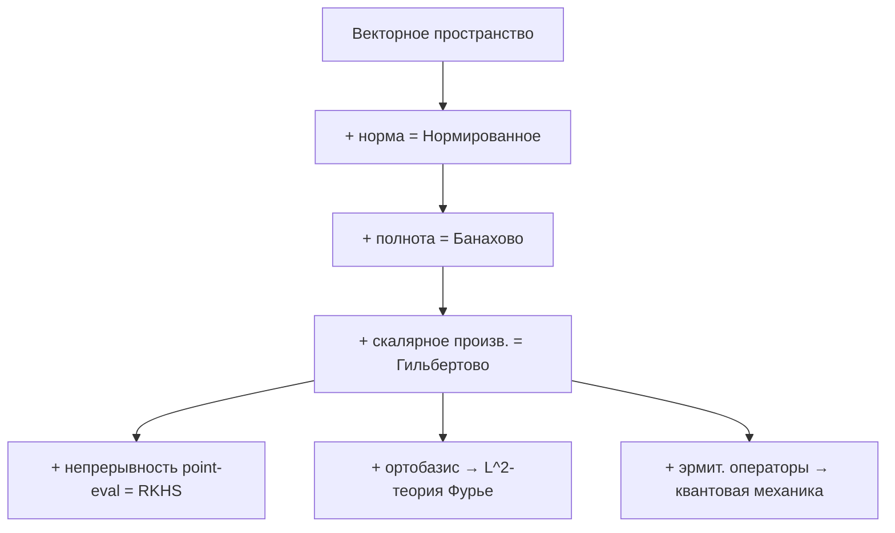

# Пространства Гильберта и Банаха

Пространства Банаха и Гильберта — это инфраструктура, на которой построено всё бесконечномерное: функциональный анализ, квантовая механика, гауссовские процессы, spectral-методы. Это геометрия, в которой «расстояние» и «угол» работают, даже когда размерность бесконечна.

## 1. Нормированное пространство

**Определение.** Пара $(X, \|\cdot\|)$, где $X$ — линейное пространство над $\mathbb{R}$ или $\mathbb{C}$, а $\|\cdot\| : X \to [0, \infty)$ удовлетворяет:

1. $\|x\| = 0 \iff x = 0$;
2. $\|\alpha x\| = |\alpha|\, \|x\|$ для всех скаляров $\alpha$;
3. $\|x + y\| \leq \|x\| + \|y\|$ (неравенство треугольника).

Метрика $d(x,y) = \|x-y\|$ превращает $X$ в метрическое пространство.

## 2. Банахово пространство

**Определение.** Нормированное пространство, **полное** относительно своей нормы: любая последовательность Коши имеет предел внутри $X$.

Полнота критична, потому что без неё обычные конструкции анализа (пределы, ряды, решения уравнений) могут «утекать» за пределы пространства.

### Классические примеры

| Пространство | Элементы | Норма |
|---|---|---|
| $\mathbb{R}^n$, $\mathbb{C}^n$ | конечные векторы | $\|x\|_2, \|x\|_p, \|x\|_\infty$ |
| $\ell^p$, $1 \leq p < \infty$ | последовательности | $\|a\|_p = (\sum |a_i|^p)^{1/p}$ |
| $\ell^\infty$ | огран. последовательности | $\|a\|_\infty = \sup |a_i|$ |
| $C[a,b]$ | непр. функции | $\|f\|_\infty = \sup |f|$ |
| $L^p(\mu)$, $1\leq p<\infty$ | измеримые функции | $\|f\|_p = (\int |f|^p d\mu)^{1/p}$ |

### Равномерная ограниченность и замкнутый график

Пять «китов» банаховой теории, без которых функциональный анализ не существует:

1. **Теорема Хана-Банаха** — любое ограниченное линейное функционал на подпространстве продолжается на всё $X$ с сохранением нормы.
2. **Теорема об открытом отображении** — сюръективный ограниченный оператор открыт.
3. **Теорема о замкнутом графике** — оператор с замкнутым графиком автоматически ограничен.
4. **Принцип равномерной ограниченности (Банах-Штейнгауз)** — поточечно ограниченное семейство операторов равномерно ограничено.
5. **Теорема Банаха о неподвижной точке** — сжимающее отображение имеет единственную fixed point.

## 3. Гильбертово пространство

**Определение.** Банахово пространство $H$, в котором норма порождается **скалярным произведением** $\langle \cdot, \cdot \rangle : H \times H \to \mathbb{C}$:

$$
\|x\|^2 = \langle x, x\rangle.
$$

Скалярное произведение удовлетворяет:

- **линейность** по первому аргументу;
- **эрмитова симметрия:** $\langle x, y\rangle = \overline{\langle y, x\rangle}$;
- **положительная определённость:** $\langle x, x\rangle \geq 0$, равенство только при $x=0$.

Гильбертово $\iff$ банахово + тождество параллелограмма:

$$
\|x+y\|^2 + \|x-y\|^2 = 2(\|x\|^2 + \|y\|^2).
$$

### Ключевые гильбертовы пространства

- $L^2(\mu)$ — квадратично-интегрируемые функции. $\langle f, g\rangle = \int \bar f g\, d\mu$.
- $\ell^2$ — суммируемые в квадрате последовательности.
- **Соболевские пространства** $H^s = W^{s,2}$ — $L^2$-функции с производными в $L^2$; язык PDE.
- **RKHS** — пространства функций, где point evaluation непрерывен.

## 4. Ортогональность и проекция

В гильбертовом пространстве угол между векторами определяется по Коши-Буняковскому:

$$
\cos\theta = \frac{\langle x, y\rangle}{\|x\|\|y\|}.
$$

Ортогональное дополнение: $M^\perp = \{y \in H : \langle x,y\rangle = 0 \ \forall x \in M\}$.

**Теорема (разложение по прямой сумме).** Для замкнутого подпространства $M \subset H$:

$$
H = M \oplus M^\perp,\qquad \text{любое } x = P_M x + P_{M^\perp} x.
$$

Проекция $P_M x$ — **уникальная ближайшая точка** в $M$ к $x$. Это фундамент метода наименьших квадратов, регрессии, kernel projection.

## 5. Ортонормированные базисы

**Определение.** Семейство $\{e_i\}_{i \in I}$ — ортонормированный базис, если $\langle e_i, e_j\rangle = \delta_{ij}$ и замыкание линейной оболочки равно $H$.

**Разложение Фурье.** Для любого $x \in H$:

$$
x = \sum_{i \in I} \langle x, e_i\rangle\, e_i,\qquad \|x\|^2 = \sum_{i \in I} |\langle x, e_i\rangle|^2\ \text{(равенство Парсеваля)}.
$$

Это обобщает ряды Фурье функций $L^2[-\pi,\pi]$ на произвольное гильбертово пространство.

**Следствие.** Все сепарабельные бесконечномерные гильбертовы пространства изоморфны $\ell^2$. Нет «разных» сепарабельных Гильбертов.

## 6. Дуальность

**Теорема Рисса-Фреше.** Отображение $y \mapsto \langle \cdot, y\rangle$ задаёт изоморфизм $H \cong H^*$. Каждый ограниченный линейный функционал представим как скалярное произведение с единственным вектором.

В банаховых пространствах дуал $X^*$ — это тоже банахово, но не всегда изоморфен $X$. Например, $(L^1)^* = L^\infty$, но $(L^\infty)^* \supsetneq L^1$.

**Рефлексивность.** $X$ **рефлексивно**, если отображение $X \hookrightarrow X^{**}$ — изоморфизм. $L^p$ рефлексивно при $1<p<\infty$, а $L^1$ и $L^\infty$ — нет.

## 7. Компактность и слабая сходимость

Замкнутый единичный шар в бесконечномерном банаховом пространстве **не компактен** по норме. Но по **слабой топологии** (теорема Банаха-Алаоглу) компактен — это ключевая идея вариационного исчисления и PDE.

$x_n \rightharpoonup x$ (слабо) значит $\ell(x_n) \to \ell(x)$ для всех $\ell \in X^*$. В гильбертовом: $\langle x_n, y\rangle \to \langle x, y\rangle$ для всех $y$.

## 8. Линейные операторы

$T : X \to Y$ **ограничен**, если $\|T\| := \sup_{\|x\|\leq 1} \|Tx\| < \infty$. Ограниченные $\iff$ непрерывные операторы.

### Классы операторов в гильбертовом

- **Самосопряжённые:** $T^* = T$. Вещественный спектр.
- **Нормальные:** $T^*T = TT^*$. Спектральная теорема.
- **Унитарные:** $T^*T = I$. Изометрии.
- **Компактные:** переводят ограниченные множества в относительно компактные. Спектр — счётное множество с возможной точкой накопления в 0.

**Спектральная теорема (компактные самосопряжённые).** $T = \sum \lambda_i \langle \cdot, e_i\rangle e_i$, где $\{e_i\}$ — собственные, $\lambda_i \to 0$. Это бесконечномерное обобщение диагонализации матрицы и основа PCA, спектральной кластеризации, Karhunen-Loève.

## 9. RKHS и kernel trick

**Определение.** Гильбертово пространство функций $\mathcal{H}$ на множестве $X$ — **RKHS**, если point evaluation $E_x : f \mapsto f(x)$ непрерывен для всех $x$. По Риссу существует $K_x \in \mathcal{H}$ с $f(x) = \langle f, K_x\rangle$.

Функция $k(x,y) = \langle K_x, K_y\rangle$ называется **воспроизводящим ядром**.

**Теорема Мура-Ароншайна.** Положительно определённая функция $k$ одно-однозначно задаёт RKHS.

**Применение.** В SVM / kernel ridge мы никогда не вычисляем координаты в бесконечномерном пространстве; вся работа идёт через $k(x,y)$. Это и есть **kernel trick**.

## 10. Квантовая механика

Состояние квантовой системы — единичный вектор $|\psi\rangle$ в комплексном гильбертовом пространстве. Наблюдаемые — самосопряжённые операторы. Вероятности — $|\langle \phi | \psi\rangle|^2$.

Все аксиомы квантовой механики получают естественный смысл через язык гильбертовых пространств: суперпозиция — линейная комбинация, интерференция — скалярное произведение, квантование — спектральное разложение.

## 11. Визуализация

## 12. Связи

- [[functional-analysis|Функциональный анализ]] — общая теория этих пространств.
- [[lp-spaces|L^p-пространства]] — канонические примеры банаховых пространств.
- [[kernel-methods-rkhs|Ядерные методы и RKHS]] — ML-применение гильбертовых пространств.
- [[spectral-theory-operators|Спектральная теория операторов]] — диагонализация в бесконечномерии.
- [[sobolev-spaces|Соболевские пространства]] — базовое пространство для PDE.
- [[gaussian-processes|Гауссовские процессы]] — «распределения на RKHS».
- [[quantum-math|Математика квантов]] — физическая реализация гильбертовой геометрии.
